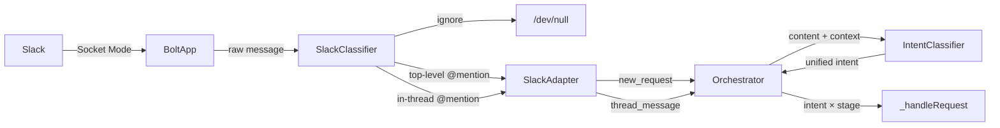
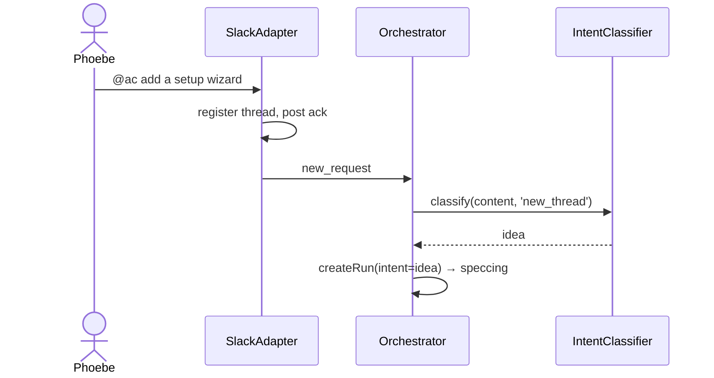
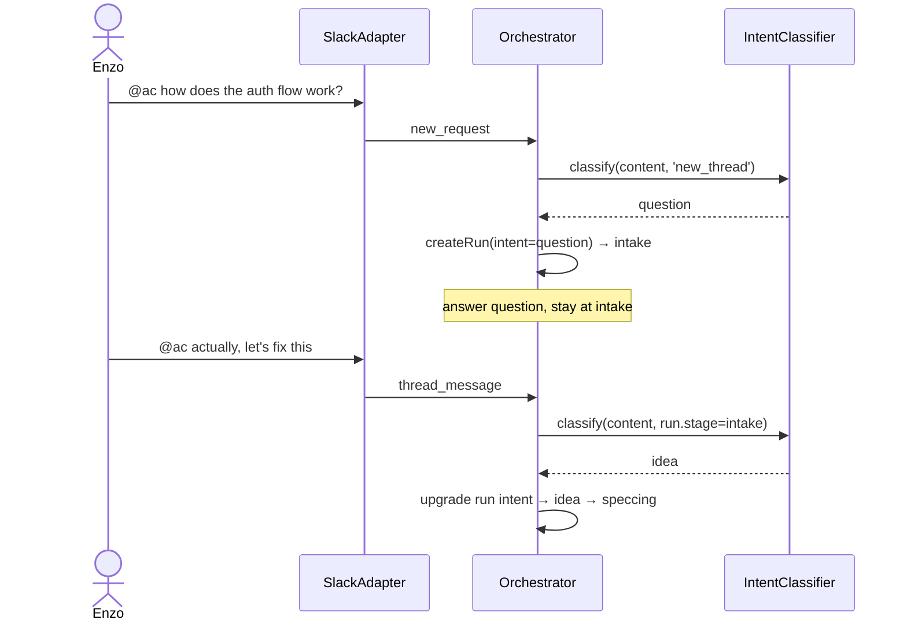

# Enhancement: Intent classifier routing

## Parent feature

`feature-slack-message-routing.md`

## What

The slack message routing feature currently classifies messages with a fixed ruleset: new top-level @mentions are always treated as feature ideas, and thread replies are always treated as spec feedback. This enhancement replaces that hardcoded routing with AI-powered intent classification on every inbound message — both top-level and in-thread — so the system can understand what a user is actually asking for and route it accordingly.

## Why

Every inbound message is a request for something — a new feature, a bug fix, a question, a piece of feedback — and the system needs to know which in order to respond correctly. The current fixed ruleset can only distinguish message position (new thread vs. reply), not intent, so it cannot route messages to the right handler or compose the right response. Classifying every message by intent gives the system what it needs to address each request appropriately.

## User stories

- Phoebe can @mention the bot with a bug report and have it routed as a bug, not a feature idea
- Phoebe can ask the bot a direct question and get a response appropriate to a question
- Phoebe can @mention the bot with a feature idea and have it routed as before
- Enzo can reply to an in-progress thread with approval and have the system recognize it as such
- Enzo can ask a question in an active thread and have it handled as a question rather than spec feedback
- Enzo can provide feedback on a spec or implementation in a thread and have it routed correctly
- Enzo can post in a channel without @mentioning the bot and have the bot ignore it entirely
- Enzo can @mention another person in a thread without triggering a bot response
- Phoebe can @mention both the bot and another person in a thread and have the bot respond normally

## Design changes

*(Added by design specs stage — frame as delta on the parent feature's design spec)*

## Technical changes

### Affected files

*(Populated during tech specs stage — list files that will change and why)*

### Changes

### 1. Introduction and overview

**Prerequisites and assumptions**
- Depends on `feature-slack-message-routing.md` (complete) — the existing Slack `classifier.ts`, `ThreadRegistry`, `SlackAdapter`, and `InboundEvent` types
- Depends on `adr-001-agent-first-development.md` — AI-first processing approach
- Depends on PR #31 (merged) — `IntentClassifier` at `src/adapters/agent/intent-classifier.ts`, `thread_message` event type, and current orchestrator routing using stage-specific intents (`spec_feedback`, `spec_approval`, `implementation_feedback`, `implementation_approval`)
- No new ADRs required; no database or API changes
- The orchestrator handles routing by `InboundEvent.type` and run stage — replacing intent types here requires corresponding updates there

**Technical goals**
- Every inbound @mention — top-level or in-thread — is classified by a single `IntentClassifier` using a unified taxonomy before reaching the orchestrator
- In-thread messages where someone other than the bot is @mentioned (and the bot is not) are ignored without classification
- Classification completes within 2 seconds of message receipt
- The classifier never produces an unhandled intent type at the orchestrator boundary
- Terminology is consistent: `Idea` / `idea_id` / `new_idea` replaced with `Request` / `request_id` / `idea` throughout

**Non-goals**
- Implementing the downstream handler for `bug` intent (tracked in #42)
- Emoji reaction approval
- Persisting classification history
- Multi-turn conversation or context tracking within a thread

**In scope**
- Top-level intents: `idea`, `bug` (classifier only, no handler), `question`, `ignore`
- In-thread intents: `feedback`, `approval`, `question`, `ignore`
- Refactor `IntentClassifier` to use the unified taxonomy, replacing stage-specific intents (`spec_feedback`, `spec_approval`, `implementation_feedback`, `implementation_approval`); orchestrator derives context from intent + run stage
- Update Slack `classifier.ts` to route all @mentions through `IntentClassifier` and apply correct ignore rules
- Update orchestrator to handle unified intents
- Rename `Idea` → `Request` throughout types, events, orchestrator, and registry

**Glossary**
- **Top-level intent** — the intent of a new @mention that starts a thread: `idea`, `bug`, `question`, `ignore`
- **In-thread intent** — the intent of a reply in a tracked thread: `feedback`, `approval`, `question`, `ignore`
- **Request** — the generic term for any incoming work item, replacing `Idea` in the codebase

### 2. System design and architecture

**Modified components**

- `src/adapters/agent/intent-classifier.ts` — replace stage-specific taxonomy with unified taxonomy; add `'new_thread'` context for top-level classification alongside run-stage contexts
- `src/adapters/slack/classifier.ts` — update ignore rules: suppress in-thread messages where only someone other than the bot is @mentioned; remove `spec_feedback` return (all @mentions pass through as top-level or in-thread)
- `src/adapters/slack/slack-adapter.ts` — remove hardcoded `new_idea` / `spec_feedback` routing; emit `new_request` for top-level @mentions, `thread_message` for in-thread @mentions
- `src/core/orchestrator.ts` — replace multi-handler intent dispatch with single `_handleRequest`; routing logic is intent × stage; add `intent` field to `Run`; implement upgrade path (question → idea/bug only when stage is `intake`)
- `src/types/events.ts` — rename `Idea` → `Request`, `new_idea` → `new_request`; `ThreadMessage.idea_id` → `request_id`
- `src/types/runs.ts` — add `intent` field; `idea_id` → `request_id`
- `src/adapters/slack/thread-registry.ts` — rename `idea_id` references to `request_id` internally

**High-level flow**



**Sequence — top-level @mention**



**Sequence — in-thread question then upgrade**



**Intent × stage routing table**

| Intent | Stage | Action |
|---|---|---|
| `idea` | `new_thread` / `intake` | start spec pipeline |
| `bug` | `new_thread` / `intake` | ack + log (handler in #42) |
| `question` | `new_thread` / `intake` | answer, stay at `intake` |
| `feedback` | `reviewing_spec` | revise spec |
| `feedback` | `reviewing_implementation` / `awaiting_impl_input` | handle impl feedback |
| `approval` | `reviewing_spec` | commit spec, start implementation |
| `approval` | `reviewing_implementation` | create PR |
| `question` | any other stage | answer, no stage change |
| `ignore` | any | discard |

### 3. Detailed design

**Updated types**

`src/types/events.ts`:
```typescript
export interface Request {
  id: string;
  source: 'slack';
  content: string;
  author: string;
  received_at: string; // ISO 8601
  thread_ts: string;
  channel_id: string;
}

export interface ThreadMessage {
  request_id: string;
  content: string;
  author: string;
  received_at: string; // ISO 8601
  thread_ts: string;
  channel_id: string;
}

export type InboundEvent =
  | { type: 'new_request'; payload: Request }
  | { type: 'thread_message'; payload: ThreadMessage };
```

`src/types/runs.ts` — add `intent` field, rename `idea_id`:
```typescript
export type RequestIntent = 'idea' | 'bug' | 'question';

export interface Run {
  id: string;
  request_id: string;
  intent: RequestIntent;
  stage: RunStage;
  // ... rest unchanged
}
```

**Updated `IntentClassifier` interface**

```typescript
export type ClassificationContext =
  | 'new_thread'
  | RunStage; // only stages that accept messages: 'intake', 'reviewing_spec', 'reviewing_implementation', 'awaiting_impl_input'

export type Intent =
  | 'idea'
  | 'bug'
  | 'question'
  | 'feedback'
  | 'approval'
  | 'ignore';

export const VALID_INTENTS_BY_CONTEXT: Record<ClassificationContext, Intent[]> = {
  new_thread:                 ['idea', 'bug', 'question', 'ignore'],
  intake:                     ['idea', 'bug', 'question', 'ignore'],  // upgrade path
  reviewing_spec:             ['feedback', 'approval', 'question', 'ignore'],
  reviewing_implementation:   ['feedback', 'approval', 'question', 'ignore'],
  awaiting_impl_input:        ['feedback', 'question', 'ignore'],
  // non-message stages not included — orchestrator guards before calling
};

export interface IntentClassifier {
  classify(message: string, context: ClassificationContext): Promise<Intent>;
}
```

**Orchestrator routing algorithm (`_handleRequest`)**

```
_handleRequest(event: InboundEvent):
  if event.type === 'new_request':
    create run with intent = 'question' (temporary, will be set after classification)
    context = 'new_thread'
  else:
    run = runs.get(event.payload.request_id)
    if no run → discard
    if run.stage not in message-accepting stages → discard (or busy-notify)
    context = run.stage

  intent = intentClassifier.classify(content, context)

  if intent === 'ignore' → discard

  if event.type === 'new_request' OR (run.intent === 'question' AND run.stage === 'intake'):
    // set or upgrade intent
    run.intent = intent
    if intent === 'idea'     → start spec pipeline
    if intent === 'bug'      → ack + log (handler in #42)
    if intent === 'question' → answer, leave at intake
    return

  // in-thread routing by intent × stage
  if intent === 'feedback':
    if run.stage === 'reviewing_spec' → _handleSpecFeedback
    if run.stage in ['reviewing_implementation', 'awaiting_impl_input'] → _handleImplementationFeedback
  if intent === 'approval':
    if run.stage === 'reviewing_spec' → _handleSpecApproval
    if run.stage === 'reviewing_implementation' → _handleImplementationApproval
  if intent === 'question':
    answer question, no stage change
```

## Task list

*(Added by task decomposition stage)*
