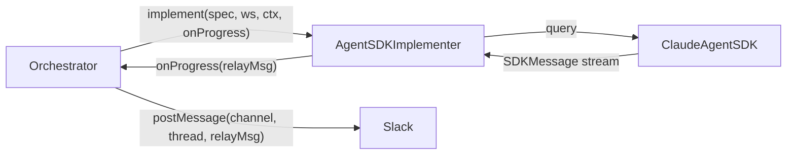
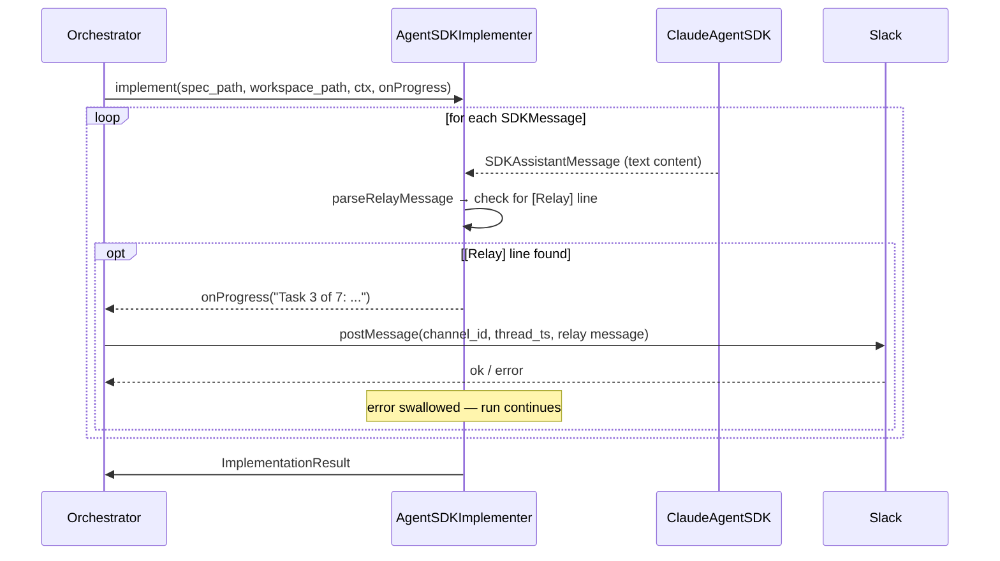

# Enhancement: Agent progress updates during long-running operations

## Parent feature

`feature-approval-to-implementation.md`
## What

During spec generation and implementation runs, the agent posts progress updates to the Slack thread at interesting intervals. The agent is prompted with instructions to emit specially-tagged `[Relay]` lines whenever it has something worth reporting to a human — phase transitions, current focus, task starts, or anything a human watching would find useful. When the speccer or implementer detects a `[Relay]`-tagged line in an assistant turn, the message is forwarded to the Slack thread. All progress posts are best-effort — a failed post never interrupts or fails the run.
## Why

Spec generation and implementation runs can take 20 minutes or longer with no visible activity in the Slack thread. The human has no way to tell whether the agent is making progress, waiting on a dependency, or silently failing. Early visibility enables course-correction before a long run concludes on a wrong path and builds confidence that the system is actively working.
## User stories

- During a long implementation run, Phoebe can see what the agent is currently working on in the Slack thread without waiting for the run to complete
- During a spec generation run, Phoebe can see which comment the agent is currently processing or which section it is drafting
- If a Slack notification fails during any run, the run continues and completes normally
- When no `onProgress` callback is provided, agent behavior is identical to before this change
## Design changes

*(No UI changes — this is a backend-only enhancement to the speccer, implementer, and orchestrator.)*
Example progress updates visible in the Slack thread during a spec generation run:
```javascript
autocatalyst  10:00 AM
Analyzing requirements and reviewing existing specs

autocatalyst  10:03 AM
Processing feedback comment 3 of 8 — authentication design section

autocatalyst  10:07 AM
Drafting technical design section

autocatalyst  10:11 AM
Spec draft complete — reviewing for consistency
```
Example progress updates visible in the Slack thread during an implementation run:
```javascript
autocatalyst  10:00 AM
Planning started — analyzing spec and generating task list

autocatalyst  10:01 AM
Planning complete — 7 tasks identified. Starting implementation.

autocatalyst  10:04 AM
Task 3 of 7: Implementing the parseRelayMessage helper

autocatalyst  10:17 AM
Starting final code review
```
## Technical changes

### Affected files

- `src/adapters/agent/speccer.ts` — add optional `onProgress` callback to `Speccer` interface and `AgentSDKSpeccer` methods; augment spec gen prompts with checkpoint instructions; detect `[Relay]` lines in the drain loop
- `src/adapters/agent/implementer.ts` — add optional `onProgress` callback to `Implementer` interface and `AgentSDKImplementer.implement()` signature; add `parseRelayMessage` helper; augment agent prompt with checkpoint instructions; detect `[Relay]` lines in the drain loop
- `src/core/orchestrator.ts` — construct `onProgress` callbacks and pass them into `_runSpecGeneration` and `_runImplementation` call sites
- `tests/adapters/agent/speccer.test.ts` — add tests for relay message detection and best-effort failure handling
- `tests/adapters/agent/implementer.test.ts` — add tests for relay message detection and best-effort failure handling
- `tests/core/orchestrator.test.ts` — add tests for callback wiring and `postMessage` delegation for both run paths
### Changes

### 1. Introduction and overview

**Prerequisites and assumptions**
- Depends on `feature-approval-to-implementation.md` (complete) — establishes `AgentSDKSpeccer`, `AgentSDKImplementer`, the `query()` drain loop, and `_runSpecGeneration`/`_runImplementation` in the orchestrator
- Both `Speccer` and `Implementer` interfaces are shared by their respective implementations and all test doubles; the signature change is non-breaking because the new parameter is optional
- The `onProgress` callback is always invoked with best-effort semantics: errors are caught and logged at warn level, never rethrown
**Technical goals**
- The agent prompts (spec gen and implementation) are augmented with checkpoint instructions to emit `[Relay]`-tagged lines when the agent has something meaningful to report to a human watching; the LLM determines what is worth reporting and the specific wording, but must use the `[Relay]` prefix so the adapters require no heuristic text parsing
- Checkpoint-tagged messages provide structured, actionable progress signal at interesting intervals without requiring the speccer or implementer to parse or interpret free-form assistant output
- When the drain loop detects a `[Relay]` line in an assistant turn, it calls `onProgress` with the relay message content
- A failure in `onProgress` (including a rejected `postMessage` call) does not propagate to the drain loop or fail the run
- When `onProgress` is omitted, behavior is identical to the current implementation — zero changes in observable behavior for callers that do not pass the callback
**Non-goals**
- Progress during question answering or PR creation (only `_runSpecGeneration` and `_runImplementation` are affected)
- Delivery guarantees — posts are fire-and-forget; a missed update is acceptable
### 2. System design and architecture

**Modified components**
- `src/adapters/agent/speccer.ts` — the `Speccer` interface, `AgentSDKSpeccer` method signatures, prompt construction, and drain loop body change; no other methods are affected
- `src/adapters/agent/implementer.ts` — the `Implementer` interface, `AgentSDKImplementer.implement()` signature, the prompt construction, and the drain loop body change; no other methods are affected
- `src/core/orchestrator.ts` — `_runSpecGeneration` and `_runImplementation` are the only methods that change; relevant call sites are updated in place
**High-level flow (unchanged externally)**

*(The same pattern applies for **`AgentSDKSpeccer`** and **`_runSpecGeneration`**.)*
**Sequence — progress post during implementation**

*(The speccer sequence is identical, substituting **`AgentSDKSpeccer`**, **`specPath`**, and **`SpecResult`**.)*
### 3. Detailed design

**Updated ****`Implementer`**** interface**
```typescript
export interface Implementer {
  implement(
    spec_path: string,
    workspace_path: string,
    additional_context?: string,
    onProgress?: (message: string) => Promise<void>,
  ): Promise<ImplementationResult>;
}
```
Adding `onProgress` as the fourth positional parameter preserves backwards compatibility: all existing call sites pass two or three arguments and continue to work without modification.
**Updated ****`Speccer`**** interface**
```typescript
export interface Speccer {
  generateSpec(
    request: SpecRequest,
    onProgress?: (message: string) => Promise<void>,
  ): Promise<SpecResult>;

  reviseSpec(
    spec_path: string,
    feedback: string,
    onProgress?: (message: string) => Promise<void>,
  ): Promise<SpecResult>;
}
```
Adding `onProgress` as the last optional parameter preserves backwards compatibility for all existing call sites.
**Prompt augmentation**
The goal is for the agent to emit `[Relay]` messages whenever it has something genuinely worth reporting to the human watching — phase transitions, current focus, an interesting finding, a meaningful milestone. Examples orient the agent; the agent uses its judgment about what's worth reporting and when.
The following checkpoint instruction block is appended to each prompt:
```javascript
At any point during your work, if you have something worth reporting to the human watching —
a phase transition, your current focus, something interesting you found, or a meaningful
milestone — emit it on its own line using this exact format:

[Relay] <your message here>

Examples of good checkpoints:
- [Relay] Planning started — analyzing spec and requirements
- [Relay] Planning complete — 7 tasks identified
- [Relay] Task 3 of 7: Implementing the parseRelayMessage helper
- [Relay] Found a potential issue with the existing auth middleware — investigating
- [Relay] Starting final code review
- [Relay] Processing feedback comment 3 of 8 — authentication design section
- [Relay] Drafting technical design section

The goal is to keep a human informed at intervals they'd find interesting. You decide what's
worth reporting and when.
```
**Full prompts with additions marked**
The following shows the structure of each prompt with this spec's additions marked `// [ADDED]`. The existing body is summarized for brevity; the actual file content is authoritative.
*Spec generation — initial prompt (**`buildSpecPrompt`** in **`speccer.ts`**):*
```javascript
You are an expert software architect generating a technical specification.

<system_context>
[... existing context: repo description, spec format, conventions ...]
</system_context>

<request>
{{request_description}}
</request>

[... existing instructions: output format, required sections, style ...]

// [ADDED] — checkpoint instruction block
At any point during your work, if you have something worth reporting to the human watching...
[Relay] <your message here>
[examples as above]
```
*Spec generation — revision prompt (**`buildSpecRevisionPrompt`** in **`speccer.ts`**):*
```javascript
You are an expert software architect revising a technical specification based on feedback.

<system_context>
[... existing context ...]
</system_context>

<spec>
{{existing_spec_content}}
</spec>

<feedback>
{{feedback}}
</feedback>

[... existing revision instructions ...]

// [ADDED] — checkpoint instruction block
At any point during your work, if you have something worth reporting...
[Relay] <your message here>
[examples as above]
```
*Implementation — initial prompt (**`buildPrompt`** in **`implementer.ts`**):*
```javascript
You are an expert software engineer implementing a technical specification.

<system_context>
[... existing context: repo description, coding conventions, tool instructions ...]
</system_context>

<spec>
{{spec_content}}
</spec>

{{#if additional_context}}
<additional_context>
{{additional_context}}
</additional_context>
{{/if}}

[... existing implementation instructions: task output format, tool use, result file ...]

// [ADDED] — checkpoint instruction block
At any point during your work, if you have something worth reporting...
[Relay] <your message here>
[examples as above]
```
*Implementation — feedback prompt (**`buildFeedbackPrompt`** in **`implementer.ts`**):*
```javascript
You are an expert software engineer addressing feedback on an implementation.

<system_context>
[... existing context ...]
</system_context>

<spec>
{{spec_content}}
</spec>

<feedback>
{{feedback}}
</feedback>

[... existing instructions ...]

// [ADDED] — checkpoint instruction block
At any point during your work, if you have something worth reporting...
[Relay] <your message here>
[examples as above]
```
**New module-local helper in ****`implementer.ts`**** (same pattern for ****`speccer.ts`****)**
```typescript
// BetaMessage is the assistant message type from @anthropic-ai/sdk (beta channel).
// Its content field is an array of content blocks — text blocks, tool-use blocks, etc.
function parseRelayMessage(content: BetaMessage['content']): string | null {
  for (const block of content) {
    if (block.type === 'text') {
      for (const line of block.text.split('\n')) {
        const match = line.match(/^\[Relay\]\s+(.+)$/);
        if (match) return match[1].trim();
      }
    }
  }
  return null;
}
```
`parseRelayMessage` scans each text block line by line for the `[Relay]` prefix and returns the message content after the tag. Returns `null` if no relay line is found (including tool-use-only content and assistant turns without a relay line). The same function is added to both `implementer.ts` and `speccer.ts`; extraction to a shared module is at implementer's discretion.
**Updated ****`AgentSDKImplementer.implement()`**** drain loop**
```typescript
async implement(
  spec_path: string,
  workspace_path: string,
  additional_context?: string,
  onProgress?: (message: string) => Promise<void>,
): Promise<ImplementationResult> {
  // ...existing setup (resultFilePath, prompt augmented with checkpoint instructions, logger.debug)...

  try {
    for await (const message of this.queryFn({ prompt, options: { ... } })) {
      if (onProgress && message.type === 'assistant') {
        const relayMessage = parseRelayMessage(message.message.content);
        if (relayMessage) {
          onProgress(relayMessage)
            .then(() => {
              this.logger.info(
                { event: 'progress_update', phase: 'implementation', message: relayMessage },
                'Progress update posted',
              );
            })
            .catch(err => {
              this.logger.warn(
                { event: 'progress_failed', phase: 'implementation', error: String(err) },
                'Failed to post progress update',
              );
            });
        }
      }
    }
  } catch (err) {
    // ...existing error handling unchanged...
  }

  // ...existing result file read unchanged...
}
```
The `.then`/`.catch` on the `onProgress` call is non-blocking: the drain loop does not await the callback, so a slow or failing `postMessage` call never delays message processing.
**Updated ****`AgentSDKSpeccer`**** drain loop (same pattern)**
```typescript
// Applied to both generateSpec() and reviseSpec() drain loops:
if (onProgress && message.type === 'assistant') {
  const relayMessage = parseRelayMessage(message.message.content);
  if (relayMessage) {
    onProgress(relayMessage)
      .then(() => {
        this.logger.info(
          { event: 'progress_update', phase: 'spec_generation', message: relayMessage },
          'Progress update posted',
        );
      })
      .catch(err => {
        this.logger.warn(
          { event: 'progress_failed', phase: 'spec_generation', error: String(err) },
          'Failed to post progress update',
        );
      });
  }
}
```
**Updated ****`_runImplementation`**** in ****`orchestrator.ts`**
Construct the callback once and pass it to the unified `implement()` call:
```typescript
private async _runImplementation(feedback: ThreadMessage, run: Run, additional_context?: string): Promise<void> {
  const onProgress = (message: string): Promise<void> =>
    this.deps.postMessage(feedback.channel_id, feedback.thread_ts, message).catch(err => {
      this.logger.warn(
        { event: 'progress_failed', phase: 'implementation', run_id: run.id, error: String(err) },
        'Failed to post progress update',
      );
    });

  let result;
  try {
    result = await this.deps.implementer!.implement(
      run.spec_path!,
      run.workspace_path,
      additional_context,
      onProgress,
    );
  } catch (err) {
    await this.failRun(run, feedback.channel_id, feedback.thread_ts, err);
    return;
  }

  // ...rest of method unchanged...
}
```
Passing `additional_context` directly (which may be `undefined`) replaces the current ternary that called `implement()` with two different signatures. `buildPrompt` already handles `undefined` via its `if (additionalContext)` guard, so this is a safe simplification.
**Updated ****`_runSpecGeneration`**** in ****`orchestrator.ts`**** (same pattern)**
```typescript
private async _runSpecGeneration(feedback: ThreadMessage, run: Run): Promise<void> {
  const onProgress = (message: string): Promise<void> =>
    this.deps.postMessage(feedback.channel_id, feedback.thread_ts, message).catch(err => {
      this.logger.warn(
        { event: 'progress_failed', phase: 'spec_generation', run_id: run.id, error: String(err) },
        'Failed to post progress update',
      );
    });

  // pass onProgress to speccer.generateSpec() / speccer.reviseSpec() call...
}
```
### 4. Security, privacy, and compliance

No authentication or authorization changes. The `onProgress` callback receives the content of `[Relay]`-tagged lines — agent-authored checkpoint messages rather than arbitrary assistant output. No new data category leaves the system boundary.
### 5. Observability

**New log events**
<table header-row="true">
<tr>
<td>Event</td>
<td>Level</td>
<td>Fields</td>
<td>Notes</td>
</tr>
<tr>
<td>`progress_update`</td>
<td>info</td>
<td>`phase` (`spec_generation` \| `implementation`), `message`</td>
<td>Emitted in the adapter (implementer/speccer) when `onProgress` resolves successfully</td>
</tr>
<tr>
<td>`progress_failed`</td>
<td>warn</td>
<td>`phase`, `error` (in adapter); `phase`, `run_id`, `error` (in orchestrator wrapper)</td>
<td>Emitted when `onProgress` throws or the underlying `postMessage` rejects; run continues normally</td>
</tr>
</table>
A single `progress_update` / `progress_failed` event pair is used rather than phase-prefixed variants (`impl.progress_update`, `spec.progress_update`). The `phase` field carries enough context for log filtering, and this avoids proliferating event names as more phases are added.
No new metrics are required.
### 6. Testing plan

All tests use Vitest. Existing tests continue to pass without modification; all new cases are additive.
#### `parseRelayMessage` unit tests (in both `implementer.test.ts` and `speccer.test.ts`)

- **Single relay line**: one text block with one `[Relay]` line — assert returns the text after `[Relay]`, trimmed
- **First of multiple relay lines**: text block with two `[Relay]` lines — assert only the first is returned
- **Relay line among non-relay lines**: text block with regular lines before and after a `[Relay]` line — assert correct extraction
- **No relay line**: text block with no `[Relay]` line — assert `null`
- **Tool-use block only**: content array has only a tool-use block, no text block — assert `null`
- **Empty content array**: content is `[]` — assert `null`
- **Case-sensitive prefix**: content has `[relay]` (lowercase) or `[Relay]:` (with colon) — assert `null` (no match)
- **Multi-block content**: two text blocks, relay line only in the second — assert relay message is found
#### `AgentSDKImplementer` drain loop tests (`tests/adapters/agent/implementer.test.ts`)

- **Relay line forwarded**: query yields one `SDKAssistantMessage` containing a `[Relay]` line — assert `onProgress` called once with the extracted text; assert `progress_update` logged at info with `phase: 'implementation'` and the message
- **Non-relay assistant turn ignored**: `SDKAssistantMessage` with no `[Relay]` line — assert `onProgress` not called
- **Non-assistant messages ignored**: query yields `SDKToolProgressMessage` and `SDKResultMessage` — assert `onProgress` not called
- **Tool-use-only assistant message ignored**: `SDKAssistantMessage` with only tool-use blocks, no text — assert `onProgress` not called
- **Failed callback does not throw**: `onProgress` returns a rejected promise — assert `implement()` resolves normally with result file contents; assert `progress_failed` logged at warn with `phase: 'implementation'` and `error` field
- **No callback — behavior unchanged**: `onProgress` omitted — assert drain loop completes, result file is read, `ImplementationResult` returned, no `progress_update` or `progress_failed` events logged
- **Multiple relay lines in one turn**: `SDKAssistantMessage` contains two `[Relay]` lines — assert `onProgress` called once (first relay only)
- **Relay across multiple messages**: two `SDKAssistantMessage`s each with a `[Relay]` line — assert `onProgress` called twice
#### `AgentSDKSpeccer` drain loop tests (`tests/adapters/agent/speccer.test.ts`)

Mirror of the implementer tests above for both `generateSpec()` and `reviseSpec()`, substituting `phase: 'spec_generation'`. Each method must be tested independently.
#### `_runImplementation` orchestrator tests (`tests/core/orchestrator.test.ts`)

- **Callback wired (both call paths)**: spy on `deps.implementer.implement`; invoke `_runImplementation` with `additional_context` defined and with it `undefined` — assert `implement` receives an `onProgress` function in both cases
- **Callback invokes ****`postMessage`**: capture `onProgress` from the spy; call it with a message string — assert `deps.postMessage` called with the run's `channel_id`, `thread_ts`, and the exact message string
- **`postMessage`**** failure does not fail the run**: `deps.postMessage` rejects inside `onProgress` — assert implementation result propagates to caller; assert `_runImplementation` does not throw; assert `progress_failed` logged at warn with `phase: 'implementation'`, `run_id`, and `error`
#### `_runSpecGeneration` orchestrator tests (`tests/core/orchestrator.test.ts`)

Mirror of the `_runImplementation` tests above, substituting `deps.speccer` (or equivalent) and `phase: 'spec_generation'`.
### 7. Alternatives considered

**Poll every assistant text turn (rate-limited)**
Sample any assistant text turn and rate-limit to one post per 60 seconds. Rejected: free-text excerpts are often mid-thought and lack context for the reader; rate limiting is arbitrary and may suppress useful checkpoints or surface irrelevant output. Instructing the LLM to emit explicit checkpoints produces more meaningful messages with no parsing heuristics required.
**Inspect tool-use blocks instead of text turns**
Tool-use blocks expose the tool name and input (e.g., `bash` with a command string), which could yield more targeted messages like "Running: npm test". Rejected for this iteration: parsing tool inputs introduces coupling to Claude Code tool names and input schemas, and the utility of the resulting messages is unclear until tested in production.
**Push callback into ****`OrchestratorOptions`**** rather than ****`implement()`**** signature**
Makes the callback a property of the orchestrator configuration, available to any adapter method. Rejected: the callback is per-run (it closes over `feedback.channel_id` and `feedback.thread_ts`), not per-orchestrator. It must be constructed at call time, not at construction time.
**Await ****`onProgress`**** in the drain loop**
Awaiting the callback would block the drain loop until each Slack post completes (including network round-trip). Rejected: this adds latency to every iteration of the loop and means a slow Slack API call holds up the agent. Fire-and-forget with `.then`/`.catch` is the right model for a best-effort notification.
**Differentiate event names by phase (****`impl.progress_update`**** vs ****`spec.progress_update`****)**
Rejected in favor of a single `progress_update` / `progress_failed` event pair with a `phase` field. The `phase` field makes filtering equally straightforward and avoids proliferating event names as more phases are added in the future.
### 8. Risks

**Agent may not always emit checkpoints**
If the agent omits a `[Relay]` line, the Slack thread simply receives no update for that moment. This is acceptable: the feature is best-effort by design, and the agent is unlikely to omit checkpoints consistently if the prompt instructions are clear.
**`[Relay]`**** tag appears in non-checkpoint text**
If the agent emits `[Relay]` outside a checkpoint context (e.g., inside a code block or explanation), it would generate a spurious Slack post. This is low-risk given explicit prompt instructions and the goal-oriented framing.
## Task list

- [x] **Story: Update ****`Implementer`**** interface and ****`AgentSDKImplementer`**
	- [x] **Task: Add ****`onProgress`**** parameter to ****`Implementer`**** interface**
		- **Description**: Add `onProgress?: (message: string) => Promise<void>` as the fourth positional parameter to `Implementer.implement()` in `src/adapters/agent/implementer.ts`. Interface change only — no implementation logic yet.
		- **Acceptance criteria**:
			- [ ] `Implementer.implement()` signature includes the optional `onProgress` parameter
			- [ ] `AgentSDKImplementer.implement()` signature updated to match (no body changes yet)
			- [ ] `tsc --noEmit` passes
			- [ ] All existing tests pass
		- **Dependencies**: None
	- [x] **Task: Add ****`parseRelayMessage`**** helper and augment implementation prompts**
		- **Description**: Add module-local helper `parseRelayMessage(content: BetaMessage['content']): string | null` to `src/adapters/agent/implementer.ts`. The function iterates each text block's lines, matches the first line of the form `/^\[Relay\]\s+(.+)$/`, and returns the capture group trimmed, or `null` if none found. Update `buildPrompt` and `buildFeedbackPrompt` to append the goal-oriented checkpoint instruction block.
		- **Acceptance criteria**:
			- [ ] `parseRelayMessage` handles all cases in the §6 unit test matrix
			- [ ] Both `buildPrompt` and `buildFeedbackPrompt` output includes the checkpoint instruction block
			- [ ] `tsc --noEmit` passes
		- **Dependencies**: Task: Add `onProgress` parameter to `Implementer` interface
	- [x] **Task: Implement relay detection in ****`AgentSDKImplementer.implement()`**** drain loop**
		- **Description**: Update `AgentSDKImplementer.implement()` drain loop. When `onProgress` is defined and the message is `type === 'assistant'`, call `parseRelayMessage(message.message.content)`. If non-null, call `onProgress(relayMessage).then(() => logger.info(...)).catch(err => logger.warn(...))`. Do not await.
		- **Acceptance criteria**:
			- [ ] `onProgress` called when agent emits a `[Relay]` line
			- [ ] `onProgress` not called for non-relay turns or non-assistant messages
			- [ ] Success: `progress_update` logged at info with `phase: 'implementation'`
			- [ ] Failure: `progress_failed` logged at warn with `phase: 'implementation'`; `implement()` resolves normally
			- [ ] When `onProgress` omitted, behavior identical to before
			- [ ] `tsc --noEmit` passes
		- **Dependencies**: Task: Add `parseRelayMessage` helper and augment implementation prompts
- [x] **Story: Update ****`Speccer`**** interface and ****`AgentSDKSpeccer`**
	- [x] **Task: Add ****`onProgress`**** parameter to ****`Speccer`**** interface**
		- **Description**: Add `onProgress?: (message: string) => Promise<void>` as the last optional parameter to both `Speccer.generateSpec()` and `Speccer.reviseSpec()` in `src/adapters/agent/speccer.ts`. Interface change only.
		- **Acceptance criteria**:
			- [ ] Both method signatures include the optional `onProgress` parameter
			- [ ] `AgentSDKSpeccer` implementations updated to match (no body changes yet)
			- [ ] `tsc --noEmit` passes
			- [ ] All existing tests pass
		- **Dependencies**: None
	- [x] **Task: Add ****`parseRelayMessage`**** helper and augment spec gen prompts**
		- **Description**: Add `parseRelayMessage` helper to `src/adapters/agent/speccer.ts` (same implementation as in `implementer.ts`). Update `buildSpecPrompt` and `buildSpecRevisionPrompt` to append the checkpoint instruction block.
		- **Acceptance criteria**:
			- [ ] `parseRelayMessage` handles all cases in the §6 unit test matrix
			- [ ] Both `buildSpecPrompt` and `buildSpecRevisionPrompt` output includes the checkpoint instruction block
			- [ ] `tsc --noEmit` passes
		- **Dependencies**: Task: Add `onProgress` parameter to `Speccer` interface
	- [x] **Task: Implement relay detection in ****`AgentSDKSpeccer`**** drain loop**
		- **Description**: Apply the same relay detection and logging pattern to both `generateSpec()` and `reviseSpec()` drain loops using `phase: 'spec_generation'`. Do not await `onProgress`.
		- **Acceptance criteria**:
			- [ ] `onProgress` called correctly in both `generateSpec` and `reviseSpec` when a `[Relay]` line is present
			- [ ] `onProgress` not called for non-relay turns or non-assistant messages in either method
			- [ ] Success: `progress_update` logged at info with `phase: 'spec_generation'`
			- [ ] Failure: `progress_failed` logged at warn with `phase: 'spec_generation'`; the spec method resolves normally
			- [ ] When `onProgress` omitted, behavior identical to before in both methods
			- [ ] `tsc --noEmit` passes
		- **Dependencies**: Task: Add `parseRelayMessage` helper and augment spec gen prompts
- [x] **Story: Wire ****`onProgress`**** in the orchestrator**
	- [x] **Task: Pass ****`onProgress`**** callback to ****`implement()`**** in ****`_runImplementation`**
		- **Description**: In `src/core/orchestrator.ts`, update `_runImplementation` to construct an `onProgress` callback closing over `feedback.channel_id`, `feedback.thread_ts`, and `run.id`. Replace the current ternary with a single `implement()` call passing `additional_context` (which may be `undefined`) and `onProgress`.
		- **Acceptance criteria**:
			- [ ] Both call paths (with and without `additional_context`) pass `onProgress`
			- [ ] Callback calls `deps.postMessage` with correct args
			- [ ] `postMessage` rejection handled; `progress_failed` logged at warn with `phase: 'implementation'`, `run_id`, `error`; run continues
			- [ ] `tsc --noEmit` passes
		- **Dependencies**: Task: Implement relay detection in `AgentSDKImplementer.implement()` drain loop
	- [x] **Task: Pass ****`onProgress`**** callback in ****`_runSpecGeneration`**
		- **Description**: Apply the same `onProgress` wiring to `_runSpecGeneration` in `src/core/orchestrator.ts`. Construct the callback closing over `feedback.channel_id`, `feedback.thread_ts`, and `run.id`, and pass it to both the `speccer.generateSpec()` and `speccer.reviseSpec()` call sites in the method. Use `phase: 'spec_generation'` in the warn log.
		- **Acceptance criteria**:
			- [ ] `onProgress` passed to both `generateSpec()` and `reviseSpec()` call sites within `_runSpecGeneration`
			- [ ] Callback calls `deps.postMessage` with the run's `channel_id`, `thread_ts`, and message
			- [ ] `postMessage` rejection handled; `progress_failed` logged at warn with `phase: 'spec_generation'`, `run_id`, `error`; run continues
			- [ ] `tsc --noEmit` passes
		- **Dependencies**: Task: Implement relay detection in `AgentSDKSpeccer` drain loop
- [x] **Story: Tests**
	- [x] **Task: Add ****`parseRelayMessage`**** unit tests**
		- **Description**: Add unit tests covering the full §6 test matrix to both `tests/adapters/agent/implementer.test.ts` and `tests/adapters/agent/speccer.test.ts`.
		- **Acceptance criteria**:
			- [ ] All 8 matrix cases covered in both test files
		- **Dependencies**: Task: Add `parseRelayMessage` helper and augment implementation prompts; Task: Add `parseRelayMessage` helper and augment spec gen prompts
	- [x] **Task: Add ****`AgentSDKImplementer`**** drain loop tests**
		- **Description**: Add all 8 drain loop test cases from §6 to `tests/adapters/agent/implementer.test.ts`.
		- **Acceptance criteria**:
			- [ ] All 8 cases covered
			- [ ] `progress_update` (info) and `progress_failed` (warn) log events asserted via structured JSON capture (logDestination stream)
			- [ ] All existing implementer tests pass
		- **Dependencies**: Task: Implement relay detection in `AgentSDKImplementer.implement()` drain loop
	- [x] **Task: Add ****`AgentSDKSpeccer`**** drain loop tests**
		- **Description**: Mirror of the implementer drain loop tests for `tests/adapters/agent/speccer.test.ts`. Both `generateSpec()` and `reviseSpec()` must be covered independently, each with all 8 cases from §6 substituting `phase: 'spec_generation'`.
		- **Acceptance criteria**:
			- [ ] All 8 cases covered independently for both `generateSpec()` and `reviseSpec()`
			- [ ] `progress_update` (info) and `progress_failed` (warn) log events asserted via structured JSON capture (logDestination stream) for both methods
			- [ ] All existing speccer tests pass
		- **Dependencies**: Task: Implement relay detection in `AgentSDKSpeccer` drain loop
	- [x] **Task: Add orchestrator ****`_runImplementation`**** progress tests**
		- **Description**: Add the three test cases from §6 to `tests/core/orchestrator.test.ts`.
		- **Acceptance criteria**:
			- [ ] Callback wired for both call paths; `postMessage` invocation verified; failure handling confirmed with log event
			- [ ] All existing orchestrator tests pass
		- **Dependencies**: Task: Pass `onProgress` callback in `_runImplementation`
	- [x] **Task: Add orchestrator ****`_runSpecGeneration`**** progress tests**
		- **Description**: Mirror of the `_runImplementation` orchestrator tests for the spec gen path, substituting `deps.speccer` (or equivalent) and `phase: 'spec_generation'`.
		- **Acceptance criteria**:
			- [ ] Callback wired to speccer call site(s); `postMessage` invocation verified with correct `channel_id`, `thread_ts`, and message
			- [ ] `postMessage` failure does not fail the run; `progress_failed` logged at warn with `phase: 'spec_generation'`, `run_id`, and `error`
			- [ ] All existing orchestrator tests pass
		- **Dependencies**: Task: Pass `onProgress` callback in `_runSpecGeneration`