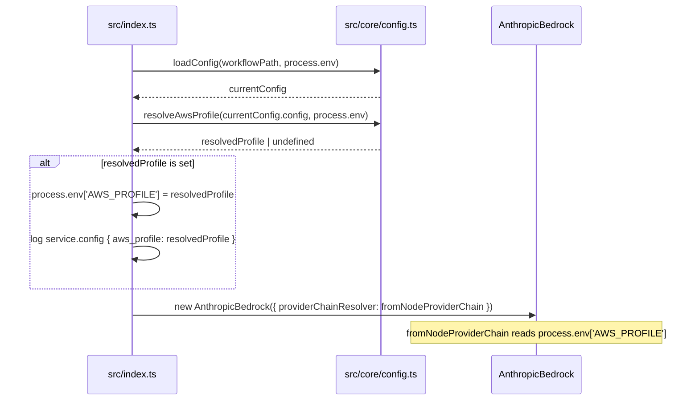

# Enhancement: AWS_PROFILE support

## Parent feature

`feature-foundation.md`
## What

Autocatalyst gains an optional `aws_profile` field in [WORKFLOW.md](http://WORKFLOW.md) and reads `AWS_PROFILE` from the environment at startup. When the config field is set, it takes precedence over the environment variable. The resolved profile is applied to `process.env` early in startup — before any Bedrock API calls or Agent SDK subprocess invocations — so that all credential lookups throughout the process lifetime use the correct named AWS profile.
## Why

Users with multiple AWS accounts or named profiles have no reliable way to specify which credentials autocatalyst should use. Without explicit support, they must either mutate their default AWS profile globally, export `AWS_PROFILE` before starting the service each time, or keep a separate shell wrapper. A config-level `aws_profile` field in [WORKFLOW.md](http://WORKFLOW.md) lets operators lock in the correct profile once, close to the other service configuration, and have it apply consistently to every Bedrock call and every Claude Code subprocess that autocatalyst spawns.
## User stories

- An operator can set `aws_profile: my-profile` in [WORKFLOW.md](http://WORKFLOW.md) and have autocatalyst use those credentials without needing to set any environment variables
- An operator can set `AWS_PROFILE=my-profile` in the shell and have autocatalyst forward that profile to all credential lookups and subprocess invocations
- An operator who sets both `aws_profile` in [WORKFLOW.md](http://WORKFLOW.md) and `AWS_PROFILE` in the shell sees the [WORKFLOW.md](http://WORKFLOW.md) value take precedence
- An operator who sets neither `aws_profile` nor `AWS_PROFILE` observes no change in behavior
## Design changes

*(Added by design specs stage — frame as delta on the parent feature's design spec)*
## Technical changes

### Affected files

- `src/types/config.ts` — add optional `aws_profile?: string` field to `WorkflowConfig`
- `src/core/config.ts` — add `resolveAwsProfile(config, env)` pure function that implements config \> env precedence
- `src/index.ts` — call `resolveAwsProfile` after config is loaded and apply the result to `process.env['AWS_PROFILE']` before Bedrock client construction
- `tests/core/config.test.ts` — unit tests for `resolveAwsProfile`
### Changes

### 1. Introduction and overview

**Prerequisites and assumptions**
- Depends on `feature-foundation.md` (complete) — the existing `WorkflowConfig` type, `loadConfig`, `resolveEnvVars`, and `redactConfig` in `src/core/config.ts`, and the startup sequence in `src/index.ts`
- The AWS Bedrock client already calls `fromNodeProviderChain()` from `@aws-sdk/credential-providers`. That function reads `AWS_PROFILE` from `process.env` at call time, so setting `process.env['AWS_PROFILE']` before Bedrock client construction is sufficient to apply the profile
- Agent SDK's `query()` spawns Claude Code CLI as a child process. Node.js child processes inherit the parent's `process.env` at spawn time, so modifications to `process.env` before any `query()` call are automatically propagated
- No new external services, APIs, or packages required
**Technical goals**
- `config.aws_profile` takes precedence over `process.env['AWS_PROFILE']` when both are set
- The resolved profile is applied to `process.env['AWS_PROFILE']` before the Bedrock client is constructed
- When neither is set, behavior is identical to today
- The resolved profile is logged at `service.config` level (consistent with existing auth logging at line 139 of `src/index.ts`)
**Non-goals**
- Supporting multiple profiles per invocation
- AWS credential rotation or refresh
- Validating that the named profile exists in `~/.aws/config`
- Changing how `AC_ANTHROPIC_API_KEY` path works (profile is only relevant when falling back to Bedrock)
**Glossary**
- **Named profile** — a credentials entry in `~/.aws/config` identified by a name other than `default`
- **Provider chain** — the ordered sequence of credential sources `fromNodeProviderChain()` tries: env vars, SSO, instance roles, etc.
### 2. System design and architecture

**Modified components**
- `src/types/config.ts` — extend `WorkflowConfig` with `aws_profile?: string`
- `src/core/config.ts` — add `resolveAwsProfile(config: WorkflowConfig, env: Record<string, string | undefined>): string | undefined`
- `src/index.ts` — call `resolveAwsProfile` after `loadConfig`, apply to `process.env`, log result
**No new components.** This enhancement only adds a single pure function and wires it into the existing startup sequence.
**Startup sequence (modified)**

### 3. Detailed design

**`src/types/config.ts`**** — WorkflowConfig change**
```typescript
export interface WorkflowConfig {
  polling?: { interval_ms?: number };
  workspace?: { root?: string };
  slack?: {
    bot_token?: string;
    app_token?: string;
    channel_name?: string;
  };
  notion?: { parent_page_id?: string };
  aws_profile?: string;            // <-- new optional field
  [key: string]: unknown;
}
```
**`src/core/config.ts`**** — resolveAwsProfile function**
```typescript
/**
 * Resolves the effective AWS profile to use, applying config-level override
 * precedence over the environment variable.
 *
 * Returns undefined when neither source provides a value, leaving existing
 * process.env['AWS_PROFILE'] (if any) unchanged.
 */
export function resolveAwsProfile(
  config: WorkflowConfig,
  env: Record<string, string | undefined>,
): string | undefined {
  if (typeof config.aws_profile === 'string' && config.aws_profile.trim() !== '') {
    return config.aws_profile.trim();
  }
  const envProfile = env['AWS_PROFILE'];
  if (typeof envProfile === 'string' && envProfile.trim() !== '') {
    return envProfile.trim();
  }
  return undefined;
}
```
**`src/index.ts`**** — startup wiring (insert after loadConfig, before Bedrock client construction)**
```typescript
// Resolve AWS profile — config takes precedence over environment variable
const resolvedAwsProfile = resolveAwsProfile(currentConfig.config, process.env as Record<string, string | undefined>);
if (resolvedAwsProfile !== undefined) {
  process.env['AWS_PROFILE'] = resolvedAwsProfile;
  logger.info(
    { event: 'service.config', aws_profile: resolvedAwsProfile },
    'Using AWS profile',
  );
}
```
This block must be placed after `loadConfig` and before the `if (anthropicApiKey)` / Bedrock block so that `fromNodeProviderChain()` picks up the correct profile.
The existing log on line 139 (`logger.info({ event: 'service.config', auth: 'bedrock', aws_profile: process.env['AWS_PROFILE'] ?? 'default' }, ...)`) will now reflect the resolved value because `process.env['AWS_PROFILE']` has already been set at that point.
**No changes** to `spec-generator.ts`, `implementer.ts`, `question-answerer.ts`, or `pr-creator.ts`. These all inherit `process.env` via normal child process mechanics — setting `AWS_PROFILE` on the parent's `process.env` before any spawn is sufficient.
### 4. Security, privacy, and compliance

**Authentication and authorization**
- This change does not alter the authentication model. It only controls which named profile the existing AWS credential chain selects
- `aws_profile` is a non-secret configuration value (profile names are not credentials). It does not need to be redacted in logs
- The existing `redactConfig` function in `src/core/config.ts` identifies sensitive fields by matching against known token/key patterns. `aws_profile` does not match and should not be added to the redaction list
**Data privacy**
- No PII is introduced. Profile names are infrastructure identifiers
**Input validation**
- `aws_profile` is trimmed before use. An empty string after trimming is treated as absent — equivalent to not setting the field — so a misconfigured `aws_profile: ""` does not override a valid env var
- Profile names are passed only to `process.env['AWS_PROFILE']`, which is consumed by the AWS SDK. The SDK is responsible for resolving it against `~/.aws/config`; autocatalyst does not construct credential paths from the profile name
### 5. Observability

**Log events**
<table header-row="true">
<tr>
<td>Event</td>
<td>Level</td>
<td>Fields</td>
<td>Condition</td>
</tr>
<tr>
<td>`service.config`</td>
<td>info</td>
<td>`aws_profile`</td>
<td>Emitted when a resolved profile is applied (config or env source)</td>
</tr>
</table>
No new log events are needed beyond the single config log. The existing `service.config` event on the Bedrock path (line 139) already logs `aws_profile`; after this change it will always reflect the resolved value.
**Metrics**
- No new metrics
**Alerting**
- No new alerting thresholds
### 6. Testing plan

**`src/core/config.ts`**** — ****`resolveAwsProfile`**** unit tests**
These are pure-function tests; no mocking required.
- Config `aws_profile` set, env `AWS_PROFILE` not set → returns config value
- Config `aws_profile` not set, env `AWS_PROFILE` set → returns env value
- Config `aws_profile` set AND env `AWS_PROFILE` set → returns config value (config wins)
- Config `aws_profile` not set, env `AWS_PROFILE` not set → returns `undefined`
- Config `aws_profile` is empty string → treated as absent; returns env value if set, else `undefined`
- Config `aws_profile` is whitespace only → treated as absent
- Config `aws_profile` has leading/trailing whitespace → returned value is trimmed
**`src/types/config.ts`**** — type tests (existing ****`tests/core/config-types.test.ts`****)**
- `WorkflowConfig` with `aws_profile: 'my-profile'` satisfies the type
- `WorkflowConfig` without `aws_profile` still satisfies the type (field is optional)
**Integration — startup behavior (tested via ****`src/index.ts`**** behavior; no direct unit test)**
The startup sequence in `src/index.ts` is the entry point and is not directly unit-tested in the current test suite. The correctness of the startup wiring is covered by:
1. The `resolveAwsProfile` unit tests verifying precedence logic
2. The Bedrock path already reading `process.env['AWS_PROFILE']` (verified by the existing `service.config` log test coverage in manual integration testing)
No new integration tests are required for the startup block itself; the pure function tests are sufficient.
### 7. Alternatives considered

**Pass ****`env`**** explicitly into ****`query()`**** options in spec-generator, implementer, question-answerer**
Rather than mutating `process.env`, the profile could be threaded through each Agent SDK call as an explicit `env` option. This avoids global state mutation. Rejected because: (a) the `query()` options in the Claude Agent SDK do not expose an `env` parameter in the current API surface; (b) mutating `process.env` early in startup is the standard Node.js pattern for propagating environment configuration to subprocesses; (c) it would require plumbing the profile through constructors and call sites of `AgentSDKSpecGenerator`, `AgentSDKImplementer`, `AgentSDKQuestionAnswerer`, and `GHPRCreator`, adding complexity for no benefit.
**`--aws-profile`**** CLI flag instead of environment variable**
A `--aws-profile` CLI argument would make the profile explicit at invocation time. Rejected because autocatalyst is typically run as a long-lived service started from a shell script or process manager, where environment variables are the conventional mechanism for credential configuration. A [WORKFLOW.md](http://WORKFLOW.md) field achieves the same goal with better discoverability and co-location with other service config.
**Validate the profile name against ****`~/.aws/config`**** at startup**
Autocatalyst could check whether the named profile exists before attempting any Bedrock calls and fail fast with a clear error. Rejected as out of scope for this enhancement. The AWS SDK already produces a clear `CredentialsProviderError` on the first API call, and the existing error handler in `src/index.ts` (lines 129–136) already logs actionable guidance. Adding profile validation would require parsing AWS config files or shelling out to `aws configure list-profiles`, adding complexity and a potential failure mode on unusual config layouts.
### 8. Risks

**Mutating ****`process.env`**** affects all code after the assignment**
Setting `process.env['AWS_PROFILE']` is a global side effect. If any code running before this block (e.g., during `loadConfig`) had already read `process.env['AWS_PROFILE']` and cached the result, those cached values would be stale. Mitigation: the assignment is placed immediately after `loadConfig` and before any AWS SDK or Agent SDK use. `loadConfig` does not read `AWS_PROFILE`. No caching of env values occurs in the current startup sequence.
**Empty or whitespace aws_profile silently falls through to env var**
If an operator sets `aws_profile: " "` in [WORKFLOW.md](http://WORKFLOW.md), the intent is ambiguous (mistake or deliberate reset?). The spec treats whitespace-only as absent and falls back to the env var. This is the safer default — a blank config field shouldn't override a valid env var. Mitigation: documented in the trimming behavior; no special error is raised.
## Task list

- [x] **Story: Implement AWS profile resolution**
	- [x] **Task: Add ****`aws_profile`**** field to ****`WorkflowConfig`**
		- **Description**: In `src/types/config.ts`, add `aws_profile?: string` to the `WorkflowConfig` interface, immediately after the `notion` block and before the index signature.
		- **Acceptance criteria**:
			- [x] `WorkflowConfig` has an optional `aws_profile?: string` field
			- [x] `WorkflowConfig` without `aws_profile` still compiles (field is optional)
			- [x] `tsc --noEmit` passes
		- **Dependencies**: None
	- [x] **Task: Add ****`resolveAwsProfile`**** to ****`src/core/config.ts`**
		- **Description**: Add the `resolveAwsProfile(config: WorkflowConfig, env: Record<string, string | undefined>): string | undefined` function to `src/core/config.ts`. Implement config \> env precedence; trim both values; treat empty/whitespace as absent; return `undefined` when neither source provides a non-empty value. Export the function. Import `WorkflowConfig` at the top of the file if not already imported.
		- **Acceptance criteria**:
			- [x] Function is exported from `src/core/config.ts`
			- [x] Config value takes precedence when both sources are set
			- [x] Env value is returned when config field is absent
			- [x] Returns `undefined` when both sources are absent
			- [x] Empty string and whitespace-only values from either source are treated as absent
			- [x] Values are trimmed before returning
			- [x] `tsc --noEmit` passes
		- **Dependencies**: Task: Add `aws_profile` field to `WorkflowConfig`
	- [x] **Task: Apply resolved profile in ****`src/index.ts`**
		- **Description**: In `src/index.ts`, import `resolveAwsProfile` from `./core/config.js`. After the `loadConfig` call and before the `if (anthropicApiKey)` / Bedrock client block, add the resolution and application logic: call `resolveAwsProfile(currentConfig.config, process.env)`, and if the result is defined, set `process.env['AWS_PROFILE']` and log a `service.config` event with the `aws_profile` field. Verify the insertion point is before line 112 (the `const anthropicApiKey` line).
		- **Acceptance criteria**:
			- [x] `resolveAwsProfile` is called after `loadConfig`
			- [x] `process.env['AWS_PROFILE']` is set to the resolved value when defined
			- [x] `service.config` event is logged with `aws_profile` when a profile is applied
			- [x] Block is inserted before Bedrock client construction
			- [x] When resolved profile is `undefined`, `process.env['AWS_PROFILE']` is not modified
			- [x] `tsc --noEmit` passes
		- **Dependencies**: Task: Add `resolveAwsProfile` to `src/core/config.ts`
- [x] **Story: Tests**
	- [x] **Task: Unit tests for ****`resolveAwsProfile`**
		- **Description**: In `tests/core/config.test.ts`, add a `describe('resolveAwsProfile', ...)` block. Cover all cases from the testing plan: config wins over env; env used when config absent; `undefined` when neither set; empty string from config falls through to env; whitespace-only config treated as absent; trimming of leading/trailing whitespace from config value.
		- **Acceptance criteria**:
			- [x] 7 test cases covering all cases from the testing plan §6
			- [x] Config \> env precedence asserted
			- [x] `undefined` return asserted when both absent
			- [x] Empty and whitespace config values asserted to fall through to env
			- [x] Trimming behavior asserted
			- [x] All tests pass (`npm test` or `npx vitest run`)
		- **Dependencies**: Task: Add `resolveAwsProfile` to `src/core/config.ts`
	- [x] **Task: Config type test for ****`aws_profile`**** field**
		- **Description**: In `tests/core/config-types.test.ts`, add test cases verifying that `WorkflowConfig` with `aws_profile: 'my-profile'` satisfies the type, and that `WorkflowConfig` without `aws_profile` still satisfies the type. These are TypeScript-level type tests; use `satisfies WorkflowConfig` or assignment assertions.
		- **Acceptance criteria**:
			- [x] `WorkflowConfig` with `aws_profile` field accepted by the type
			- [x] `WorkflowConfig` without `aws_profile` field accepted by the type
			- [x] All tests pass
		- **Dependencies**: Task: Add `aws_profile` field to `WorkflowConfig`