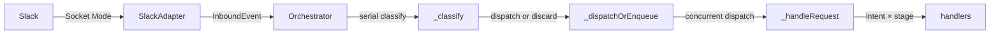
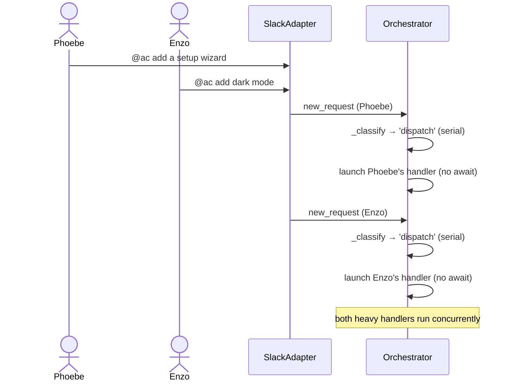
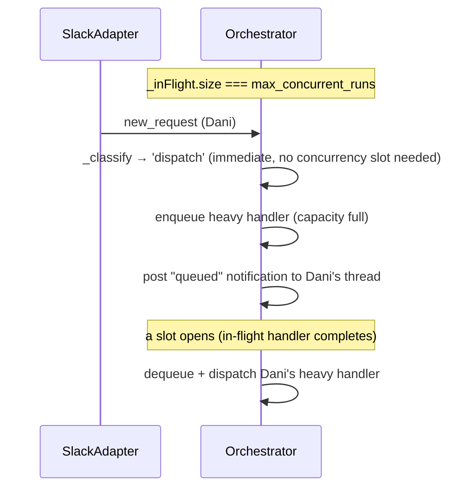

# Enhancement: Concurrent run processing

## Parent feature

`feature-idea-to-spec.md`
## What

The orchestrator currently processes one inbound event at a time — each handler must complete before the next event is dequeued. This enhancement removes that serial bottleneck so that multiple requests can be handled concurrently. When a second request arrives while the first is still being processed, both run in parallel without one waiting on the other. A configurable `max_concurrent_runs` limit caps the number of simultaneous in-flight handlers to prevent resource exhaustion; requests that arrive when the limit is reached are queued and dispatched in order as slots open. Classification of each event remains serial to prevent duplicate or conflicting dispatches for the same run.
## Why

The orchestrator handles a growing range of request types — questions, bug reports, spec generation, and implementation — any of which can involve spawning an agent process, running multi-step AI tasks, or waiting for external operations. With serial dispatch, a single in-flight handler blocks every subsequent request regardless of its type or urgency. A user asking a quick question should not wait behind another user's long-running spec run. The agent must feel immediately responsive for every new message, regardless of what is currently processing. Concurrent dispatch removes that coupling: each request runs on its own, the queue drains as fast as capacity allows, and no request needlessly delays another.
## User stories

- Phoebe can submit two requests in rapid succession and have both begin processing immediately rather than the second waiting behind the first
- Phoebe can see that a failure during one run has no effect on other runs in flight
- Enzo can configure the maximum number of concurrent runs so the system doesn't overwhelm the agent runtime on a resource-constrained host
- Phoebe can submit a request when the system is at its concurrency limit and receive a notification that it has been queued rather than silently dropped
## Design changes

*(No UI changes — this is a backend-only enhancement to the orchestrator's event dispatch loop.)*
## Technical changes

### Affected files

- `src/core/orchestrator.ts` — split the run loop into a serial classification step and a concurrent dispatch step; add in-flight tracking, concurrency limit, and queue
- `src/types/runs.ts` — no interface changes required; `runs` Map is already keyed by `request_id`, providing safe concurrent access for distinct ideas
- `tests/core/orchestrator.test.ts` — add test cases for serial classification, concurrent dispatch, independent failure isolation, deduplication, and concurrency limit / queue behavior
### Changes

### 1. Introduction and overview

**Prerequisites and assumptions**
- Depends on `feature-idea-to-spec.md` (complete) — establishes `OrchestratorImpl`, `_runLoop`, and the `runs` Map
- Depends on `enhancement-intent-classifier-routing.md` (complete) — introduces the unified `_handleRequest` entry point that this enhancement modifies the dispatch of
- A new ADR is required (e.g., `adr-NNN-concurrent-dispatch.md`) documenting the decision to adopt concurrent dispatch over the existing serial processing model — rationale, trade-offs, and the serial classification guarantee all belong there
- The `runs` Map is keyed by `request_id` (one entry per unique run); concurrent handlers for distinct runs access disjoint map entries — no concurrent mutation on the same key
- For any given run, the serial `_classify` step is the sole guard against dispatching duplicate heavy handlers. It checks the run's current stage and, if the action is valid, advances that stage atomically before returning `'dispatch'`. A second message for the same run (e.g., an accidental double-approval) arrives after the first has already advanced the stage — `_classify` sees the new stage and returns `'discard'`. The heavy handler (`_handleRequest`) therefore never needs to race against a duplicate for the same run, and the existing stage guards inside `_handleRequest` (e.g., the `implementing` guard) remain as a belt-and-suspenders safety net but are not the primary deduplication mechanism. This area must have thorough test coverage — see §6.
**Technical goals**
- Classification is serialized in the main loop: each event is fully classified and a dispatch decision is committed before the next event is dequeued. This prevents duplicate dispatches — e.g., two rapid approvals for the same spec cannot both trigger an implementation run.
- Once classified as `'dispatch'`, the heavy handler (`_handleRequest`) runs concurrently with other in-flight handlers; classification itself does not consume a concurrency slot and proceeds immediately.
- A failure in one concurrent run (transition to `failed`, error posted to thread) does not affect any other in-flight run
- Concurrent run count is bounded by a configurable `max_concurrent_runs` (default: `5`); requests beyond the limit are queued (FIFO) and dispatched as slots open
- `stop()` resolves only after all in-flight handlers have fully completed
- No change to observable behavior for single-request workloads
**Non-goals**
- Cross-process or distributed concurrency (multiple service instances)
- Priority queuing or per-user rate limiting
- Cancelling in-flight runs on `stop()` — runs drain to completion
**Glossary**
- **Classification** — the serial step in the run loop that determines whether an event should be dispatched, and commits any stage transition needed to prevent duplicate dispatch
- **In-flight** — a handler that has been dispatched (promise created) but has not yet resolved or rejected
- **Queue** — a FIFO buffer of events waiting for a concurrency slot to open
### 2. System design and architecture

**Modified components**
- `src/core/orchestrator.ts` — the only file that changes. A new `_classify` method handles the serial gate; two new private fields are added (`_inFlight: Set<Promise<void>>` and `_queue: InboundEvent[]`); `_runLoop` is changed to `await this._classify(event)` then call `_dispatchOrEnqueue` if the result is `'dispatch'`; a new `_dispatchOrEnqueue` method manages concurrency gating
**High-level flow (unchanged externally)**

The external interface of `Orchestrator` (`start()`, `stop()`) and all downstream handlers are unchanged.
**Sequence — two concurrent new_request events**

**Sequence — duplicate approval for same run (deduplication)**
```mermaid
sequenceDiagram
    actor Phoebe
    participant SlackAdapter
    participant Orchestrator

    Phoebe->>SlackAdapter: approve (accidental double-send)
    Phoebe->>SlackAdapter: approve (duplicate)
    SlackAdapter->>Orchestrator: thread_message (approval #1)
    Orchestrator->>Orchestrator: _classify → stage=reviewing_spec → advances to implementing → 'dispatch'
    Orchestrator->>Orchestrator: launch implementation handler (no await)
    SlackAdapter->>Orchestrator: thread_message (approval #2)
    Orchestrator->>Orchestrator: _classify → stage=implementing → 'discard'
    Note over Orchestrator: duplicate silently dropped; only one implementation runs
```
**Sequence — queue when at capacity**

### 3. Detailed design

**New private fields on ****`OrchestratorImpl`**
```typescript
private _inFlight = new Set<Promise<void>>();
private _queue: InboundEvent[] = [];
private readonly _maxConcurrentRuns: number; // set from OrchestratorOptions, default 5
```
**Updated ****`OrchestratorOptions`**
```typescript
interface OrchestratorOptions {
  logDestination?: pino.DestinationStream;
  maxConcurrentRuns?: number; // default: 5
}
```
Constructor initialises `_maxConcurrentRuns`:
```typescript
this._maxConcurrentRuns = options?.maxConcurrentRuns ?? 5;
```
**Updated ****`_runLoop`**
```typescript
private async _runLoop(): Promise<void> {
  for await (const event of this.deps.adapter.receive()) {
    if (this._stopping) break;
    // Classification is serial and awaited: advances run state and commits the
    // dispatch decision before the next event is processed. This prevents duplicate
    // or conflicting dispatches for the same run (e.g., double-approval).
    const action = await this._classify(event as InboundEvent);
    if (action === 'dispatch') {
      this._dispatchOrEnqueue(event as InboundEvent);
    }
  }
  // drain all in-flight handlers before resolving
  while (this._inFlight.size > 0) {
    await Promise.allSettled([...this._inFlight]);
  }
}
```
**New ****`_classify`**
```typescript
/**
 * Classifies an event and decides whether to dispatch a heavy handler.
 * Runs serially in the main loop — this is the deduplication gate.
 *
 * For new_request events: always returns 'dispatch'.
 * For thread_message events: checks the run's current stage. If the action is
 * valid, advances the stage atomically before returning 'dispatch' so that a
 * concurrent duplicate message sees the updated stage and is discarded.
 */
private async _classify(event: InboundEvent): Promise<'dispatch' | 'discard'> {
  if (event.type === 'new_request') {
    return 'dispatch';
  }
  // thread_message path: look up run and check stage
  const run = this._runs.get(event.payload.request_id);
  if (!run) {
    this.logger.debug({ event: 'classify.run_not_found', request_id: event.payload.request_id }, 'No run found; discarding');
    return 'discard';
  }
  const actionableStages: RunStage[] = ['reviewing_spec', 'reviewing_implementation', 'awaiting_impl_input'];
  if (!actionableStages.includes(run.stage)) {
    this.logger.debug({ event: 'classify.stage_blocked', stage: run.stage }, 'Stage blocked: discarding thread_message');
    return 'discard';
  }
  // Advance stage here — prevents a duplicate message from also dispatching
  run.stage = stageAfterApproval(run.stage); // advances to 'implementing', etc.
  this.logger.debug({ event: 'classify.dispatched', stage: run.stage }, 'Stage advanced; dispatching');
  return 'dispatch';
}
```
**New ****`_dispatchOrEnqueue`**
```typescript
private _dispatchOrEnqueue(event: InboundEvent): void {
  if (this._inFlight.size >= this._maxConcurrentRuns) {
    this._queue.push(event);
    // notify the user their request has been queued (best-effort)
    if (event.type === 'new_request') {
      const { channel_id, thread_ts } = event.payload;
      this.deps.postMessage(channel_id, thread_ts,
        'The system is at capacity right now — your request has been queued and will start shortly.'
      ).catch(err => {
        this.logger.error({ event: 'run.notify_failed', error: String(err) }, 'Failed to post queue notification');
      });
    }
    this.logger.warn({ event: 'run.queued', queue_depth: this._queue.length }, 'Concurrency limit reached; event queued');
    return;
  }
  this._launch(event);
}

private _launch(event: InboundEvent): void {
  let p: Promise<void>;
  p = this._handleRequest(event)
    .catch(err => {
      this.logger.error({ event: 'run.unhandled_error', error: String(err) }, 'Unhandled error in request handler');
    })
    .finally(() => {
      this._inFlight.delete(p);
      // dequeue next event if any
      const next = this._queue.shift();
      if (next) {
        this.logger.debug({ event: 'run.dequeued', in_flight: this._inFlight.size, queue_depth: this._queue.length }, 'Dequeued event; dispatching');
        this._launch(next);
      }
    });
  this._inFlight.add(p);
  this.logger.debug({ event: 'run.dispatched', in_flight: this._inFlight.size }, 'Handler dispatched');
}
```
**`stop()`**** behavior (unchanged)**
`stop()` sets `_stopping = true`, calls `adapter.stop()`, then awaits `_loopPromise`. Because `_runLoop` now drains `_inFlight` with a while loop before returning, `_loopPromise` resolves only after all in-flight handlers complete (including any promoted from the queue during draining). No change to `stop()` is needed.
**Safety of the ****`runs`**** Map under concurrency**
The `runs` Map is keyed by `request_id` (one entry per run). Concurrent handlers for distinct runs access disjoint map entries. The only potential collision — two events for the same `request_id` arriving in rapid succession — is prevented by `_classify`, which runs serially and advances the run stage before returning. By the time a duplicate message is classified, the stage has already advanced and the duplicate is discarded. The stage guards inside `_handleRequest` remain as a secondary safety net.
### 4. Security, privacy, and compliance

**No authentication or authorization changes** — the dispatch model change is internal; the Bolt SDK still verifies Slack request signatures before any event reaches the adapter.
**Data privacy** — no change. Message content is still passed to the Anthropic API only within handler methods, not in the dispatch or classification layers.
**Input validation** — no change. Event payloads are validated by `SlackAdapter` before reaching the orchestrator.
### 5. Observability

**New log events**
<table header-row="true">
<tr>
<td>Event</td>
<td>Level</td>
<td>Fields</td>
<td>Notes</td>
</tr>
<tr>
<td>`classify.run_not_found`</td>
<td>debug</td>
<td>`request_id`</td>
<td>Event discarded — no matching run found</td>
</tr>
<tr>
<td>`classify.stage_blocked`</td>
<td>debug</td>
<td>`stage`</td>
<td>Event discarded — run not in an actionable stage</td>
</tr>
<tr>
<td>`classify.dispatched`</td>
<td>debug</td>
<td>`stage`</td>
<td>Stage advanced; event will be dispatched</td>
</tr>
<tr>
<td>`run.dispatched`</td>
<td>debug</td>
<td>`in_flight` (current count)</td>
<td>Emitted each time a handler is launched</td>
</tr>
<tr>
<td>`run.queued`</td>
<td>warn</td>
<td>`queue_depth`</td>
<td>Emitted when concurrency limit reached</td>
</tr>
<tr>
<td>`run.dequeued`</td>
<td>debug</td>
<td>`in_flight`, `queue_depth`</td>
<td>Emitted when a queued event is dispatched after a slot opens</td>
</tr>
<tr>
<td>`run.unhandled_error`</td>
<td>error</td>
<td>`error`</td>
<td>Emitted if a handler throws outside of `failRun` — should never happen in practice</td>
</tr>
</table>
**Metrics**
- `orchestrator.in_flight` — gauge tracking current number of in-flight handlers; emit on dispatch and on slot release
- `orchestrator.queue_depth` — gauge tracking current queue depth; emit on enqueue and dequeue
- `orchestrator.queue_wait_ms` — histogram; time from enqueue to dispatch for queued events
**Alerting**
- `orchestrator.queue_depth` sustained above 0 for more than 5 minutes warrants investigation — indicates the concurrency limit is consistently too low for the workload
### 6. Testing plan

All tests use Vitest. Existing orchestrator tests continue to pass without modification; the new cases are additive.
**Test infrastructure and helpers**
To keep tests deterministic and free of timing dependencies, establish these shared helpers in the test file:
- `makeControllablePromise()` — returns a `{ promise, resolve, reject }` triple; use to simulate long-running handlers that hold a concurrency slot until explicitly resolved or rejected in the test body
- `makeEventFixture(type, overrides?)` — returns a valid `InboundEvent` with deterministic `request_id`, `channel_id`, and `thread_ts` values; prevents brittle inline literals across test cases
- For log-assertion tests, capture pino output via the `logDestination` stream option and assert on structured JSON records rather than string matching
- Use Vitest's `vi.useFakeTimers()` in any test that must control promise scheduling order or assert on wall-clock values such as `queue_wait_ms`
**Serial classification and deduplication (highest priority)**
This area requires the strongest coverage given the correctness guarantees it provides:
- **Duplicate approval — same run**: Two rapid `thread_message` approval events for the same run in `reviewing_spec` — assert `_classify` returns `'dispatch'` for the first and `'discard'` for the second; assert exactly one `_handleRequest` call is made
- **Stage advance atomicity**: Assert the run's stage has been mutated to the post-approval stage by the time `_classify` resolves, even before `_handleRequest` begins — verify by inspecting `run.stage` immediately after the first `await _classify()` returns
- **No matching run**: `thread_message` with `request_id` for a non-existent run — `'discard'` returned; `classify.run_not_found` logged with the correct `request_id` field
- **Non-actionable stage (****`speccing`****)**: `thread_message` with run in `speccing` stage — `'discard'` returned; `classify.stage_blocked` logged with `stage: 'speccing'`
- **Non-actionable stage (****`implementing`****)**: `thread_message` with run already in `implementing` stage — `'discard'` returned; confirms deduplication for the implementing transition specifically
- **New request always dispatches**: `new_request` event — `'dispatch'` regardless of any run state already in the map
- **Two ****`new_request`**** events for different runs**: Both classified as `'dispatch'`; both `_handleRequest` calls made; no cross-contamination of `request_id`
- **Classification serial guarantee**: Three sequential `thread_message` events for three different runs are classified one at a time — verify that `_classify` is awaited by confirming no handler is entered before classification of its event returns
**Concurrent dispatch**
- **Two handlers run simultaneously**: `maxConcurrentRuns: 2`, two `new_request` events — assert `_handleRequest` is entered for both before either resolves (use controllable promises to hold each handler)
- **`_inFlight.size`**** is accurate**: Assert `_inFlight.size === 2` while both handlers are pending, drops to `1` after the first resolves, and reaches `0` after both resolve
- **No payload cross-contamination**: Each concurrent handler receives its own event's `channel_id`, `thread_ts`, and `request_id` — verified using per-handler spies
- **Stage isolation**: Stage transitions for run A (e.g., advance to `implementing`) have no effect on run B's stage
**Failure isolation**
- **Unhandled throw in run A**: `_handleRequest` for run A throws an unhandled error — assert `run.unhandled_error` logged with the `error` field; assert run B's handler is not affected and completes normally
- **`_inFlight`**** cleanup after throw**: After run A's unhandled throw, `_inFlight.size` decrements correctly — no ghost entries that would block future dispatches
- **`failRun`**** in run A**: Controlled error path in run A — run B continues to `reviewing_spec` stage unimpeded
- **Queue continues after failure**: Run A fails while run C is queued — run C is still promoted and dispatched after the slot opens; `run.dequeued` logged
**Concurrency limit and queue**
- **At-capacity enqueue**: `maxConcurrentRuns: 2`, three simultaneous `new_request` events — first two dispatched immediately (`_inFlight.size === 2`); third enqueued; `run.queued` logged with `queue_depth: 1`
- **Queue notification only for ****`new_request`**: Queue notification posted to the third event's `channel_id`/`thread_ts`; no notification posted for `thread_message` events that are enqueued
- **FIFO ordering**: `maxConcurrentRuns: 1`, four simultaneous `new_request` events — events are dispatched in arrival order; verify by recording handler-entry order against enqueue order
- **Slot opens → dequeue**: When one in-flight handler completes, the queued event is promoted; `_inFlight.size` returns to the limit while the promoted handler runs; `run.dequeued` logged with correct `in_flight` and `queue_depth` field values
- **Queue drains to zero**: After all events processed, `_queue.length === 0` and `_inFlight.size === 0`
- **Log fields accurate at each stage**: At each enqueue, dequeue, and dispatch point, assert that `queue_depth` and `in_flight` fields on emitted log records match the actual sizes of `_queue` and `_inFlight`
- **`maxConcurrentRuns: 1`**** (effectively serial)**: Three events processed sequentially; second begins only after first completes; third begins only after second completes
- **Boundary — exactly at limit then above**: `maxConcurrentRuns: 3`, exactly 3 in-flight handlers — a fourth event is enqueued; a fifth event is also enqueued; both dequeued in FIFO order as slots open
**Stop drains in-flight work**
- **Stop with in-flight handlers**: `stop()` called while two handlers are in-flight — `_loopPromise` does not resolve until both handlers complete
- **Stop with queued events**: `stop()` called with two in-flight handlers and one queued event — all three complete (including the promoted queued handler) before `stop()` resolves
- **No post-stop errors**: Handlers that complete after `stop()` is called do not log additional errors or attempt to dequeue new events
- **`_stopping`**** breaks the receive loop**: After `_stopping` is set, no new events are dequeued from the adapter; only the drain loop runs
**Observability and metrics**
- **Log field correctness**: For each log event (`classify.run_not_found`, `classify.stage_blocked`, `classify.dispatched`, `run.dispatched`, `run.queued`, `run.dequeued`, `run.unhandled_error`), assert that all documented fields are present and carry correct values on the emitted log record
- **`orchestrator.in_flight`**** gauge**: Emitted on dispatch (value = new `_inFlight.size`) and on slot release (value = decremented `_inFlight.size`); assert correct values at both points
- **`orchestrator.queue_depth`**** gauge**: Reflects actual queue depth at each enqueue and dequeue point; assert values match `_queue.length` after each operation
- **`orchestrator.queue_wait_ms`**** histogram**: An entry is recorded for each queued event when it is dispatched; value is non-negative
**Single-request regression**
- All existing orchestrator test cases pass without modification — behavior for a single request is identical to before this change
### 7. Alternatives considered

**Fire-and-forget with no concurrency limit**
Dispatch every handler without `await` and without tracking in-flight count. Simpler implementation, no queue needed. Rejected because unbounded concurrency allows the orchestrator to spawn an unlimited number of agent processes simultaneously — on a resource-constrained host this would cause memory pressure, port exhaustion, or subprocess spawn failures. A configurable limit with a sensible default is low-cost insurance.
**Back-pressure via async generator pause**
Instead of a queue, pause the `for await` loop when the concurrency limit is reached (e.g., by not dequeuing the next event until a slot opens). This is cleaner in that the adapter's internal buffer acts as the queue, but it couples the dispatch rate to the adapter's receive loop in a way that is harder to observe and test, and it would also block classification of subsequent events while waiting for a slot — violating the requirement that classification is immediate. The explicit `_queue` array makes queue depth directly measurable and the promotion logic explicit.
**Fully concurrent classification (no serial gate)**
Dispatch every event to a concurrent handler immediately, relying entirely on the stage guards inside `_handleRequest` for deduplication. Rejected because concurrent stage guards require careful locking to be race-free — two handlers for the same run could both pass the stage check before either writes back the new stage. The serial `_classify` step eliminates this window entirely without introducing locks.
**Worker pool library (e.g., ****`p-limit`****)**
A library like `p-limit` provides a ready-made bounded concurrency primitive. Rejected for this use case because the additional dependency adds little over the \~20 lines of custom implementation, and the custom version integrates naturally with the existing in-flight tracking needed by `stop()`.
### 8. Risks

**Race condition on ****`runs`**** Map for same-****`request_id`**** events**
If a `new_request` and an immediate `thread_message` for the same `request_id` arrive in rapid succession, could both be classified as `'dispatch'`? No: `_classify` for the `thread_message` checks the run's stage. A run freshly created by a `new_request` starts in `intake` or `speccing` — neither is an actionable stage — so the `thread_message` is discarded by `_classify` before any concurrent handler is launched.
**Queue notification posted before run is created**
The queue notification is posted to the `thread_ts` of the incoming event before `_handleRequest` (and therefore `createRun`) is called. If the user replies in that thread before the queued event is dispatched, there will be no run registered for that `thread_ts` yet, and the reply will be silently discarded by `_classify`. This is acceptable; the user is told to wait and a reply before processing starts has no defined semantics.
**`_inFlight`**** Set modified during drain in ****`stop()`**
`_launch` removes the promise from `_inFlight` in `.finally()`. If new slots open during the drain and promote queued events, those new promises are added to `_inFlight`. The drain loop (`while (this._inFlight.size > 0) { await Promise.allSettled([...this._inFlight]); }`) handles this correctly by re-checking `_inFlight` size after each `allSettled` pass, catching any promises added by promotions during the drain.
## Task list

- [ ] **Story: Prerequisites**
	- [x] **Task: Write ADR for concurrent dispatch**
		- **Description**: Create `adr-NNN-concurrent-dispatch.md` documenting the decision to adopt concurrent dispatch over the existing serial processing model. Cover rationale, trade-offs, the serial classification guarantee, and the alternatives considered (fire-and-forget, back-pressure via generator pause, fully concurrent classification, worker pool library).
		- **Acceptance criteria**:
			- [x] ADR file exists at `adr-NNN-concurrent-dispatch.md`
			- [x] Documents the decision, rationale, and trade-offs
			- [x] Explains the serial classification guarantee and why it is the primary deduplication mechanism
			- [x] References the alternatives considered and why each was rejected
		- **Dependencies**: None
- [ ] **Story: Serial classification gate**
	- [x] **Task: Add ****`_inFlight`****, ****`_queue`****, and ****`_maxConcurrentRuns`**** fields**
		- **Description**: Add three private fields to `OrchestratorImpl`: `_inFlight = new Set<Promise<void>>()`, `_queue: InboundEvent[] = []`, and `readonly _maxConcurrentRuns: number`. Extend `OrchestratorOptions` with `maxConcurrentRuns?: number`. Initialise `_maxConcurrentRuns = options?.maxConcurrentRuns ?? 5` in the constructor.
		- **Acceptance criteria**:
			- [x] `_inFlight`, `_queue`, and `_maxConcurrentRuns` fields present on `OrchestratorImpl`
			- [x] `OrchestratorOptions` has `maxConcurrentRuns?: number`
			- [x] Default value of `5` used when option is omitted
			- [x] `tsc --noEmit` passes
		- **Dependencies**: None
	- [ ] **Task: Implement ****`_classify`**
		- **Description**: Add `_classify(event: InboundEvent): Promise<'dispatch' | 'discard'>` to `OrchestratorImpl` per the detailed design in §3. For `new_request` events: return `'dispatch'`. For `thread_message` events: look up the run; if not found return `'discard'`; if found but stage is not actionable (`reviewing_spec`, `reviewing_implementation`, `awaiting_impl_input`) return `'discard'`; otherwise advance the run's stage atomically and return `'dispatch'`. Log `classify.run_not_found`, `classify.stage_blocked`, and `classify.dispatched` as appropriate.
		- **Acceptance criteria**:
			- [ ] `new_request` always returns `'dispatch'`
			- [ ] `thread_message` with no matching run returns `'discard'` and logs `classify.run_not_found`
			- [ ] `thread_message` with run in non-actionable stage returns `'discard'` and logs `classify.stage_blocked`
			- [ ] `thread_message` with run in actionable stage advances stage and returns `'dispatch'`; logs `classify.dispatched`
			- [ ] Stage advance happens before method returns (visible to next classify call)
			- [ ] `tsc --noEmit` passes
		- **Dependencies**: Task: Add `_inFlight`, `_queue`, and `_maxConcurrentRuns` fields
	- [ ] **Task: Implement ****`_dispatchOrEnqueue`**** and ****`_launch`**
		- **Description**: Add `_dispatchOrEnqueue(event: InboundEvent): void` and `_launch(event: InboundEvent): void` to `OrchestratorImpl` per the detailed design in §3. `_dispatchOrEnqueue` checks `_inFlight.size >= _maxConcurrentRuns`; if at capacity, pushes to `_queue`, posts a "queued" notification (best-effort, non-blocking), and logs `run.queued`. Otherwise calls `_launch`. `_launch` wraps `_handleRequest` in a promise, attaches `.catch` for unhandled errors (logs `run.unhandled_error`), and `.finally` to delete from `_inFlight`, dequeue the next event, and log `run.dequeued` if applicable. Adds the promise to `_inFlight` and logs `run.dispatched`.
		- **Acceptance criteria**:
			- [ ] `_dispatchOrEnqueue` enqueues when `_inFlight.size >= _maxConcurrentRuns`
			- [ ] Queue notification posted to `channel_id`/`thread_ts` of `new_request` events only (not `thread_message`)
			- [ ] `run.queued` logged with `queue_depth` when enqueuing
			- [ ] `_launch` creates a promise wrapping `_handleRequest`, adds it to `_inFlight`, logs `run.dispatched`
			- [ ] `.finally` removes promise from `_inFlight` and dequeues next event if any; logs `run.dequeued`
			- [ ] `.catch` logs `run.unhandled_error` on unexpected throws
			- [ ] `tsc --noEmit` passes
		- **Dependencies**: Task: Implement `_classify`
	- [ ] **Task: Update ****`_runLoop`**** to use ****`_classify`**** and ****`_dispatchOrEnqueue`****, and drain on stop**
		- **Description**: Replace `await this._handleRequest(event as InboundEvent)` in `_runLoop` with: `const action = await this._classify(event as InboundEvent); if (action === 'dispatch') { this._dispatchOrEnqueue(event as InboundEvent); }`. After the `for await` loop exits, add a drain loop: `while (this._inFlight.size > 0) { await Promise.allSettled([...this._inFlight]); }`.
		- **Acceptance criteria**:
			- [ ] `_runLoop` awaits `_classify` for each event before processing the next
			- [ ] `_runLoop` calls `_dispatchOrEnqueue` only when `_classify` returns `'dispatch'`
			- [ ] `_runLoop` awaits full drain of `_inFlight` after the event loop exits
			- [ ] `stop()` continues to resolve only after all in-flight handlers complete
			- [ ] `tsc --noEmit` passes
		- **Dependencies**: Task: Implement `_dispatchOrEnqueue` and `_launch`
- [ ] **Story: Observability and metrics**
	- [ ] **Task: Add metrics instrumentation**
		- **Description**: Instrument `_launch` and its `.finally` callback to emit `orchestrator.in_flight` (gauge) on dispatch and slot release. Instrument `_dispatchOrEnqueue` to emit `orchestrator.queue_depth` (gauge) on enqueue and dequeue. Record `orchestrator.queue_wait_ms` (histogram) in `_launch` when dispatching a previously-queued event — capture enqueue timestamp in `_dispatchOrEnqueue` and compute elapsed time in `_launch`.
		- **Acceptance criteria**:
			- [ ] `orchestrator.in_flight` emitted on each dispatch (value = new `_inFlight.size`) and each slot release (value = decremented `_inFlight.size`)
			- [ ] `orchestrator.queue_depth` emitted on each enqueue and dequeue (value matches `_queue.length` after operation)
			- [ ] `orchestrator.queue_wait_ms` recorded for each queued event when dispatched; value is non-negative
			- [ ] `tsc --noEmit` passes
		- **Dependencies**: Task: Update `_runLoop` to use `_classify` and `_dispatchOrEnqueue`, and drain on stop
- [ ] **Story: Tests**
	- [ ] **Task: Set up test infrastructure and helpers**
		- **Description**: Establish shared test helpers in `tests/core/orchestrator.test.ts` per §6: `makeControllablePromise()` returning a `{ promise, resolve, reject }` triple; `makeEventFixture(type, overrides?)` returning a valid `InboundEvent` with deterministic identifiers; log capture via the `logDestination` stream option for structured JSON assertion; and `vi.useFakeTimers()` setup for timing-sensitive tests.
		- **Acceptance criteria**:
			- [ ] `makeControllablePromise()` helper available in test file; used to simulate long-running handlers
			- [ ] `makeEventFixture()` helper available; produces deterministic `request_id`, `channel_id`, `thread_ts`
			- [ ] Log capture wired via `logDestination`; tests can assert on structured JSON log records
			- [ ] `vi.useFakeTimers()` configured for timing-sensitive test cases
			- [ ] All existing orchestrator tests continue to pass
		- **Dependencies**: Task: Add metrics instrumentation
	- [ ] **Task: Add serial classification and deduplication tests**
		- **Description**: Add tests for all eight cases in §6 "Serial classification and deduplication": (1) two rapid approvals for same run — only first dispatched; (2) stage advance happens before `_classify` returns; (3) `thread_message` with no run → `'discard'`; (4) `thread_message` with non-actionable stage (`speccing`) → `'discard'`; (5) `thread_message` with run in `implementing` → `'discard'`; (6) `new_request` always → `'dispatch'`; (7) two `new_request` events for different runs — both dispatched, no `request_id` cross-contamination; (8) classification serial guarantee — no handler entered before its event's `_classify` call returns.
		- **Acceptance criteria**:
			- [ ] Two rapid approvals for same run: `_classify` returns `'dispatch'` then `'discard'`; only one `_handleRequest` call made
			- [ ] Run stage is mutated by `_classify` before it returns
			- [ ] `thread_message` with no run: `'discard'`; `classify.run_not_found` logged with correct `request_id`
			- [ ] `thread_message` with non-actionable stage: `'discard'`; `classify.stage_blocked` logged with correct `stage` field (tested for both `speccing` and `implementing`)
			- [ ] `new_request`: always `'dispatch'`
			- [ ] Two `new_request` events for different runs: both dispatched; `request_id` values not cross-contaminated
			- [ ] Serial guarantee: no handler entered before its event's `_classify` call returns
			- [ ] All existing orchestrator tests pass
		- **Dependencies**: Task: Set up test infrastructure and helpers
	- [ ] **Task: Add concurrent dispatch tests**
		- **Description**: Add tests for all four cases in §6 "Concurrent dispatch": (1) `maxConcurrentRuns: 2`, two simultaneous `new_request` events — both `_handleRequest` calls entered before either resolves (use controllable promises); (2) `_inFlight.size` accurate throughout — 2 while both pending, 1 after first resolves, 0 after both resolve; (3) no payload cross-contamination — each handler receives its own `channel_id`, `thread_ts`, `request_id`; (4) stage isolation — transitions for run A have no effect on run B's stage.
		- **Acceptance criteria**:
			- [ ] Both handlers entered before either completes (verified via controllable promises)
			- [ ] `_inFlight.size` equals 2, then 1, then 0 at the correct points
			- [ ] Each handler's received event payload is its own (no cross-contamination)
			- [ ] Run A stage transition does not affect run B's stage
			- [ ] All existing orchestrator tests pass
		- **Dependencies**: Task: Add serial classification and deduplication tests
	- [ ] **Task: Add failure isolation tests**
		- **Description**: Add tests for all four cases in §6 "Failure isolation": (1) unhandled throw in run A — `run.unhandled_error` logged; run B unaffected and completes normally; (2) `_inFlight` cleanup after unhandled throw — `_inFlight.size` decrements correctly, no ghost entries; (3) `failRun` path in run A — run B continues to `reviewing_spec` unimpeded; (4) queue continues after failure — run A fails while run C is queued; run C still promoted and dispatched; `run.dequeued` logged.
		- **Acceptance criteria**:
			- [ ] Unhandled throw in run A: `run.unhandled_error` logged with `error` field; run B completes normally
			- [ ] `_inFlight.size` decrements correctly after unhandled throw; no ghost entries
			- [ ] `failRun` in run A: run B reaches `reviewing_spec`
			- [ ] Queue continues after failure: run C promoted and dispatched; `run.dequeued` logged
			- [ ] All existing orchestrator tests pass
		- **Dependencies**: Task: Add concurrent dispatch tests
	- [ ] **Task: Add concurrency limit and queue tests**
		- **Description**: Add tests for all eight cases in §6 "Concurrency limit and queue": (1) at-capacity enqueue; (2) queue notification only for `new_request`; (3) FIFO ordering with `maxConcurrentRuns: 1`; (4) slot opens → dequeue with correct log fields; (5) queue drains to zero; (6) log fields accurate at each stage; (7) `maxConcurrentRuns: 1` effectively serial; (8) boundary — exactly at limit then above, both dequeued in FIFO order.
		- **Acceptance criteria**:
			- [ ] Third event enqueued when `_inFlight.size === maxConcurrentRuns`; `run.queued` logged with correct `queue_depth`
			- [ ] Queue notification posted to third event's `channel_id`/`thread_ts` for `new_request`; not posted for `thread_message`
			- [ ] Slot opens → queued event dispatched; `_inFlight.size` and `_queue.length` accurate; `run.dequeued` logged
			- [ ] Queue and in-flight both empty after all processing completes
			- [ ] FIFO dispatch ordering verified with `maxConcurrentRuns: 1`
			- [ ] Fourth and fifth events enqueued and dequeued in order at boundary
			- [ ] All log record fields match actual data structure state at time of emission
			- [ ] All existing orchestrator tests pass
		- **Dependencies**: Task: Add failure isolation tests
	- [ ] **Task: Add stop-drain tests**
		- **Description**: Add tests for all four cases in §6 "Stop drains in-flight work": (1) `stop()` called while two handlers are in-flight — `_loopPromise` does not resolve until both complete; (2) `stop()` called with two in-flight handlers and one queued event — all three complete (including promoted queued handler) before `stop()` resolves; (3) no post-stop errors — handlers completing after `stop()` do not log additional errors or attempt to dequeue new events; (4) `_stopping` breaks the receive loop — no new events dequeued after `_stopping` is set; only drain loop runs.
		- **Acceptance criteria**:
			- [ ] `stop()` with in-flight handlers: `_loopPromise` not resolved until both handlers complete
			- [ ] `stop()` with queued events: queued event promoted, completes, and `stop()` resolves only after all three finish
			- [ ] No post-stop errors or spurious dequeue attempts from completing handlers
			- [ ] `_stopping` prevents new event dequeue; drain loop runs to completion
			- [ ] All existing orchestrator tests pass
		- **Dependencies**: Task: Add concurrency limit and queue tests
	- [ ] **Task: Add observability and metrics tests**
		- **Description**: Add tests for all four cases in §6 "Observability and metrics": (1) each log event emits all documented fields with correct values; (2) `orchestrator.in_flight` gauge correct at dispatch and release; (3) `orchestrator.queue_depth` gauge reflects actual queue depth at each enqueue and dequeue; (4) `orchestrator.queue_wait_ms` histogram entry recorded for each queued event; value is non-negative.
		- **Acceptance criteria**:
			- [ ] All seven log events assert on all documented fields with correct values
			- [ ] `orchestrator.in_flight` values correct at dispatch and release points
			- [ ] `orchestrator.queue_depth` values match `_queue.length` after each operation
			- [ ] `orchestrator.queue_wait_ms` entries non-negative for all queued events
			- [ ] All existing orchestrator tests pass
		- **Dependencies**: Task: Add stop-drain tests