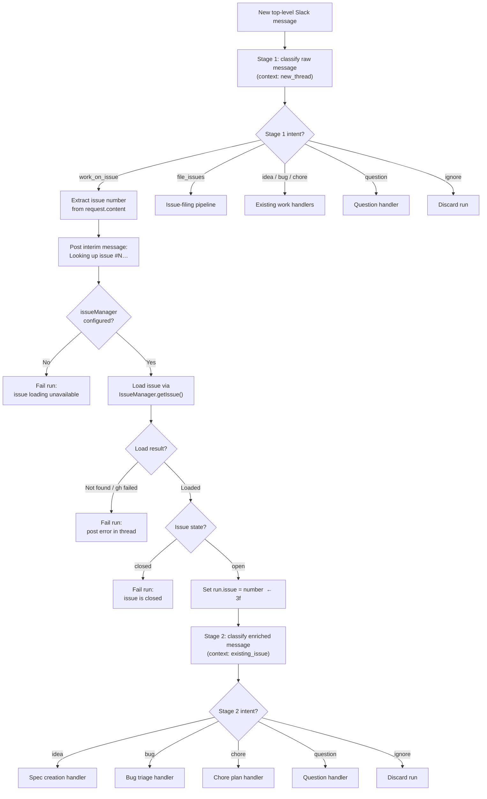

# Enhancement: Existing issue work routing

## Parent feature

`enhancement-intent-classifier-routing.md`
This enhances intent classifier routing by adding a two-stage classification path for messages that ask Autocatalyst to work on an existing GitHub issue. It also depends on `enhancement-batch-issue-filing.md` because that enhancement introduced the `file_issues` intent whose description currently attracts these messages, and on `enhancement-bug-and-chore-handlers.md` because loaded issues may route to the bug or chore triage/implementation pipelines.
## What

When a user sends a new top-level request that asks Autocatalyst to work on an existing GitHub issue, a two-stage intent classification process routes the request correctly. In Stage 1, the raw message is classified under the `new_thread` context — the same context used today — but the classifier now recognises a new `work_on_issue` intent, signalling that the user wants to act on an existing issue without yet revealing what kind of work it is. If Stage 1 returns `work_on_issue`, Autocatalyst extracts the issue number, loads the issue, checks its state, and then runs Stage 2 classification against the enriched issue content in an `existing_issue` context. Stage 2 routes to the same `idea`, `bug`, or `chore` pipelines that direct requests use today. Messages that reference an issue number but are only asking a question — such as "tell me about issue 32" — return `question` from Stage 1 and go directly to the question handler without triggering issue loading at all.
## Why

A regex-first approach to detecting issue references cannot distinguish between a request to work on an issue and a question about one. "Tell me about issue 32" and "fix issue 32" both contain issue numbers, but only the latter should trigger issue loading and work routing. Two-stage classification solves this: Stage 1 first determines whether the user's intent is to work on an existing issue, and only then does Autocatalyst load the issue and run Stage 2 to identify the specific type of work. This also prevents "let's work on issue 42" from being misclassified as `file_issues`, which is the existing bug that motivated this enhancement.
## User stories

- Enzo can say "let's work on issue 42" and have Autocatalyst classify the request as `work_on_issue`, load the issue, and then decide whether the work is a bug, feature, or chore.
- Phoebe can paste "#42" in a top-level Slack request and have the issue's title, body, and labels drive the selected work pipeline.
- Enzo can ask "tell me about issue 32" and have Autocatalyst answer the question without loading the issue or routing it to a work pipeline.
- Enzo can ask Autocatalyst to work on a bug-labeled issue and receive the bug/chore plan behavior instead of the issue-filing behavior.
- Phoebe can ask Autocatalyst to work on an enhancement-labeled issue and receive the spec-writing behavior instead of a duplicate issue.
- Dani can still ask Autocatalyst to "file these issues" and have explicit issue-filing requests route to `file_issues` when no existing issue work request is present.
- Operators can see logs that show when a `work_on_issue` intent was classified, when an issue was loaded or failed to load, and which Stage 2 intent was selected.
## Design changes

*(No UI changes — this is a backend-only enhancement to request classification and GitHub issue access.)*
The user-visible behavior changes only through Slack responses and downstream routing:
- When Stage 1 returns `work_on_issue`, Autocatalyst immediately posts an interim message in the thread — for example, "Looking up issue #42…" — before loading the issue or running Stage 2 classification. This ensures the user receives a response without waiting through two LLM classification passes and one GitHub CLI fetch.
- The subsequent acknowledgement, sent after Stage 2 classification completes, should match the classified Stage 2 intent. Examples: bug/chore issues still get "Working on a plan — will post it here when I'm done," and enhancement/feature issues still get "Writing a spec — will post it here when I'm done."
- The issue-filing acknowledgement "Filing this — will confirm here when I'm done" should not appear for messages whose primary action is to work on an existing issue number.
- "Tell me about issue 32" should produce a question-handler response, not a work acknowledgement.
- If the referenced issue cannot be loaded or is closed, Autocatalyst should post a clear error in the thread and fail the new run rather than silently falling back to `file_issues`.
## Technical changes

### Affected files

- `src/types/intent.ts` — add `work_on_issue` as a named intent value and allow `existing_issue` as a named `ClassificationContext`, while retaining extensibility for custom contexts.
- `src/core/extensions/built-ins.ts` — register `work_on_issue` as a valid Stage 1 intent in the `new_thread` context with a description that makes its meaning clear to the classifier; register `existing_issue` as a built-in Stage 2 classification context with valid intents that exclude `file_issues`; sharpen the `file_issues` description to exclude existing issue references.
- `src/types/issue-tracker.ts` — add a structured `TrackedIssue` type and `IssueManager.getIssue(workspace_path, issue_number)` method.
- `src/adapters/github/issue-manager.ts` — implement `getIssue()` using GitHub CLI issue read APIs and parse title, body, labels, state, URL, and number.
- `src/core/orchestrator.ts` — run Stage 1 classification for all `new_request` events; if Stage 1 returns `work_on_issue`, extract the issue number, post an interim "Looking up issue…" message, load the issue through `IssueManager.getIssue()`, check preliminary conditions, set `run.issue`, and run Stage 2 classification in the `existing_issue` context; otherwise route the Stage 1 intent through existing handlers unchanged.
- `src/core/ai/model-intent-classifier.ts` — ensure prompts for `existing_issue` classification include the enriched issue content and only list valid intents for that context.
- `src/core/default-handler-registry.ts` — no new handlers are required, but routing must receive `idea`, `bug`, `chore`, `question`, or `ignore` from Stage 2 classification and continue to resolve through existing new-request handlers.
- `src/core/commands/classify-intent-command.ts` — accept `existing_issue` as a valid diagnostic context if it validates contexts against the built-in list.
- `tests/adapters/github/issue-manager.test.ts` — cover successful issue loading and GitHub CLI failure handling.
- `tests/core/orchestrator.test.ts` — cover Stage 1 classification to `work_on_issue`, interim message posting, issue number extraction, issue loading before Stage 2 classification, closed-issue rejection, run issue linking, routing by loaded issue content, and load-failure behavior.
- `tests/core/ai/model-intent-classifier.test.ts` — cover `existing_issue` prompt validity and the absence of `file_issues` from the valid intent set.
- `tests/core/extensions/built-ins.test.ts` — cover `work_on_issue` intent registration in `new_thread`, `existing_issue` context registration, and the updated `file_issues` description.
### Changes

#### 1. Prerequisites and assumptions

- Depends on `enhancement-intent-classifier-routing.md` (#43, status: closed) for unified intent classification and intent × stage dispatch.
- Depends on `enhancement-bug-and-chore-handlers.md` (#42, status: approved) for bug/chore work pipelines and the `IssueManager` abstraction.
- Depends on `enhancement-batch-issue-filing.md` (#62, status: complete) for the `file_issues` intent and issue-filing pipeline that must remain available for explicit filing requests.
- No new ADRs are required; this is an additive routing improvement within the existing orchestrator, classifier, and issue-tracker adapter architecture.
- No database schema changes are required. Existing run persistence already supports `Run.issue?: number`, which should be populated when a loaded issue becomes the source of a run.
- The enhancement applies to `new_request` events. In-thread replies continue to be classified by current run stage because they already have a run context.
#### 2. Scope

**In scope**
- Add a `work_on_issue` Stage 1 intent to the `new_thread` context so the classifier can distinguish "work on issue 42" from "tell me about issue 32" before any issue loading occurs.
- After Stage 1 returns `work_on_issue`, extract the issue number from the request using a pure helper. Support common reference forms: `issue 42`, `issue #42`, `#42`, and `GH-42` if the repo already uses that shorthand in user-facing requests.
- Post an immediate interim message in the Slack thread (e.g., "Looking up issue #42…") after extraction and before issue loading, so the user receives feedback without waiting through two classification passes and one issue fetch.
- Load one referenced issue through `IssueManager.getIssue()` after `work_on_issue` is confirmed.
- Perform preliminary checks on the loaded issue: if the issue is closed or cannot be fetched, fail the run with a clear error.
- Build an issue-enriched classification message that includes the user's request and loaded issue fields.
- Add an `existing_issue` Stage 2 classification context where valid intents exclude `file_issues`.
- Store the loaded issue number on the run before dispatch so downstream bug/chore approval can update the same issue when applicable.
- Tighten the `file_issues` built-in intent description so existing-issue work requests are explicitly excluded.
- Log the Stage 1 intent, issue load, Stage 2 intent, and failure paths with structured events.
**Out of scope**
- Filing or deduplicating new issues; that remains the `file_issues` pipeline.
- Supporting multiple existing issue numbers in a single work request. The first valid issue reference is used, and multiple-issue orchestration remains future work.
- Inferring an issue number from a GitHub URL unless the number is already captured by the supported patterns. Full URL parsing can be added later if needed.
- Loading issue comments, linked PRs, sub-issues, or dependency metadata for classification.
- Changing Slack message parsing, thread registration, or command mode behavior.
- Automatically closing, labeling, or commenting on the loaded issue during classification.
#### 3. `work_on_issue` intent

Add `work_on_issue` as a new valid intent for the `new_thread` classification context. This intent means the user wants Autocatalyst to implement or address an existing GitHub issue. It does not specify what kind of work is involved — that is determined in Stage 2 after the issue is loaded.
**Precedence over ****`bug`****, ****`chore`****, and ****`idea`**** in Stage 1.** When a message references an existing GitHub issue number with the intent to act on it, `work_on_issue` takes precedence over `bug`, `chore`, and `idea`. The Stage 1 classifier is not responsible for determining the type of work — that is Stage 2's job after the issue is loaded. A message like "fix the race condition in issue #42" should return `work_on_issue`, not `bug`; the `bug` intent in Stage 1 is reserved for bug reports that do not reference an existing issue to act upon. The description must make this precedence explicit so the model does not try to classify the type of work prematurely.
Register the intent with a description that enforces this precedence and distinguishes action from inquiry:
```typescript
{
  name: 'work_on_issue',
  description:
    'The user wants Autocatalyst to work on, fix, implement, or pick up an existing GitHub issue. ' +
    'The message references a specific issue number and the intent is to act on it, not merely discuss or ask about it. ' +
    'Use this intent whenever the user references an existing issue number with the intent to take action — ' +
    'even if the message sounds like a bug report, feature request, or chore description. ' +
    'For example, "fix the race condition in issue #42" should return work_on_issue, not bug. ' +
    'This intent takes precedence over bug, chore, and idea when an existing issue number is referenced with action intent. ' +
    'Do not use this intent for questions about what an issue contains or requests to summarise an issue.',
}
```
**Stage 2 cannot return ****`work_on_issue`****.** The `work_on_issue` intent must appear in the `new_thread` valid intent list alongside `idea`, `bug`, `chore`, `question`, `file_issues`, and `ignore`. It must not appear in the `existing_issue` valid intent list. By Stage 2, the question of whether to act on an issue has already been settled; the classifier is choosing what type of work to perform, not whether to perform it. Omitting `work_on_issue` from the `existing_issue` valid intent set makes this structurally impossible rather than relying on prompt wording alone.
#### 4. Issue number extraction

After Stage 1 confirms `work_on_issue`, extract the issue number from the request content using a small pure helper. The helper may live in a dedicated module such as `src/core/issue-reference.ts`:
```typescript
export interface IssueReference {
  number: number;
  raw: string;
}

export function extractIssueReference(message: string): IssueReference | undefined;
```
Extraction rules:
- Match `issue 42` and `issue #42` case-insensitively.
- Match standalone `#42` when it appears as a token, not inside a word or URL fragment.
- Optionally match `GH-42` case-insensitively if this shorthand appears in the codebase or tests.
- Ignore non-positive numbers and impossible JavaScript integers.
- Return only the first reference for this enhancement.
Because Stage 1 has already confirmed the user intends to work on an issue, the extraction helper does not need to reject phrases like "file an issue" — the classifier has already handled that distinction. The helper only needs to find a valid issue number.
This helper should be unit-tested independently if it lives outside `orchestrator.ts`; otherwise test it through orchestrator behavior.
#### 5. Issue manager read API

Extend `IssueManager` with a read method:
```typescript
export interface TrackedIssue {
  number: number;
  title: string;
  body: string;
  labels: string[];
  state: 'open' | 'closed' | string;
  url?: string;
}

export interface IssueManager {
  getIssue(workspace_path: string, issue_number: number): Promise;
  writeIssue(workspace_path: string, issue_number: number, body: string): Promise;
  create(workspace_path: string, title: string, body: string, labels?: string[]): Promise;
}
```
`GHIssueManager.getIssue()` should call `gh issue view  --json number,title,body,labels,state,url` with `cwd` set to the workspace path. It should parse labels from GitHub's JSON label objects into a string array. If the issue does not exist, the repo is unavailable, or `gh` fails, the method should log `issue.read_failed` with the issue number and throw an error with a clear message.
#### 6. Classification context and prompt

Add `existing_issue` to the built-in contexts and valid intent map:
```typescript
export const BUILT_IN_CLASSIFICATION_CONTEXTS: ClassificationContext[] = [
  'new_thread',
  'existing_issue',
  'intake',
  // existing run stages...
];
```
Register valid intents for `existing_issue` as:
- `idea`
- `bug`
- `chore`
- `question`
- `ignore`
Do not include `file_issues` for this context. A request that reaches Stage 2 has already been confirmed as an existing-issue work request, so filing new issues is not a valid classification outcome. Do not include `work_on_issue` either — that intent is only valid in Stage 1.
The existing `ModelIntentClassifier.classify(message, context)` interface can remain unchanged if the orchestrator passes an enriched message string. The enriched message should be structured and explicit:
```plain text
User request:
let's work on issue 42

Referenced GitHub issue:
Number: 42
State: open
Labels: bug, P2: medium
Title: Intent classifier misidentifies "let's work on issue N" as an issue-filing request
Body:

Classify the type of work requested by the referenced GitHub issue. Do not classify this as issue filing merely because the user mentioned an issue number.
```
This keeps the classifier interface simple and gives the model the real signal. If future providers need richer metadata, a later enhancement can add a structured `ClassificationInput` overload.
#### 7. Orchestrator flow

Update the `new_request` branch of `_handleRequest()`:
1. Create the run as it does today after channel mapping succeeds.
2. Classify the raw message in the `new_thread` context (Stage 1). This uses the standard classification path and may return any valid `new_thread` intent, including the new `work_on_issue`.
3. If Stage 1 returns `work_on_issue`:
	- a. Extract the issue number from `request.content` using the issue reference helper.
	- b. Post an interim message in the Slack thread — for example, "Looking up issue #42…" — so the user receives immediate feedback. This message is sent before issue loading or Stage 2 classification begins, ensuring the user does not wait through two LLM calls and one GitHub CLI fetch without any response.
	- c. If `issueManager` is not configured, fail the run with a clear message that existing issue loading is unavailable. Do not fall back to `new_thread` re-classification.
	- d. Load the issue with `issueManager.getIssue(workspace_path_or_repo_path, number)`.
	- e. Preliminary checks: if the issue is not found or `gh` fails, fail the run and post a clear error in the Slack thread. If the issue state is `closed`, fail the run with a message indicating the issue is closed.
	- f. Set `run.issue = number`. (This is the point at which the run becomes permanently linked to the loaded issue; subsequent steps may reference `run.issue` without re-reading it.)
	- g. Classify the enriched message in the `existing_issue` context (Stage 2). The enriched message includes the user's original request and the loaded issue fields.
	- h. Continue with the existing acknowledgement and handler resolution using the Stage 2 classified intent.
4. If Stage 1 returns any other intent (`idea`, `bug`, `chore`, `question`, `file_issues`, `ignore`):
	- Continue with the existing acknowledgement and handler resolution for that intent unchanged. No issue loading occurs.
#### Flowchart


The workspace path passed to `getIssue()` should be the path where `gh issue view` can infer the target repository. If the run workspace is not created until a downstream handler starts, use the configured repo path from `channelRepoMap` or create the workspace before reading the issue. Prefer the smallest change that keeps issue reads pointed at the correct repository and does not create extra workspaces for ignored requests.
#### 8. Routing behavior

Existing handler registrations remain valid:
- `existing_issue` → `idea` routes to the artifact/spec creation handler.
- `existing_issue` → `bug` routes to the bug triage handler.
- `existing_issue` → `chore` routes to the chore plan handler.
- `existing_issue` → `question` routes to the question handler.
- `existing_issue` → `ignore` discards the run as today.
For bug and chore runs, `run.issue` should already contain the loaded issue number. On approval, the existing artifact approval path should update that issue rather than creating a new one, preserving the user's intent to work from the existing issue.
For `idea` runs sourced from an existing enhancement or feature-request issue, the spec pipeline should still create a spec artifact. This enhancement does not require the spec approval path to sync the final spec back to the issue, because the current feature spec lifecycle uses repo specs as the canonical artifact. A future enhancement can add issue-linking behavior for feature specs if needed.
#### 9. Observability

Add structured logs:
- `intent_classification.work_on_issue` with `request_id` and the matched Stage 1 intent, logged when Stage 1 returns `work_on_issue`.
- `issue_reference.extracted` with `request_id`, `issue_number`, and matched form, logged after extraction succeeds.
- `issue_reference.loaded` with `request_id`, `issue_number`, `labels`, and `state`, logged after issue loading succeeds.
- `issue_reference.load_failed` with `request_id`, `issue_number`, and redacted error string.
- `issue_reference.closed` with `request_id` and `issue_number`, logged when the loaded issue is in a closed state.
- `intent_classification.issue_context` with `run_id`, `issue_number`, `context: existing_issue`, and `classified_intent`, logged after Stage 2.
Do not log full issue bodies because they may contain secrets or sensitive customer details. Existing classifier logs that include message length are acceptable; avoid adding raw enriched prompts to logs.
#### 10. Failure behavior

- If Stage 1 classification fails entirely, use the existing classification-unavailable error path. No issue loading occurs.
- If issue extraction finds no number after Stage 1 returns `work_on_issue`, mark the run failed and post an error. This should not occur in practice if the classifier is well-described, but guards against prompt drift.
- If `issueManager` is not configured when needed, mark the run failed and post a clear message. Do not re-classify under `new_thread`.
- If issue loading fails, mark the run `failed`, persist it, and post an error in the conversation. The user can retry after fixing the issue number or GitHub access.
- If the issue is closed, mark the run `failed` and post a message stating the issue is already closed. Do not route to any work handler.
- If Stage 2 classification fails after issue loading, use the existing classification-unavailable error path. Preserve `run.issue` so logs and persisted state show which issue the failed run targeted.
- If the classifier returns an invalid intent for `existing_issue`, `ModelIntentClassifier` should fall back according to the registry. The fallback for `existing_issue` should be `idea`, matching `new_thread` conservatism, unless tests show `ignore` is safer. Do not fall back to `file_issues`.
#### 11. Security and provider behavior

- Treat loaded issue bodies as untrusted user content. They must be placed inside clearly delimited prompt sections and never interpreted as instructions for the orchestrator itself.
- Do not print issue bodies in logs or error messages.
- GitHub CLI authentication remains an operational prerequisite for issue loading. If `gh` is unavailable or unauthenticated, the run should fail clearly rather than misroute.
- This spec only covers the GitHub issue manager. Other future issue tracker providers must implement the same `IssueManager.getIssue()` contract before existing-issue work routing can operate for them.
## Task list

### Story 1: Classify user intent before any issue loading

The classifier can distinguish "work on issue 42" from "tell me about issue 32" without loading any issue data.
#### Task: Add `work_on_issue` intent to built-in registry

- **Description**: Add `work_on_issue` as a named intent value in `src/types/intent.ts` and register it with a description in `src/core/extensions/built-ins.ts` as a valid `new_thread` intent. The description must clearly distinguish action (implement, fix, pick up) from inquiry (ask about, summarise, explain), and must make explicit that `work_on_issue` takes precedence over `bug`, `chore`, and `idea` when an existing issue is referenced with action intent.
- **Acceptance criteria**:
	- [ ] `work_on_issue` is a valid intent type in TypeScript.
	- [ ] The intent appears in the `new_thread` valid intent list.
	- [ ] The classifier description distinguishes work intent from question intent.
	- [ ] The classifier description states that `work_on_issue` takes precedence over `bug`, `chore`, and `idea` when an existing issue number is referenced with action intent.
	- [ ] `work_on_issue` does not appear in the `existing_issue` valid intent list.
	- [ ] Existing intent type assertions and exhaustive switches compile without change.
- **Dependencies**: None.
#### Task: Verify Stage 1 classifier behavior for issue-referencing messages

- **Description**: Add classifier tests that confirm "let's work on issue 42" returns `work_on_issue` and "tell me about issue 32" returns `question` under `new_thread` context. Include cases where the message content implies a specific issue type (e.g., bug language) to verify `work_on_issue` precedence.
- **Acceptance criteria**:
	- [ ] "let's work on issue 42" classifies as `work_on_issue` in `new_thread`.
	- [ ] "please pick up #42" classifies as `work_on_issue` in `new_thread`.
	- [ ] "fix the race condition in issue #42" classifies as `work_on_issue`, not `bug`, in `new_thread`.
	- [ ] "tell me about issue 32" classifies as `question` in `new_thread`.
	- [ ] "what is #32?" classifies as `question` in `new_thread`.
	- [ ] "file issues for these three findings" still classifies as `file_issues` in `new_thread`.
- **Dependencies**: Task: Add `work_on_issue` intent to built-in registry.
### Story 2: Extract issue number after intent confirmation

When Stage 1 returns `work_on_issue`, the orchestrator can reliably extract the issue number from the message and immediately acknowledge to the user.
#### Task: Add issue number extraction helper

- **Description**: Add a pure helper `extractIssueReference(message)` that extracts a single issue number from text. Support `issue 42`, `issue #42`, and standalone `#42`; optionally support `GH-42` if chosen during implementation. This helper is called only after Stage 1 confirms `work_on_issue`, so it does not need to reject filing-related phrases.
- **Acceptance criteria**:
	- [ ] Extracts `42` from `let's work on issue 42`.
	- [ ] Extracts `42` from `please pick up issue #42`.
	- [ ] Extracts `42` from `work on #42`.
	- [ ] Returns `undefined` for messages with no valid issue number.
	- [ ] Ignores invalid, zero, negative, or unsafe integer references.
- **Dependencies**: None.
#### Task: Wire Stage 1 → extraction into new-request orchestration

- **Description**: In `OrchestratorImpl._handleRequest()` for `new_request`, run Stage 1 classification first. If the result is `work_on_issue`, call the extraction helper, post an interim Slack message (e.g., "Looking up issue #42…"), and proceed to issue loading. Otherwise, pass the Stage 1 intent through existing handler resolution unchanged.
- **Acceptance criteria**:
	- [ ] A request classified as `work_on_issue` in Stage 1 triggers extraction and issue loading.
	- [ ] After extraction succeeds, an interim message such as "Looking up issue #N…" is posted to the Slack thread before issue loading begins.
	- [ ] A request classified as `question` in Stage 1 goes directly to the question handler without issue loading or an interim message.
	- [ ] A request classified as `file_issues` in Stage 1 goes directly to the filing pipeline without issue loading or an interim message.
	- [ ] A request without an issue number that somehow returns `work_on_issue` fails the run with a clear error rather than crashing.
	- [ ] Stage 1 classification emits a structured log event.
- **Dependencies**: Task: Add `work_on_issue` intent to built-in registry; Task: Add issue number extraction helper.
### Story 3: Load referenced GitHub issue data

Autocatalyst can read an existing GitHub issue and pass its content into Stage 2 classification.
#### Task: Extend the issue tracker interface with `getIssue()`

- **Description**: Add `TrackedIssue` and `IssueManager.getIssue(workspace_path, issue_number)` to `src/types/issue-tracker.ts`. Update tests and mocks that construct `IssueManager` objects.
- **Acceptance criteria**:
	- [ ] `TrackedIssue` includes number, title, body, labels, state, and optional URL.
	- [ ] All TypeScript test helpers that create `IssueManager` compile with the new method.
	- [ ] Existing `create()` and `writeIssue()` callers remain unchanged.
- **Dependencies**: None.
#### Task: Implement GitHub issue loading

- **Description**: Implement `GHIssueManager.getIssue()` using `gh issue view  --json number,title,body,labels,state,url` and normalize labels into strings.
- **Acceptance criteria**:
	- [ ] Calls `gh issue view` with the provided issue number and workspace `cwd`.
	- [ ] Parses a successful GitHub CLI JSON response into `TrackedIssue`.
	- [ ] Converts label objects to label names.
	- [ ] Logs and throws a clear error when `gh` fails or returns malformed JSON.
	- [ ] Does not log the issue body.
- **Dependencies**: Task: Extend the issue tracker interface with `getIssue()`.
#### Task: Add preliminary issue checks

- **Description**: After loading the issue, check that it is open before proceeding to Stage 2. Fail the run clearly if the issue is closed.
- **Acceptance criteria**:
	- [ ] A closed issue fails the run with a message stating the issue is closed.
	- [ ] An open issue passes through to Stage 2 classification.
	- [ ] The closed-issue failure path persists the run state.
	- [ ] The closed-issue failure path does not route to any work handler or `file_issues`.
- **Dependencies**: Task: Implement GitHub issue loading.
### Story 4: Classify loaded issues in an existing-issue context

Stage 2 classification chooses a work intent from loaded issue content and cannot return `file_issues` or `work_on_issue`.
#### Task: Add the `existing_issue` classification context

- **Description**: Register `existing_issue` as a built-in Stage 2 classification context and configure valid intents for it.
- **Acceptance criteria**:
	- [ ] `existing_issue` appears in `BUILT_IN_CLASSIFICATION_CONTEXTS`.
	- [ ] Valid intents for `existing_issue` are `idea`, `bug`, `chore`, `question`, and `ignore`.
	- [ ] `file_issues` is not valid for `existing_issue`.
	- [ ] `work_on_issue` is not valid for `existing_issue`.
	- [ ] The fallback for `existing_issue` is not `file_issues`.
- **Dependencies**: None.
#### Task: Build enriched classification input for loaded issues

- **Description**: Add a helper that formats the user's request and loaded issue fields into a clear Stage 2 classifier message. Use this enriched message when classifying with context `existing_issue`.
- **Acceptance criteria**:
	- [ ] The classifier receives the user's original request text.
	- [ ] The classifier receives the issue number, state, labels, title, and body.
	- [ ] The prompt includes an explicit instruction not to classify as issue filing merely because an issue number was mentioned.
	- [ ] The enriched issue body is not logged.
- **Dependencies**: Task: Extend the issue tracker interface with `getIssue()`; Task: Add the `existing_issue` classification context.
#### Task: Tighten `file_issues` built-in intent description

- **Description**: Update the `file_issues` description so it means explicit requests to create or file new issues, not requests to work on existing numbered issues.
- **Acceptance criteria**:
	- [ ] Description states that existing issue references like `issue 42` or `#42` are excluded from `file_issues` when the intent is to work on the issue.
	- [ ] Existing `file_issues` routing tests still pass for explicit filing requests.
	- [ ] Classifier prompt tests show the updated description when `file_issues` is valid.
- **Dependencies**: None.
### Story 5: Route existing issues to the correct pipeline

Loaded existing issues use the same handlers as direct bug, chore, feature, or question requests.
#### Task: Update new-request classification and run state

- **Description**: In `OrchestratorImpl._handleRequest()`, after Stage 1 → `work_on_issue` → extraction → interim message → load → checks, classify the enriched content with `existing_issue` context, set `run.issue`, and continue through existing acknowledgement and handler resolution.
- **Acceptance criteria**:
	- [ ] `issueManager.getIssue(42)` is called only after Stage 1 returns `work_on_issue` for "let's work on issue 42".
	- [ ] `intentClassifier.classify()` receives context `existing_issue` for the Stage 2 call.
	- [ ] `run.issue` is set to `42` before dispatch.
	- [ ] A bug-labeled issue classified as `bug` in Stage 2 routes through the bug/chore artifact creation handler.
	- [ ] An enhancement-labeled issue classified as `idea` in Stage 2 routes through the spec creation handler.
	- [ ] No loaded issue request routes to the `file_issues` handler.
- **Dependencies**: Task: Wire Stage 1 → extraction into new-request orchestration; Task: Implement GitHub issue loading; Task: Add preliminary issue checks; Task: Build enriched classification input for loaded issues.
#### Task: Handle unavailable issue loading safely

- **Description**: Add failure handling for the `work_on_issue` path when `issueManager` is missing or `getIssue()` fails.
- **Acceptance criteria**:
	- [ ] Missing `issueManager` produces a clear user-facing error and does not re-classify under `new_thread`.
	- [ ] `getIssue()` rejection produces a clear user-facing error and marks the run failed.
	- [ ] Failure path persists the run state.
	- [ ] Failure path never invokes the issue-filing handler.
- **Dependencies**: Task: Update new-request classification and run state.
### Story 6: Prove old routing still works

Explicit issue filing remains available, and non-issue requests are unaffected.
#### Task: Add regression tests for issue-filing and normal requests

- **Description**: Add tests that cover explicit filing requests, ordinary feature ideas, ordinary bug/chore requests, and question-about-issue requests after the new two-stage path is added.
- **Acceptance criteria**:
	- [ ] "file issues for these three findings" can still classify as `file_issues` in Stage 1 `new_thread` context and routes to the filing pipeline.
	- [ ] "tell me about issue 32" classifies as `question` in Stage 1 and routes to the question handler without loading the issue.
	- [ ] A feature idea without an issue number still uses `new_thread` context and goes to the appropriate handler.
	- [ ] A bug report without an issue number still uses `new_thread` context and goes to the appropriate handler.
	- [ ] Existing `file_issues` orchestrator tests pass without weakening assertions.
- **Dependencies**: Task: Update new-request classification and run state; Task: Tighten `file_issues` built-in intent description.
#### Task: Run targeted validation

- **Description**: Run focused tests for issue manager, classifier, built-in intents, and orchestrator routing.
- **Acceptance criteria**:
	- [ ] `npm test -- tests/adapters/github/issue-manager.test.ts` passes.
	- [ ] `npm test -- tests/core/ai/model-intent-classifier.test.ts` passes.
	- [ ] `npm test -- tests/core/extensions/built-ins.test.ts` passes.
	- [ ] `npm test -- tests/core/orchestrator.test.ts` or a narrower supported Vitest filter for the new cases passes.
	- [ ] `npm test` passes or any unrelated failures are documented.
- **Dependencies**: All implementation tasks.