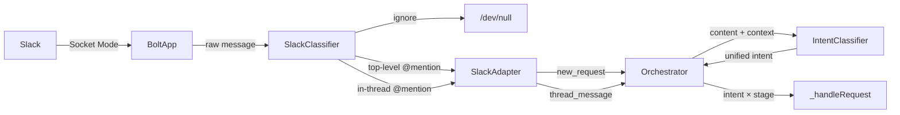
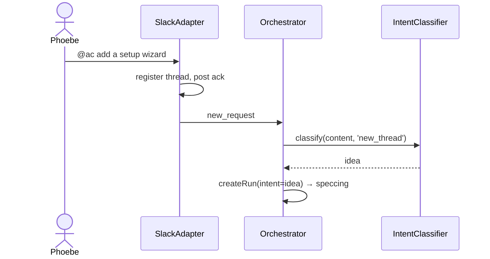
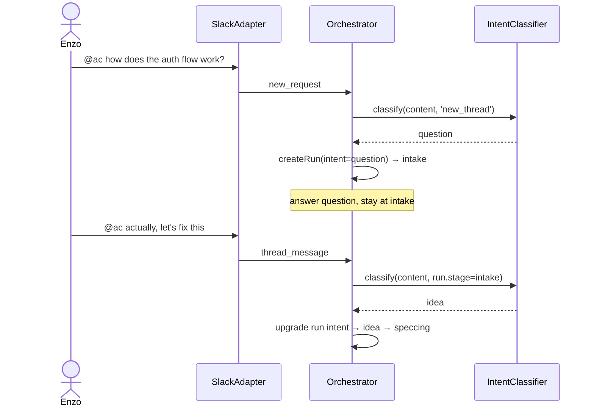

# Enhancement: Intent classifier routing

## Parent feature

`feature-slack-message-routing.md`

## What

The slack message routing feature currently classifies messages with a fixed ruleset: new top-level @mentions are always treated as feature ideas, and thread replies are always treated as spec feedback. This enhancement replaces that hardcoded routing with AI-powered intent classification on every inbound message — both top-level and in-thread — so the system can understand what a user is actually asking for and route it accordingly.

## Why

Every inbound message is a request for something — a new feature, a bug fix, a question, a piece of feedback — and the system needs to know which in order to respond correctly. The current fixed ruleset can only distinguish message position (new thread vs. reply), not intent, so it cannot route messages to the right handler or compose the right response. Classifying every message by intent gives the system what it needs to address each request appropriately.

## User stories

- Phoebe can @mention the bot with a bug report and have it routed as a bug, not a feature idea
- Phoebe can ask the bot a direct question and get a response appropriate to a question
- Phoebe can @mention the bot with a feature idea and have it routed as before
- Enzo can reply to an in-progress thread with approval and have the system recognize it as such
- Enzo can ask a question in an active thread and have it handled as a question rather than spec feedback
- Enzo can provide feedback on a spec or implementation in a thread and have it routed correctly
- Enzo can post in a channel without @mentioning the bot and have the bot ignore it entirely
- Enzo can @mention another person in a thread without triggering a bot response
- Phoebe can @mention both the bot and another person in a thread and have the bot respond normally

## Design changes

*(Added by design specs stage — frame as delta on the parent feature's design spec)*

## Technical changes

### Affected files

- `src/adapters/agent/intent-classifier.ts` — replace stage-specific taxonomy with unified taxonomy; add `new_thread` / `intake` contexts
- `src/adapters/slack/classifier.ts` — update ignore rules for `@other_user` in-thread; remove `spec_feedback` return
- `src/adapters/slack/slack-adapter.ts` — emit `new_request` / `thread_message`; remove hardcoded intent routing
- `src/adapters/slack/thread-registry.ts` — rename `idea_id` → `request_id` internally
- `src/core/orchestrator.ts` — replace multi-handler dispatch with `_handleRequest`; add intent upgrade logic; add question stub handler
- `src/types/events.ts` — rename `Idea` → `Request`, `new_idea` → `new_request`, `ThreadMessage.idea_id` → `request_id`
- `src/types/runs.ts` — add `intent: RequestIntent` field; rename `idea_id` → `request_id`
- `tests/adapters/agent/intent-classifier.test.ts` — update for unified taxonomy
- `tests/adapters/slack/classifier.test.ts` — update for new ignore rules and return types
- `tests/adapters/slack/slack-adapter.test.ts` — update for `new_request` event type
- `tests/core/orchestrator.test.ts` — update for unified intent routing and rename

### Changes

### 1. Introduction and overview

**Prerequisites and assumptions**
- Depends on `feature-slack-message-routing.md` (complete) — the existing Slack `classifier.ts`, `ThreadRegistry`, `SlackAdapter`, and `InboundEvent` types
- Depends on `adr-001-agent-first-development.md` — AI-first processing approach
- Depends on PR #31 (merged) — `IntentClassifier` at `src/adapters/agent/intent-classifier.ts`, `thread_message` event type, and current orchestrator routing using stage-specific intents (`spec_feedback`, `spec_approval`, `implementation_feedback`, `implementation_approval`)
- No new ADRs required; no database or API changes
- The orchestrator handles routing by `InboundEvent.type` and run stage — replacing intent types here requires corresponding updates there

**Technical goals**
- Every inbound @mention — top-level or in-thread — is classified by a single `IntentClassifier` using a unified taxonomy before reaching the orchestrator
- In-thread messages where someone other than the bot is @mentioned (and the bot is not) are ignored without classification
- Classification completes within 2 seconds of message receipt
- The classifier never produces an unhandled intent type at the orchestrator boundary
- Terminology is consistent: `Idea` / `idea_id` / `new_idea` replaced with `Request` / `request_id` / `idea` throughout

**Non-goals**
- Implementing the downstream handler for `bug` intent (tracked in #42)
- Emoji reaction approval
- Persisting classification history
- Multi-turn conversation or context tracking within a thread

**In scope**
- Top-level intents: `idea`, `bug` (classifier only, no handler), `question`, `ignore`
- In-thread intents: `feedback`, `approval`, `question`, `ignore`
- Refactor `IntentClassifier` to use the unified taxonomy, replacing stage-specific intents (`spec_feedback`, `spec_approval`, `implementation_feedback`, `implementation_approval`); orchestrator derives context from intent + run stage
- Update Slack `classifier.ts` to route all @mentions through `IntentClassifier` and apply correct ignore rules
- Update orchestrator to handle unified intents
- Rename `Idea` → `Request` throughout types, events, orchestrator, and registry

**Glossary**
- **Top-level intent** — the intent of a new @mention that starts a thread: `idea`, `bug`, `question`, `ignore`
- **In-thread intent** — the intent of a reply in a tracked thread: `feedback`, `approval`, `question`, `ignore`
- **Request** — the generic term for any incoming work item, replacing `Idea` in the codebase

### 2. System design and architecture

**Modified components**

- `src/adapters/agent/intent-classifier.ts` — replace stage-specific taxonomy with unified taxonomy; add `'new_thread'` context for top-level classification alongside run-stage contexts
- `src/adapters/slack/classifier.ts` — update ignore rules: suppress in-thread messages where only someone other than the bot is @mentioned; remove `spec_feedback` return (all @mentions pass through as top-level or in-thread)
- `src/adapters/slack/slack-adapter.ts` — remove hardcoded `new_idea` / `spec_feedback` routing; emit `new_request` for top-level @mentions, `thread_message` for in-thread @mentions
- `src/core/orchestrator.ts` — replace multi-handler intent dispatch with single `_handleRequest`; routing logic is intent × stage; add `intent` field to `Run`; implement upgrade path (question → idea/bug only when stage is `intake`)
- `src/types/events.ts` — rename `Idea` → `Request`, `new_idea` → `new_request`; `ThreadMessage.idea_id` → `request_id`
- `src/types/runs.ts` — add `intent` field; `idea_id` → `request_id`
- `src/adapters/slack/thread-registry.ts` — rename `idea_id` references to `request_id` internally

**High-level flow**



**Sequence — top-level @mention**



**Sequence — in-thread question then upgrade**



**Intent × stage routing table**

| Intent | Stage | Action |
|---|---|---|
| `idea` | `new_thread` / `intake` | start spec pipeline |
| `bug` | `new_thread` / `intake` | ack + log (handler in #42) |
| `question` | `new_thread` / `intake` | answer, stay at `intake` |
| `feedback` | `reviewing_spec` | revise spec |
| `feedback` | `reviewing_implementation` / `awaiting_impl_input` | handle impl feedback |
| `approval` | `reviewing_spec` | commit spec, start implementation |
| `approval` | `reviewing_implementation` | create PR |
| `question` | any other stage | answer, no stage change |
| `ignore` | any | discard |

### 3. Detailed design

**Updated types**

`src/types/events.ts`:
```typescript
export interface Request {
  id: string;
  source: 'slack';
  content: string;
  author: string;
  received_at: string; // ISO 8601
  thread_ts: string;
  channel_id: string;
}

export interface ThreadMessage {
  request_id: string;
  content: string;
  author: string;
  received_at: string; // ISO 8601
  thread_ts: string;
  channel_id: string;
}

export type InboundEvent =
  | { type: 'new_request'; payload: Request }
  | { type: 'thread_message'; payload: ThreadMessage };
```

`src/types/runs.ts` — add `intent` field, rename `idea_id`:
```typescript
export type RequestIntent = 'idea' | 'bug' | 'question';

export interface Run {
  id: string;
  request_id: string;
  intent: RequestIntent;
  stage: RunStage;
  // ... rest unchanged
}
```

**Updated `IntentClassifier` interface**

```typescript
export type ClassificationContext =
  | 'new_thread'
  | RunStage; // only stages that accept messages: 'intake', 'reviewing_spec', 'reviewing_implementation', 'awaiting_impl_input'

export type Intent =
  | 'idea'
  | 'bug'
  | 'question'
  | 'feedback'
  | 'approval'
  | 'ignore';

export const VALID_INTENTS_BY_CONTEXT: Record<ClassificationContext, Intent[]> = {
  new_thread:                 ['idea', 'bug', 'question', 'ignore'],
  intake:                     ['idea', 'bug', 'question', 'ignore'],  // upgrade path
  reviewing_spec:             ['feedback', 'approval', 'question', 'ignore'],
  reviewing_implementation:   ['feedback', 'approval', 'question', 'ignore'],
  awaiting_impl_input:        ['feedback', 'question', 'ignore'],
  // non-message stages not included — orchestrator guards before calling
};

export interface IntentClassifier {
  classify(message: string, context: ClassificationContext): Promise<Intent>;
}
```

**Orchestrator routing algorithm (`_handleRequest`)**

```
_handleRequest(event: InboundEvent):
  if event.type === 'new_request':
    create run with intent = 'question' (temporary, will be set after classification)
    context = 'new_thread'
  else:
    run = runs.get(event.payload.request_id)
    if no run → discard
    if run.stage not in message-accepting stages → discard (or busy-notify)
    context = run.stage

  intent = intentClassifier.classify(content, context)

  if intent === 'ignore' → discard

  if event.type === 'new_request' OR (run.intent === 'question' AND run.stage === 'intake'):
    // set or upgrade intent
    run.intent = intent
    if intent === 'idea'     → start spec pipeline
    if intent === 'bug'      → ack + log (handler in #42)
    if intent === 'question' → answer, leave at intake
    return

  // in-thread routing by intent × stage
  if intent === 'feedback':
    if run.stage === 'reviewing_spec' → _handleSpecFeedback
    if run.stage in ['reviewing_implementation', 'awaiting_impl_input'] → _handleImplementationFeedback
  if intent === 'approval':
    if run.stage === 'reviewing_spec' → _handleSpecApproval
    if run.stage === 'reviewing_implementation' → _handleImplementationApproval
  if intent === 'question':
    answer question, no stage change
```

### 4. Security, privacy, and compliance

**Authentication and authorization**
- No changes to the authentication model — Bolt SDK verifies Slack request signatures; the orchestrator trusts only events from the authenticated adapter
- Intent classification runs against message content using the Anthropic API; the API key is already managed via `AC_ANTHROPIC_API_KEY` and redacted in logs per the foundation's logging standard

**Data privacy**
- Message content is passed to the Anthropic API for classification — this is an extension of the existing `spec_generator` and `implementer` pattern; no new data sharing model is introduced
- Message content is not logged at any stage; only metadata (author, channel, intent, `thread_ts`) is logged
- `request_id` replaces `idea_id` in all log fields; no PII is introduced

**Input validation**
- Message content is treated as untrusted user input throughout — passed as a typed field, never interpolated into system prompts without proper isolation
- The classifier prompt treats the message as opaque user content, not as instructions — prompt injection risk is mitigated by structural separation between system instructions and message content

### 5. Observability

**Log events**

| Event | Level | Fields |
|---|---|---|
| `slack.message.classified` | info | `author`, `channel_id`, `intent`, `thread_ts`, `context` |
| `slack.message.ignored` | debug | `author`, `channel_id`, `reason` |
| `intent.classified` | info | `context`, `classified_intent`, `message_length` |
| `intent.classification_failed` | warn | `context`, `error` |
| `intent.invalid_for_context` | warn | `returned_intent`, `context`, `valid_intents` |
| `run.intent_upgraded` | info | `run_id`, `request_id`, `from_intent`, `to_intent` |
| `thread_message.discarded` | debug | `run_id`, `request_id`, `stage`, `reason` |

Message content is never logged. `request_id` replaces `idea_id` in all existing log fields.

**Metrics**
- `slack.messages.classified` — counter with `intent` and `context` labels
- `slack.messages.ignored` — counter with `reason` label
- `intent.classification_latency_ms` — histogram; classification call duration
- `run.intent_upgrades` — counter with `from_intent` and `to_intent` labels

**Alerting**
- No new alerting thresholds beyond existing; `intent.classification_failed` warn-level events warrant investigation if sustained

### 6. Testing plan

**`intent-classifier.ts` — unit tests**

*Unified taxonomy:*
- `new_thread` context → valid intents are `idea`, `bug`, `question`, `ignore`
- `reviewing_spec` context → valid intents are `feedback`, `approval`, `question`, `ignore`
- `reviewing_implementation` context → valid intents are `feedback`, `approval`, `question`, `ignore`
- `awaiting_impl_input` context → valid intents are `feedback`, `question`, `ignore`
- `intake` context → valid intents are `idea`, `bug`, `question`, `ignore`
- Model returns intent not valid for context → fallback to conservative default
- Empty message → fallback to conservative default
- API call fails → fallback to conservative default after 2 retries

**`classifier.ts` (Slack) — unit tests**

*Top-level:*
- @mention, no `thread_ts` → top-level classification pass-through
- No @mention → `ignore`
- Message from bot's own user ID → `ignore`

*In-thread:*
- @mention in thread, `thread_ts` in registry → in-thread classification pass-through
- @mention in thread, `thread_ts` not in registry → `ignore`
- `@other_user` only in thread (no bot mention) → `ignore`
- `@other_user` + `@bot` in thread → in-thread classification pass-through (bot is mentioned)
- Message from bot's own user ID → `ignore`

**`orchestrator.ts` — unit tests (delta on existing)**

*New request routing:*
- `new_request` + classifier returns `idea` → spec pipeline starts, `run.intent = 'idea'`
- `new_request` + classifier returns `bug` → ack posted, run created with `intent = 'bug'`, stays at `intake`
- `new_request` + classifier returns `question` → question answered, run created with `intent = 'question'`, stays at `intake`
- `new_request` + classifier returns `ignore` → no run created, no response

*Upgrade path:*
- `thread_message` + `run.intent = 'question'` + `run.stage = 'intake'` + classifier returns `idea` → intent upgraded, spec pipeline starts
- `thread_message` + `run.intent = 'question'` + `run.stage = 'intake'` + classifier returns `bug` → intent upgraded to `bug`, ack posted
- `thread_message` + `run.intent = 'idea'` + classifier returns `question` → no upgrade, question answered, stage unchanged

*In-thread routing:*
- `feedback` + `reviewing_spec` → spec feedback handler
- `feedback` + `reviewing_implementation` → impl feedback handler
- `approval` + `reviewing_spec` → spec approval handler
- `approval` + `reviewing_implementation` → impl approval handler
- `question` + any active stage → question answered, stage unchanged
- `ignore` → discarded

*Rename coverage:*
- All existing orchestrator tests pass with `request_id` / `new_request` — no `idea_id` / `new_idea` references remain

**`thread-registry.ts` — no new tests**; rename-only change, existing tests cover behavior

### 7. Alternatives considered

**Keep stage-specific intents in `IntentClassifier`, add separate top-level classifier**

The existing `IntentClassifier` could be left as-is and a new classifier added for top-level messages. This avoids touching working code. Rejected because it splits the classification surface across two implementations with different taxonomies — exactly the inconsistency this enhancement exists to fix. One classifier, one taxonomy, one place to tune.

**Keyword heuristics instead of AI classification for top-level messages**

Simple pattern matching ("this is broken" → bug, ends with "?" → question) would be fast and cheap. Rejected because the AI classifier already exists and is proven; heuristics would need ongoing maintenance and would misclassify ambiguous messages that a language model handles well.

**Persist intent on `ThreadRegistry` instead of `Run`**

Intent could be stored alongside `thread_ts → request_id` in the registry rather than on the run. Rejected because `Run` is already the authoritative state record for a thread's lifecycle — adding intent there keeps all run state in one place and avoids a second lookup.

### 8. Risks

**Terminology rename blast radius**

`idea_id` / `new_idea` / `Idea` appear across types, orchestrator, adapter, tests, and run store serialization. A partial rename will cause type errors; a serialization mismatch will break run persistence across the deploy. Mitigation: rename in a single task, run `tsc --noEmit` and full test suite before committing; treat the run store format as a breaking change and document it.

**Classifier fallback produces wrong default for new contexts**

The conservative fallback for `new_thread` and `intake` contexts needs to be defined explicitly — currently the fallback logic defaults to `spec_feedback` which won't exist after this change. Mitigation: define fallback as `idea` for `new_thread`/`intake` and `feedback` for reviewing stages; enforce via test.

**Question handler requires a new AI call**

Answering a question in-thread requires generating a response, which isn't currently implemented anywhere in the system. The spec says "answer question" but the mechanism isn't defined. Mitigation: for this PR, a question response can be a simple acknowledgement stub with a follow-up issue to implement real question answering.

## Task list

- [x] **Story: Unify intent taxonomy**
  - [x] **Task: Refactor `IntentClassifier` to unified taxonomy and `ClassificationContext`**
    - **Description**: Replace the existing stage-specific `Intent` type (`spec_feedback`, `spec_approval`, `implementation_feedback`, `implementation_approval`) with the unified taxonomy (`idea`, `bug`, `question`, `feedback`, `approval`, `ignore`). Replace the `RunStage` parameter with a `ClassificationContext` type (`'new_thread' | RunStage`). Update `VALID_INTENTS_BY_CONTEXT` to map each context to its valid intents. Update conservative fallbacks: `new_thread`/`intake` → `idea`; reviewing stages → `feedback`. Update the classifier prompt to use the new intent names and descriptions.
    - **Acceptance criteria**:
      - [ ] `Intent` type is `'idea' | 'bug' | 'question' | 'feedback' | 'approval' | 'ignore'`
      - [ ] `ClassificationContext` type is `'new_thread' | RunStage`
      - [ ] `VALID_INTENTS_BY_CONTEXT` covers `new_thread`, `intake`, `reviewing_spec`, `reviewing_implementation`, `awaiting_impl_input`
      - [ ] Conservative fallback is `idea` for `new_thread`/`intake`, `feedback` for reviewing stages
      - [ ] `tsc --noEmit` passes
    - **Dependencies**: None

  - [x] **Task: Update `IntentClassifier` unit tests**
    - **Description**: Update `tests/adapters/agent/intent-classifier.test.ts` to cover the unified taxonomy. Add test cases for each `ClassificationContext` verifying valid intent sets. Add cases for fallback on invalid-for-context intent, empty message, and API failure. Remove tests for old stage-specific intents.
    - **Acceptance criteria**:
      - [ ] Test cases cover all five `ClassificationContext` values
      - [ ] Invalid-for-context intent → conservative fallback asserted
      - [ ] Empty message → conservative fallback asserted
      - [ ] API failure → conservative fallback after 2 retries asserted
      - [ ] No references to `spec_feedback`, `spec_approval`, `implementation_feedback`, `implementation_approval` remain in test file
      - [ ] All tests pass
    - **Dependencies**: Task: Refactor `IntentClassifier` to unified taxonomy and `ClassificationContext`

- [ ] **Story: Rename `Idea` → `Request` throughout**
  - [ ] **Task: Rename types in `events.ts` and `runs.ts`**
    - **Description**: In `src/types/events.ts`: rename `Idea` → `Request`, `new_idea` → `new_request`, `ThreadMessage.idea_id` → `request_id`. In `src/types/runs.ts`: rename `idea_id` → `request_id`; add `intent: RequestIntent` field where `RequestIntent = 'idea' | 'bug' | 'question'`.
    - **Acceptance criteria**:
      - [ ] `Request` interface exists with same fields as old `Idea`
      - [ ] `InboundEvent` uses `new_request` / `Request`
      - [ ] `ThreadMessage.request_id` replaces `idea_id`
      - [ ] `Run.request_id` replaces `idea_id`
      - [ ] `Run.intent: RequestIntent` field added
      - [ ] `RequestIntent` type exported from `runs.ts`
      - [ ] `tsc --noEmit` passes (will have downstream errors until call sites updated)
    - **Dependencies**: None

  - [ ] **Task: Rename all call sites**
    - **Description**: Update every file that references `idea_id`, `new_idea`, or `Idea` in the work-item context: `src/core/orchestrator.ts`, `src/adapters/slack/slack-adapter.ts`, `src/adapters/slack/thread-registry.ts`, `src/core/run-store.ts` (serialization — treat as breaking change, document in commit message), `src/index.ts`. Grep for remaining references after the rename: `grep -r "idea_id\|new_idea\|: Idea\b" src/`.
    - **Acceptance criteria**:
      - [ ] `grep -r "idea_id\|new_idea\|: Idea\b" src/` returns no matches
      - [ ] Run store serialization updated; breaking change noted in commit message
      - [ ] `tsc --noEmit` passes
    - **Dependencies**: Task: Rename types in `events.ts` and `runs.ts`

  - [ ] **Task: Update all affected tests**
    - **Description**: Update all test files that reference `idea_id`, `new_idea`, or `Idea` in the work-item context. Grep for remaining references: `grep -r "idea_id\|new_idea\|: Idea\b" tests/`.
    - **Acceptance criteria**:
      - [ ] `grep -r "idea_id\|new_idea\|: Idea\b" tests/` returns no matches
      - [ ] All existing tests pass
    - **Dependencies**: Task: Rename all call sites

- [ ] **Story: Update Slack classifier ignore rules**
  - [ ] **Task: Update `classifier.ts` for new ignore rules and return type**
    - **Description**: Update `classifyMessage` in `src/adapters/slack/classifier.ts`. Add rule: if the message is a thread reply and @mentions at least one other user but does NOT mention the bot → `ignore`. Remove the `spec_feedback` return; in-thread @mentions that pass all ignore checks should return a new `{ intent: 'thread_message'; request_id: string }` result (the Slack adapter will emit the `thread_message` event). Remove `classifyReaction` and `ReactionClassification` (emoji approval is out of scope).
    - **Acceptance criteria**:
      - [ ] `@other_user` only in thread → `ignore`
      - [ ] `@other_user` + `@bot` in thread → `thread_message` result
      - [ ] `@bot` only in thread → `thread_message` result
      - [ ] `@bot` top-level → `new_request` result (rename from `new_idea`)
      - [ ] `classifyReaction` removed
      - [ ] `tsc --noEmit` passes
    - **Dependencies**: Task: Rename types in `events.ts` and `runs.ts`

  - [ ] **Task: Update `classifier.ts` unit tests**
    - **Description**: Update `tests/adapters/slack/classifier.test.ts` to cover the new ignore rules and return types. Add cases: `@other_user` only in thread → `ignore`; `@other_user` + `@bot` in thread → `thread_message`; `@bot` only in thread → `thread_message`. Remove all `classifyReaction` tests.
    - **Acceptance criteria**:
      - [ ] All new ignore rule cases covered
      - [ ] No `classifyReaction` tests remain
      - [ ] No `spec_feedback` intent references remain
      - [ ] All tests pass
    - **Dependencies**: Task: Update `classifier.ts` for new ignore rules and return type

- [ ] **Story: Wire top-level classification through `IntentClassifier`**
  - [ ] **Task: Update `slack-adapter.ts` to emit `new_request` via `IntentClassifier`**
    - **Description**: Update `src/adapters/slack/slack-adapter.ts`. On top-level @mention: call `IntentClassifier.classify(content, 'new_thread')` before emitting. Emit `{ type: 'new_request', payload: Request }` regardless of intent — the orchestrator handles routing. Remove hardcoded `new_idea` / `spec_feedback` paths. For in-thread @mentions that pass classification: emit `{ type: 'thread_message', payload: ThreadMessage }` unchanged. The `IntentClassifier` is injected via the adapter constructor (optional dep, same pattern as existing deps).
    - **Acceptance criteria**:
      - [ ] `IntentClassifier` injected via constructor as optional dep
      - [ ] Top-level @mention → `IntentClassifier.classify(content, 'new_thread')` called
      - [ ] `new_request` event emitted with correct `Request` shape
      - [ ] In-thread @mention → `thread_message` event emitted (no classifier call here; orchestrator calls it)
      - [ ] `tsc --noEmit` passes
    - **Dependencies**: Task: Update `classifier.ts` for new ignore rules and return type, Task: Refactor `IntentClassifier` to unified taxonomy and `ClassificationContext`

  - [ ] **Task: Update `slack-adapter.ts` integration tests**
    - **Description**: Update `tests/adapters/slack/slack-adapter.test.ts`. Replace `new_idea` event assertions with `new_request`. Add cases verifying `IntentClassifier` is called with `'new_thread'` context on top-level @mentions. Verify `thread_message` is still emitted correctly for in-thread @mentions. Verify `@other_user`-only threads are ignored.
    - **Acceptance criteria**:
      - [ ] `new_request` event shape verified
      - [ ] `IntentClassifier.classify` called with `'new_thread'` on top-level @mention
      - [ ] `thread_message` emitted correctly for in-thread @mention
      - [ ] `@other_user`-only in-thread → no event emitted
      - [ ] All tests pass
    - **Dependencies**: Task: Update `slack-adapter.ts` to emit `new_request` via `IntentClassifier`

- [ ] **Story: Refactor orchestrator to `_handleRequest`**
  - [ ] **Task: Implement `_handleRequest` with intent × stage routing**
    - **Description**: Refactor `src/core/orchestrator.ts`. Replace `_handleNewIdea` and the top-level dispatch in `_handleThreadMessage` with a single `_handleRequest(event: InboundEvent)` entry point. Implement the routing table from the tech spec: `idea` + new/intake → spec pipeline; `bug` + new/intake → ack + log; `feedback` + reviewing stage → existing feedback handlers; `approval` + reviewing stage → existing approval handlers. The existing `_handleSpecFeedback`, `_handleSpecApproval`, `_handleImplementationFeedback`, `_handleImplementationApproval` methods are retained as internal helpers — only the dispatch logic changes.
    - **Acceptance criteria**:
      - [ ] `_runLoop` calls `_handleRequest` for both `new_request` and `thread_message` events
      - [ ] All intent × stage routing cases from the tech spec routing table are handled
      - [ ] `run.intent` is set on run creation
      - [ ] `tsc --noEmit` passes
    - **Dependencies**: Task: Rename all call sites, Task: Refactor `IntentClassifier` to unified taxonomy and `ClassificationContext`

  - [ ] **Task: Implement intent upgrade path**
    - **Description**: In `_handleRequest`, add the upgrade path: when a `thread_message` arrives for a run with `intent = 'question'` and `stage = 'intake'`, reclassify with `IntentClassifier.classify(content, 'intake')`. If result is `idea` or `bug`, update `run.intent`, log `run.intent_upgraded`, and route to the appropriate handler. If result is `question` or `ignore`, handle as before.
    - **Acceptance criteria**:
      - [ ] `run.intent = 'question'` + `stage = 'intake'` + classifier returns `idea` → intent upgraded, spec pipeline starts, `run.intent_upgraded` logged
      - [ ] `run.intent = 'question'` + `stage = 'intake'` + classifier returns `bug` → intent upgraded to `bug`, ack posted
      - [ ] `run.intent = 'idea'` + any stage + classifier returns `question` → no upgrade, question stub response posted
      - [ ] `tsc --noEmit` passes
    - **Dependencies**: Task: Implement `_handleRequest` with intent × stage routing

  - [ ] **Task: Add question stub handler and follow-up issue**
    - **Description**: Add `_handleQuestion(content: string, channel_id: string, thread_ts: string)` to the orchestrator. For this PR, it posts a stub acknowledgement: `"I've noted your question — question answering is coming soon."`. Create a GitHub issue for implementing real question answering.
    - **Acceptance criteria**:
      - [ ] `_handleQuestion` posts stub acknowledgement
      - [ ] All `question` intent cases in routing table call `_handleQuestion`
      - [ ] GitHub issue created for real question answering implementation
      - [ ] `tsc --noEmit` passes
    - **Dependencies**: Task: Implement `_handleRequest` with intent × stage routing

  - [ ] **Task: Update orchestrator unit tests**
    - **Description**: Update `tests/core/orchestrator.test.ts` to cover the unified routing. Add test cases from the testing plan: `new_request` routing by intent; upgrade path cases; in-thread routing by intent × stage; question stub handler. Remove references to `new_idea`, `spec_feedback`, `spec_approval`, `implementation_feedback`, `implementation_approval`. Verify all existing pipeline tests (spec feedback, spec approval, impl feedback, impl approval) still pass under the new dispatch.
    - **Acceptance criteria**:
      - [ ] All new routing cases from §6 testing plan covered
      - [ ] No references to `new_idea`, `spec_feedback`, `spec_approval`, `implementation_feedback`, `implementation_approval` in test file
      - [ ] All existing pipeline tests pass
      - [ ] `grep -r "idea_id\|new_idea\|spec_feedback\|spec_approval\|implementation_feedback\|implementation_approval" tests/core/orchestrator.test.ts` returns no matches
      - [ ] All tests pass
    - **Dependencies**: Task: Implement intent upgrade path, Task: Add question stub handler and follow-up issue
