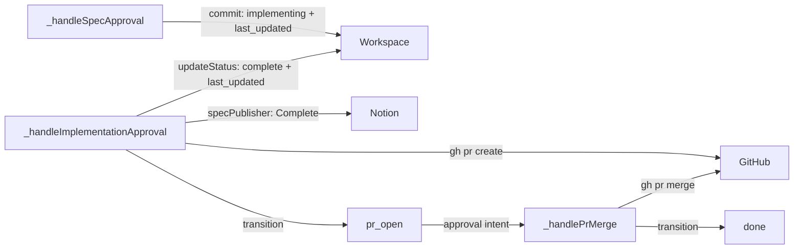
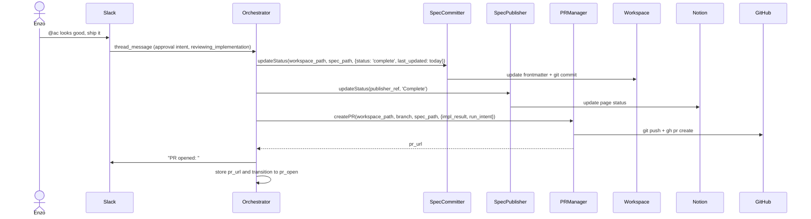
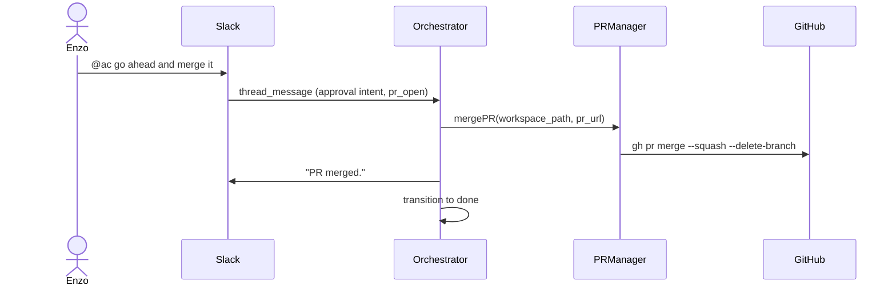

# Enhancement: Lifecycle improvements

## Parent feature

`feature-approval-to-implementation.md`
## What

This enhancement closes five gaps in the spec-to-PR lifecycle:
1. Spec frontmatter not updated to `status: implementing` + `implemented_by` + `last_updated` at spec-approval time
2. Spec frontmatter not updated to `status: complete` + `last_updated` in a commit immediately before PR creation
3. Configured spec publisher (Notion) not updated to `Complete` status when implementation is approved
4. PR body contains only a spec link and a generated note rather than a structured summary, testing instructions, and `Closes #` footer
5. No way to merge an open PR from the Slack thread without navigating to GitHub
## Why

Spec frontmatter has not tracked lifecycle state beyond `approved`, making it impossible to see at a glance who is building something or whether work is complete. A structured PR body with summary and testing instructions replaces a body that previously gave reviewers nothing to act on. Completing the flow from Slack for the merge step avoids a context switch to GitHub for a team working entirely in threads.
## User stories

- Enzo can see `status: implementing` and his GitHub username as `implemented_by` in the committed spec immediately after approving it for implementation
- Enzo can see `status: complete` and today's `last_updated` in the PR diff when the PR is created
- Enzo can read a PR body that summarizes what was built, provides testing instructions, and includes a `Closes #` reference to the tracking issue
- Enzo can merge an open PR by @mentioning the bot with a merge signal in the Slack thread, without navigating to GitHub
- Phoebe can see at a glance which specs are in progress and by whom by reading the committed spec files
## Design changes

*(Added by design specs stage — frame as delta on the parent feature's design spec)*
## Technical changes

### Affected files

- `src/types/runs.ts` — add `pr_open` to `RunStage`; add `pr_url` and `last_impl_result` fields to `Run`
- `src/adapters/notion/spec-committer.ts` — update `commit()` to set `status: implementing`, `implemented_by`, and `last_updated`; add `updateStatus()` for updating `status` and `last_updated` on an already-committed spec
- `src/adapters/agent/pr-manager.ts` — rename from `pr-creator.ts`; update `createPR()` to accept impl result and derive issue closing reference; improve PR body format; add `mergePR``()` method
- `src/adapters/agent/intent-classifier.ts` — add `pr_open` to `VALID_INTENTS_BY_CONTEXT`
- `src/core/orchestrator.ts` — store `last_impl_result` on run after implementation completes; update `_handleImplementationApproval` to call `updateStatus` (status: complete + last_updated), call `specPublisher.updateStatus('Complete')`, and transition to `pr_open`; add `_handlePrMerge`
- `tests/adapters/notion/spec-committer.test.ts` — tests for updated `commit()` behavior and new `updateStatus()`
- `tests/adapters/agent/pr-manager.test.ts` — tests for improved PR body and `mergePR()`
- `tests/core/orchestrator.test.ts` — tests for new lifecycle paths
### Changes

### 1. Introduction and overview

**Prerequisites and assumptions**
- Depends on `feature-approval-to-implementation.md` (complete) — provides `SpecCommitter`, `Implementer`, `PRCreator`, `ImplementationFeedbackPage`, and the full spec-to-PR pipeline
- Depends on `enhancement-intent-classifier-routing.md` — provides the unified intent taxonomy and `ClassificationContext` type; `pr_open` is added as a new valid context here
- No new ADRs or external dependencies
**Technical goals**
- Spec frontmatter updated to `implementing` + `implemented_by` + `last_updated` within the same git commit as the initial spec file at spec-approval time
- Spec frontmatter updated to `complete` + `last_updated` in a separate commit immediately before `gh pr create` at implementation-approval time
- Configured spec publisher updated to `Complete` status at implementation-approval time
- PR body follows a structured format with summary, testing instructions, and a `Closes #` footer derived from spec frontmatter
- PR title prefix derived from `run.intent`: `feat:` for `idea`, `fix:` for `bug`, `chore:` for `chore`, defaulting to `feat:`
- `gh pr merge --squash --delete-branch` called in the workspace when the user signals a merge from Slack
- Run transitions to `pr_open` after PR creation; transitions to `done` after PR merge
**Non-goals**
- Configurable merge strategy (squash merge with branch deletion is always used)
- Closing a PR from Slack
- Updating spec frontmatter for work types without committed specs (bugs, chores at this time)
- Expiry or cleanup of runs that stay in `pr_open` indefinitely
**Glossary**
- **`pr_open`** — new run stage indicating a PR has been created and is awaiting merge
- **`implemented_by`** — existing spec frontmatter field; set to the GitHub username of the person (or service) who triggered implementation
- **`updateStatus`** — new method on `SpecCommitter` that updates frontmatter on an already-committed spec file and commits the change
### 2. System design and architecture

**Modified components**
- `src/types/runs.ts` — add `pr_open` to `RunStage` (between `reviewing_implementation` and `done`); add `pr_url: string | undefined` and `last_impl_result: { summary: string; testing_instructions: string } | undefined` to `Run`
- `src/adapters/notion/spec-committer.ts` — `commit()` sets `status: implementing`, `implemented_by`, and `last_updated`; new `updateStatus()` reads an existing spec, patches frontmatter (`status` and `last_updated`), and commits
- `src/adapters/agent/pr-manager.ts` — `createPR()` accepts optional `impl_result` and `run_intent`; reads spec frontmatter for `issue` field; builds structured PR body; new `mergePR()` method calls `gh pr merge`
- `src/adapters/agent/intent-classifier.ts` — `pr_open` added to `VALID_INTENTS_BY_CONTEXT` with valid intents `['approval', 'question', 'ignore']`; conservative fallback for `pr_open` is `ignore`
- `src/core/orchestrator.ts` — stores `last_impl_result` on run when implementation completes; `_handleImplementationApproval` updated to call `specCommitter.updateStatus` (status: complete + last_updated), call `specPublisher.updateStatus('Complete')`, create PR, and transition to `pr_open`; new `_handlePrMerge` handler; `approval` + `pr_open` routing added
**High-level flow changes**
The spec approval and implementation feedback paths are structurally unchanged. The changes are additive steps within existing handlers and a new exit path after PR creation.

**Sequence diagram — implementation approval**

**Sequence diagram — PR merge**

**Updated intent × stage routing table (delta)**

Intent
Stage
Action

`approval`
`pr_open`
merge PR → `done`

`question`
`pr_open`
answer question, no stage change

`feedback`
`pr_open`
post "PR is already open — merge or close it first"

`ignore`
`pr_open`
discard

### 3. Detailed design

**Updated types**
```typescript
// src/types/runs.ts
export type RunStage =
  | 'intake'
  | 'speccing'
  | 'reviewing_spec'
  | 'implementing'
  | 'awaiting_impl_input'
  | 'reviewing_implementation'
  | 'pr_open'              // new
  | 'done'
  | 'failed';

export interface Run {
  // existing fields unchanged
  pr_url: string | undefined;          // new: PR URL set after PR creation
  last_impl_result: {                  // new: set after implementation completes
    summary: string;
    testing_instructions: string;
  } | undefined;
}
```
**Updated ****`SpecCommitter`**** interface**
```typescript
// src/adapters/notion/spec-committer.ts

export type SpecLifecycleStatus = 'implementing' | 'complete';

export interface SpecCommitter {
  // Existing method — behavior updated: now sets status: implementing + implemented_by + last_updated
  commit(
    workspace_path: string,
    publisher_ref: string,
    spec_path: string,
  ): Promise;

  // New method: update frontmatter on an already-committed spec file
  updateStatus(
    workspace_path: string,
    spec_path: string,
    update: { status: SpecLifecycleStatus; last_updated: string },
  ): Promise;
}
```
**`commit()`**** frontmatter changes**
The existing frontmatter normalization step changes:

Field
Was
Now

`status`
`approved`
`implementing`

`implemented_by`
(unchanged)
set to `gh api user -q .login` output

`last_updated`
today
today (unchanged)

`created`
preserved
preserved (unchanged)

Fetching `implemented_by`:
- Run `gh api user -q .login` in the workspace before writing the spec
- If the command fails: log `spec.implemented_by_fetch_failed` at warn level; set `implemented_by: null`; do not abort the commit (non-fatal)
**`updateStatus()`**** implementation**
1. Read `/` from disk
2. Parse frontmatter; update `status` and `last_updated` to the provided values; leave all other fields unchanged
3. Write the file back to disk
4. `git add `
5. `git commit -m "docs: update spec status —  ()"`
Where `` is extracted from the spec's `# Title` heading and `` is the new status value.
**Updated ****`PRManager`**** interface**
```typescript
// src/adapters/agent/pr-manager.ts

export interface PRManagerOptions {
  impl_result?: {
    summary: string;
    testing_instructions: string;
  };
  run_intent?: 'idea' | 'bug' | 'chore';
}

export interface PRManager {
  createPR(
    workspace_path: string,
    branch: string,
    spec_path: string,
    options?: PRManagerOptions,
  ): Promise; // returns pr_url

  mergePR(
    workspace_path: string,
    pr_url: string,
  ): Promise;
}
```
**`createPR()`**** — PR title and body**
PR title: derived from `run_intent` and spec title
- `run_intent = 'idea'` (or undefined): `feat: `
- `run_intent = 'bug'`: `fix: `
- `run_intent = 'chore'`: `chore: `
PR body format:
```javascript

## Testing

---
Spec: 
Closes #
```
The `Closes #` line is included only when the spec frontmatter `issue` field is non-null and non-zero.
`createPR()` reads the spec file (already accessible at `/`) to extract the title and `issue` frontmatter field.
**`mergePR()`**** implementation**
```bash
cd 
gh pr merge  --squash --delete-branch
```
Returns when the command exits zero. Throws with the stderr content if the command exits non-zero.
**Orchestrator — ****`last_impl_result`**** storage**
In `_handleSpecApproval` and `_handleImplementationFeedback`, after `Implementer.implement` returns `{ status: 'complete', summary, testing_instructions }`:
```typescript
run.last_impl_result = { summary, testing_instructions };
```
This value is available when `_handleImplementationApproval` constructs the `PRManagerOptions`.
**Orchestrator — ****`_handleImplementationApproval`**** (updated)**
1. Call `specCommitter.updateStatus(workspace_path, spec_path, { status: 'complete', last_updated: today })`
	- If `updateStatus` rejects: log `spec.status_update_failed` at error level; continue (non-fatal — spec update failure does not block PR creation)
2. Call `specPublisher.updateStatus(run.publisher_ref, 'Complete')` if `run.publisher_ref` is set
	- If `updateStatus` rejects: log `spec.publisher_update_failed` at error level; continue (non-fatal)
3. Call `prManager.createPR(workspace_path, branch, spec_path, { impl_result: run.last_impl_result, run_intent: run.intent })`
4. Store `run.pr_url = pr_url`
5. Post "PR opened: \" to Slack
6. Transition to `pr_open`
**Orchestrator — ****`_handlePrMerge`**** (new)**
1. Call `prManager.mergePR(workspace_path, run.pr_url)`
2. Post "PR merged." to Slack
3. Transition to `done`
Failure path: `mergePR` rejects → post error to Slack; transition to `failed`.
**Orchestrator — ****`pr_open`**** stage routing**
In `_handleRequest`, add to the intent × stage table:
- `approval` + `pr_open` → `_handlePrMerge`
- `question` + `pr_open` → answer question, no stage change
- `feedback` + `pr_open` → post "A PR is already open — merge it or close it first." to Slack; no stage change
- `ignore` + `pr_open` → discard
The `pr_open` stage must be added to the set of message-accepting stages in `VALID_INTENTS_BY_CONTEXT`.
### 4. Security, privacy, and compliance

**Authentication and authorization**
- `gh pr merge` uses the same gh authentication as `gh pr create` — no new credentials
- `gh api user -q .login` is a read-only API call using the existing gh token
- No new secrets or API keys are introduced
**Data privacy**
- PR body includes the spec path and implementation summary (same data already present in the Notion feedback page); no new data exposure
- `implemented_by` stores a GitHub username in the spec file; this is already public in the gh CLI authentication context
**Input validation**
- `pr_url` stored on the run is derived from `gh pr create` stdout, not from user input
- `spec_path` passed to `updateStatus` comes from the run, not from user input
### 5. Observability

**New log events**

Event
Level
Component

`spec.status_updated`
info
spec-committer

`spec.status_update_failed`
error
spec-committer

`spec.implemented_by_fetch_failed`
warn
spec-committer

`spec.publisher_update_failed`
error
orchestrator

`pr.merged`
info
pr-manager

`pr.merge_failed`
error
pr-manager

`spec.status_updated` includes `workspace_path`, `spec_path`, `status`, and `last_updated`.
`pr.merged` includes `pr_url` and `workspace_path`.
**New metrics**
- `pr.merged.count` (counter) — total PRs merged via Autocatalyst
- `pr.open.count` (counter) — total PRs opened (existing `pr.created.count` may be reused)
**Updated run stage log events**
- `run.stage_transition` emits `from_stage: 'reviewing_implementation'`, `to_stage: 'pr_open'` after PR creation
- `run.stage_transition` emits `from_stage: 'pr_open'`, `to_stage: 'done'` after merge
### 6. Testing plan

**`spec-committer.ts`**** — updated unit tests**
*`commit()`** — frontmatter changes:*
- `status` field set to `implementing` in the committed spec (not `approved`)
- `implemented_by` set to the result of `gh api user -q .login` (mock subprocess returning `testuser`)
- `last_updated` set to today; `created` preserved
- `gh api user -q .login` exits non-zero → `implemented_by: null`; commit still proceeds; `spec.implemented_by_fetch_failed` warn logged
- All existing `commit()` tests updated to expect `status: implementing`
*`updateStatus()`** — new method:*
- Reads spec from `/`; updates `status` and `last_updated`; leaves other frontmatter unchanged
- `status: 'implementing'` → commit message: `"docs: update spec status —  (implementing)"`
- `status: 'complete'` → commit message: `"docs: update spec status —  (complete)"`
- Spec file not found → throws with descriptive error; no git commands called
- `git add` fails → throws
- `git commit` fails → throws
- `spec.status_updated` logged on success with `status`, `spec_path`, `workspace_path`, and `last_updated`
- `spec.status_update_failed` logged on failure
**`pr-manager.ts`**** — updated unit tests**
*`createPR()`** — title derivation:*
- `run_intent = 'idea'`: title is `feat: `
- `run_intent = 'bug'`: title is `fix: `
- `run_intent = 'chore'`: title is `chore: `
- `run_intent` not provided: title defaults to `feat: `
*`createPR()`** — PR body:*
- With `impl_result`: body contains `summary` text, `## Testing` section with `testing_instructions`
- Without `impl_result`: body contains generic placeholder text
- Spec frontmatter has `issue: 42`: body contains `Closes #42`
- Spec frontmatter has `issue: null`: no `Closes #` line in body
- `Closes #` line is the last non-empty line before (or in place of) the `---` separator
*`mergePR()`** — new method:*
- `gh pr merge  --squash --delete-branch` called with `cwd: workspace_path`
- Command exits zero → resolves
- Command exits non-zero → throws with stderr content
- `gh` not found → throws with descriptive error
- `pr.merged` logged on success with `pr_url` and `workspace_path`
- `pr.merge_failed` logged on failure
**`orchestrator.ts`**** — updated unit tests**
*`last_impl_result`** storage:*
- After `Implementer.implement` returns `complete` in `_handleSpecApproval`: `run.last_impl_result` is set to `{ summary, testing_instructions }`
- After `Implementer.implement` returns `complete` in `_handleImplementationFeedback`: `run.last_impl_result` is updated with the latest result
- `run.last_impl_result` is passed to `prManager.createPR` in `_handleImplementationApproval`
*`_handleImplementationApproval`** — updated:*
- `specCommitter.updateStatus` called before `prManager.createPR` with `{ status: 'complete', last_updated: today }`
- `updateStatus` rejects → error logged; `prManager.createPR` still called (non-fatal)
- `specPublisher.updateStatus` called with `('Complete')` when `publisher_ref` is set; rejects → error logged; PR creation still proceeds (non-fatal)
- `specPublisher.updateStatus` not called when `publisher_ref` is null/undefined
- `prManager.createPR` receives `{ impl_result: run.last_impl_result, run_intent: run.intent }`
- `run.pr_url` set after successful PR creation
- Run transitions to `pr_open` (not `done`)
*`_handlePrMerge`** — new:*
- Called when `approval` intent + `pr_open` stage
- `prManager.mergePR` called with `workspace_path` and `run.pr_url`
- "PR merged." posted to Slack
- Run transitions to `done`
- `mergePR` rejects → error posted to Slack; run transitions to `failed`
*`pr_open`** stage routing guards:*
- `approval` + `pr_open` → `_handlePrMerge` called
- `question` + `pr_open` → question answered; no stage change
- `feedback` + `pr_open` → "A PR is already open" message posted; no stage change
- `ignore` + `pr_open` → discarded
- Run in `pr_open`: no existing `implementing`-style guard needed (it's a message-accepting stage)
**`intent-classifier.ts`**** — updated unit tests**
- `pr_open` context → valid intents are `approval`, `question`, `ignore`
- Conservative fallback for `pr_open` → `ignore`
- Model returns `feedback` for `pr_open` context → retries; falls back to `ignore`
### 7. Alternatives considered

**Update ****`implemented_by`**** via a separate commit**
After the initial spec commit, the `implemented_by` update could be committed separately once the `gh api user -q .login` call completes. Rejected because combining it into the initial commit keeps the history cleaner — one commit per lifecycle event rather than two commits per event.
**Derive PR title prefix from spec filename (feature- vs. enhancement-)**
The PR title prefix (`feat:` vs. `fix:`) could be inferred from the spec filename rather than `run.intent`. Rejected because `run.intent` is already the authoritative signal for run type, and spec filenames may not always be available at PR-creation time without reading the filesystem.
**`gh pr merge --merge`**** instead of ****`--squash`**
Standard merge commits preserve individual commit history from the feature branch. Squash merge was chosen because it keeps the main branch history linear — each feature appears as a single, self-contained commit that maps to one spec. This matches the project's one-spec-one-PR convention.
**Store PR number in spec frontmatter**
Storing the PR number in the spec file would create a permanent record of which PR implemented the feature. Rejected for this enhancement because it requires a fourth frontmatter update (implementing → complete → + pr_number) without clear operational value; the PR URL is already stored on the run and is sufficient for the merge call.
### 8. Risks

**`gh api user -q .login`**** fails at spec-commit time**
If the `gh` CLI is unauthenticated or unavailable at the moment the spec is committed, `implemented_by` cannot be set. Mitigation: the fetch failure is non-fatal — the spec is committed with `implemented_by: null` and a warn-level log event is emitted; the team can investigate the auth issue separately. The lifecycle update does not block implementation.
**`gh pr merge`**** fails due to merge conflicts or CI failures**
If the PR has conflicts or a required CI check has failed, `gh pr merge` exits non-zero. Mitigation: the error message from `gh` is surfaced in the Slack thread; the run transitions to `failed` with a clear log event; the team can resolve conflicts manually and retry by mentioning the bot again (the run is in `failed` at that point, so a fresh run would be needed — a future enhancement could add retry from `failed` for merge).
**Run serialization breaking change**
Adding `pr_url`, `last_impl_result`, and `pr_open` to the `Run` interface and `RunStage` type is a breaking change for the run store serialization format. Mitigation: treat as a breaking change in the commit message; existing in-flight runs will not have these fields, but the new code handles `undefined` gracefully (no `pr_url` → `mergePR` cannot be called; the orchestrator logs a warning and posts a message to Slack if `_handlePrMerge` is invoked on a run with no `pr_url`).
**`pr_open`**** runs accumulate if merge is never triggered**
If a user opens a PR but never sends a merge signal, the run stays in `pr_open` indefinitely. The run store will accumulate such entries over time. Mitigation: out of scope for this enhancement; run expiry and cleanup are deferred to a future enhancement.
## Task list

*(Added by task decomposition stage)*