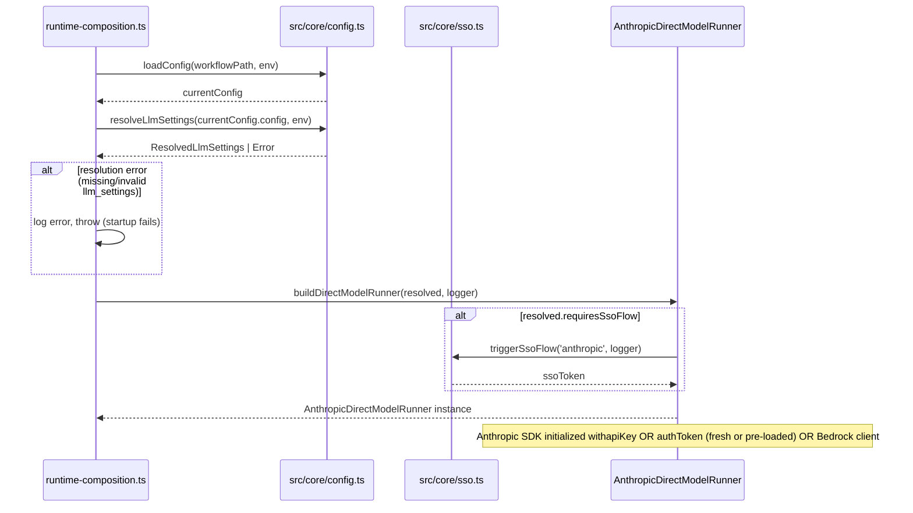

# Enhancement: LLM settings config

## Parent feature

`feature-foundation.md`
## What

Autocatalyst gains a structured `llm_settings` configuration block in [WORKFLOW.md](http://WORKFLOW.md) that explicitly declares which AI provider to use (Anthropic direct or Amazon Bedrock) and how to authenticate with it (API key, SSO token, or AWS IAM). This replaces the current implicit provider selection — which uses the presence of the `AC_ANTHROPIC_API_KEY` environment variable as a silent toggle — with a documented, first-class config field. The `aws_profile` field, previously a standalone top-level key, moves into `llm_settings` where it belongs alongside the rest of provider configuration. The block is designed to absorb future additions (per-route model selection, per-user overrides, temperature and token settings) without requiring structural changes. `llm_settings` is required; operators must declare their provider and auth method explicitly.
When `llm_settings.auth: sso` is configured, an SSO bearer token can be supplied via `AC_ANTHROPIC_SSO_TOKEN`. If the token is absent or has expired, Autocatalyst automatically initiates the SSO authentication flow for the configured provider — the user is briefly interrupted to authenticate, and the run continues once credentials are obtained.
## Why

The current provider selection is implicit and fragile. Autocatalyst checks for `AC_ANTHROPIC_API_KEY` and silently falls back to Bedrock when it's absent — there is no way to express "use Anthropic directly, but authenticate via SSO rather than an API key." This gap blocks organizations that have Anthropic enterprise accounts and provision workforce access through SSO rather than distributing individual API keys. Beyond SSO support, the implicit toggle approach does not scale: there is no natural place in the config to add model selection, auth method overrides, or per-user settings as those needs arise. The existing `aws_profile` field is stranded at the top level with no obvious relationship to the Bedrock configuration it governs. A proper `llm_settings` config block establishes that place, makes the provider choice visible in [WORKFLOW.md](http://WORKFLOW.md) (rather than inferred from which env vars happen to be set), co-locates `aws_profile` with the rest of Bedrock settings, and sets up the config hierarchy that per-user overrides will later extend.
## User stories

- An operator can set `llm_settings.provider: anthropic` and `llm_settings.auth: sso` in [WORKFLOW.md](http://WORKFLOW.md) and have Autocatalyst authenticate with Anthropic directly using an SSO-issued bearer token
- An operator can set `llm_settings.provider: anthropic` and `llm_settings.auth: api_key` in [WORKFLOW.md](http://WORKFLOW.md) and have Autocatalyst authenticate with Anthropic using an API key
- An operator can set `llm_settings.provider: bedrock` in [WORKFLOW.md](http://WORKFLOW.md) and have Autocatalyst authenticate via the AWS credential chain (IAM, SSO, named profile)
- An operator can set `llm_settings.provider: bedrock` and `llm_settings.aws_profile: my-profile` in [WORKFLOW.md](http://WORKFLOW.md) and have Autocatalyst use the named AWS profile for Bedrock authentication
- An operator can read the startup log and confirm which provider and auth method are active
- An operator with `llm_settings.auth: sso` who has not set `AC_ANTHROPIC_SSO_TOKEN` is automatically prompted through the SSO authentication flow at startup; the service waits for the user to complete authentication rather than failing with an error
- An operator whose SSO token expires mid-run is automatically prompted to re-authenticate; the in-progress request is retried after successful re-authentication
- An operator who misconfigures `llm_settings` with an invalid combination (e.g., `auth: sso` under `provider: bedrock`) receives a clear error at startup — not a runtime failure during a live run
## Design changes

*(Added by design specs stage — frame as delta on the parent feature's design spec)*
`llm_settings` replaces the implicit env-var provider toggle and the top-level `aws_profile` field. Below are the canonical config forms for each supported auth method.
**Anthropic direct — API key**
```yaml
llm_settings:
  provider: anthropic
  auth: api_key
# Reads AC_ANTHROPIC_API_KEY from the environment; fails at startup if absent

```
**Anthropic direct — SSO**
```yaml
llm_settings:
  provider: anthropic
  auth: sso
# Reads AC_ANTHROPIC_SSO_TOKEN from the environment if pre-loaded;

# otherwise triggers the interactive SSO flow before the first request

```
**Amazon Bedrock — default credential chain (IAM / instance role / env)**
```yaml
llm_settings:
  provider: bedrock
  # auth: iam is implied and the only valid value for bedrock
```
**Amazon Bedrock — named AWS profile**
```yaml
llm_settings:
  provider: bedrock
  aws_profile: my-sso-profile
```
**Illustrative future fields (additive, no breaking changes)**
```yaml
llm_settings:
  provider: anthropic
  auth: api_key
  model: claude-opus-4-6      # future: per-repo model selection
  max_tokens: 4096            # future: token budget
  # per_user_overrides layered on top by a future enhancement
```
## Technical changes

### Affected files

- `src/types/config.ts` — add `LlmSettings` interface and required `llm_settings: LlmSettings` field to `WorkflowConfig`; add `aws_profile?: string` to `LlmSettings`; remove top-level `aws_profile` from `WorkflowConfig`; add `SsoProvider` type
- `src/core/config.ts` — add `resolveLlmSettings(config, env)` function that reads `llm_settings` from config, validates the result, and resolves `aws_profile` for the Bedrock path; throws if `llm_settings` is absent
- `src/adapters/runtime-composition.ts` — update `buildDirectModelRunner()` to accept and act on `ResolvedLlmSettings` instead of directly reading env vars; add SSO flow initiation and token-refresh-on-401 logic for the SSO path
- `src/core/sso.ts` *(new)* — `triggerSsoFlow(provider: SsoProvider, logger): Promise` generic interactive SSO flow; dispatches to the appropriate provider-specific OAuth implementation
- `tests/core/config.test.ts` — unit tests for `resolveLlmSettings`
### Changes

## Tech spec

### 1. Introduction and overview

**Prerequisites and assumptions**
- Depends on `feature-foundation.md` (complete) — `WorkflowConfig`, `loadConfig`, `resolveEnvVars`, `redactConfig`, and the service startup sequence in `src/adapters/runtime-composition.ts`
- Depends on `enhancement-aws-profile-support.md` (complete) — `aws_profile` is already part of `WorkflowConfig` and `resolveAwsProfile` already exists in `src/core/config.ts`; this enhancement moves `aws_profile` into `llm_settings.aws_profile` and removes the top-level field
- The Anthropic SDK (`@anthropic-ai/sdk`) supports both API key auth (`apiKey` constructor param) and bearer token auth (`authToken` constructor param); no new SDK packages are required for SSO support
- SSO bearer tokens may be pre-loaded via the `AC_ANTHROPIC_SSO_TOKEN` environment variable; when absent or expired, Autocatalyst initiates the provider's enterprise OAuth flow interactively. The specific OAuth endpoints and flow variant (device code or PKCE with local callback) must be confirmed against the relevant provider's enterprise documentation before implementation. `'anthropic'` is the only supported SSO provider in this iteration
- No database changes, no new external services; an OAuth helper package may be required depending on the chosen SSO flow variant
**Technical goals**
- Provider and auth method are visible in [WORKFLOW.md](http://WORKFLOW.md) and in the startup log; no magic env-var detection
- When SSO is configured and the token is missing or has expired, the SSO authentication flow starts automatically; the user is briefly interrupted to provide credentials, but the run does not fail
- Invalid combinations (e.g., `auth: sso` under `provider: bedrock`, or an unknown provider value) fail at startup with a clear error, not at request time
- The `llm_settings` block is structured to accommodate future fields (`model`, `max_tokens`, per-user overrides) without breaking existing configs
- `aws_profile` is co-located with the rest of provider config within `llm_settings` for Bedrock operators
- The `triggerSsoFlow` helper is provider-agnostic at the call site; adding a new SSO provider (e.g., Codex) requires only a new `case` in its internal dispatch and a new `SsoProvider` union member, with no changes to `buildDirectModelRunner`
**Non-goals**
- Background SSO token refresh without user interaction (future enhancement)
- Per-route or per-user model provider overrides (future enhancement)
- Model selection (future field within `llm_settings`)
- Supporting model providers other than `anthropic` and `bedrock` in this iteration
- Supporting SSO providers other than `anthropic` in this iteration (structure is in place; implementation is not)
**Glossary**
- **SSO token** — a bearer token issued by a provider's enterprise OAuth / SSO flow, passed to the provider SDK via an auth token parameter
- **SSO provider** — the identity/OAuth provider responsible for issuing the SSO token (e.g., `'anthropic'`; extensible to others such as `'codex'`); distinct from the model provider
- **API key** — a static `sk-ant-...` key, passed to the Anthropic SDK via `apiKey`
- **IAM** — AWS Identity and Access Management; the default credential chain used by the Bedrock client (`fromNodeProviderChain`)
- **Provider chain** — the ordered sequence of credential sources `fromNodeProviderChain()` tries (env vars, SSO, instance roles, etc.)
- **SSO flow** — the interactive enterprise OAuth sequence that produces a bearer token; the user is prompted once and the token is used for the duration of the run
---
### 2. System design and architecture

**High-level architecture**
The change is confined to four layers: the config type definition, a new pure resolver function, the `buildDirectModelRunner` factory, and a new `triggerSsoFlow` helper invoked by the factory when SSO credentials are absent or expired.
```javascript
WORKFLOW.md  ──►  resolveLlmSettings()  ──►  buildDirectModelRunner()
   (config)        (src/core/config.ts)       (src/adapters/runtime-composition.ts)
                          │                            │
                     env vars                 triggerSsoFlow(provider, logger)
                 AC_ANTHROPIC_API_KEY           (src/core/sso.ts)
                 AC_ANTHROPIC_SSO_TOKEN        [called when token missing/expired]
```
**Component breakdown**

Component
Role
Change

`WorkflowConfig` in `src/types/config.ts`
Config schema
Add required `llm_settings: LlmSettings`; remove top-level `aws_profile`; add `SsoProvider` type

`resolveLlmSettings` in `src/core/config.ts`
Pure resolver
New function; reads `llm_settings` from config; throws if absent; validates combos; resolves `aws_profile`; sets `requiresSsoFlow` when SSO token absent

`triggerSsoFlow` in `src/core/sso.ts`
SSO flow
New function; accepts a `SsoProvider` parameter; dispatches to the appropriate provider-specific OAuth flow; returns bearer token

`buildDirectModelRunner` in `src/adapters/runtime-composition.ts`
Factory
Accept `ResolvedLlmSettings`; trigger SSO flow via `triggerSsoFlow` when `requiresSsoFlow`; retry on 401 via SSO re-auth

**Startup sequence (modified)**

---
### 3. Detailed design

#### Config schema additions (`src/types/config.ts`)

```typescript
export type ModelProvider = 'anthropic' | 'bedrock';
export type AnthropicAuthMethod = 'api_key' | 'sso';
export type BedrockAuthMethod = 'iam';
export type AuthMethod = AnthropicAuthMethod | BedrockAuthMethod;

/**
 * Identifies which SSO provider's OAuth flow to initiate when auth=sso.
 * Distinct from ModelProvider — the SSO provider is the identity/credential source,
 * not necessarily the model inference backend.
 * Extend this union as additional SSO providers are supported (e.g. 'codex').
 */
export type SsoProvider = 'anthropic';

export interface LlmSettings {
  provider: ModelProvider;
  /**
   * Authentication method.
   * - For provider "anthropic": "api_key" (default) or "sso"
   * - For provider "bedrock": "iam" (default, only valid value)
   * Optional — defaults are applied in resolveLlmSettings.
   */
  auth?: AuthMethod;
  /**
   * AWS named profile to use for Bedrock authentication.
   * Ignored when provider is not "bedrock".
   */
  aws_profile?: string;
  // Reserved for future fields: model, max_tokens, per_user_overrides
}

export interface WorkflowConfig {
  polling?: { interval_ms?: number };
  workspace?: { root?: string };
  channels?: WorkflowChannelConfig[];
  publishers?: WorkflowPublisherConfig[];
  artifact_policies?: Partial>>;
  llm_settings: LlmSettings;  // required
  [key: string]: unknown;
}
```
#### Resolved config type and resolver (`src/core/config.ts`)

```typescript
export interface ResolvedLlmSettings {
  provider: ModelProvider;
  auth: AuthMethod;
  /** Set when provider=anthropic and auth=api_key */
  apiKey?: string;
  /** Set when provider=anthropic and auth=sso and a token was available at resolve time */
  ssoToken?: string;
  /**
   * True when provider=anthropic, auth=sso, and no token was present in the environment.
   * buildDirectModelRunner will call triggerSsoFlow before the first request.
   */
  requiresSsoFlow?: boolean;
  /** Set when provider=bedrock and llm_settings.aws_profile is configured */
  awsProfile?: string;
}

/**
 * Resolves the effective LLM settings from WORKFLOW.md config and env vars.
 *
 * llm_settings is required in config. Throws with a clear error message if absent.
 *
 * For SSO with no token: returns { provider: 'anthropic', auth: 'sso', requiresSsoFlow: true }
 * rather than throwing. The SSO flow is triggered lazily in buildDirectModelRunner.
 *
 * Throws for structurally invalid combinations (wrong auth method for provider,
 * unknown provider/auth values, api_key auth with no key, absent llm_settings).
 */
export function resolveLlmSettings(
  config: WorkflowConfig,
  env: Record,
): ResolvedLlmSettings {
  if (!config.llm_settings) {
    throw new Error(
      'llm_settings is required in WORKFLOW.md. Add a provider and auth block to configure the AI provider.',
    );
  }

  const { provider, auth: rawAuth, aws_profile } = config.llm_settings;

  if (provider === 'anthropic') {
    const auth: AnthropicAuthMethod = (rawAuth as AnthropicAuthMethod) ?? 'api_key';
    if (auth === 'api_key') {
      const apiKey = env['AC_ANTHROPIC_API_KEY'];
      if (!apiKey) throw new Error(
        'llm_settings.auth is "api_key" but AC_ANTHROPIC_API_KEY is not set',
      );
      return { provider, auth, apiKey };
    }
    if (auth === 'sso') {
      const ssoToken = env['AC_ANTHROPIC_SSO_TOKEN']?.trim() || undefined;
      if (!ssoToken) {
        // No token available — SSO flow will be triggered interactively before first request
        return { provider, auth, requiresSsoFlow: true };
      }
      return { provider, auth, ssoToken };
    }
    throw new Error(`Invalid auth method for provider "anthropic": "${auth}". Valid values: api_key, sso`);
  }

  if (provider === 'bedrock') {
    const awsProfile = aws_profile?.trim() || undefined;
    return { provider, auth: 'iam', awsProfile };
  }

  throw new Error(`Unknown llm_settings.provider: "${provider}". Valid values: anthropic, bedrock`);
}
```
#### SSO flow helper (`src/core/sso.ts`)

```typescript
/**
 * Initiates the enterprise SSO authentication flow for the given provider.
 *
 * When called, prompts the user to authenticate using the appropriate OAuth flow
 * for the specified provider (device code or PKCE with local callback — exact
 * variant determined per-provider by consulting enterprise OAuth documentation).
 * Logs a clear message so the user understands why they are being interrupted.
 * Returns the resulting bearer token.
 *
 * To add a new SSO provider, add a new case to the switch statement and a new
 * member to the SsoProvider union type in src/types/config.ts.
 *
 * NOTE: The specific OAuth endpoints and flow variant for each provider must be
 * confirmed against that provider's enterprise documentation before implementing
 * the corresponding case.
 */
export async function triggerSsoFlow(provider: SsoProvider, logger: RuntimeLogger): Promise {
  logger.info(
    { event: 'sso.flow.start', provider },
    `${provider} SSO token missing or expired — starting SSO authentication flow. ` +
    'You will be prompted to authenticate.',
  );
  let token: string;
  switch (provider) {
    case 'anthropic':
      // Implementation: device code flow or PKCE with local redirect per Anthropic enterprise docs
      token = await /* ... Anthropic OAuth flow ... */;
      break;
    // case 'codex':
    //   token = await /* ... Codex OAuth flow ... */;
    //   break;
    default:
      throw new Error(`Unsupported SSO provider: ${provider}`);
  }
  logger.info({ event: 'sso.flow.complete', provider }, 'SSO authentication complete');
  return token;
}
```
#### Updated factory (`src/adapters/runtime-composition.ts`)

```typescript
function buildDirectModelRunner(
  resolved: ResolvedLlmSettings,
  logger: RuntimeLogger,
): AnthropicDirectModelRunner {
  if (resolved.provider === 'anthropic') {
    if (resolved.auth === 'sso') {
      logger.info(
        { event: 'service.config', provider: 'anthropic', auth: 'sso' },
        'Using Anthropic direct API with SSO token',
      );

      // Token state — may be pre-loaded or obtained via SSO flow on first use
      let currentToken = resolved.ssoToken;

      const getClient = (token: string) => new Anthropic({ authToken: token });

      return new AnthropicDirectModelRunner('', {
        createFn: async (params) => {
          // If no token yet, trigger SSO flow before first request
          if (!currentToken) {
            currentToken = await triggerSsoFlow('anthropic', logger);
          }
          let client = getClient(currentToken);
          try {
            return await client.messages.create(params) as Promise;
          } catch (err) {
            if (isAnthropicAuthError(err)) {
              // Token expired mid-run — re-authenticate and retry once
              logger.warn(
                { event: 'sso.token.expired', provider: 'anthropic' },
                'SSO token expired — re-authenticating',
              );
              currentToken = await triggerSsoFlow('anthropic', logger);
              client = getClient(currentToken);
              return await client.messages.create(params) as Promise;
            }
            throw err;
          }
        },
        defaultModel: 'claude-haiku-4-5-20251001',
      });
    }

    // auth === 'api_key'
    logger.info(
      { event: 'service.config', provider: 'anthropic', auth: 'api_key' },
      'Using Anthropic direct API with API key',
    );
    return new AnthropicDirectModelRunner(resolved.apiKey!, {
      defaultModel: 'claude-haiku-4-5-20251001',
    });
  }

  // provider === 'bedrock'
  const bedrockClient = new AnthropicBedrock({
    providerChainResolver: () => Promise.resolve(
      resolved.awsProfile
        ? fromNodeProviderChain({ profile: resolved.awsProfile })
        : fromNodeProviderChain(),
    ),
  });
  logger.info(
    { event: 'service.config', provider: 'bedrock', auth: 'iam', aws_profile: resolved.awsProfile ?? 'default' },
    'Using Amazon Bedrock',
  );
  return new AnthropicDirectModelRunner('', {
    createFn: async (params) => {
      try {
        return await bedrockClient.messages.create({
          ...params,
          model: 'us.anthropic.claude-haiku-4-5-20251001-v1:0',
        }) as unknown as { content: Array };
      } catch (err) {
        const msg = String(err);
        if (msg.includes('CredentialsProviderError') || msg.includes('Could not load credentials') || msg.includes('sso')) {
          logger.error(
            { event: 'bedrock.credentials_expired', aws_profile: resolved.awsProfile ?? 'default' },
            'AWS credentials expired or unavailable. Run: aws sso login --profile ',
          );
        }
        throw err;
      }
    },
    defaultModel: 'us.anthropic.claude-haiku-4-5-20251001-v1:0',
  });
}
```
`isAnthropicAuthError(err)` is a narrow type guard that checks for HTTP 401 responses from the Anthropic SDK (e.g., `err instanceof Anthropic.AuthenticationError` or equivalent SDK error type).
The call site in `composeRuntime()` (or equivalent) becomes:
```typescript
const resolvedLlm = resolveLlmSettings(currentConfig.config, env);
// resolveLlmSettings throws on missing or invalid llm_settings — startup fails with clear error
// SSO token absence is NOT an error here; SSO flow triggers lazily in buildDirectModelRunner
const directModelRunner = buildDirectModelRunner(resolvedLlm, logger);
```
#### Extensibility contract

The `LlmSettings` interface uses `[key: string]: unknown` implicitly (via TypeScript's index signature in `WorkflowConfig`). Future fields are additive:
```yaml
# Future WORKFLOW.md additions — no breaking changes to this schema:

llm_settings:
  provider: anthropic
  auth: sso
  model: claude-opus-4-6           # future: per-repo model selection
  max_tokens: 2048                  # future: token budget
```
Per-user overrides will be layered on top of the repo-level `llm_settings` block by a future enhancement; the resolved type (`ResolvedLlmSettings`) can be extended with a `merge(userOverride)` combinator at that time.
Adding a new SSO provider (e.g., Codex) requires: (1) adding its name to the `SsoProvider` union in `src/types/config.ts`, (2) adding a `case` to the `switch` in `triggerSsoFlow`, and (3) wiring the appropriate token env var in `resolveLlmSettings`. No changes to `buildDirectModelRunner` are needed.
---
### 4. Security, privacy, and compliance

**Authentication and authorization**
- `AC_ANTHROPIC_SSO_TOKEN` is a bearer credential and must be treated as a secret. It follows the same redaction pattern as other secrets in `redactConfig`: the key suffix `token` already matches the existing secret-detection heuristic in `src/core/init.ts`, so it will be redacted from logs automatically
- Tokens obtained via the interactive SSO flow must be held only in memory and never written to logs, disk, or config files
- `AC_ANTHROPIC_API_KEY` is already redacted today; no change needed
- `llm_settings.provider` and `llm_settings.auth` are non-secret config values; they appear in the startup log without redaction
- The `ssoToken` field in `ResolvedLlmSettings` must not be logged; it is only passed directly to the Anthropic SDK constructor
**Data privacy**
- No PII is introduced. Provider names and auth method strings are infrastructure identifiers
**Input validation**
- `resolveLlmSettings` throws if `llm_settings` is absent from config, with a message directing the operator to add it
- `resolveLlmSettings` validates the combination of `provider` + `auth` at startup and throws an `Error` with a human-readable message before any agent run begins for structurally invalid combinations
- A missing SSO token is not a validation error at resolve time; it is resolved lazily via the SSO flow
- Unknown `provider` or `auth` values produce an error naming the invalid value and listing valid options
- Empty string tokens and `aws_profile` values are treated as absent
---
### 5. Observability

**Log events**

Event
Level
Fields
Condition

`service.config`
info
`provider: 'anthropic'`, `auth: 'api_key'`
Anthropic direct with API key

`service.config`
info
`provider: 'anthropic'`, `auth: 'sso'`
Anthropic direct with SSO token

`service.config`
info
`provider: 'bedrock'`, `auth: 'iam'`, `aws_profile`
Bedrock path

`sso.flow.start`
info
`provider`
SSO token absent or expired; interactive flow starting

`sso.flow.complete`
info
`provider`
SSO authentication completed successfully

`sso.token.expired`
warn
`provider`
401 received mid-run; SSO re-auth triggered

`bedrock.credentials_expired`
error
`aws_profile`
Bedrock credential failure (existing event, unchanged)

The startup log now always names the active provider and auth method, making it easy to confirm the correct path is active without inspecting env vars. SSO flow events include a `provider` field so operators can distinguish between SSO flows for different providers as support expands.
**Metrics and alerting**
No new metrics or alerting thresholds. Provider startup errors surface as process exits with a non-zero code; existing process-restart alerting covers this. SSO flow interruptions are informational and do not increment error counters.
---
### 6. Testing plan

#### 6.1 Unit tests — `resolveLlmSettings` (`tests/core/config.test.ts`)

All cases use inline env-var maps (`{ AC_ANTHROPIC_API_KEY: '...' }` etc.) — no mocking of `process.env` is needed.
**Error cases — calls that must throw**

#
Config
Env
Expected error content

E1
`llm_settings` absent
any
message contains `"llm_settings is required"`

E2
`provider: anthropic`, `auth: api_key`
`AC_ANTHROPIC_API_KEY` absent
message references `AC_ANTHROPIC_API_KEY`

E3
`provider: anthropic`, `auth: api_key`
`AC_ANTHROPIC_API_KEY = ''` (empty string)
same as E2 — empty string treated as absent

E4
`provider: anthropic`, `auth: api_key`
`AC_ANTHROPIC_API_KEY = '   '` (whitespace only)
same as E2 — whitespace treated as absent

E5
`provider: 'openai'` (unknown)
any
message names the invalid value `"openai"` and lists valid options

E6
`provider: anthropic`, `auth: 'oauth'` (unknown)
any
message names the invalid value `"oauth"` and lists valid options

E7
`provider: bedrock`, `auth: 'sso'` explicitly set
any
message identifies the invalid `provider + auth` combination

E8
`provider: anthropic`, `auth: 'iam'` explicitly set
any
message identifies the invalid `provider + auth` combination

**Valid config cases — calls that must resolve successfully**

#
Config
Env
Expected result shape

V1
`provider: anthropic`, `auth: api_key`
`AC_ANTHROPIC_API_KEY = 'sk-ant-test'`
`{ provider: 'anthropic', auth: 'api_key', apiKey: 'sk-ant-test' }`

V2
`provider: anthropic`, `auth: sso`
`AC_ANTHROPIC_SSO_TOKEN = 'tok-abc'`
`{ provider: 'anthropic', auth: 'sso', ssoToken: 'tok-abc' }`; `requiresSsoFlow` is falsy

V3
`provider: anthropic`, `auth: sso`
`AC_ANTHROPIC_SSO_TOKEN` absent
`{ provider: 'anthropic', auth: 'sso', requiresSsoFlow: true }`; does NOT throw

V4
`provider: anthropic`, `auth: sso`
`AC_ANTHROPIC_SSO_TOKEN = '   '` (whitespace)
same as V3 — whitespace treated as absent

V5
`provider: anthropic`, `auth` omitted
`AC_ANTHROPIC_API_KEY` set
defaults to `api_key`; resolves as V1

V6
`provider: bedrock`, `auth` omitted
any
`{ provider: 'bedrock', auth: 'iam', awsProfile: undefined }`

V7
`provider: bedrock`, `aws_profile: 'my-profile'`
any
`{ provider: 'bedrock', auth: 'iam', awsProfile: 'my-profile' }`

V8
`provider: bedrock`, `aws_profile` absent
any
`awsProfile` is `undefined`

V9
`provider: bedrock`, `aws_profile: '   '` (whitespace)
any
`awsProfile` is `undefined` — whitespace trimmed and treated as absent

V10
`provider: anthropic`, `auth: sso`, token present
any
`ssoToken` is set; `apiKey` is not present on the result

V11
`provider: anthropic`, `auth: api_key`, key present
any
`ssoToken` is not present; `requiresSsoFlow` is not present

V12
`provider: bedrock`
any
`apiKey` and `ssoToken` are not present on the result

#### 6.2 Integration tests — SSO flow in `buildDirectModelRunner` (`tests/core/sso.test.ts`)

All tests mock `triggerSsoFlow` (spy/stub) and a mock `createFn` to avoid real OAuth and real API calls. The mock logger captures all structured log calls for assertion.
**SSO flow initiation**

#
Setup
Assertion

S1
`requiresSsoFlow: true`
`triggerSsoFlow` is called exactly once with `('anthropic', logger)` before the first `createFn` invocation

S2
`requiresSsoFlow: true`, `triggerSsoFlow` returns `'fresh-token'`
`new Anthropic({ authToken: 'fresh-token' })` is used for the first request

S3
`ssoToken: 'pre-loaded-token'` (no `requiresSsoFlow`)
`triggerSsoFlow` is NOT called before first request; pre-loaded token is used

S4
`requiresSsoFlow: true`
`sso.flow.start` log event emitted with `provider: 'anthropic'` before `createFn` is called

**401 retry behavior**

#
Setup
Assertion

R1
Pre-loaded token; first `createFn` throws `AuthenticationError` (401)
`sso.token.expired` warn logged with `provider: 'anthropic'`; `triggerSsoFlow` called once; `createFn` called twice total; second call uses new token

R2
Pre-loaded token; both `createFn` invocations throw 401
`triggerSsoFlow` called exactly once; error propagates after second 401; no third `createFn` invocation

R3
Pre-loaded token; first `createFn` throws a non-401 error
`triggerSsoFlow` is NOT called; error propagates immediately; `createFn` called once

R4
`requiresSsoFlow: true`; `createFn` throws 401 after SSO flow completes
`triggerSsoFlow` called twice total (once for initial token, once for re-auth); `createFn` called twice

**Log event assertions for all runner paths**

#
Runner path
Expected log event

L1
Anthropic + SSO
`service.config` info with `{ provider: 'anthropic', auth: 'sso' }`

L2
Anthropic + API key
`service.config` info with `{ provider: 'anthropic', auth: 'api_key' }`

L3
Bedrock + IAM, no profile
`service.config` info with `{ provider: 'bedrock', auth: 'iam' }`

L4
Bedrock + IAM, named profile
`service.config` info includes `aws_profile: 'my-profile'`

L5
SSO, 401 mid-run
`sso.token.expired` warn with `provider: 'anthropic'`

**Security / redaction assertions**

#
Scenario
Assertion

SEC1
SSO path, token obtained via `triggerSsoFlow`
No mock logger call contains the raw token value in any field or message string

SEC2
API key path
No mock logger call contains the `apiKey` value in any field or message string

#### 6.3 Startup sequence integration tests (`tests/adapters/runtime-composition.test.ts`)

These tests exercise the wiring in `composeRuntime()` / the call site, using a real config object paired with a mock `buildDirectModelRunner` or a mocked `resolveLlmSettings` to isolate startup-path behavior.

#
Scenario
Assertion

ST1
`llm_settings` absent in [WORKFLOW.md](http://WORKFLOW.md)
Startup throws before any agent work begins; error message contains `"llm_settings is required"`

ST2
`llm_settings.provider` is an unknown value
Startup throws before any agent work begins; error names the invalid value

ST3
`llm_settings.auth: sso`, `AC_ANTHROPIC_SSO_TOKEN` absent
Startup completes successfully; `triggerSsoFlow` is NOT called at startup; SSO flow is deferred to first request

ST4
`llm_settings.auth: api_key`, key present
Startup completes; `buildDirectModelRunner` receives `ResolvedLlmSettings` with `auth: 'api_key'`

ST5
Direct env read audit
Assert no direct `process.env.AC_ANTHROPIC_API_KEY` read exists in `buildDirectModelRunner` or the startup call path outside `resolveLlmSettings`

#### 6.4 Type-level tests (`tests/core/config-types.test.ts`)

Verified at compile time via `tsc --noEmit`. Use `satisfies` or direct typed assignment to trigger type errors on invalid shapes.

#
Assertion

T1
`WorkflowConfig` with `llm_settings: { provider: 'anthropic', auth: 'sso' }` satisfies the type — no compile error

T2
`WorkflowConfig` with `llm_settings: { provider: 'bedrock', aws_profile: 'my-profile' }` satisfies the type — no compile error

T3
`'anthropic'` satisfies `SsoProvider` — no compile error

T4
`WorkflowConfig` without `llm_settings` does NOT satisfy the type — `@ts-expect-error` annotation is required and present

---
### 7. Alternatives considered

**Keep using env-var detection; add ****`AC_ANTHROPIC_SSO_TOKEN`**** alongside the existing ****`AC_ANTHROPIC_API_KEY`**** check**
Add a second env var check: if `AC_ANTHROPIC_SSO_TOKEN` is set, use SSO auth; otherwise fall back through the existing chain. Simple, requires no config schema changes.
Rejected because it doubles down on the implicit-toggle pattern. The startup log still wouldn't tell an operator which path is active without inspecting env vars. More importantly, the request explicitly calls for a config block that will grow over time — model selection and per-user overrides both require a structured config home. Starting with a dedicated block now is better than retrofitting it later.
**Top-level **[**WORKFLOW.md**](http://WORKFLOW.md)** fields (****`anthropic_provider`****, ****`anthropic_auth`****) rather than a nested block**
Add `anthropic_provider: anthropic | bedrock` and `anthropic_auth: api_key | sso` as flat top-level fields alongside `aws_profile`.
Rejected because flat fields don't compose well as the config grows. Adding a model choice later would require `anthropic_model`, `anthropic_max_tokens`, etc., polluting the top-level namespace. A nested `llm_settings` block keeps all LLM-related settings together and makes the scope of future additions obvious — `aws_profile` joining it in this enhancement is the first demonstration of that composability.
**`model_provider`**** as the block name rather than ****`llm_settings`**
An earlier draft used `model_provider` as the key name, which reflects the primary concern of selecting a provider. `llm_settings` is preferred because the block is designed to grow beyond provider selection alone — model choice, token budgets, per-user overrides, and `aws_profile` all naturally belong under "LLM settings" rather than "model provider". The broader name also avoids awkward nesting like `model_provider.model` or `model_provider.max_tokens` as future fields are added.
**Fail fast on missing SSO token (startup error rather than interactive flow)**
The original draft threw an error at startup if `auth: sso` was configured but no `AC_ANTHROPIC_SSO_TOKEN` was present, treating a missing token the same as a misconfigured API key.
Rejected because SSO tokens have bounded TTLs and cannot realistically be kept permanently valid in an env var. Requiring operators to pre-set the token before every service start would be operationally painful. The interactive flow makes SSO a first-class, recoverable credential source: token absent → prompt once → run proceeds. Pre-loading via env var remains supported for automated environments where a token can be injected.
**Provider-specific SSO functions (e.g., ****`triggerAnthropicSsoFlow`****, ****`triggerCodexSsoFlow`****) rather than a unified ****`triggerSsoFlow(provider)`**
Keep separate top-level functions per SSO provider rather than a single dispatching function.
Rejected because it leaks provider-specific names into `buildDirectModelRunner` and forces that function to grow a new import and call site for each new SSO provider. A single `triggerSsoFlow(provider, logger)` keeps the factory stable as new providers are added — only `src/core/sso.ts` and `src/types/config.ts` change.
---
### 8. Risks

**SSO token expiry**
SSO tokens have expiry times. Unlike AWS SSO (which the AWS SDK handles transparently), provider SSO tokens require explicit renewal. Mitigation: when a 401 is received mid-run, `buildDirectModelRunner` triggers `triggerSsoFlow` once and retries the request. A second consecutive 401 after re-auth propagates as an error to avoid infinite loops. The operator is logged out and must re-authenticate, but the current request is not silently dropped.
**SSO flow blocking the event loop**
The interactive SSO flow requires the user to complete an action (open a URL, enter a code) before the run can proceed. During this window, the service is paused. Mitigation: `sso.flow.start` is logged with a clear message so the user understands why the pause is occurring. Automated environments (CI, scheduled runs) should pre-load `AC_ANTHROPIC_SSO_TOKEN`; the interactive flow is a fallback for interactive operator use only.
**`llm_settings.auth`**** values may need to expand**
Future auth mechanisms (OAuth device flow, workload identity, etc.) may not map cleanly to `api_key | sso`. Mitigation: `auth` is typed as a string union (`AuthMethod`) and the resolver throws on unknown values — adding a new valid value is a one-line change with no breaking effect on existing configs.
## Task list

- [ ] **Story: Config schema and resolver**
	- [ ] **Task: Add ****`LlmSettings`****, ****`SsoProvider`****, and ****`llm_settings`**** field to ****`WorkflowConfig`**
		- **Description**: In `src/types/config.ts`, add the `ModelProvider`, `AnthropicAuthMethod`, `BedrockAuthMethod`, `AuthMethod`, `SsoProvider`, and `LlmSettings` type definitions. `SsoProvider` is a string union type representing supported SSO identity providers (`'anthropic'`); it is separate from `ModelProvider` and must include a JSDoc comment explaining it is extensible (e.g., to `'codex'`). `LlmSettings` must include `provider: ModelProvider`, `auth?: AuthMethod`, and `aws_profile?: string` (JSDoc notes it applies only to Bedrock). Add the required `llm_settings: LlmSettings` field to `WorkflowConfig` (not optional). Remove the top-level `aws_profile` field from `WorkflowConfig`.
		- **Acceptance criteria**:
			- [ ] `SsoProvider` type is exported from `src/types/config.ts` with a JSDoc comment noting extensibility
			- [ ] `LlmSettings` interface exists with `provider: ModelProvider`, `auth?: AuthMethod`, and `aws_profile?: string`
			- [ ] `WorkflowConfig` has required `llm_settings: LlmSettings` (not optional)
			- [ ] Top-level `aws_profile` is removed from `WorkflowConfig`
			- [ ] `tsc --noEmit` passes
		- **Dependencies**: None
	- [ ] **Task: Add ****`ResolvedLlmSettings`**** type and ****`resolveLlmSettings`**** to ****`src/core/config.ts`**
		- **Description**: Add the `ResolvedLlmSettings` interface (including `requiresSsoFlow?: boolean`) and `resolveLlmSettings(config: WorkflowConfig, env: Record): ResolvedLlmSettings` as specified in the detailed design. The function must: (1) throw with a clear message containing `"llm_settings is required"` if `config.llm_settings` is absent, (2) resolve `aws_profile` via `config.llm_settings.aws_profile?.trim()`, treating whitespace-only values as absent, (3) validate all `provider + auth` combinations and throw on invalid ones including cross-provider auth (e.g., `bedrock + sso`, `anthropic + iam`), (4) treat empty-string or whitespace-only `AC_ANTHROPIC_API_KEY` as absent and throw, (5) treat whitespace-only `AC_ANTHROPIC_SSO_TOKEN` as absent and return `{ requiresSsoFlow: true }` without throwing, (6) name invalid values and list valid options in all thrown error messages. Export both the interface and the function.
		- **Acceptance criteria**:
			- [ ] `ResolvedLlmSettings` is exported with `requiresSsoFlow?: boolean` field
			- [ ] `resolveLlmSettings` is exported from `src/core/config.ts`
			- [ ] `llm_settings` absent → throws; message contains `"llm_settings is required"`
			- [ ] `auth: api_key` with absent, empty-string, or whitespace-only key → throws; message references `AC_ANTHROPIC_API_KEY`
			- [ ] `auth: sso` with token present → resolves with `ssoToken` set; `requiresSsoFlow` falsy
			- [ ] `auth: sso` with absent or whitespace-only token → `{ requiresSsoFlow: true }` without throwing
			- [ ] `auth` omitted for `anthropic` → defaults to `api_key`
			- [ ] `auth` omitted for `bedrock` → resolves to `iam`
			- [ ] `aws_profile` set → `awsProfile` uses the value; whitespace-only → `awsProfile` is undefined
			- [ ] `provider: bedrock`, `auth: sso` explicitly → throws naming the invalid combination
			- [ ] `provider: anthropic`, `auth: iam` explicitly → throws naming the invalid combination
			- [ ] Unknown `provider` or `auth` value → throws naming the invalid value and listing valid options
			- [ ] `tsc --noEmit` passes
		- **Dependencies**: Task: Add `LlmSettings`, `SsoProvider`, and `llm_settings` field to `WorkflowConfig`
- [ ] **Story: SSO flow implementation**
	- [ ] **Task: Implement ****`triggerSsoFlow`**** in ****`src/core/sso.ts`**
		- **Description**: Create `src/core/sso.ts` with an exported `triggerSsoFlow(provider: SsoProvider, logger: RuntimeLogger): Promise` function. Dispatch on `provider` via a `switch` statement so future providers require only a new `case` with no changes to callers. For `provider === 'anthropic'`: consult Anthropic enterprise OAuth documentation to determine the correct flow variant (device code or PKCE with local callback) and implement accordingly. The function must: (1) log `sso.flow.start` with `provider` field and a user-facing message before prompting, (2) initiate the OAuth flow and wait for completion, (3) log `sso.flow.complete` with `provider` field on success, (4) return the bearer token as a non-empty string. The token must never appear in any logger field or message string, and must never be written to disk. An unrecognized provider value must throw with a descriptive error.
		- **Acceptance criteria**:
			- [ ] `triggerSsoFlow(provider: SsoProvider, logger: RuntimeLogger): Promise` exported from `src/core/sso.ts`
			- [ ] Uses a `switch` on `provider` for dispatch
			- [ ] Logs `sso.flow.start` with `provider` field before prompting; `sso.flow.complete` with `provider` field on success
			- [ ] Returns a non-empty string bearer token for `provider === 'anthropic'`
			- [ ] Token never written to a file, passed to any logger field, or included in any log message string
			- [ ] Unrecognized provider value throws with a descriptive error
			- [ ] `tsc --noEmit` passes
		- **Dependencies**: Anthropic enterprise OAuth documentation
- [ ] **Story: Update runtime wiring**
	- [ ] **Task: Refactor ****`buildDirectModelRunner`**** in ****`src/adapters/runtime-composition.ts`**
		- **Description**: Update `buildDirectModelRunner` to accept `ResolvedLlmSettings` instead of reading env vars directly. Implement three branches per the detailed design: (1) Anthropic + SSO — lazy token acquisition via `triggerSsoFlow('anthropic', logger)` when `!currentToken`, with 401-retry-once logic (second consecutive 401 propagates without further retry), (2) Anthropic + API key — `new Anthropic({ apiKey })`, (3) Bedrock + IAM — existing Bedrock client with `awsProfile`. Each branch emits a `service.config` info log with `provider` and `auth` fields. Neither `ssoToken` nor `apiKey` values may appear in any logger call. Remove all direct reads of `AC_ANTHROPIC_API_KEY` from this function.
		- **Acceptance criteria**:
			- [ ] Function signature accepts `ResolvedLlmSettings` (not raw env)
			- [ ] SSO branch calls `triggerSsoFlow('anthropic', logger)` when `!currentToken` before first request
			- [ ] SSO branch calls `triggerSsoFlow('anthropic', logger)` on 401 and retries once; second consecutive 401 propagates
			- [ ] `sso.token.expired` warn log includes `provider: 'anthropic'` and does not include the token value
			- [ ] API key branch creates Anthropic client with `apiKey`; key value does not appear in any logger call
			- [ ] Bedrock branch preserves existing behavior including `awsProfile` and credential error handling
			- [ ] Each branch emits `service.config` info log with `provider` and `auth` fields
			- [ ] `tsc --noEmit` passes
		- **Dependencies**: Task: Add `ResolvedLlmSettings` type and `resolveLlmSettings`; Task: Implement `triggerSsoFlow`
	- [ ] **Task: Wire ****`resolveLlmSettings`**** into the startup sequence**
		- **Description**: In `src/adapters/runtime-composition.ts`, call `resolveLlmSettings(currentConfig.config, env)` after `loadConfig` and before `buildDirectModelRunner`. Pass the result to `buildDirectModelRunner`. Do not wrap the `resolveLlmSettings` call in a try/catch — thrown errors propagate to the top-level startup error handler and exit the process. A `requiresSsoFlow: true` result must NOT cause a throw; SSO is handled lazily in `buildDirectModelRunner`. Remove any remaining direct reads of `AC_ANTHROPIC_API_KEY` from the startup path.
		- **Acceptance criteria**:
			- [ ] `resolveLlmSettings` called before `buildDirectModelRunner`
			- [ ] Missing `llm_settings` causes startup to fail with a clear error message before any agent work begins
			- [ ] Invalid config causes startup to fail with a clear error message before any agent work begins
			- [ ] Missing SSO token does NOT cause startup to fail; SSO flow triggers at first request
			- [ ] `AC_ANTHROPIC_API_KEY` not read directly in `buildDirectModelRunner` or startup path outside `resolveLlmSettings`
			- [ ] `tsc --noEmit` passes
		- **Dependencies**: Task: Refactor `buildDirectModelRunner`
- [ ] **Story: Tests**
	- [ ] **Task: Unit tests for ****`resolveLlmSettings`**** (****`tests/core/config.test.ts`****)**
		- **Description**: In `tests/core/config.test.ts`, add a `describe('resolveLlmSettings', ...)` block. Cover all error cases E1–E8 from §6.1 (absent `llm_settings`; absent/empty/whitespace API key; unknown provider; unknown auth; cross-provider invalid combinations `bedrock+sso` and `anthropic+iam`) and all valid config cases V1–V12 (each auth path; default auth inference for both providers; `aws_profile` present/absent/whitespace; whitespace-only SSO token treated as absent; no cross-contamination between result fields). Use inline env-var maps; no mocking of `process.env`.
		- **Acceptance criteria**:
			- [ ] E1: absent `llm_settings` → throws; message contains `"llm_settings is required"`
			- [ ] E2–E4: `auth: api_key` with absent/empty/whitespace key → throws; message references `AC_ANTHROPIC_API_KEY`
			- [ ] E5: unknown provider → throws; error names the invalid value
			- [ ] E6: unknown auth for `anthropic` → throws; error names the invalid value
			- [ ] E7: `provider: bedrock`, `auth: sso` → throws naming the invalid combination
			- [ ] E8: `provider: anthropic`, `auth: iam` → throws naming the invalid combination
			- [ ] V1: API key path resolves correctly with `apiKey` field set
			- [ ] V2: SSO path with token present — `ssoToken` set; `requiresSsoFlow` falsy
			- [ ] V3–V4: SSO path with absent or whitespace-only token → `{ requiresSsoFlow: true }`, does NOT throw
			- [ ] V5: omitted `auth` for `anthropic` defaults to `api_key`
			- [ ] V6: omitted `auth` for `bedrock` defaults to `iam`
			- [ ] V7–V9: `aws_profile` present/absent/whitespace resolves correctly
			- [ ] V10–V12: no cross-contamination between result fields across auth paths
			- [ ] All tests pass (`npm test` or `npx vitest run`)
		- **Dependencies**: Task: Add `ResolvedLlmSettings` type and `resolveLlmSettings`
	- [ ] **Task: Integration tests for SSO flow in ****`buildDirectModelRunner`**** (****`tests/core/sso.test.ts`****)**
		- **Description**: In `tests/core/sso.test.ts`, add tests covering SSO flow initiation (S1–S4), 401 retry behavior (R1–R4), log event assertions for all runner paths (L1–L5), and security/redaction assertions (SEC1–SEC2) per §6.2. Mock `triggerSsoFlow` as a spy/stub and mock `createFn` to simulate success, 401, and non-401 errors. Use a mock logger that captures all structured log calls for assertion.
		- **Acceptance criteria**:
			- [ ] S1: `requiresSsoFlow: true` → `triggerSsoFlow` called exactly once with `('anthropic', logger)` before first `createFn`
			- [ ] S2: token from `triggerSsoFlow` used to construct the Anthropic SDK client
			- [ ] S3: pre-loaded `ssoToken` → `triggerSsoFlow` NOT called before first request
			- [ ] S4: `sso.flow.start` log event emitted with `provider: 'anthropic'` before `createFn`
			- [ ] R1: 401 → `sso.token.expired` warn logged; `triggerSsoFlow` called once; request retried with new token; `createFn` called twice
			- [ ] R2: two consecutive 401s → `triggerSsoFlow` called once; error propagates; no third `createFn`
			- [ ] R3: non-401 error → `triggerSsoFlow` not called; error propagates immediately
			- [ ] R4: `requiresSsoFlow: true` + 401 → `triggerSsoFlow` called twice total; `createFn` called twice
			- [ ] L1–L5: `service.config` and `sso.token.expired` events emitted with correct fields for each path
			- [ ] SEC1: no mock logger call contains the raw SSO token value in any field or message string
			- [ ] SEC2: no mock logger call contains the `apiKey` value in any field or message string
			- [ ] All tests pass
		- **Dependencies**: Task: Refactor `buildDirectModelRunner`; Task: Implement `triggerSsoFlow`
	- [ ] **Task: Startup sequence integration tests (****`tests/adapters/runtime-composition.test.ts`****)**
		- **Description**: In `tests/adapters/runtime-composition.test.ts`, add tests for the wiring at the startup call site per §6.3 (ST1–ST5). Use a real config object paired with a mock `buildDirectModelRunner` or mocked `resolveLlmSettings` to isolate startup behavior. Assert error propagation, deferred SSO flow, correct `ResolvedLlmSettings` passing, and absence of direct env-var reads outside `resolveLlmSettings`.
		- **Acceptance criteria**:
			- [ ] ST1: absent `llm_settings` → startup throws before agent work; message contains `"llm_settings is required"`
			- [ ] ST2: unknown provider → startup throws before agent work; error names the invalid value
			- [ ] ST3: `auth: sso`, token absent → startup succeeds; `triggerSsoFlow` NOT called at startup
			- [ ] ST4: `auth: api_key`, key present → startup succeeds; `buildDirectModelRunner` receives `ResolvedLlmSettings` with `auth: 'api_key'`
			- [ ] ST5: no direct `process.env.AC_ANTHROPIC_API_KEY` read in `buildDirectModelRunner` or startup path outside `resolveLlmSettings`
			- [ ] All tests pass
		- **Dependencies**: Task: Refactor `buildDirectModelRunner`; Task: Wire `resolveLlmSettings` into startup sequence
	- [ ] **Task: Config type tests for ****`LlmSettings`**** and ****`SsoProvider`**** (****`tests/core/config-types.test.ts`****)**
		- **Description**: In `tests/core/config-types.test.ts`, add type-level tests per §6.4 (T1–T4) verified at compile time via `tsc --noEmit`. Use `satisfies` or direct typed assignment to catch invalid shapes. For T4, use `@ts-expect-error` to assert that a `WorkflowConfig` without `llm_settings` fails to compile.
		- **Acceptance criteria**:
			- [ ] T1: `WorkflowConfig` with `llm_settings: { provider: 'anthropic', auth: 'sso' }` compiles without error
			- [ ] T2: `WorkflowConfig` with `llm_settings: { provider: 'bedrock', aws_profile: 'my-profile' }` compiles without error
			- [ ] T3: `'anthropic'` satisfies `SsoProvider` without error
			- [ ] T4: `WorkflowConfig` without `llm_settings` requires `@ts-expect-error` — annotation present and necessary
			- [ ] `tsc --noEmit` passes
		- **Dependencies**: Task: Add `LlmSettings`, `SsoProvider`, and `llm_settings` field to `WorkflowConfig`