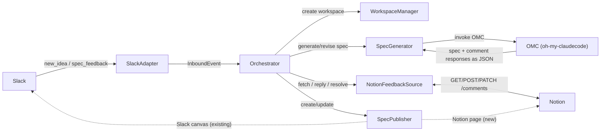
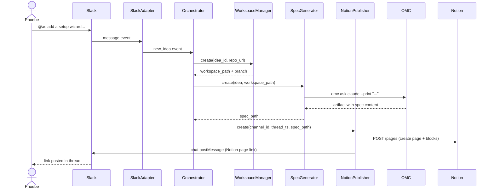

# Enhancement: Notion publisher

## Parent feature

`feature-idea-to-spec.md` — Idea to spec to review

## What

When an idea is processed, the spec is published to a Notion page. The Slack thread receives a link to the page and that's where Slack's involvement ends. Team members leave feedback as page comments, Autocatalyst replies in the same comment thread, and revised specs are updated on the page in place.

## Why

Notion is where many teams already do their written work — specs, docs, project notes. When the spec lives in Notion, team members can review and comment without switching context or learning a new tool. Notion pages are first-class documents that fit naturally into an existing knowledge base and can be linked, organized, and searched alongside everything else the team writes.

## User stories

- Phoebe can read the generated spec in Notion without leaving her team's knowledge base
- Phoebe can leave feedback as a Notion page comment, then @mention Autocatalyst in the Slack thread to process it, and see the spec revised in place
- Phoebe can include additional feedback in the same Slack @mention and have it combined with her Notion comments in a single revision pass
- Enzo can see Autocatalyst's replies to his Notion comments directly in the comment thread
- Enzo can still provide feedback as a Slack thread reply by @mentioning Autocatalyst, and see the spec revised with his message and any open Notion comments included

## Narratives

### Phoebe reviews the spec in Notion

Phoebe gets the Notion page link in the Slack thread. She reads the spec and leaves two comments on the page: one questioning whether the wizard needs to be a modal dialog, and another noting that several settings should be optional. When she's done, she @mentions `@ac` in the thread: `@ac I've left some comments on the spec`.

Autocatalyst fetches both open comment threads from the Notion page, combines them with Phoebe's Slack message, and runs a revision pass. The spec is updated in place — the modal is replaced with an inline flow, and the optional settings are called out explicitly. Autocatalyst replies to each of Phoebe's comments: "Updated: wizard now uses an inline flow rather than a modal" and "Updated: three settings are now marked optional with a note on how to complete them later." Both comment threads are then resolved. The page reflects the revised spec; the Slack thread is unchanged.

## Design changes

*(Added by design specs stage — frame as delta on the parent feature's design spec)*

## Technical changes

### Affected files

*(Populated during tech specs stage — list files that will change and why)*

### Changes

## Tech spec

### 1. Introduction and overview

**Dependencies**
- Feature: Idea to spec to review — provides the full pipeline this enhancement modifies (`Orchestrator`, `SpecGenerator`, `WorkspaceManager`, `CanvasPublisher`)
- Decision: Human interface adapter — Slack remains the inbound surface for both idea seeding and feedback signals; this enhancement does not change that
- Decision: Observability stack — logging for the new publisher follows the same `createLogger` conventions

**Technical goals**
- Spec published to a Notion page within the existing 5-minute SLA — no latency regression
- Slack thread receives the same two messages as today: "working on it" on intake, and a link to the Notion page when the spec is ready
- Any `@ac` mention in the idea's Slack thread triggers a revision pass: the feedback payload is the union of the Slack message content and the body of all open Notion comment threads on the page; the spec is revised in place; Autocatalyst replies in the Slack thread and resolves each Notion comment thread
- Publisher selection (Notion vs. Slack canvas) is controlled by configuration — no code change required to switch

**Non-goals**
- Removing or deprecating `SlackCanvasPublisher` — it stays; Notion is an alternative, not a replacement
- Migrating existing in-flight runs from canvas to Notion
- Polling Notion for new comments — the trigger for processing Notion feedback is always a Slack @mention

**Glossary**
- **Notion page** — a document in the Notion API (`page` object); spec content is written as child blocks via the Blocks API
- **Notion comment** — a top-level discussion on a page (`discussion` object); feedback left by reviewers before they trigger a revision pass
- **Open comment thread** — a Notion comment thread with `resolved: false`; included in the feedback payload when a revision is triggered
- **Notion integration token** — a secret issued by a Notion internal integration; authenticates all Notion API calls; provided via the `AC_NOTION_INTEGRATION_TOKEN` environment variable
- **`SpecPublisher`** — the renamed interface (replacing `CanvasPublisher`) that both `SlackCanvasPublisher` and `NotionPublisher` implement
- **`FeedbackSource`** — a new interface with three methods: `fetch` (returns open comment threads), `reply` (posts a response to a specific comment thread), and `resolve` (marks threads resolved); `NotionFeedbackSource` is the first implementation
- **`NotionCommentResponse`** — a `{ comment_id: string; response: string }` pair returned by `SpecGenerator.revise()` and dispatched by the Orchestrator back to the originating comment thread

### 2. System design and architecture

**Modified and new components**

*Modified*
- `src/adapters/slack/canvas-publisher.ts` — exported interface renamed `CanvasPublisher` → `SpecPublisher`; `SlackCanvasPublisher` implementation unchanged
- `src/core/orchestrator.ts` — `canvasPublisher` dep replaced with `specPublisher: SpecPublisher`; optional `feedbackSource?: FeedbackSource` dep added; on `spec_feedback`, fetches Notion comments if source is present (empty array if not), passes them alongside the Slack message to `SpecGenerator.revise`, dispatches `NotionCommentResponse[]` back via `feedbackSource.reply`, then resolves the comment threads; `canvas_id` on `Run` renamed to `publisher_ref`
- `src/types/runs.ts` — `canvas_id` → `publisher_ref`
- `src/types/config.ts` — optional `notion` block added: `{ integration_token: string; parent_page_id: string }`; in WORKFLOW.md the token is referenced as `${AC_NOTION_INTEGRATION_TOKEN}`, following the same pattern as `${AC_SLACK_BOT_TOKEN}`
- `src/index.ts` — wires `NotionPublisher` + `NotionFeedbackSource` when `config.notion` is present; falls back to `SlackCanvasPublisher`

*New*
- `src/adapters/notion/notion-client.ts` — thin wrapper around `@notionhq/client` SDK; injectable for testing
- `src/adapters/notion/notion-publisher.ts` — `NotionPublisher` implements `SpecPublisher`; `create` creates a Notion page under `parent_page_id`, converts spec Markdown to Notion blocks, posts Slack message with page link; `update` replaces the page's child blocks with revised spec content
- `src/adapters/notion/notion-feedback-source.ts` — defines the `FeedbackSource` interface and `NotionFeedbackSource` implementation; `fetch(publisher_ref)` calls `GET /v1/comments?block_id=<page_id>` and returns open threads; `reply(publisher_ref, comment_id, response)` posts a reply via `POST /v1/comments`; `resolve(publisher_ref, comment_ids)` marks each thread resolved via `PATCH /v1/comments/<id>`

**Revision response format**

`SpecGenerator.create()` keeps the existing `## Raw output` / `FILENAME:` artifact format — it works and returns only the spec.

`SpecGenerator.revise()` shifts to a JSON response from OMC:

```json
{
  "spec": "---\nfrontmatter...\n---\n# Feature...",
  "comment_responses": [
    { "comment_id": "abc123", "response": "Updated: wizard now uses an inline flow rather than a modal" },
    { "comment_id": "def456", "response": "Updated: three settings are now marked optional" }
  ]
}
```

`comment_responses` is an empty array when there are no Notion comments. `SpecGenerator.revise()` parses with `JSON.parse()` + validation, writes `spec` to disk, and returns `NotionCommentResponse[]`. The Orchestrator dispatches each response via `feedbackSource.reply()` then calls `feedbackSource.resolve()`.

**High-level architecture**



**Sequence diagram — new idea (Notion publisher selected)**



**Sequence diagram — spec feedback with Notion comments**

```mermaid
sequenceDiagram
    actor Phoebe
    participant Slack
    participant SlackAdapter
    participant Orchestrator
    participant NotionFeedbackSource
    participant SpecGenerator
    participant NotionPublisher

    Phoebe->>Notion: leaves 2 comments on spec page
    Phoebe->>Slack: @ac I've left some comments
    Slack->>SlackAdapter: message event (thread reply)
    SlackAdapter->>Orchestrator: spec_feedback event
    Orchestrator->>NotionFeedbackSource: fetch(publisher_ref)
    NotionFeedbackSource->>Notion: GET /comments?block_id=<page_id>
    Notion-->>NotionFeedbackSource: 2 open comment threads
    Note over Orchestrator: combines Slack message + 2 comment bodies (with IDs)
    Orchestrator->>SpecGenerator: revise(feedback, notion_comments, spec_path, workspace_path)
    SpecGenerator->>OMC: omc ask claude --print "..."
    OMC-->>SpecGenerator: JSON — revised spec + comment_responses[]
    SpecGenerator-->>Orchestrator: spec written to disk, NotionCommentResponse[]
    Orchestrator->>NotionPublisher: update(publisher_ref, spec_path)
    NotionPublisher->>Notion: replace page child blocks
    loop for each NotionCommentResponse
        Orchestrator->>NotionFeedbackSource: reply(publisher_ref, comment_id, response)
        NotionFeedbackSource->>Notion: POST /comments (reply to thread)
    end
    Orchestrator->>NotionFeedbackSource: resolve(publisher_ref, comment_ids)
    NotionFeedbackSource->>Notion: PATCH /comments/<id> × 2
    Note right of Phoebe: page updated; each comment thread has a reply and is resolved
```

### 3. Detailed design

**Updated types**

```typescript
// src/types/runs.ts — canvas_id renamed to publisher_ref
export interface Run {
  id: string;
  idea_id: string;
  stage: RunStage;
  workspace_path: string;
  branch: string;
  spec_path: string | undefined;
  publisher_ref: string | undefined; // Notion page ID or Slack canvas ID
  attempt: number;
  created_at: string;
  updated_at: string;
}

// src/types/config.ts — notion block added
export interface WorkflowConfig {
  // existing fields unchanged
  notion?: {
    integration_token: string;
    parent_page_id: string;
  };
}
```

**New shared types** (in `src/adapters/agent/spec-generator.ts`, alongside `SpecGenerator`)

```typescript
export interface NotionComment {
  id: string;   // discussion ID — used to post the reply
  body: string; // full thread text: all comments in the discussion concatenated, separated by "\n"
}

export interface NotionCommentResponse {
  comment_id: string; // matches NotionComment.id
  response: string;
}
```

One `NotionComment` represents one discussion thread. One `NotionCommentResponse` is one reply posted back to that thread. They are always 1:1.

**Updated interfaces**

```typescript
// src/adapters/slack/canvas-publisher.ts — interface renamed
export interface SpecPublisher {
  create(channel_id: string, thread_ts: string, spec_path: string): Promise<string>; // returns publisher_ref
  update(publisher_ref: string, spec_path: string): Promise<void>;
}

// src/adapters/agent/spec-generator.ts — revise() signature updated
export interface SpecGenerator {
  create(idea: Idea, workspace_path: string): Promise<string>;
  revise(
    feedback: SpecFeedback,
    notion_comments: NotionComment[],
    spec_path: string,
    workspace_path: string,
  ): Promise<NotionCommentResponse[]>;
}

// src/adapters/notion/notion-feedback-source.ts
export interface FeedbackSource {
  fetch(publisher_ref: string): Promise<NotionComment[]>;
  reply(publisher_ref: string, comment_id: string, response: string): Promise<void>;
  resolve(publisher_ref: string, comment_ids: string[]): Promise<void>;
}

// src/core/orchestrator.ts — OrchestratorDeps updated
interface OrchestratorDeps {
  adapter: SlackAdapter;
  workspaceManager: WorkspaceManager;
  specGenerator: SpecGenerator;
  specPublisher: SpecPublisher;     // was canvasPublisher: CanvasPublisher
  feedbackSource?: FeedbackSource;  // absent when using SlackCanvasPublisher
  postError: (channel_id: string, thread_ts: string, text: string) => Promise<void>;
  repo_url: string;
}
```

**`SpecGenerator.revise()` — prompt and JSON parsing**

When `notion_comments` is non-empty, the revision prompt includes a Notion comments section with IDs:

```
Revise the spec below based on the following feedback. Respond with only a JSON object — no other text before or after it.

Your response must match this shape exactly:
{
  "spec": "<complete revised spec as a Markdown string — preserve YAML frontmatter>",
  "comment_responses": [
    { "comment_id": "<id from [COMMENT_ID:] tag>", "response": "<1-2 sentences explaining how this comment was addressed>" }
  ]
}

Slack message:
<<<
{feedback.content}
>>>

Notion page comments:
<<<
[COMMENT_ID: abc123]
First comment body...

[COMMENT_ID: def456]
Second comment body...
>>>

Current spec:
<<<
{spec content}
>>>
```

When `notion_comments` is empty, the Notion section is omitted and the model is instructed to return `"comment_responses": []`.

Parsing:
1. Extract the `## Raw output` section from the OMC artifact (same depth-tracking logic as `create`)
2. `JSON.parse()` the content
3. Validate: `spec` is a non-empty string; `comment_responses` is an array of `{ comment_id: string; response: string }`; throw with a descriptive error if either check fails
4. Write `spec` to `spec_path` (overwrite in place)
5. Return `comment_responses`

**`NotionPublisher` — Markdown to blocks and page operations**

Spec Markdown is converted to Notion block format using `@tryfabric/martian` (`markdownToBlocks(content)`). This handles headings, paragraphs, bullet and numbered lists, code blocks, and inline formatting.

`create()`:
1. Read spec from `spec_path`; derive title via `titleFromPath` (same logic as `SlackCanvasPublisher`)
2. `POST /v1/pages` with `parent: { page_id: config.notion.parent_page_id }`, `properties: { title }`, and `children: markdownToBlocks(content)`
3. Post Slack message to the thread with the Notion page URL (`https://notion.so/<page_id>`)
4. Return `page_id`

`update()`:
1. Read spec from `spec_path`
2. `GET /v1/blocks/<page_id>/children` → existing child block IDs
3. `DELETE /v1/blocks/<block_id>` for each existing child (sequential)
4. `PATCH /v1/blocks/<page_id>/children` with `markdownToBlocks(content)`

Note: Notion's append endpoint accepts up to 100 blocks per request. Large specs that produce more than 100 blocks will fail silently at the truncation point. Pagination is not implemented in this iteration — see Risks.

**`NotionFeedbackSource` — comment operations**

`fetch(publisher_ref)`:
- `GET /v1/comments?block_id=<publisher_ref>`
- Filter to threads where `resolved === false`
- For each thread: format each comment as `{author_name}: {plain_text}` and join with `"\n"` to form `body`, where `author_name` is `created_by.name` from the comment object — this preserves attribution across multi-person threads
- Return `{ id: string; body: string }[]` where `id` is the `discussion_id`

`reply(publisher_ref, comment_id, response)`:
- `POST /v1/comments` with `{ discussion_id: comment_id, rich_text: [{ type: 'text', text: { content: response } }] }`

`resolve(publisher_ref, comment_ids)`:
- Best-effort: for each ID, attempt `PATCH /v1/comments/<id>` with `{ resolved: true }`
- If the endpoint returns 404 or 405 (not supported by the API), log a warning at `warn` level and continue — do not fail the run
- See Risks

**Orchestrator — enrichment and dispatch**

Updated `_handleSpecFeedback` logic:

```
1. Fetch: notionComments = feedbackSource ? await feedbackSource.fetch(run.publisher_ref) : []
2. Revise: commentResponses = await specGenerator.revise(feedback, notionComments, run.spec_path, run.workspace_path)
3. Update page: await specPublisher.update(run.publisher_ref, run.spec_path)
4. If feedbackSource && commentResponses.length > 0:
   a. For each response: await feedbackSource.reply(run.publisher_ref, response.comment_id, response.response)
   b. await feedbackSource.resolve(run.publisher_ref, commentResponses.map(r => r.comment_id))
5. Transition run to 'review'
```

Step 4 failures (reply/resolve) are logged as errors but do **not** fail the run — the spec is already revised and the page updated; losing comment thread replies is a recoverable UX degradation, not a pipeline failure.

### 4. Security, privacy, and compliance

**Authentication and authorization**
- The Notion integration token is read from the `AC_NOTION_INTEGRATION_TOKEN` environment variable at startup, following the same pattern as `AC_SLACK_BOT_TOKEN` — it is never logged, never exposed to clients, and never included in error messages posted to Slack
- The Notion integration must be manually added to the parent page in the Notion UI before the service starts — this is an operator setup step; Autocatalyst does not verify integration access at startup and will surface a 401/403 from the Notion API as a run failure if it is missing
- No per-user authorization: the integration acts as itself, not on behalf of individual users; all pages and comments are created under the integration's identity

**Data privacy**
- Spec content is written to Notion pages — this is a broader surface than Slack canvases (which stay within the workspace). Operators should ensure the Notion integration is scoped to an appropriate parent page and not granted workspace-wide access
- Notion comment bodies, including `created_by.name` attribution, are fetched and included in the OMC revision prompt, meaning they are sent to Anthropic. This mirrors the existing behavior for Slack feedback content and is not new in kind, but operators should be aware that Notion comment authors' names are now part of the data sent to Anthropic
- The integration token must not appear in any log output; `NotionClient` must never log the token value

**Input validation**
- `publisher_ref` values stored on `Run` originate from Notion API responses, not user input — no further validation needed at call sites
- Notion comment content is passed to the OMC prompt wrapped in `<<<`/`>>>` delimiters; it is not executed or interpreted as code
- The JSON response from OMC is parsed with `JSON.parse()` and structurally validated before any field is used — invalid shape throws and fails the run rather than passing untrusted data downstream

### 5. Observability

**Logging**

All new components use `createLogger()` from `src/core/logger.ts`. New stable event names:

| Event | Level | Component |
|---|---|---|
| `notion_page.created` | info | notion-publisher |
| `notion_page.updated` | info | notion-publisher |
| `notion_comments.fetched` | debug | notion-feedback-source |
| `notion_comment.replied` | debug | notion-feedback-source |
| `notion_comments.resolved` | debug | notion-feedback-source |
| `notion_comments.resolve_skipped` | warn | notion-feedback-source |
| `spec_revision.enriched` | debug | orchestrator |

`notion_comments.fetched` includes `comment_count` so it's easy to see whether a revision pass had Notion comments or was Slack-only. `spec_revision.enriched` is emitted by the Orchestrator with `slack_feedback: boolean` and `notion_comment_count: number` before each revision — gives a clear trace of what fed each revision pass.

Sensitive content (comment bodies, spec content) is not logged at `info` level or above.

**Metrics**

No new metrics beyond what the parent feature already tracks (run stage transitions, OMC invocation counts). Notion API call failures surface as `run.failed` events on the existing metric.

**Alerting**

No new alert conditions beyond the parent feature. Repeated `notion_comments.resolve_skipped` warnings in a short window would indicate the Notion API doesn't support resolution — worth a manual investigation but not an on-call alert.

### 6. Testing plan

All tests use Vitest. `NotionClient` is injectable, so all Notion API calls are mocked with `vi.fn()`. Filesystem operations use real temp directories created in `beforeEach` and cleaned in `afterEach`. Log output captured via `destination` injection.

---

**`NotionPublisher`**

_`create` — happy path_
- Reads spec content from `spec_path` and passes it to `markdownToBlocks`
- Calls `notionClient.pages.create` with `parent: { page_id: config.notion.parent_page_id }` — asserts exact `parent_page_id` value
- Calls `notionClient.pages.create` with `properties.title` derived from the spec filename slug (e.g., `setup-wizard.md` → `"Setup wizard"`)
- Calls `notionClient.pages.create` with `children` equal to the output of `markdownToBlocks`
- Calls `app.client.chat.postMessage` after `pages.create` (never before)
- `postMessage` uses `channel_id` and `thread_ts` from the arguments
- `postMessage` body contains the Notion page URL in the form `https://notion.so/<page_id>`
- Returns the `page_id` from the `pages.create` response

_`create` — failure paths_
- `pages.create` rejects → throws; `postMessage` is never called
- `postMessage` rejects after a successful `pages.create` → throws; `page_id` is not returned (caller cannot store a ref to an unannounced page)

_`update` — happy path_
- Reads spec content from `spec_path`
- Calls `notionClient.blocks.children.list` with `publisher_ref` to get existing block IDs
- Calls `notionClient.blocks.delete` for each existing block ID, in order
- Calls `notionClient.blocks.children.append` with `publisher_ref` and the new blocks after all deletes complete
- `postMessage` is never called during `update`
- Correctly handles an empty page: `children.list` returns no blocks → no deletes → append proceeds normally

_`update` — failure paths_
- `blocks.children.list` rejects → throws; no deletes or appends called
- `blocks.delete` rejects on the second of three blocks → throws; remaining blocks are not deleted and append is not called
- `blocks.children.append` rejects → throws

---

**`NotionFeedbackSource`**

_`fetch` — filtering and formatting_
- Returns only threads where `resolved === false`; threads with `resolved === true` are excluded
- Returns an empty array when all threads are resolved
- Returns an empty array when there are no comment threads at all
- Single-comment thread: `body` is `"{name}: {plain_text}"`
- Multi-comment thread (3 comments from 2 authors): `body` concatenates each as `"{name}: {plain_text}"` joined by `"\n"`, in order
- Thread with a comment where `created_by.name` is null or absent: falls back to `created_by.id`; does not throw
- `id` field is the `discussion_id`, not the individual comment ID
- Multiple open threads: returns one entry per thread

_`reply`_
- Calls `POST /v1/comments` with `discussion_id` equal to `comment_id`
- `rich_text` contains a single `{ type: 'text', text: { content: response } }` entry
- Throws if the API call rejects

_`resolve`_
- Calls `PATCH /v1/comments/<id>` once per ID in `comment_ids`
- Empty `comment_ids` array: no API calls made
- API returns 404 on one ID: logs `notion_comments.resolve_skipped` at `warn` level; does not throw; continues to resolve remaining IDs
- API returns 405: same warn-and-continue behavior
- Log entry for `resolve_skipped` includes the affected `comment_id`

---

**`SpecGenerator.revise()` — updated**

_Prompt construction_
- With `notion_comments` non-empty: prompt includes a `Notion page comments:` section with each comment formatted as `[COMMENT_ID: <id>]\n<body>`
- With `notion_comments` non-empty: prompt includes the JSON shape example showing `comment_responses` with `comment_id` and `response` fields
- With `notion_comments` empty: prompt does not contain `[COMMENT_ID:` anywhere; `comment_responses` instruction says to return `[]`
- Slack message content appears in the `<<<`/`>>>` delimiters regardless of whether Notion comments are present
- Current spec content appears in the `<<<`/`>>>` delimiters in both cases
- OMC is invoked with the correct `cwd: workspace_path`

_Artifact parsing_
- Valid JSON with non-empty `spec` and populated `comment_responses`: spec written to `spec_path`; `NotionCommentResponse[]` returned with correct `comment_id` and `response` values
- Valid JSON with empty `comment_responses: []`: spec written; empty array returned
- `spec` field written to disk overwrites the previous file content exactly — no trailing characters added or removed
- Malformed JSON (not parseable): throws with a descriptive error; spec file is not modified
- JSON missing `spec` field: throws with a descriptive error
- JSON with `spec` as empty string: throws with a descriptive error
- JSON missing `comment_responses` field: throws with a descriptive error
- JSON with `comment_responses` as a non-array: throws with a descriptive error
- `comment_responses` entry missing `comment_id`: throws with a descriptive error
- `comment_responses` entry missing `response`: throws with a descriptive error
- Extra unknown fields in the JSON object: tolerated without error
- OMC exits non-zero: throws; spec file is not modified

---

**`Orchestrator` — `spec_feedback` with `feedbackSource`**

_Happy path — with Notion comments_
- `feedbackSource.fetch` is called with `run.publisher_ref` before `specGenerator.revise`
- `specGenerator.revise` receives the `notion_comments` array returned by `fetch` alongside the `SpecFeedback` event
- `specPublisher.update` is called after `specGenerator.revise` resolves, before any `reply` calls
- `feedbackSource.reply` is called once per entry in `commentResponses`, in order, with the correct `comment_id` and `response`
- `feedbackSource.resolve` is called after all `reply` calls complete, with the IDs from `commentResponses` (not all fetched IDs)
- Run transitions back to `review` after all steps complete

_Happy path — no Notion comments (fetch returns empty)_
- `specGenerator.revise` is called with `notion_comments: []`
- `feedbackSource.reply` and `feedbackSource.resolve` are not called when `commentResponses` is empty
- Run transitions back to `review`

_Happy path — no feedbackSource_
- `fetch` is never called
- `specGenerator.revise` is called with `notion_comments: []`
- Run transitions back to `review`

_`spec_revision.enriched` log event_
- Emitted before `specGenerator.revise` with `slack_feedback: true` when the Slack message is non-empty
- Emitted with correct `notion_comment_count` matching the length of the fetched array

_Failure paths_
- `feedbackSource.fetch` rejects → run transitions to `failed`; `specGenerator.revise` is not called
- `specGenerator.revise` rejects → run transitions to `failed`; `specPublisher.update` is not called
- `specPublisher.update` rejects → run transitions to `failed`; `feedbackSource.reply` is not called
- `feedbackSource.reply` rejects on second of three responses → logs error; run does **not** transition to `failed`; remaining replies are still attempted; `resolve` is still called
- `feedbackSource.resolve` rejects → logs error; run does **not** transition to `failed`; run transitions back to `review`

---

**Manual acceptance testing**

- Seed an idea; confirm a Notion page is created under the configured parent page with the correct title and formatted spec content, and a link appears in the Slack thread
- Leave two comments on the Notion page from different accounts, then @mention `@ac` in the thread; confirm: (1) the spec is revised, (2) each comment thread has a reply from Autocatalyst, (3) comment threads are resolved, (4) the Slack thread has no new messages
- @mention `@ac` in the thread with a Slack message but no Notion comments; confirm the spec is revised using only the Slack message; no Notion comment replies or resolve calls are made
- @mention `@ac` with both a Slack message and open Notion comments; confirm both are reflected in the revision
- Configure the service without a `notion` block (fallback to `SlackCanvasPublisher`); confirm behavior is identical to the parent feature with no regression

### 7. Alternatives considered

**Notion webhook trigger instead of Slack @mention**

Notion does not expose a public webhook API for comment events. Polling on a timer was considered but rejected (Non-goals, Section 1) — it adds latency unpredictability and requires the service to hold a timer per active run. The Slack @mention reuses the existing feedback mechanism at no added complexity cost.

**Spec stored as a single Notion code block instead of converted blocks**

Skipping the Markdown-to-blocks conversion would eliminate the `@tryfabric/martian` dependency and simplify `NotionPublisher` considerably — the spec would be stored as a single `code` block. The cost is that the Notion page renders as a wall of raw Markdown text with no headings, structure, or inline formatting. Since Notion readability is the primary motivation for this enhancement, that cost is unacceptable. Block conversion is the right trade-off.

**Unify `create()` and `revise()` to both return JSON**

Making `create()` also return JSON would simplify the parser (one code path instead of two) but would require changing the working `create()` artifact format and its tests for no functional benefit. Keeping the two formats distinct keeps the change surface minimal and preserves the already-validated `create()` path.

**Dedicated `/ac process-comments` slash command instead of @mention trigger**

A slash command would be unambiguous — it can only mean "process my Notion comments." The cost is a new Slack slash command registration, more operator setup, and higher friction for users who already know to @mention `@ac` for feedback. The @mention approach is consistent with the existing model and handles both Slack feedback and the Notion comment trigger in a single interaction.

### 8. Risks

**Notion comment resolution API availability**

The Notion public API may not support `PATCH /v1/comments/<id>` with `resolved: true` (the resolution endpoint was not publicly available as of the spec date). Mitigation: `resolve()` is best-effort — 404/405 responses log a warning and do not fail the run. The reply posted by Autocatalyst still signals that the feedback was processed, even if the thread remains technically open.

**Large specs exceeding Notion's 100-block append limit**

Notion's `blocks.children.append` endpoint accepts at most 100 blocks per call. A spec that produces more than 100 blocks will be silently truncated at the page boundary. Mitigation: log the block count at `debug` level during `update()` so truncation is detectable; implement chunked appending in a follow-up. At current spec sizes this limit is unlikely to be reached.

**`@tryfabric/martian` conversion fidelity**

The converter may not handle every Markdown construct in generated specs correctly — notably YAML frontmatter, nested lists, and tables. Mitigation: validate against real spec output during manual acceptance testing; if the converter drops content, scope a fallback (e.g., render frontmatter as a Notion callout block and unsupported constructs as paragraph text) as a follow-up.

**OMC JSON response reliability**

The model must return well-formed JSON matching the specified shape. Prompt changes or model updates could degrade reliability. Mitigation: the prompt shows the exact expected shape with a concrete example; `JSON.parse()` + structural validation fails fast with a descriptive error; the run can be retried by re-triggering with an @mention.

**`created_by.name` unavailability**

Notion integrations may not have access to full user profile data on all plan tiers. If `created_by.name` is null or absent, the attribution format breaks. Mitigation: `fetch()` falls back to `created_by.id` when `name` is not present — tested explicitly in the unit test suite.

**Notion page accumulation**

Pages are created on every `new_idea` run and never deleted. A misconfigured or looping service could populate the parent page with many stub pages. Mitigation: document the `parent_page_id` scoping recommendation in the operator setup guide; manual cleanup is operator responsibility.

## Task list

- [x] **Story: Interface renames and type additions**
  - [x] **Task: Rename `CanvasPublisher` → `SpecPublisher` and `canvas_id` → `publisher_ref`**
    - **Description**: Mechanical rename across all files. In `src/adapters/slack/canvas-publisher.ts`, rename the exported interface from `CanvasPublisher` to `SpecPublisher`. In `src/types/runs.ts`, rename `canvas_id` to `publisher_ref` with updated comment. In `src/core/orchestrator.ts`, update the import, `OrchestratorDeps` field (`canvasPublisher` → `specPublisher`), and all field accesses (`run.canvas_id` → `run.publisher_ref`). Update all test files that reference these names. No behavior changes — all existing tests must still pass after this task.
    - **Acceptance criteria**:
      - [ ] `SpecPublisher` is the exported interface name in `canvas-publisher.ts`; `CanvasPublisher` does not appear anywhere in the codebase
      - [ ] `Run.publisher_ref` replaces `Run.canvas_id` in `runs.ts`
      - [ ] `OrchestratorDeps.specPublisher` replaces `canvasPublisher`; all orchestrator field accesses updated
      - [ ] All existing tests pass: `npm test`
    - **Dependencies**: None

  - [x] **Task: Add `NotionComment`, `NotionCommentResponse` types and `notion` config block**
    - **Description**: Add two new shared types to `src/adapters/agent/spec-generator.ts` alongside the `SpecGenerator` interface: `NotionComment { id: string; body: string }` and `NotionCommentResponse { comment_id: string; response: string }`, each with inline comments as specified in Section 3. Add the optional `notion?: { integration_token: string; parent_page_id: string }` block to `WorkflowConfig` in `src/types/config.ts`. No behavior changes — no existing tests should break.
    - **Acceptance criteria**:
      - [ ] `NotionComment` and `NotionCommentResponse` interfaces exported from `spec-generator.ts` with correct fields and comments
      - [ ] `WorkflowConfig.notion` is optional with `integration_token` and `parent_page_id` string fields
      - [ ] All existing tests pass: `npm test`
    - **Dependencies**: None

- [x] **Story: NotionClient**
  - [x] **Task: Implement `NotionClient`**
    - **Description**: Create `src/adapters/notion/notion-client.ts`. Define and export a `NotionClient` interface with methods wrapping the `@notionhq/client` SDK calls used by `NotionPublisher` and `NotionFeedbackSource`: `pages.create`, `blocks.children.list`, `blocks.children.append`, `blocks.delete`, `comments.list`, `comments.create`, and `comments.update`. Implement `NotionClientImpl` that takes `integration_token` in its constructor and delegates each method to the underlying `@notionhq/client` `Client`. Install `@notionhq/client` as a dependency. All relative imports use `.js` extensions.
    - **Acceptance criteria**:
      - [ ] `NotionClient` interface exported with all seven methods matching the SDK signatures
      - [ ] `NotionClientImpl` constructor takes `{ integration_token: string }`; never logs the token value
      - [ ] `@notionhq/client` added to `package.json` dependencies
      - [ ] File compiles without errors under `NodeNext` module resolution
      - [ ] All relative imports use `.js` extensions
    - **Dependencies**: None

- [x] **Story: NotionPublisher**
  - [x] **Task: Unit tests for `NotionPublisher`**
    - **Description**: Create `tests/adapters/notion/notion-publisher.test.ts`. Use a mock `NotionClient` (all methods `vi.fn()`) and a mock Bolt `App` with `chat.postMessage` mocked. Use real temp files for spec content. Tests will fail until the implementation task is complete. Cover all cases from the Section 6 testing plan for `NotionPublisher`.
    - **Acceptance criteria**:
      - [ ] `create` calls `pages.create` with exact `parent_page_id`, correct title for multiple filename formats, and blocks from `markdownToBlocks`
      - [ ] `create` calls `postMessage` after `pages.create`; URL contains `page_id`
      - [ ] `create` returns `page_id`
      - [ ] `create` throws if `pages.create` rejects; `postMessage` never called
      - [ ] `create` throws if `postMessage` rejects after successful `pages.create`
      - [ ] `update` calls `blocks.children.list`, then `blocks.delete` for each block ID in order, then `blocks.children.append` with new blocks
      - [ ] `update` handles empty page (no existing blocks): no deletes, append called
      - [ ] `update` throws if `blocks.children.list` rejects; no deletes or appends called
      - [ ] `update` throws if any `blocks.delete` rejects; append not called
      - [ ] `update` throws if `blocks.children.append` rejects
      - [ ] `postMessage` never called during `update`
      - [ ] All tests pass: `npm test`
    - **Dependencies**: "Task: Implement `NotionClient`", "Task: Rename `CanvasPublisher` → `SpecPublisher`"

  - [x] **Task: Implement `NotionPublisher`**
    - **Description**: Create `src/adapters/notion/notion-publisher.ts`. Implement `NotionPublisher` which implements `SpecPublisher`. Constructor takes `NotionClient`, the Bolt `App` (for posting the Slack message), and `parent_page_id`. Install `@tryfabric/martian` as a dependency and use `markdownToBlocks(content)` for all Markdown-to-blocks conversion. `create()`: reads spec from `spec_path`, derives title via `titleFromPath` (same logic as `SlackCanvasPublisher`), calls `notionClient.pages.create` with `parent: { page_id: parent_page_id }`, `properties: { title }`, and `children: markdownToBlocks(content)`, then calls `app.client.chat.postMessage` with the Notion page URL (`https://notion.so/<page_id>`), and returns `page_id`. `update()`: reads spec, fetches existing child block IDs via `blocks.children.list`, deletes each sequentially via `blocks.delete`, then appends new blocks via `blocks.children.append`. Uses `createLogger('notion-publisher')`. All relative imports use `.js` extensions.
    - **Acceptance criteria**:
      - [ ] `NotionPublisher` implements `SpecPublisher` interface
      - [ ] `@tryfabric/martian` added to `package.json` dependencies
      - [ ] `create()` calls `pages.create` with correct `parent_page_id`, title, and block children
      - [ ] `create()` calls `postMessage` after `pages.create` with a URL containing the `page_id`
      - [ ] `create()` returns `page_id`; throws if `pages.create` rejects (no `postMessage` call); throws if `postMessage` rejects
      - [ ] `update()` fetches existing blocks, deletes each, then appends new blocks
      - [ ] `update()` handles empty page (no existing blocks) without error
      - [ ] `notion_page.created` and `notion_page.updated` log events emitted with correct fields
      - [ ] All relative imports use `.js` extensions
      - [ ] All tests from the preceding task pass: `npm test`
    - **Dependencies**: "Task: Unit tests for `NotionPublisher`"

- [x] **Story: NotionFeedbackSource**
  - [x] **Task: Unit tests for `NotionFeedbackSource`**
    - **Description**: Create `tests/adapters/notion/notion-feedback-source.test.ts`. Use a mock `NotionClient` (all methods `vi.fn()`). Tests will fail until the implementation task is complete. Cover all cases from the Section 6 testing plan for `NotionFeedbackSource`.
    - **Acceptance criteria**:
      - [ ] `fetch` returns only unresolved threads; resolved threads excluded
      - [ ] `fetch` returns empty array when all threads resolved or no threads exist
      - [ ] `fetch` single-comment thread: `body` is `"{name}: {text}"`
      - [ ] `fetch` multi-comment thread (3 comments, 2 authors): `body` concatenates all with `"\n"` in order
      - [ ] `fetch` comment with absent `name`: falls back to `created_by.id`; no throw
      - [ ] `fetch` returns `discussion_id` as `id`
      - [ ] `reply` calls `comments.create` with `discussion_id: comment_id` and correct `rich_text`
      - [ ] `reply` throws if API rejects
      - [ ] `resolve` calls `comments.update` once per ID with `{ resolved: true }`
      - [ ] `resolve` with empty array: no API calls made
      - [ ] `resolve` 404 on one ID: `notion_comments.resolve_skipped` logged with `comment_id`; does not throw; remaining IDs still processed
      - [ ] `resolve` 405: same warn-and-continue behavior
      - [ ] All tests pass: `npm test`
    - **Dependencies**: "Task: Implement `NotionClient`", "Task: Add `NotionComment`, `NotionCommentResponse` types"

  - [x] **Task: Define `FeedbackSource` interface and implement `NotionFeedbackSource`**
    - **Description**: Create `src/adapters/notion/notion-feedback-source.ts`. Export the `FeedbackSource` interface with three methods: `fetch(publisher_ref: string): Promise<NotionComment[]>`, `reply(publisher_ref: string, comment_id: string, response: string): Promise<void>`, and `resolve(publisher_ref: string, comment_ids: string[]): Promise<void>`. Implement `NotionFeedbackSource` which takes `NotionClient` in its constructor. `fetch()`: calls `comments.list` with `block_id: publisher_ref`, filters to `resolved === false`, formats each thread as `{author_name}: {plain_text}` per comment joined by `"\n"` (falling back to `created_by.id` when `name` is absent), and returns `{ id: discussion_id, body }[]`. `reply()`: calls `comments.create` with `discussion_id: comment_id` and a `rich_text` entry. `resolve()`: for each ID calls `comments.update` with `{ resolved: true }`; catches 404/405 errors, emits `notion_comments.resolve_skipped` at `warn` level, and continues. Uses `createLogger('notion-feedback-source')`. All relative imports use `.js` extensions.
    - **Acceptance criteria**:
      - [ ] `FeedbackSource` interface exported with correct method signatures
      - [ ] `fetch` filters to unresolved threads only; returns empty array when none exist
      - [ ] `fetch` formats thread body as `"{name}: {text}"` joined by `"\n"`; falls back to `created_by.id` when name is absent
      - [ ] `fetch` returns `discussion_id` as `id`, not individual comment ID
      - [ ] `reply` calls `comments.create` with correct `discussion_id` and `rich_text`
      - [ ] `resolve` calls `comments.update` for each ID; empty array is a no-op
      - [ ] `resolve` logs `notion_comments.resolve_skipped` with `comment_id` on 404/405; does not throw
      - [ ] `notion_comments.fetched`, `notion_comment.replied`, `notion_comments.resolved`, `notion_comments.resolve_skipped` log events emitted correctly
      - [ ] All relative imports use `.js` extensions
      - [ ] All tests from the preceding task pass: `npm test`
    - **Dependencies**: "Task: Unit tests for `NotionFeedbackSource`"

- [x] **Story: SpecGenerator revision update**
  - [x] **Task: Update `SpecGenerator` tests for `revise()`**
    - **Description**: Update `tests/adapters/agent/spec-generator.test.ts`. Add the new `notion_comments` argument to all existing `revise()` call sites (passing `[]` to preserve existing behavior). Add new test cases covering all scenarios from the Section 6 testing plan for `SpecGenerator.revise()`. Tests will fail until the implementation task is complete.
    - **Acceptance criteria**:
      - [ ] All existing `revise()` test cases updated with `notion_comments: []` argument
      - [ ] Prompt includes `[COMMENT_ID:]` blocks when `notion_comments` is non-empty
      - [ ] Prompt omits Notion section when `notion_comments` is `[]`
      - [ ] Valid JSON parsed correctly: spec written, `NotionCommentResponse[]` returned with correct values
      - [ ] Empty `comment_responses` array returned correctly
      - [ ] Throws with descriptive error for each invalid JSON shape (malformed, missing `spec`, empty `spec`, missing `comment_responses`, non-array, missing `comment_id`, missing `response`)
      - [ ] Extra fields tolerated
      - [ ] OMC exit non-zero: throws, file not modified
      - [ ] All tests pass: `npm test`
    - **Dependencies**: "Task: Add `NotionComment`, `NotionCommentResponse` types"

  - [x] **Task: Update `OMCSpecGenerator.revise()` — new signature, JSON prompt, and parsing**
    - **Description**: Update `src/adapters/agent/spec-generator.ts`. Change the `revise()` signature to `revise(feedback: SpecFeedback, notion_comments: NotionComment[], spec_path: string, workspace_path: string): Promise<NotionCommentResponse[]>`. Update the prompt to include the Notion comments section (formatted as `[COMMENT_ID: <id>]\n<body>` per comment) and the JSON shape example when `notion_comments` is non-empty; omit the Notion section and instruct `comment_responses: []` when empty. After OMC completes, extract the `## Raw output` section using the existing depth-tracking logic, parse as JSON, validate that `spec` is a non-empty string and `comment_responses` is an array of `{ comment_id: string; response: string }`, write `spec` to `spec_path`, and return `comment_responses`. Throw descriptive errors for all validation failures.
    - **Acceptance criteria**:
      - [ ] `revise()` signature updated to accept `notion_comments: NotionComment[]` and return `Promise<NotionCommentResponse[]>`
      - [ ] Prompt includes `[COMMENT_ID: <id>]` blocks and JSON shape example when `notion_comments` is non-empty
      - [ ] Prompt omits Notion section and instructs `comment_responses: []` when `notion_comments` is `[]`
      - [ ] Valid JSON: `spec` written to `spec_path`; `NotionCommentResponse[]` returned
      - [ ] Throws on malformed JSON, missing `spec`, empty `spec`, missing `comment_responses`, non-array `comment_responses`, entry missing `comment_id` or `response`
      - [ ] Extra unknown fields in JSON: tolerated
      - [ ] OMC exit non-zero: throws; `spec_path` not modified
      - [ ] All relative imports use `.js` extensions
      - [ ] All tests from the preceding task pass: `npm test`
    - **Dependencies**: "Task: Update `SpecGenerator` tests for `revise()`"

- [x] **Story: Orchestrator enrichment and dispatch**
  - [x] **Task: Update Orchestrator tests for enrichment and dispatch**
    - **Description**: Update `tests/core/orchestrator.test.ts`. Update existing `spec_feedback` tests to pass `notion_comments: []` where needed. Add test cases covering all new scenarios from the Section 6 testing plan for the Orchestrator. Tests will fail until the implementation task is complete.
    - **Acceptance criteria**:
      - [ ] All existing orchestrator tests updated and passing
      - [ ] Happy path with Notion comments: fetch → revise (with comments) → update → reply × N → resolve, all called in order with correct args
      - [ ] Happy path with empty fetch: revise called with `[]`; no reply or resolve
      - [ ] No `feedbackSource`: fetch never called; revise called with `[]`
      - [ ] `spec_revision.enriched` log event emitted with correct `slack_feedback` and `notion_comment_count`
      - [ ] `feedbackSource.fetch` rejects → run fails; `revise` not called
      - [ ] `feedbackSource.reply` rejects on second of three: error logged; run stays in `review`; remaining replies attempted; `resolve` called
      - [ ] `feedbackSource.resolve` rejects: error logged; run stays in `review`
      - [ ] All tests pass: `npm test`
    - **Dependencies**: "Task: Rename `CanvasPublisher` → `SpecPublisher`", "Task: Add `NotionComment`, `NotionCommentResponse` types", "Task: Define `FeedbackSource` interface and implement `NotionFeedbackSource`", "Task: Update `OMCSpecGenerator.revise()`"

  - [x] **Task: Update `OrchestratorImpl` for feedback enrichment and comment dispatch**
    - **Description**: Update `src/core/orchestrator.ts`. Add `feedbackSource?: FeedbackSource` to `OrchestratorDeps`. Update `_handleSpecFeedback()` to implement the enrichment and dispatch logic from Section 3: (1) fetch Notion comments via `feedbackSource.fetch(run.publisher_ref)` if source is present, else use `[]`; (2) emit `spec_revision.enriched` log event with `slack_feedback` and `notion_comment_count`; (3) pass `notion_comments` to `specGenerator.revise()`; (4) call `specPublisher.update()`; (5) if `feedbackSource` present and `commentResponses.length > 0`, call `feedbackSource.reply()` for each response then `feedbackSource.resolve()` — step 5 failures log errors but do not fail the run. Update `createRun()` to initialize `publisher_ref: undefined` instead of `canvas_id`.
    - **Acceptance criteria**:
      - [ ] `OrchestratorDeps` has `specPublisher: SpecPublisher` and `feedbackSource?: FeedbackSource`
      - [ ] `feedbackSource.fetch` called with `run.publisher_ref` before `specGenerator.revise`
      - [ ] `notion_comments` from `fetch` passed to `specGenerator.revise`
      - [ ] `spec_revision.enriched` emitted with `slack_feedback: boolean` and `notion_comment_count: number`
      - [ ] `specPublisher.update` called after `revise`, before any `reply`
      - [ ] `feedbackSource.reply` called once per `NotionCommentResponse` with correct args
      - [ ] `feedbackSource.resolve` called after all replies with IDs from `commentResponses`
      - [ ] When no `feedbackSource`: `revise` called with `notion_comments: []`; no fetch/reply/resolve calls
      - [ ] When `commentResponses` is empty: no reply or resolve calls
      - [ ] `feedbackSource.reply` failure: error logged; run does not transition to `failed`; remaining replies attempted; `resolve` still called
      - [ ] `feedbackSource.resolve` failure: error logged; run does not transition to `failed`; transitions to `review`
      - [ ] All relative imports use `.js` extensions
      - [ ] All tests from the preceding task pass: `npm test`
    - **Dependencies**: "Task: Update Orchestrator tests for enrichment and dispatch"

- [ ] **Story: Wiring and configuration**
  - [x] **Task: Update `src/index.ts` to wire `NotionPublisher` and `NotionFeedbackSource`**
    - **Description**: Update `src/index.ts`. When `config.notion` is present, read `AC_NOTION_INTEGRATION_TOKEN` from `process.env` (exit with code 1 and a descriptive error if absent), create `NotionClientImpl`, create `NotionPublisher` and `NotionFeedbackSource`, and pass them to `OrchestratorDeps` as `specPublisher` and `feedbackSource`. When `config.notion` is absent, create `SlackCanvasPublisher` as `specPublisher` and omit `feedbackSource` (existing behavior). All relative imports use `.js` extensions.
    - **Acceptance criteria**:
      - [ ] `config.notion` present + `AC_NOTION_INTEGRATION_TOKEN` set: `NotionPublisher` and `NotionFeedbackSource` created and wired
      - [ ] `config.notion` present + `AC_NOTION_INTEGRATION_TOKEN` absent: process exits with code 1 and descriptive error
      - [ ] `config.notion` absent: `SlackCanvasPublisher` used; `feedbackSource` omitted; no Notion code paths entered
      - [ ] `AC_NOTION_INTEGRATION_TOKEN` value never appears in log output
      - [ ] All relative imports use `.js` extensions
    - **Dependencies**: "Task: Implement `NotionPublisher`", "Task: Define `FeedbackSource` interface and implement `NotionFeedbackSource`", "Task: Update `OrchestratorImpl` for feedback enrichment and comment dispatch"

  - [ ] **Task: Add `notion` block to `WORKFLOW.md` config template**
    - **Description**: Update `WORKFLOW.md` in the repo root to add the `notion` config block as an optional, commented-out section. Follow the same pattern as the `slack` block: reference `AC_NOTION_INTEGRATION_TOKEN` via `${AC_NOTION_INTEGRATION_TOKEN}` interpolation and include a placeholder comment for `parent_page_id`.
    - **Acceptance criteria**:
      - [ ] `WORKFLOW.md` contains a `notion` config block (commented out by default)
      - [ ] `integration_token` references `${AC_NOTION_INTEGRATION_TOKEN}`
      - [ ] `parent_page_id` has a placeholder value with a comment directing the operator to set it
    - **Dependencies**: "Task: Add `NotionComment`, `NotionCommentResponse` types and `notion` config block"
