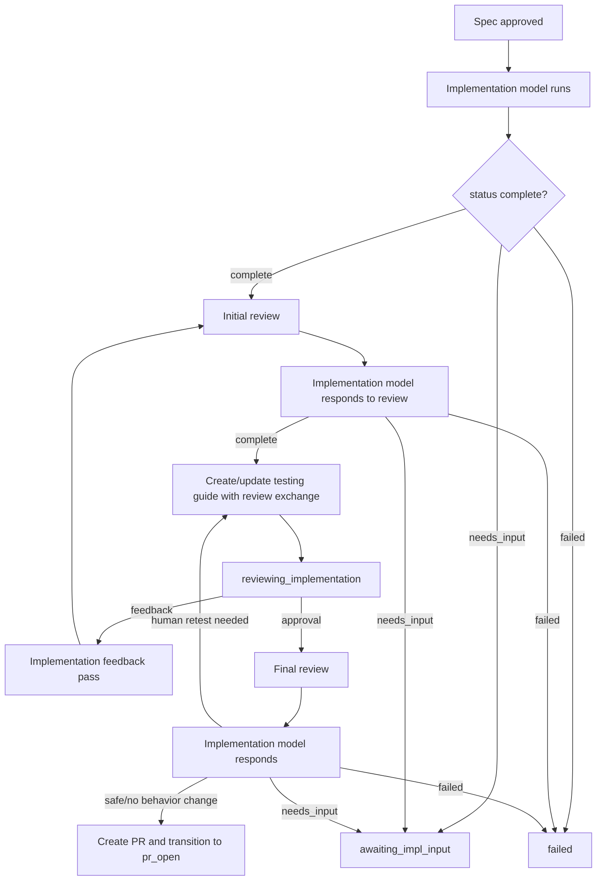

# Enhancement: Two-part implementation review

## Parent features

- `feature-approval-to-implementation.md` — provides the implementation loop, implementation feedback page, and implementation approval path.
- `enhancement-testing-guide-feedback-loop.md` — provides structured testing guides, unresolved feedback handling, and feedback-resolution display.
- `enhancement-model-provider-config.md` and `feature-openai-agent-sdk-runner.md` — provide provider-neutral AI profiles and route-based model selection.
## Issue tracking

A GitHub issue should track this enhancement before implementation starts. I attempted to create it with `gh issue create --repo markdstafford/autocatalyst`, but the sandbox is not authenticated with GitHub CLI and has no `GH_TOKEN`, so issue creation failed before the spec was written. The implementer should create the issue before starting code changes and update the `issue` frontmatter field with the issue number.
## What

Autocatalyst adds two adversarial review checkpoints to the implementation lifecycle. An initial review runs after the implementation agent reports a complete implementation; a final review runs after the human approves and before PR creation.
Both checkpoints use a configurable coding agent that inspects git commits and diffs and acts as an adversarial reviewer. Review findings are sent to the implementation model, which must respond to each one before the testing guide is updated or the PR is created. The exchange — models used, findings, and implementer responses — is documented in the testing guide.
## Why

The current implementation loop has one AI model both build and summarize its own work — creating a blind spot where the same model that made a mistake may not notice it. Adversarial and critic model pairings are well-documented as producing better review outcomes than self-review; a separate configured critic model gives Autocatalyst an adversarial pass before human time is spent. Both exchanges are documented in the testing guide so humans can inspect what was challenged and how the implementer responded, rather than trusting a hidden internal loop.
## Goals

- Run a configurable adversarial coding agent after a complete implementation result and before creating or updating the human testing guide.
- Send review feedback back to the implementation model and require a structured response for each review item.
- Let the implementation model decide whether to fix, decline, ask for input, or abort the run (signal that the implementation cannot proceed safely), while preserving an auditable record of the decision.
- Run a lighter final review after human implementation approval and before PR creation.
- Allow initial and final review to use different AI profiles.
- Document each review exchange in the testing guide with implementation profile, review profile, review findings, implementer responses, and outcome.
- Preserve the existing human-facing implementation feedback loop: humans still approve, give feedback, and test through the testing guide.
- Keep review-model failures degraded but visible unless the configured policy says they are blocking.
- Preserve branch ownership and branch-guard behavior.
## Non-goals

- Replacing human implementation approval.
- Giving the review model authority to edit files or decide what ships.
- Adding a dedicated review UI outside the existing testing guide.
- Unbounded loops — each phase runs one review pass and one fix/response pass.
- Guaranteeing that every provider can enforce read-only filesystem access. Prompt and adapter constraints are required; true sandbox enforcement depends on the runner/provider.
## Personas

- **Enzo: Engineer** — wants another model to scrutinize implementation quality before he spends time testing, and wants the final PR creation path to catch last-minute security or branch issues.
- **Phoebe: Product manager** — wants a clear testing guide that explains not only what changed, but what the AI review questioned and how the implementer handled it.
- **Autocatalyst operator** — configures which profiles perform implementation, initial review, and final review for each repository.
## User stories

- As Enzo, I can configure `implementation.review.``initial` to use a different profile from `implementation.run` and see that profile used before the testing guide is posted.
- As Enzo, I can configure `implementation.review.final` independently from `implementation.review.``initial` for the lighter post-approval review.
- As Enzo, I can open the testing guide and see the implementation profile, review profile, review findings, and implementer responses for the initial review.
- As Enzo, I can approve an implementation and know Autocatalyst runs a final security/PR-readiness review before creating the PR.
- As Enzo, I can see a Slack progress update when Autocatalyst starts the initial review, applies review feedback, starts final review, and decides whether to open a PR.
- As Phoebe, I can read the testing guide and understand whether the implementer fixed review feedback, declined it, or escalated it.
- As an implementer model, I receive structured review feedback with stable IDs and must return structured responses that say which feedback was fixed, declined, or needs human input.
## Design changes

### Lifecycle placement

The implementation lifecycle becomes:

The initial review runs after every complete implementation attempt, including feedback passes. This ensures the human sees the implementation only after the configured review model has had a chance to challenge it.
The final review runs only when the human approves the implementation. It does not replace the initial review.
### Testing guide review exchange section

Testing guides gain an AI-managed `AI review` section at the end, after the `Human review` section:
Review findings and their implementer responses are combined in a single `Review findings` checklist. Each finding appears as a completed checklist item when addressed, with the implementer response as an indented child paragraph. When no findings exist, the checklist contains a single "No blocking or informational findings" item with no child.
```markdown
## AI review

### Initial review

Implementation model: `grove-sonnet-4.6-medium` (`claude-sonnet-4-6`, `claude_agent_sdk`)
Review model: `grove-sonnet-4.6-high` (`claude-sonnet-4-6`, `claude_agent_sdk`)
Review status: addressed

#### Review findings

- [x] [INIT-1] Missing regression test for invalid provider config.
  Fixed — added `config.invalid-provider.test.ts` coverage for unknown profile routing.
- [x] [INIT-2] Error log may include provider credential name; confirm it is not a secret.
  Declined — credential names are non-secret config identifiers; no token values are logged.

### Final review

Implementation model: `grove-sonnet-4.6-medium` (`claude-sonnet-4-6`, `claude_agent_sdk`)
Review model: `grove-haiku-4.5-low` (`claude-haiku-4-5`, `anthropic_direct`)
Review status: no findings

#### Review findings

- No blocking or informational findings.
```
Rules:
- The section is AI-managed and replaced on each testing-guide update.
- Each review item has a stable ID such as `INIT``-1` or `FINAL-1`.
- Implementation responses must use the same IDs.
- Review-model text is summarized into concise bullets. Raw prompts and full hidden chain-of-thought are never published.
- Provider credentials, tokens, API keys, environment values, and full request payloads are never included.
### Slack progress updates

Autocatalyst posts best-effort progress messages directly:
```plain text
Implementation complete — starting initial review with grove-sonnet-4.6-high
Initial review returned 2 findings — asking implementation model to respond
Implementation model addressed review feedback — creating testing guide
Implementation approved — running final review with grove-haiku-4.5-low
Final review found no blockers — opening PR
```
If a progress message fails to send, the run continues and logs `progress_failed` with the relevant review phase.
### Review authority

The review model never has final authority. It returns findings. The implementation model responds. The implementation model may:
- `fixed` — change code/tests/docs and explain what changed.
- `declined` — leave the implementation unchanged and explain why.
- `needs_input` — ask the human a question when the review exposes an ambiguous product or security decision.
- `failed` — abort the run when the implementation cannot be safely completed.
A declined finding is acceptable only with a concrete reason. Empty or generic responses are invalid and treated as `needs_input` or `failed`, depending on the failure mode.
## Technical changes

### Affected files

- `src/types/ai.ts` — add review task kinds, review agent interfaces, review result types, profile metadata in review records, and review exchange fields.
- `src/types/runs.ts` — persist review exchanges and possibly a `pending_final_review` or `review_iteration` counter if needed for crash recovery.
- `src/types/config.ts` — document route keys for `implementation.review.initial` and `implementation.review.final`; add optional review policy config if implemented as typed config.
- `src/config/defaults.ts` — include default review route examples.
- `src/core/ai/agent-services.ts` — implement review prompt construction and implementer response prompt/context construction.
- `src/core/ai/routing-policy.ts` — resolve the new review routes and expose profile metadata for testing-guide documentation.
- `src/core/handlers/implementation-start-handler.ts` — run initial review before creating the testing guide.
- `src/core/handlers/implementation-feedback-handler.ts` — run initial review after complete feedback-pass results and before updating the testing guide.
- `src/core/handlers/implementation-approval-handler.ts` — run final review before PR creation and branch/status updates that assume final code is ready.
- `src/types/impl-feedback-page.ts` — extend `ImplementationReviewInput.update()` with review exchange records.
- `src/adapters/notion/implementation-feedback-page.ts` — render and update the `AI review` section.
- `tests/core/ai/agent-services.test.ts` — cover review prompts and response parsing.
- `tests/core/handlers/implementation-start-handler.test.ts` — cover initial review before human handoff.
- `tests/core/handlers/implementation-feedback-handler.test.ts` — cover initial review on feedback passes.
- `tests/core/handlers/implementation-approval-handler.test.ts` — cover final review before PR creation.
- `tests/adapters/notion/implementation-feedback-page.test.ts` — cover review exchange rendering and updates.
- `tests/core/config.test.ts` and/or routing policy tests — cover review route config and fallback behavior.
### Review routes and config

Add two AI task route keys:
```typescript
export type AgentTaskKind =
  | 'intent.classify'
  | 'artifact.create'
  | 'artifact.revise'
  | 'implementation.run'
  | 'implementation.review.initial'
  | 'implementation.review.final'
  | 'question.answer'
  | 'issue.triage'
  | 'pr.title_generate';
```
Example config:
```yaml
ai:
  routing:
    implementation.run: grove-sonnet-4.6-medium
    implementation.review.initial: grove-sonnet-4.6-high
    implementation.review.final: grove-haiku-4.5-low
```
Compatibility rules:
- `implementation.review.initial` is required for the initial review to run.
- `implementation.review.final` is optional. If absent, Autocatalyst uses `implementation.review.initial` for the final review.
- If neither review route is configured, Autocatalyst logs `implementation.review.skipped` at warn level and preserves existing behavior. This avoids breaking existing repos on upgrade.
- New default config should include both review route examples so new installations get the feature by default.
- The review route must resolve to an agent runner (`AgentRunner`) because review needs repository and diff context.
### Review policy

Add optional policy under top-level config:
```yaml
implementation_review:
  max_initial_rounds: 1
  max_final_rounds: 1
  on_review_failure: warn # warn | block
  retest_on_behavior_change: true
```
Defaults:
- `max_initial_rounds: 1`
- `max_final_rounds: 1`
- `on_review_failure: warn`
- `retest_on_behavior_change``: true`
Rules:
- A review round means one reviewer pass and one implementer response pass.
- If the review model returns no findings, Autocatalyst records a `no_findings` exchange and continues.
- If the review model fails and `on_review_failure: warn`, Autocatalyst records a degraded exchange, logs a warning, and continues.
- If the review model fails and `on_review_failure: block`, Autocatalyst fails the run or asks for human input with a clear message.
- If the implementer response fails, the normal implementation failure path applies.
### Review result contract

The review model writes structured JSON:
```typescript
export interface ImplementationReviewResult {
  status: 'no_findings' | 'findings' | 'failed';
  summary: string;
  findings: Array;
  requires_human_retest?: boolean;
  error?: string;
}
```
Rules:
- Initial review may return `correctness`, `test`, `security`, `maintainability`, and `docs` findings.
- Final review should focus on `security` and `pr_readiness`; it may include other categories only when the issue is newly discovered and important.
- `blocker` means the reviewer believes the implementation should not be handed off or PR-created without a response.
- `warning` means the implementer should consider a fix or give a reason to decline.
- `info` means optional follow-up.
- Findings must not include hidden chain-of-thought, secrets, or raw credential values.
### Implementer response contract

When findings exist, the implementation model gets a follow-up implementation run with additional context:
```plain text
Initial review findings:

[REVIEW_ID: INIT-1]
Severity: blocker
Category: test
Finding: Missing regression test for invalid provider config.
Suggested action: Add a test that fails before the fix.

For each [REVIEW_ID: ...] finding, either fix it or decline it with a concrete reason.
```
The implementation model returns:
```typescript
export interface ImplementationReviewResponseItem {
  id: string;
  disposition: 'fixed' | 'declined' | 'needs_input';
  response: string;
}

export interface ImplementationResult {
  status: 'complete' | 'needs_input' | 'failed';
  summary?: string;
  testing_instructions?: string;
  review_summary?: { changes: string[]; confirm: string[] };
  testing_steps?: string[];
  resolved_feedback_items?: Array;
  review_responses?: ImplementationReviewResponseItem[];
  requires_human_retest?: boolean;
  question?: string;
  error?: string;
}
```
Validation rules:
- Every review finding ID must have one response item.
- `fixed` responses should mention changed files or behavior.
- `declined` responses must explain why no change is needed.
- `needs_input` responses require `status: needs_input` or a clear human question.
- Unknown IDs are logged and ignored. Missing IDs are logged as a warning; validation failures do not stop the run — the gap is surfaced via `implementation.review.response_invalid`.
### Review exchange persistence

Persist review exchanges on `Run` so crash recovery and testing-guide updates have a source of truth:
```typescript
export interface ImplementationReviewExchange {
  id: string;
  phase: 'initial' | 'final';
  created_at: string;
  implementation_profile: AgentProfileSummary;
  review_profile: AgentProfileSummary;
  review_status: 'no_findings' | 'addressed' | 'degraded' | 'needs_input' | 'failed';
  review_summary: string;
  findings: ImplementationReviewResult['findings'];
  responses: ImplementationReviewResponseItem[];
  requires_human_retest: boolean;
}

export interface AgentProfileSummary {
  profile: string;
  provider: string;
  model?: string;
  runner?: string;
}
```
Rules:
- `Run.review_exchanges` is append-only for the current run.
- The testing guide renderer receives the current exchange list and renders a sanitized summary.
- `run.last_impl_result` updates after implementer responses so PR bodies and testing guides reflect the final code.
### Initial review handler behavior

`ImplementationStartHandler` and `ImplementationFeedbackHandler` should call a shared service after `result.status === 'complete'` and after branch guard passes:
```typescript
const reviewed = await implementationReviewCoordinator.runInitialReview({
  run,
  artifact_path: localPath,
  implementation_result: result,
  conversation: feedback.conversation,
  onProgress,
});
```
Coordinator behavior:
1. Resolve implementation and initial review profile summaries.
2. If no initial review route is configured, log and return the original result.
3. Build review context using the implementation result's existing `summary`, `testing_instructions`, and `review_summary` fields as the implementer's description of changes (preferred over a separate summarization call), plus the approved artifact path, `git diff HEAD~1..HEAD` or equivalent current branch diff, changed file list, and test output summary when available.
4. Run the review model with route `implementation.review.initial`.
5. If no findings, append a `no_findings` exchange and return the original result.
6. If findings exist, call the implementation model again with review findings as additional context.
7. Validate review responses and append an `addressed` exchange.
8. Return the implementer response result as the canonical implementation result for testing-guide creation or update.
The coordinator must run branch guard after implementer response because the implementation model may make additional commits.
### Final review handler behavior

`ImplementationApprovalHandler` should run final review before status updates and PR creation:
1. Check branch guard before review to catch drift early.
2. Run final review with route `implementation.review.final` or fallback to `implementation.review.initial`.
3. If no findings, append a `no_findings` final exchange and continue with existing approval behavior.
4. If findings exist, call the implementation model with final-review context.
5. If the implementer fixes only non-user-visible issues and `requires_human_retest` is false, continue to PR creation.
6. If the implementer changes user-visible behavior, testing steps, or sets `requires_human_retest: true`, update the testing guide and transition back to `reviewing_implementation` instead of creating a PR.
7. If the implementer asks for input, transition to `awaiting_impl_input`.
8. If the implementer fails, fail the run.
The final review should not silently change behavior after human approval. Any material change returns to human review.
### Testing guide publisher changes

Extend `ImplementationReviewInput` and `update()` options:
```typescript
export interface ImplementationReviewInput {
  // existing fields
  review_exchanges?: ImplementationReviewExchange[];
}

update(review_ref, {
  summary,
  review_summary,
  testing_steps,
  resolved_items,
  review_exchanges,
})
```
Rendering rules:
- Create the `AI review` section on new pages.
- On update, replace only the AI-managed `AI review` section.
- If an older page lacks the section, append it after `Human review`; if `Human review` is absent, append it at the end of the page and log a warning.
- Keep reviewer-managed `Additional steps` and `Human review` sections unchanged.
- Redact secrets and environment variable values from any exchange text before rendering.
### Observability

Add structured logs:
- `implementation.review.started` with `phase`, `run_id`, `review_profile`, and `implementation_profile`.
- `implementation.review.completed` with `phase`, `status`, `finding_count`, and `requires_human_retest`.
- `implementation.review.skipped` when no review route is configured.
- `implementation.review.failed` when review fails.
- `implementation.review.response_invalid` when implementer responses do not cover findings.
- `implementation.review.retest_required` when final review returns to human review.
No log includes prompt bodies, secret values, or raw model responses.
## Acceptance criteria

- A complete initial implementation triggers initial review before the testing guide is created.
- A complete implementation-feedback pass triggers initial review before the testing guide is updated.
- The testing guide includes an `AI review` section that names the implementation model and review model.
- Review findings are sent back to the implementation model with stable IDs.
- The implementation model's responses are validated and rendered beside the review findings.
- Human approval triggers final review before PR creation.
- Final review can use a distinct configured route from initial review.
- If final review makes only non-user-visible fixes, Autocatalyst proceeds to PR creation.
- If final review changes behavior or testing instructions, Autocatalyst updates the testing guide and returns to `reviewing_implementation`.
- Review route absence preserves existing behavior and logs a warning.
- Review model failure follows `implementation_review.on_review_failure`.
- Branch guard runs after any implementer response that may change files.
- Tests cover success, no-findings, findings-addressed, findings-declined, needs-input, review failure, missing route, and retest-required paths.
## Testing plan

### `tests/core/ai/agent-services.test.ts`

**Review prompt construction**
- Builds an initial review prompt that includes artifact path, diff context, implementation summary (from result `summary`, `testing_instructions`, and `review_summary` fields), changed file list, and phase-specific instructions.
- Builds a final review prompt that emphasizes `security` and `pr_readiness` categories over correctness and docs categories.
- Builds an implementer response prompt that lists every finding ID from the review result and requires one structured response per ID.
- Excludes secrets, API key values, environment variable values, and raw chain-of-thought from all constructed prompts.
**Review result parsing**
- Parses a `no_findings` result: `status` is `no_findings`, `findings` array is empty, `requires_human_retest` defaults to false.
- Parses a `findings` result that covers all valid severity values (`blocker`, `warning`, `info`) and all valid category values (`correctness`, `test`, `security`, `maintainability`, `docs`, `pr_readiness`).
- Returns `status: failed` and surfaces the `error` field when the model returns malformed or non-JSON output.
- Correctly propagates `requires_human_retest: true` from a review result that sets it.
**Implementer response validation**
- Accepts a valid response set in which every finding ID has exactly one corresponding response item.
- Logs `implementation.review.response_invalid` and continues (does not throw) when a finding ID is missing from the response set.
- Logs and ignores response items whose IDs are not present in the findings list.
- Treats an empty or whitespace-only `declined` response as invalid and promotes it to `needs_input`.
- Treats a one-word `declined` response with no concrete reasoning as invalid and promotes it to `needs_input`.
### `tests/core/ai/routing-policy.test.ts` / `tests/core/config.test.ts`

**Review route resolution**
- Resolves the `implementation.review.initial` route when configured and returns the correct `AgentProfileSummary` including `profile`, `model`, `runner`, and `provider`.
- Resolves the `implementation.review.final` route when configured.
- Falls back to `implementation.review.initial` when `implementation.review.final` is absent from config.
- Returns null without throwing when neither review route is configured.
**Review policy config parsing**
- Applies all documented defaults (`max_initial_rounds: 1`, `max_final_rounds: 1`, `on_review_failure: warn`, `retest_on_behavior_change: true`) when the `implementation_review` block is absent from config.
- Parses all policy fields correctly when explicitly provided.
- Fails startup with a descriptive error when `on_review_failure` is set to an unsupported value.
- Fails startup with a descriptive error when `max_initial_rounds` or `max_final_rounds` is not a positive integer.
- Accepts `on_review_failure: block` and `on_review_failure: warn` as the only valid string values.
### `tests/core/ai/implementation-review-coordinator.test.ts` (new file)

**No-findings path**
- Appends a `no_findings` exchange to the run containing correct `implementation_profile` and `review_profile` summaries.
- Returns the original implementation result unchanged.
- Does not call the implementation model a second time.
- Does not invoke branch guard again (no implementer commits made).
**Findings path — all fixed**
- Calls the implementation model with structured finding context that includes a `[REVIEW_ID: ...]` block for every finding.
- Validates that implementer responses cover all finding IDs and appends an `addressed` exchange recording findings, responses, and both profile summaries.
- Returns the implementer response result as the canonical implementation result.
- Invokes branch guard after the implementer response.
**Findings path — findings declined with reasoning**
- Accepts `declined` dispositions that include concrete reasoning.
- Appends an `addressed` exchange capturing each declined disposition.
- Returns the implementer result with the review exchange appended.
**Missing route — initial route absent**
- Logs `implementation.review.skipped` at warn level.
- Returns the original implementation result immediately without calling any AI model.
**Review model failure — ****`on_review_failure: warn`**
- Appends a `degraded` exchange with the `error` field populated from the failure reason.
- Logs `implementation.review.failed`.
- Returns the original implementation result so the run continues.
**Review model failure — ****`on_review_failure: block`**
- Returns a result that causes the run to fail.
- Does not call the implementation model.
- Logs `implementation.review.failed`.
**Implementer response failure**
- Propagates the `failed` or `needs_input` status from the implementation model's response.
- Does not append an exchange record for an incomplete response cycle.
- Follows the existing stage-transition path for `needs_input` and `failed`.
**Incomplete implementer responses — missing IDs**
- Logs `implementation.review.response_invalid` for each missing finding ID.
- Appends an exchange record with the gap noted in the exchange metadata.
- Run continues without stopping.
**Branch guard after implementer response**
- If branch guard detects branch drift after implementer response commits, the coordinator surfaces the branch-guard failure to the caller.
- If branch guard passes, the coordinator proceeds to append the exchange and return the result.
### `tests/core/handlers/implementation-start-handler.test.ts`

**Happy path: complete implementation → initial review → testing guide creation**
- The coordinator is called with the implementation result, run context, and artifact path after a complete implementation.
- Testing guide creation receives the reviewed result and a non-empty `review_exchanges` list.
- The `AI review` section in the testing guide creation payload reflects the exchange content.
**No-findings path**
- A no-findings exchange is included in the testing guide creation payload.
- The run transitions to `reviewing_implementation` without any error.
**Needs-input path: implementer review response returns ****`needs_input`**
- The run transitions to `awaiting_impl_input`.
- Testing guide is not created.
**Review failure — warn policy**
- A `degraded` exchange is included in the testing guide creation payload.
- The run proceeds to `reviewing_implementation` normally.
**Missing review route — skip**
- The existing flow completes without modification.
- `implementation.review.skipped` is logged exactly once.
**Progress updates**
- The progress callback is invoked when initial review starts and when findings are sent to the implementer.
- A failed progress callback invocation is non-blocking: the run continues and `progress_failed` is logged.
### `tests/core/handlers/implementation-feedback-handler.test.ts`

**Feedback pass complete → initial review → testing guide update**
- The coordinator is called after a complete feedback-pass result.
- The testing guide update receives the reviewed result and an updated `review_exchanges` list.
- Previously resolved human feedback items are preserved in the testing guide update payload.
**Multiple feedback rounds append exchanges**
- Each complete feedback pass appends a new exchange to `run.review_exchanges`.
- The testing guide update on the second and subsequent feedback rounds receives the full accumulated exchange list.
### `tests/core/handlers/implementation-approval-handler.test.ts`

**Approval → final review no findings → PR creation**
- Final review runs before any status update or PR creation attempt.
- A no-findings final exchange is appended to the run.
- The PR is created through the existing approval path.
**Approval → final review findings → implementer fixes non-user-visible issues → PR creation**
- `requires_human_retest` is false in the implementer response.
- The PR is created without returning to human review.
**Approval → final review findings → ****`requires_human_retest: true`**** → back to human review**
- The testing guide is updated with the final review exchange and any revised testing steps.
- The run stage transitions to `reviewing_implementation`.
- The PR is not created.
**Approval → final review → ****`needs_input`**** → await input**
- The run transitions to `awaiting_impl_input`.
- The PR is not created.
**Approval → final review uses fallback route**
- When `implementation.review.final` is absent from config, the coordinator resolves `implementation.review.initial` for the final phase.
- The appended exchange record has `phase: 'final'`.
**Branch guard before final review catches drift**
- Branch drift detected before the final review starts fails the run with a clear message.
- The final review model is not called.
### `tests/adapters/notion/implementation-feedback-page.test.ts`

**New testing guide includes AI review section after Human review**
- The `AI review` section is present on a newly created testing guide.
- It is positioned after the `Human review` section.
- Implementation model and review model profile names appear verbatim in the section.
**Update replaces only AI review section**
- After an update, `Human review` section content is unchanged.
- After an update, `Additional steps` section content is unchanged.
- Only the `AI review` section content changes to reflect the latest exchange.
**Page missing Human review section — append at end**
- A warning is logged when `Human review` is not found.
- The `AI review` section is appended at the end of the page.
- No exception is thrown.
**"Feedback" section renamed to "Human review" on next write**
- A page with an existing `Feedback` section is updated to use `Human review` on the next write.
- New pages use `Human review` from the start.
**Findings checklist renders correctly**
- `[x]` checklist items with stable IDs (`INIT-N`, `FINAL-N`) appear for each addressed finding.
- A `fixed` response is rendered with the implementer's description as an indented child paragraph.
- A `declined` response is rendered with the declination reasoning as an indented child paragraph.
**No-findings item rendered**
- When an exchange has no findings, a single `- No blocking or informational findings.` item with no child paragraph is rendered.
**Secret redaction before rendering**
- API key values in exchange text are replaced with `[REDACTED]` before any Notion API call.
- Environment variable values in exchange text are replaced with `[REDACTED]`.
- Profile names (non-secret identifiers) are not redacted.
**Degraded exchange renders visibly**
- An exchange with `review_status: degraded` shows a human-readable degraded status line.
- The error summary is included without embedding any raw model response or prompt body.
### Coverage targets

- `implementation-review-coordinator`: 100% branch coverage across all disposition and outcome combinations.
- Handler integration tests: all stage transitions that can be triggered by review results are exercised.
- Notion adapter: all rendering and section-update branches are covered, including missing-section and secret-redaction paths.
- Config and routing policy: all valid and invalid configurations produce the specified behavior or startup failure.
## Manual testing guide

1. Configure `implementation.run` and `implementation.review.initial` to different visible profiles.
2. Trigger a small feature implementation.
3. Confirm Slack posts a progress update when initial review starts.
4. Open the testing guide and confirm `AI review` shows initial review model names, findings, and responses.
5. Add human feedback in the testing guide and trigger a feedback pass.
6. Confirm initial review runs again and the testing guide shows the latest exchange.
7. Approve the implementation.
8. Confirm final review runs before PR creation.
9. Confirm the PR opens only after final review passes or after the implementer handles final findings.
10. Force a final-review response with `requires_human_retest: true` and confirm the run returns to `reviewing_implementation` instead of opening a PR.
## Rollout and migration

- Existing repositories continue to work without review routes; they log `implementation.review.skipped` and use the current flow.
- New default config includes review route examples.
- Existing testing guide pages are updated best-effort when feedback or final review touches them.
- No database migration is required if run persistence tolerates missing `review_exchanges` as `[]`.
## Risks and mitigations

- **Longer runtime and higher model cost:** keep default review rounds to one per phase and log review duration/count.
- **Reviewer and implementer agree too easily when same model is configured:** document profile names in the testing guide so humans can see when the same model performed both roles.
- **Provider cannot enforce read-only review:** review prompt says not to edit, branch guard detects branch drift, and future sandbox support can harden read-only access.
- **Final review changes code after human approval:** require retest when user-visible behavior or testing steps change.
- **Hidden or overly verbose review output:** publish concise sanitized findings, not raw model traces.
## Task decomposition

- [ ] **Story: Review route configuration**
	- [ ] **Task: Add review task kinds and defaults**
		- **Description**: Add `implementation.review.initial` and `implementation.review.final` to AI task kinds, default config examples, and routing policy coverage.
		- **Acceptance criteria**:
			- [ ] Routing resolves both review tasks when configured.
			- [ ] Final review falls back to initial review when only initial review is configured.
			- [ ] Missing review routes log `implementation.review.skipped` without breaking existing runs.
		- **Dependencies**: None.
	- [ ] **Task: Add review policy config**
		- **Description**: Add optional `implementation_review` policy parsing with documented defaults, using the simplified key names (`max_initial_rounds`, `max_final_rounds`, `retest_on_behavior_change`).
		- **Acceptance criteria**:
			- [ ] Defaults apply when the block is absent.
			- [ ] Invalid values fail startup with clear errors.
			- [ ] `on_review_failure` supports `warn` and `block`.
		- **Dependencies**: Add review task kinds and defaults.
- [ ] **Story: Review agent contracts**
	- [ ] **Task: Define review result and exchange types**
		- **Description**: Add `ImplementationReviewResult`, `ImplementationReviewExchange`, `AgentProfileSummary`, and `review_responses` types.
		- **Acceptance criteria**:
			- [ ] Types are exported from stable shared modules.
			- [ ] Run persistence treats missing `review_exchanges` as `[]`.
			- [ ] Review exchanges contain sanitized model/profile metadata.
		- **Dependencies**: Review route configuration.
	- [ ] **Task: Build review and implementer-response prompts**
		- **Description**: Add prompt builders for initial review, final review, and implementer responses to review findings. Review context is assembled from the implementation result's existing `summary`, `testing_instructions`, and `review_summary` fields rather than a separate summarization call.
		- **Acceptance criteria**:
			- [ ] Review prompts include artifact path, implementation summary (from result fields), changed files, diff context, and phase-specific instructions.
			- [ ] Response prompts require one response per review ID.
			- [ ] Prompt tests cover no-findings, findings, final security review, and response validation.
		- **Dependencies**: Define review result and exchange types.
- [ ] **Story: Initial review**
	- [ ] **Task: Add shared implementation review coordinator**
		- **Description**: Implement a coordinator that runs review, sends findings to the implementer, validates responses, appends exchange records, and returns the canonical implementation result.
		- **Acceptance criteria**:
			- [ ] No-findings review appends a `no_findings` exchange.
			- [ ] Findings review calls the implementer with stable review IDs.
			- [ ] Missing or invalid implementer responses are logged and handled deterministically without stopping the run.
			- [ ] Branch guard runs after implementer response.
		- **Dependencies**: Review agent contracts.
	- [ ] **Task: Wire initial review into initial implementation**
		- **Description**: Call the coordinator in `ImplementationStartHandler` after complete implementation result and before testing guide creation.
		- **Acceptance criteria**:
			- [ ] Testing guide creation receives reviewed result and review exchanges.
			- [ ] Needs-input and failed responses follow existing stage behavior.
			- [ ] Progress updates are posted best-effort.
		- **Dependencies**: Add shared implementation review coordinator.
	- [ ] **Task: Wire initial review into feedback passes**
		- **Description**: Call the coordinator in `ImplementationFeedbackHandler` after complete feedback-pass results and before testing guide update.
		- **Acceptance criteria**:
			- [ ] Testing guide update receives reviewed result and review exchanges.
			- [ ] Existing resolved human feedback handling still works.
			- [ ] Multiple feedback rounds append review exchange records.
		- **Dependencies**: Wire initial review into initial implementation.
- [ ] **Story: Final review**
	- [ ] **Task: Run final review before PR creation**
		- **Description**: Update `ImplementationApprovalHandler` to run final review before spec status updates and PR creation.
		- **Acceptance criteria**:
			- [ ] Approval does not create a PR until final review and implementer response complete.
			- [ ] No-findings review proceeds through current PR path.
			- [ ] Findings can be fixed, declined, or escalated.
		- **Dependencies**: Add shared implementation review coordinator.
	- [ ] **Task: Handle retest-required final changes**
		- **Description**: If final review or implementer response requires human retest, update the testing guide and return to `reviewing_implementation` instead of opening a PR.
		- **Acceptance criteria**:
			- [ ] User-visible final changes do not silently ship after approval.
			- [ ] Testing guide includes final review exchange and updated testing steps.
			- [ ] Run stage returns to `reviewing_implementation`.
		- **Dependencies**: Run final review before PR creation.
- [ ] **Story: Testing guide documentation**
	- [ ] **Task: Rename "Feedback" section to "Human review" in testing guide template**
		- **Description**: Update the testing guide template and Notion rendering code to rename the existing "Feedback" section to "Human review", establishing the correct section name before the `AI review` section is placed after it.
		- **Acceptance criteria**:
			- [ ] Testing guide template uses "Human review" instead of "Feedback".
			- [ ] Notion adapter section-identification logic uses the new name.
			- [ ] Existing pages that have a "Feedback" section are updated to "Human review" on the next write.
		- **Dependencies**: None (must complete before Render AI review section).
	- [ ] **Task: Extend testing guide input and update contracts**
		- **Description**: Add `review_exchanges` to create/update inputs.
		- **Acceptance criteria**:
			- [ ] Create and update callers compile with review exchange data.
			- [ ] Legacy callers can omit review exchanges.
		- **Dependencies**: Define review result and exchange types.
	- [ ] **Task: Render AI review section in Notion**
		- **Description**: Add rendering and update behavior for the `AI review` section.
		- **Acceptance criteria**:
			- [ ] New testing guides include the section at the end, after `Human review`.
			- [ ] Updates replace only the AI-managed `AI review` section.
			- [ ] Additional steps and Human review sections remain unchanged.
			- [ ] Secrets and raw credential values are redacted.
		- **Dependencies**: Extend testing guide input and update contracts; Rename "Feedback" section to "Human review".
- [ ] **Story: Observability and validation**
	- [ ] **Task: Add logs and progress updates**
		- **Description**: Emit structured logs and Slack progress updates for review start, completion, skip, failure, invalid response, and retest-required paths.
		- **Acceptance criteria**:
			- [ ] Logs use stable event names and no secrets.
			- [ ] Progress callback failure is non-blocking.
			- [ ] Tests assert key log events in failure paths.
		- **Dependencies**: Initial review and final review wiring.
	- [ ] **Task: Add end-to-end handler tests**
		- **Description**: Cover initial implementation, feedback pass, approval, and degraded paths with mocked review and implementation agents.
		- **Acceptance criteria**:
			- [ ] `npm test` passes.
			- [ ] `npm run test:core` covers coordinator and handlers.
			- [ ] `npm run test:adapters` covers Notion review exchange rendering.
		- **Dependencies**: All implementation tasks.