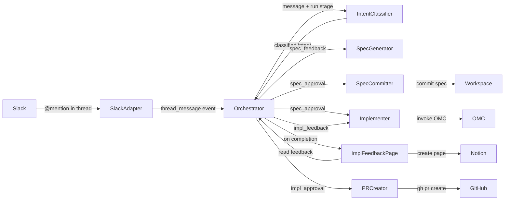
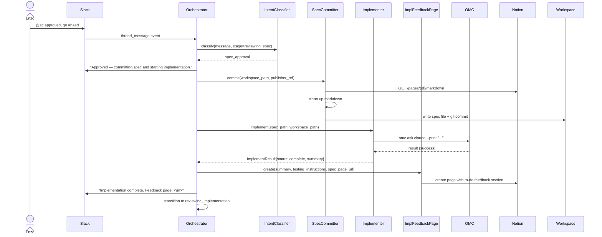
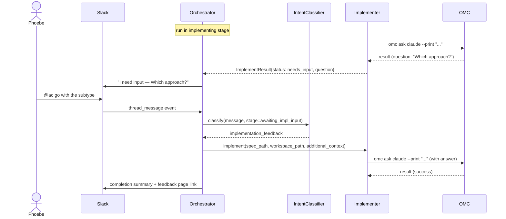
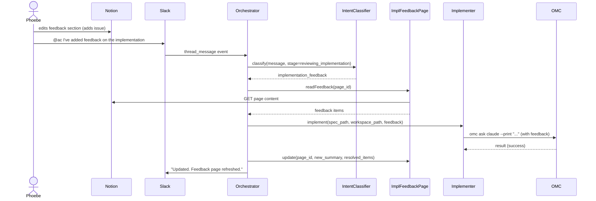
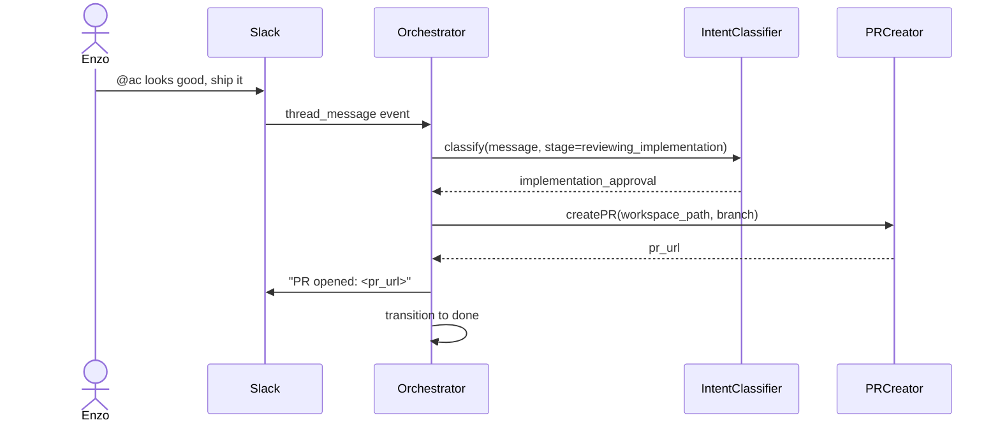

# Approval to implementation

## What

When a team member approves a spec by @mentioning the bot with an approval message in the Slack thread, Autocatalyst commits the spec to the repo and hands it to an agent that implements the feature in the existing workspace — the same shallow clone created during spec generation. When the agent finishes, Autocatalyst creates an implementation feedback page in Notion with a summary, testing instructions, and a feedback section, then posts a link to the Slack thread. The human tests the implementation and either adds feedback to the Notion page (triggering the agent to iterate) or confirms it's ready, at which point Autocatalyst opens a PR.

## Why

Human attention is the scarcest resource. After approving a spec, the human shouldn't have to think about implementation at all — no setting up a workspace, invoking an agent, feeding it context, or monitoring progress. Autocatalyst handles all of that. The human approves, waits for a notification that the implementation is ready, and tests the result. Everything between approval and testing is the system's job.

## Personas

- **Enzo: Engineer** — approves specs after technical review, tests the completed implementation, provides feedback if it doesn't work
- **Phoebe: Product manager** — approves specs after scope review, tests the completed feature against her expectations

## Narratives

### Enzo approves and ships a clean implementation

Enzo has been reviewing a spec for a CLI setup wizard in the `#autocatalyst-amp` thread. The spec looks right — scope is tight, the task list is clear. He replies in the thread: `@ac approved, go ahead and build it`. Autocatalyst recognizes the intent — this isn't spec feedback, it's an approval signal — and posts: "Approved — committing spec and starting implementation."

Twenty minutes later, Autocatalyst posts a link to an implementation feedback page in Notion: "Implementation complete. Feedback page: https://notion.so/abc123." Enzo opens the page and sees a summary of what was built, specific testing instructions (pull branch `spec/setup-wizard`, run `npm install`, then `npx autocatalyst --repo ~/git/amp-cli` and trigger the wizard with `amp setup`), and an empty feedback section. He follows the instructions, runs the wizard against a fresh environment, and it works. He replies in the thread: `@ac looks good, ship it`. Autocatalyst recognizes the intent as a confirmation, opens a PR from the implementation branch to main, and posts the link in the thread.

### The agent asks for help

Phoebe approved a spec for composable workflows. Implementation is underway when Autocatalyst posts in the thread: "I need input — the spec says steps can carry state between runs, but the existing `PipelineStep` interface doesn't have a state field. I can either add an optional `state` property to the existing interface (simpler, but changes the contract for all step types) or create a new `StatefulStep` subtype (more isolated, but adds a type hierarchy). Which approach do you prefer?"

Phoebe reads both options and replies: `@ac go with the subtype — I don't want to change the contract for steps that don't need state`. Autocatalyst classifies this as implementation feedback, incorporates the decision, and continues building. Ten minutes later it posts a link to the implementation feedback page with a summary and testing instructions.

### Phoebe finds a problem during testing

Phoebe opens the implementation feedback page for the composable workflows feature. She follows the testing instructions — pulls the branch, runs through the workflow creation flow. It mostly works, but she notices that adding a custom transformation step fails silently — the UI accepts it but the step doesn't appear in the pipeline. She adds a feedback item to the page's to-do list: "Custom transformation step isn't working — gets swallowed on add. Built-in steps work fine." Then she replies in the thread: `@ac I've added feedback on the implementation`.

Autocatalyst reads the feedback from the Notion page, classifies the message as implementation feedback, and picks it back up. A few minutes later the feedback page is updated: the item is checked off with a resolution comment — "✓ Fixed: the step type validator was rejecting custom types because they weren't in the built-in enum. Tests updated." The summary and testing instructions are refreshed. Phoebe tests again — the custom step works. She replies: `@ac confirmed, send the PR`. Autocatalyst opens the PR and posts the link.

## User stories

**Enzo approves and ships a clean implementation**

- Enzo can approve a spec by @mentioning the bot with an approval message in the thread
- Enzo can see a link to an implementation feedback page in Notion when the implementation finishes
- Enzo can read the summary, testing instructions, and feedback section on the feedback page
- Enzo can confirm the implementation works and trigger a PR by @mentioning the bot
- Enzo can see a link to the opened PR in the thread

**The agent asks for help**

- Phoebe can see the agent's question posted in the Slack thread when it needs human input
- Phoebe can reply with a decision and have the agent incorporate it and continue implementing
- Phoebe can see the implementation feedback page with summary and testing instructions when the agent finishes

**Phoebe finds a problem during testing**

- Phoebe can add feedback items to the implementation feedback page's to-do list
- Phoebe can @mention the bot to trigger the agent to read and address the feedback
- Phoebe can see addressed items marked as resolved with resolution comments on the feedback page
- Phoebe can iterate on testing feedback across multiple rounds until the implementation is right

## Goals

- Every @mention in an idea thread is classified by AI into one of four intents: spec feedback, approval, implementation feedback, or ship
- Implementation starts within 1 minute of an approval message being classified
- Spec generation uses mm:planning conventions; implementation delegated to OMC
- On completion, the orchestrator creates an implementation feedback page in Notion (summary, testing instructions, feedback to-do list) and posts a link to the Slack thread
- Mid-run progress updates deferred (markdstafford/autocatalyst#23); the agent can ask questions by exiting with a structured question that the orchestrator posts to Slack
- Implementation feedback is tracked on the Notion feedback page; @mentioning the bot triggers the agent to read and address feedback items
- Addressed feedback items are marked resolved with resolution comments on the page
- Ship confirmation opens a PR from the implementation branch to main
- Agent failure produces a clear error message in the thread — not a silent hang

## Non-goals

- Parallel implementation of multiple specs (one run at a time per idea)
- Automatic test execution or CI integration — the human tests manually for now
- Persisting implementation state across service restarts
- Multi-repo implementation from a single spec

## Tech spec

### 1. Introduction and overview

**Dependencies**
- Feature: Idea to spec to review — provides the `Orchestrator`, `SpecGenerator`, `WorkspaceManager`, and the `InboundEvent` stream
- Feature: Slack message routing — provides `SlackAdapter`, `Classifier`, `ThreadRegistry`, and the `approval_signal` event type (though this feature replaces emoji-based approval with AI-classified intent)
- Enhancement: Notion publisher — provides `SpecPublisher`, `FeedbackSource`, and the Notion-based spec publishing pipeline
- Decision: Agent runtime adapter — defines OMC via `claude` CLI subprocess as the implementation runtime
- Decision: Workspace isolation — each run has a dedicated shallow clone; this feature reuses the workspace created during spec generation

**Technical goals**
- AI intent classification determines the meaning of every @mention in an idea thread: spec feedback, approval, implementation feedback, or ship
- Intent classification completes within 1 minute of receiving the message
- Implementation invocation uses mm:planning for spec conventions; execution delegated to OMC
- Completion summary posted to Slack includes branch name, setup commands, and instructions for exercising the feature
- Agent questions (exit-and-re-invoke pattern) surface in the Slack thread; human response re-invokes the agent with additional context
- PR created from the implementation branch to main on ship confirmation

**Non-goals**
- Mid-run progress updates from the agent to Slack (deferred — OMC lacks mid-run notification hooks)
- Parallel implementation of multiple specs
- Persisting implementation state across service restarts
- Automatic CI or test execution

**Glossary**
- **Intent classification** — an AI-powered step that reads the human's @mention message and the run's current stage to determine what action the human wants: iterate on the spec, start implementation, iterate on the implementation, or send a PR
- **Exit-and-re-invoke** — pattern where the agent runs, hits something it can't resolve alone, and exits early with a structured question rather than guessing; the orchestrator posts the question to Slack, waits for a human response, and re-invokes the agent with the answer as additional context
- **Ship** — the human's signal that the implementation is ready to become a PR

### 2. System design and architecture

**Modified and new components**

*Modified*
- `src/adapters/slack/classifier.ts` — remove `classifyReaction` and emoji-based approval; all thread replies become `thread_message` events
- `src/core/orchestrator.ts` — add AI intent classification step before dispatching; add `_handleSpecApproval`, `_handleImplementationFeedback`, `_handleImplementationApproval` handlers; new run stages
- `src/types/runs.ts` — rename `review` to `reviewing_spec`; add `implementing`, `awaiting_impl_input`, `reviewing_implementation`, `done` to `RunStage`
- `src/types/events.ts` — rename `spec_feedback` to `thread_message` (`SpecFeedback` type → `ThreadMessage`); remove `ApprovalSignal` type
- `src/index.ts` — wire new components

*New*
- `src/adapters/agent/intent-classifier.ts` — calls the Anthropic API with the message content and current run stage; returns a classified intent. Initial intents: `spec_feedback`, `spec_approval`, `implementation_feedback`, `implementation_approval`. Extensible for future intents.
- `src/adapters/agent/implementer.ts` — invokes OMC with the approved spec in the workspace; parses the result for completion status or structured questions
- `src/adapters/agent/pr-creator.ts` — creates a PR from the implementation branch to main using `gh` CLI
- `src/adapters/notion/spec-committer.ts` — at spec approval: fetches spec markdown from Notion, cleans it up (strip comment spans, remove orphaned comments, prettify markdown, fix frontmatter), writes to the spec location in the workspace, and commits
- `src/adapters/notion/implementation-feedback-page.ts` — creates and manages the Notion page for implementation feedback; creates the page with summary, testing instructions, and a to-do list feedback section; reads feedback items from the page for the re-invoke cycle

**High-level flow**



**Sequence diagram — spec approval and implementation**



**Sequence diagram — exit-and-re-invoke**



**Sequence diagram — implementation feedback from Notion**



**Sequence diagram — implementation approval**



**Intent classification and extensibility**

The `IntentClassifier` interface takes a message and run stage, returns a classified intent. The initial intent set is `spec_feedback | spec_approval | implementation_feedback | implementation_approval`. New intents (e.g., codebase questions, status queries) can be added by extending the intent union type and adding a handler in the orchestrator — the classifier prompt and routing logic are the only things that change.

**Stage-intent validity matrix**

| Run stage | Valid intents |
|---|---|
| `reviewing_spec` | `spec_feedback`, `spec_approval` |
| `implementing` | (no inbound messages — agent is running) |
| `awaiting_impl_input` | `implementation_feedback` |
| `reviewing_implementation` | `implementation_feedback`, `implementation_approval` |

Invalid combinations are logged as warnings. The orchestrator posts a clarifying message to the thread (e.g., "The spec is still being implemented — I'll let you know when it's ready for testing.").

**Implementation feedback page structure**

The Notion page is organized as:
- **Link to spec** — reference back to the spec page at the top
- **Summary** — what was implemented, generated by the agent
- **Testing instructions** — branch name, setup commands, specific steps to exercise the feature
- **Feedback** — a to-do list where each item is a piece of feedback; items are marked complete as they're addressed; new items can be added by the human directly

Currently only direct edits to the feedback section are supported as an input channel. The architecture supports adding Slack @mention and Notion comment channels later (tracked as markdstafford/autocatalyst#24).

### 3. Detailed design

**Updated types**

```typescript
// src/types/runs.ts
export type RunStage =
  | 'intake'
  | 'speccing'
  | 'reviewing_spec'          // was 'review'
  | 'implementing'
  | 'awaiting_impl_input'
  | 'reviewing_implementation'
  | 'done'
  | 'failed';

export interface Run {
  // existing fields unchanged
  impl_feedback_ref: string | undefined;  // Notion page ID for implementation feedback
}
```

```typescript
// src/types/events.ts
export interface ThreadMessage {   // was SpecFeedback
  idea_id: string;
  content: string;
  author: string;
  received_at: string;
  thread_ts: string;
  channel_id: string;
}

export type InboundEvent =
  | { type: 'new_idea'; payload: Idea }
  | { type: 'thread_message'; payload: ThreadMessage };
// ApprovalSignal removed
```

**New interfaces**

```typescript
// src/adapters/agent/intent-classifier.ts
export type Intent =
  | 'spec_feedback'
  | 'spec_approval'
  | 'implementation_feedback'
  | 'implementation_approval';

export interface IntentClassifier {
  classify(message: string, run_stage: RunStage): Promise<Intent>;
}
```

```typescript
// src/adapters/agent/implementer.ts
export type ImplementationStatus = 'complete' | 'needs_input' | 'failed';

export interface ImplementationResult {
  status: ImplementationStatus;
  summary?: string;               // present when complete
  testing_instructions?: string;  // present when complete
  question?: string;              // present when needs_input
  error?: string;                 // present when failed
}

export interface Implementer {
  implement(
    spec_path: string,
    workspace_path: string,
    additional_context?: string,  // human's answer or feedback items
  ): Promise<ImplementationResult>;
}
```

```typescript
// src/adapters/agent/pr-creator.ts
export interface PRCreator {
  createPR(workspace_path: string, branch: string, spec_title: string): Promise<string>; // returns pr_url
}
```

```typescript
// src/adapters/notion/spec-committer.ts
export interface SpecCommitter {
  commit(
    workspace_path: string,
    publisher_ref: string,    // Notion page ID to fetch spec from
    spec_path: string,        // where to write in the workspace
  ): Promise<void>;
}
```

```typescript
// src/adapters/notion/implementation-feedback-page.ts
export interface FeedbackItem {
  id: string;
  text: string;           // the to-do item text
  resolved: boolean;
  conversation: string[]; // sub-bullets under the to-do item (human feedback + Claude responses)
}

export interface ImplementationFeedbackPage {
  create(
    parent_page_id: string,
    spec_page_url: string,
    summary: string,
    testing_instructions: string,
  ): Promise<string>;  // returns page_id

  readFeedback(page_id: string): Promise<FeedbackItem[]>;

  update(
    page_id: string,
    options: {
      summary?: string;
      resolved_items?: Array<{
        id: string;
        resolution_comment: string;  // Claude's explanation of how the item was addressed
      }>;
    },
  ): Promise<void>;
}
```

**IntentClassifier implementation**

`AnthropicIntentClassifier` calls the Anthropic Messages API directly (not via OMC — classification is a lightweight call that doesn't need agent orchestration). The prompt includes:
- The human's message
- The current run stage
- The valid intents for that stage (from the stage-intent validity matrix)
- A brief description of each intent

The response is parsed as a single intent string. If the model returns an invalid intent for the current stage, the classifier retries once. If it fails again, it defaults to the most conservative intent for that stage (`spec_feedback` for `reviewing_spec`, `implementation_feedback` for `reviewing_implementation` and `awaiting_impl_input`).

**SpecCommitter implementation**

`NotionSpecCommitter` performs these steps:
1. Fetch page markdown from Notion via `SpecPublisher.getPageMarkdown(publisher_ref)`
2. Strip inline comment spans via existing `stripCommentSpans()`
3. Remove the `## Orphaned comments` section if present
4. Prettify markdown: ensure blank lines after headers, consistent formatting
5. Fix frontmatter: set `status: approved`, ensure `created` date matches the Notion page creation date, set `last_updated` to today
6. Determine spec file location from mm config (`docs_root` from mm.toml, or default `context-human`) + `/specs/<filename>`
7. Write the cleaned spec to the workspace
8. `git add` + `git commit` with message `"docs: commit approved spec — <spec title>"`

**Implementer implementation**

`OMCImplementer` invokes OMC with `cwd` set to `workspace_path` using `omc team`:

```bash
omc team 1:claude "<implementation prompt>"
```

The implementation prompt follows the mm implementation handoff process:
- Includes the approved spec content (read from `spec_path`) which contains the task list
- Instructs the agent to use the task list in the spec as the implementation plan; execute tasks in dependency order
- As each task completes, the agent checks off the corresponding item in the spec's task list (`- [ ]` → `- [x]`), propagating up the hierarchy when all siblings are complete
- If `additional_context` is provided (human's answer to a question, or feedback items from the implementation feedback page), it's included as additional input
- On completion, the agent runs tests and produces a structured result

The result format from OMC uses delimited sections (same pattern as `SpecGenerator.revise()`):

```
STATUS: complete | needs_input | failed

SUMMARY:
<<<
What was implemented...
>>>

TESTING_INSTRUCTIONS:
<<<
Branch: spec/setup-wizard
Setup: npm install && npm run build
Test: npx autocatalyst --repo ~/git/amp-cli, then run amp setup
>>>

QUESTION:
<<<
(only present when STATUS is needs_input)
>>>

ERROR:
<<<
(only present when STATUS is failed)
>>>
```

**PRCreator implementation**

`GHPRCreator` runs in the workspace using conventional commit style for the PR title:

```bash
cd <workspace_path>
git push origin <branch>
gh pr create --title "feat: <spec_title_lowercased>" --body "<pr_body>"
```

The PR body includes a link to the spec and a summary of the implementation. Returns the PR URL from `gh pr create` output.

**Implementation feedback page — Notion structure**

The page is created under the same parent as the spec page:

```
[Link to spec: <spec_page_url>]

## Summary
<what was implemented, generated by the agent>

## Testing instructions
Branch: spec/setup-wizard
Setup: npm install && npm run build
Test: <specific steps to exercise the feature>

## Feedback
- [ ] <feedback item 1>
  - <human's detail or context>
  - <Claude's resolution comment>
- [x] <feedback item 2 — resolved>
  - <human's original note>
  - ✓ <Claude's explanation of how this was addressed>
```

Each feedback item is a Notion to-do list entry. Sub-bullets under each item form a conversation thread — the human adds context, Claude adds resolution comments when addressing the item. Resolved items are marked complete (checkbox checked or `[x]`).

**Orchestrator updates**

The orchestrator's `_runLoop` is updated to handle `thread_message` events (replacing `spec_feedback`). The dispatch logic becomes:

```
on thread_message:
  1. Look up run by idea_id; discard if not found
  2. Classify intent via IntentClassifier
  3. Route based on intent:
     - spec_feedback → existing _handleSpecFeedback (unchanged)
     - spec_approval → _handleSpecApproval (new)
     - implementation_feedback → _handleImplementationFeedback (new)
     - implementation_approval → _handleImplementationApproval (new)
```

`_handleSpecApproval`:
1. Transition to `implementing`
2. Post "Approved — committing spec and starting implementation." to Slack
3. Call `SpecCommitter.commit(workspace_path, publisher_ref, spec_path)`
4. Call `Implementer.implement(spec_path, workspace_path)`
5. If result is `complete`: create implementation feedback page, post completion message with page link, transition to `reviewing_implementation`
6. If result is `needs_input`: post question to Slack, transition to `awaiting_impl_input`
7. If result is `failed`: post error to Slack, transition to `failed`

`_handleImplementationFeedback`:
1. Read feedback from implementation feedback page (if `reviewing_implementation`) or use message content directly (if `awaiting_impl_input`)
2. Transition to `implementing`
3. Call `Implementer.implement(spec_path, workspace_path, feedback)`
4. Same result handling as spec approval (complete/needs_input/failed)
5. If complete: update the implementation feedback page — new summary, mark addressed items as resolved with Claude's resolution comments

`_handleImplementationApproval`:
1. Call `PRCreator.createPR(workspace_path, branch, spec_title)`
2. Post PR link to Slack
3. Transition to `done`

### 4. Security, privacy, and compliance

**Authentication and authorization**
- Anthropic API key for intent classification is read from `AC_ANTHROPIC_API_KEY` environment variable — same pattern as other secrets (`$VAR` resolution, never logged)
- OMC invocation for implementation reuses the existing agent runtime credentials (Anthropic API key, git credentials in the workspace)
- `gh` CLI for PR creation uses whatever git/GitHub credentials are configured on the host (SSH keys, credential helpers, `GITHUB_TOKEN`). No new credential is introduced.
- No per-user authorization — any Slack user in the configured channel can approve specs, provide feedback, and trigger PRs. Access control is at the Slack channel level.

**Data privacy**
- The human's message content is sent to the Anthropic API for intent classification. This mirrors existing behavior where message content is sent to OMC for spec generation.
- Implementation feedback items (from the Notion page) are sent to OMC as part of the implementation prompt. This is the same pattern as spec feedback being sent to OMC for revision.
- The spec content committed to the repo is a cleaned version of what was already visible on the Notion page — no new data exposure.
- The implementation feedback Notion page is never committed to the repo. It exists only in Notion under the configured parent page.

**Input validation**
- Intent classifier output is validated against the stage-intent validity matrix before routing. Invalid intents are retried once, then default to the conservative fallback.
- OMC implementation result is parsed via delimited-section extraction (same as `SpecGenerator.revise()`). Malformed output causes the run to transition to `failed` with a descriptive error.
- PR title and body are constructed from spec metadata, not raw user input. The spec title is sanitized (lowercased, special characters removed) before use in the conventional commit title.
- `gh pr create` runs in the workspace directory — the branch name comes from the workspace, not user input.

### 5. Observability

**Logging**

All new components use `createLogger()` from `src/core/logger.ts`. New stable event names:

| Event | Level | Component |
|---|---|---|
| `intent.classified` | info | intent-classifier |
| `intent.classification_failed` | warn | intent-classifier |
| `intent.invalid_for_stage` | warn | intent-classifier |
| `spec.committed` | info | spec-committer |
| `spec.commit_failed` | error | spec-committer |
| `implementation.started` | info | orchestrator |
| `implementation.complete` | info | orchestrator |
| `implementation.needs_input` | info | orchestrator |
| `implementation.failed` | error | orchestrator |
| `implementation.feedback_read` | debug | implementation-feedback-page |
| `implementation.feedback_updated` | info | implementation-feedback-page |
| `impl_feedback_page.created` | info | implementation-feedback-page |
| `pr.created` | info | pr-creator |
| `pr.creation_failed` | error | pr-creator |
| `omc.team_invoked` | debug | implementer |
| `omc.team_completed` | debug | implementer |
| `omc.team_failed` | error | implementer |

`intent.classified` includes `run_id`, `idea_id`, `run_stage`, `classified_intent`, and `message_length` (not content). `implementation.complete` includes `run_id`, `idea_id`, and `attempt`. Human message content and feedback item text are not logged at `info` level or above.

**Metrics**

- `intent.classification.count` (counter with `intent` label) — total classifications by intent type
- `intent.classification.fallback_count` (counter) — times the classifier fell back to the conservative default
- `implementation.duration_ms` (histogram) — time from `implementing` transition to result
- `implementation.attempts` (histogram) — number of implementation attempts per run (initial + re-invocations)
- `pr.created.count` (counter) — total PRs created

**Alerting**

- `intent.classification_failed` not followed by a successful fallback within the same event → operational alert (Anthropic API may be down)
- `implementation.failed` with `attempt > 2` → operational alert (repeated implementation failures on the same run)

### 6. Testing plan

All tests use Vitest. External calls (Anthropic API, OMC subprocess, `gh` CLI, Notion API) are mocked with `vi.fn()`. Filesystem operations use real temp directories created in `beforeEach` and cleaned up in `afterEach`. Log output is captured via the `destination` injection pattern from `src/core/logger.ts`.

---

**IntentClassifier**

_Prompt construction_
- `classify` sends a message to the Anthropic Messages API with the human's message content, the current run stage, and a list of valid intents for that stage
- The prompt for stage `reviewing_spec` includes only `spec_feedback` and `spec_approval` as valid intents
- The prompt for stage `reviewing_implementation` includes only `implementation_feedback` and `implementation_approval` as valid intents
- The prompt for stage `awaiting_impl_input` includes only `implementation_feedback` as a valid intent
- The human's message content appears verbatim in the prompt (not truncated, not summarized)

_Classification — reviewing_spec stage_
- Message "approved, go ahead and build it" with stage `reviewing_spec` → `spec_approval`
- Message "approved" (single word) with stage `reviewing_spec` → `spec_approval`
- Message "yes, this looks right, let's build it" with stage `reviewing_spec` → `spec_approval`
- Message "the wizard shouldn't require all settings before exiting" with stage `reviewing_spec` → `spec_feedback`
- Message "I think the scope is too broad here" with stage `reviewing_spec` → `spec_feedback`
- Message "can you change the section about error handling?" with stage `reviewing_spec` → `spec_feedback`

_Classification — reviewing_implementation stage_
- Message "looks good, ship it" with stage `reviewing_implementation` → `implementation_approval`
- Message "confirmed, send the PR" with stage `reviewing_implementation` → `implementation_approval`
- Message "LGTM, let's merge" with stage `reviewing_implementation` → `implementation_approval`
- Message "the custom step isn't working — it gets swallowed on add" with stage `reviewing_implementation` → `implementation_feedback`
- Message "I've added feedback on the implementation page" with stage `reviewing_implementation` → `implementation_feedback`
- Message "there's a bug when I run the setup wizard with no args" with stage `reviewing_implementation` → `implementation_feedback`

_Classification — awaiting_impl_input stage_
- Message "go with the subtype approach" with stage `awaiting_impl_input` → `implementation_feedback`
- Message "use option A" with stage `awaiting_impl_input` → `implementation_feedback`
- Message "I'm not sure, let me think about it — actually go with the simpler approach" with stage `awaiting_impl_input` → `implementation_feedback`

_Stage-intent validation_
- Model returns `spec_approval` for stage `reviewing_implementation` → classifier retries once with the same prompt
- Model returns `spec_approval` for stage `reviewing_implementation` on retry → falls back to `implementation_feedback`
- Model returns `implementation_approval` for stage `reviewing_spec` → retries once; falls back to `spec_feedback`
- Model returns `implementation_approval` for stage `awaiting_impl_input` → retries once; falls back to `implementation_feedback`
- Model returns an intent string not in the `Intent` union type → retries once; falls back to conservative default

_Response parsing_
- Model response is a single word matching an `Intent` value → parsed correctly
- Model response has leading/trailing whitespace → trimmed before parsing
- Model response includes explanation after the intent (e.g., "spec_approval — the user is approving") → the first token is extracted as the intent
- Model response is valid JSON wrapping the intent → parsed correctly
- Model response is empty → falls back to conservative default

_Error handling_
- Anthropic API returns HTTP 429 (rate limited) → retries once after a brief delay; on second failure, falls back to conservative default
- Anthropic API returns HTTP 500 → retries once; falls back to conservative default
- Anthropic API connection timeout → retries once; falls back to conservative default
- Anthropic API returns malformed JSON → falls back to conservative default
- Empty message string passed to `classify` → falls back to conservative default without calling the API

_Conservative fallback defaults_
- Stage `reviewing_spec` → `spec_feedback`
- Stage `reviewing_implementation` → `implementation_feedback`
- Stage `awaiting_impl_input` → `implementation_feedback`

_Logging_
- `intent.classified` emitted on successful classification with `run_stage`, `classified_intent`, and `message_length` (not message content)
- `intent.classification_failed` emitted when API call fails, with `error` and `run_stage`
- `intent.invalid_for_stage` emitted when model returns an intent not valid for the current stage, with `returned_intent`, `run_stage`, and `valid_intents`
- Human message content is never included in any log event at any level

---

**SpecCommitter**

_Markdown fetching_
- `commit` calls `getPageMarkdown(publisher_ref)` to fetch the Notion page content
- The `publisher_ref` argument is passed through exactly as the Notion page ID

_Comment span stripping_
- `<span discussion-urls="...">text</span>` wrapper tags are removed; inner text preserved (delegates to existing `stripCommentSpans`)
- Multiple spans in the same line are all stripped
- Content with no spans passes through unchanged

_Orphaned comments removal_
- `## Orphaned comments` section (and all content below it, up to the next `##` heading or end of file) is removed
- File with no `## Orphaned comments` section passes through unchanged
- `## Orphaned comments` at the end of the file: section removed, no trailing blank lines left

_Markdown prettification_
- `# Heading` not followed by a blank line → blank line inserted after the heading
- `## Heading` not followed by a blank line → blank line inserted
- `### Heading` not followed by a blank line → blank line inserted
- Heading already followed by a blank line → no double blank line inserted
- Multiple consecutive blank lines → collapsed to a single blank line
- Trailing whitespace on lines is preserved (not trimmed — Notion may use trailing spaces in certain contexts)

_Frontmatter normalization_
- `status` field set to `approved` regardless of its previous value
- `last_updated` field set to today's date in `YYYY-MM-DD` format
- `created` field preserved from existing frontmatter (not overwritten)
- Frontmatter retains all other fields (`specced_by`, `issue`, `superseded_by`, etc.) unchanged
- Frontmatter is enclosed in `---` delimiters on the first and last lines

_File writing and git operations_
- Spec file written to `<workspace_path>/<docs_root>/specs/<filename>` where `docs_root` is resolved from mm.toml if present, otherwise defaults to `context-human`
- `git add <spec_file_path>` executed in the workspace after writing
- `git commit -m "docs: commit approved spec — <spec title>"` executed after staging
- The commit message uses the spec's `# Title` heading as `<spec title>`
- No other files are staged or committed — only the spec file

_Error handling_
- `getPageMarkdown` rejects → throws; no file written to disk; no git commands executed
- Fetched markdown is empty → throws with descriptive error ("Notion page has no content")
- Markdown has no YAML frontmatter (no `---` delimiters) → throws with descriptive error
- `git add` fails (e.g., workspace path invalid) → throws; spec file exists on disk but is not committed
- `git commit` fails → throws
- `docs_root` from mm.toml points to a directory that doesn't exist in the workspace → directory is created before writing

_Logging_
- `spec.committed` emitted on success with `publisher_ref`, `spec_path`, and `workspace_path`
- `spec.commit_failed` emitted on any failure with `error`, `publisher_ref`, and the step that failed

---

**Implementer**

_OMC invocation — initial implementation_
- `omc team 1:claude` spawned as a child process with `cwd` set to `workspace_path`
- The prompt includes the full spec content read from `spec_path`
- The prompt includes mm implementation handoff instructions: use the task list in the spec as the implementation plan, execute tasks in dependency order, check off task list items as they complete
- The prompt instructs the agent to produce a structured result with delimited STATUS, SUMMARY, TESTING_INSTRUCTIONS, QUESTION, and ERROR sections
- `workspace_path` is validated as a non-empty string before invocation
- `spec_path` is validated as an existing file before invocation
- When `additional_context` is not provided, the prompt does not contain an additional context section

_OMC invocation — re-invocation with context_
- When `additional_context` is provided, it appears in the prompt in a clearly delimited section (e.g., `Additional context from the human:\n<<<\n{content}\n>>>`)
- The prompt still includes the full spec content and mm handoff instructions
- The agent is instructed to continue from where the previous invocation left off, using the existing workspace state

_OMC invocation — re-invocation with feedback items_
- When `additional_context` contains serialized feedback items (from the implementation feedback page), each item's text and conversation history is included
- Resolved items are excluded from the context — only unresolved items are passed

_Result parsing — complete_
- OMC artifact contains `STATUS: complete` followed by `SUMMARY:` and `TESTING_INSTRUCTIONS:` delimited sections → `ImplementationResult` with `status: 'complete'`, `summary` and `testing_instructions` populated
- `SUMMARY` section may contain multiple paragraphs — all content between `<<<` and `>>>` delimiters is captured
- `TESTING_INSTRUCTIONS` section may contain multiple lines with specific commands — all captured verbatim
- `QUESTION` and `ERROR` sections are absent or empty when STATUS is `complete` — `question` and `error` are `undefined` on the result

_Result parsing — needs_input_
- OMC artifact contains `STATUS: needs_input` followed by `QUESTION:` delimited section → `ImplementationResult` with `status: 'needs_input'`, `question` populated
- `SUMMARY` and `TESTING_INSTRUCTIONS` are absent or empty — `summary` and `testing_instructions` are `undefined`

_Result parsing — failed_
- OMC artifact contains `STATUS: failed` followed by `ERROR:` delimited section → `ImplementationResult` with `status: 'failed'`, `error` populated

_Result parsing — error cases_
- Missing STATUS line in the OMC output → throws with descriptive error; workspace state is preserved
- STATUS value is not one of `complete`, `needs_input`, `failed` → throws with descriptive error
- STATUS is `complete` but SUMMARY section is missing → throws with descriptive error
- STATUS is `complete` but TESTING_INSTRUCTIONS section is missing → throws with descriptive error
- STATUS is `needs_input` but QUESTION section is missing → throws with descriptive error
- STATUS is `failed` but ERROR section is missing → throws with descriptive error
- SUMMARY section is present but empty (only whitespace between delimiters) → throws
- OMC exits with non-zero exit code → throws with descriptive error including exit code and stderr; workspace state is preserved
- OMC output contains no `## Raw output` section → throws with descriptive error

_Logging_
- `omc.team_invoked` emitted at debug level before subprocess spawn with `workspace_path` and `has_additional_context: boolean`
- `omc.team_completed` emitted at debug level after successful parse with `status` from the result
- `omc.team_failed` emitted at error level when OMC exits non-zero, with `exit_code` and truncated `stderr`
- Prompt content and OMC output content are never logged at `info` level or above

---

**PRCreator**

_Subprocess invocation_
- `git push origin <branch>` executed with `cwd` set to `workspace_path`
- `gh pr create` executed after successful push with `cwd` set to `workspace_path`
- `gh pr create` uses `--title "feat: <spec_title_lowercased>"` (conventional commit format)
- `gh pr create` uses `--body` containing: a link to the spec file in the repo, a summary of the implementation, and a note that it was generated by Autocatalyst
- The branch name is derived from the workspace's current git branch (not constructed from input)
- The spec title is extracted from the `# Title` heading in the spec file and lowercased

_Title sanitization_
- Spec title "CLI Setup Wizard" → PR title `feat: cli setup wizard`
- Spec title "Add CSV export (v2)" → PR title `feat: add csv export (v2)`
- Spec title with leading/trailing whitespace → whitespace trimmed before lowercasing

_Return value_
- Returns the PR URL printed to stdout by `gh pr create`
- PR URL is trimmed of whitespace before returning

_Error handling_
- `git push` exits non-zero → throws with descriptive error including stderr; `gh pr create` is not called
- `gh pr create` exits non-zero → throws with descriptive error including stderr
- `gh` CLI not found on PATH → throws with descriptive error ("gh CLI is not installed")
- `gh auth status` indicates no active authentication → throws with descriptive error ("gh CLI is not authenticated")
- Branch has no commits ahead of main → `git push` succeeds but `gh pr create` may fail; error surfaced

_Logging_
- `pr.created` emitted on success with `pr_url`, `branch`, and `spec_title`
- `pr.creation_failed` emitted on failure with `error` and the step that failed (`push` or `pr_create`)

---

**ImplementationFeedbackPage**

_`create` — page structure_
- Calls Notion API to create a page under `parent_page_id`
- Page title is derived from the spec title (e.g., "Implementation: CLI Setup Wizard")
- First content on the page is a link to the spec page: the `spec_page_url` rendered as a Notion bookmark or linked text
- `## Summary` section follows the spec link, containing the `summary` text
- `## Testing instructions` section follows, containing the `testing_instructions` text verbatim (preserving line breaks for command-line instructions)
- `## Feedback` section follows, containing an empty to-do list (no items initially)
- Returns the `page_id` from the Notion create response

_`create` — error handling_
- Notion API rejects on page creation → throws; no page created
- `parent_page_id` is invalid → throws with the Notion API error
- `summary` is empty string → page created with empty Summary section (not an error)

_`readFeedback` — parsing to-do items_
- Page with no to-do items in the Feedback section → returns empty array
- Page with one unchecked to-do item and no sub-bullets → returns `[{ id, text: "item text", resolved: false, conversation: [] }]`
- Page with one checked to-do item and no sub-bullets → returns `[{ id, text: "item text", resolved: true, conversation: [] }]`
- Page with one to-do item and two sub-bullets → returns `[{ id, text, resolved, conversation: ["sub-bullet 1", "sub-bullet 2"] }]`
- Page with three to-do items (1 resolved, 2 unresolved) → returns all three in document order with correct `resolved` states
- Sub-bullets are captured as plain text strings in the order they appear under the to-do item
- To-do items outside the `## Feedback` section are ignored
- Content between `## Feedback` heading and the first to-do item (e.g., introductory text) is ignored

_`readFeedback` — error handling_
- Notion API rejects → throws
- Page has a `## Feedback` heading but no to-do blocks at all → returns empty array

_`update` — summary replacement_
- When `options.summary` is provided, the content under `## Summary` is replaced with the new summary text
- When `options.summary` is not provided, the Summary section is left unchanged
- Summary replacement preserves the `## Summary` heading itself

_`update` — resolving items_
- For each entry in `options.resolved_items`: the to-do item matching `id` is checked (marked resolved)
- For each entry in `options.resolved_items`: a new sub-bullet is appended under the to-do item with `resolution_comment` prefixed by `✓` (e.g., `✓ Fixed: the step type validator now accepts custom types`)
- Items not listed in `resolved_items` are left unchanged — their checked state and sub-bullets are preserved
- `resolved_items` is empty array → no items modified; no sub-bullets added
- `resolved_items` contains an ID that doesn't match any to-do item → logged as warning; other items still processed
- Multiple items resolved in a single `update` call → all processed; each gets its own resolution comment

_`update` — error handling_
- Notion API rejects during summary update → throws; resolution comments may not be written
- Notion API rejects during item resolution → throws; partially resolved state is possible (some items checked, others not)

_Logging_
- `impl_feedback_page.created` emitted on successful creation with `page_id` and `parent_page_id`
- `implementation.feedback_read` emitted at debug level with `page_id`, `total_items`, `unresolved_items`
- `implementation.feedback_updated` emitted with `page_id`, `summary_updated: boolean`, `items_resolved: number`

---

**Orchestrator — intent classification routing**

_Classification integration_
- Every `thread_message` event for a known `idea_id` triggers a call to `IntentClassifier.classify` with the message content and the run's current stage
- The classifier is called before any handler is invoked — no handler is called if classification fails and the fallback is used
- The run's `idea_id` is used to look up the run; the run's `stage` is passed to the classifier

_Routing_
- Classified intent `spec_feedback` → `_handleSpecFeedback` called with the original `ThreadMessage` payload
- Classified intent `spec_approval` → `_handleSpecApproval` called
- Classified intent `implementation_feedback` → `_handleImplementationFeedback` called
- Classified intent `implementation_approval` → `_handleImplementationApproval` called

---

**Orchestrator — spec approval path**

_Happy path — implementation completes_
- `thread_message` for run in `reviewing_spec` classified as `spec_approval`
- Run transitions to `implementing` before any component is called
- "Approved — committing spec and starting implementation." posted to Slack via `postMessage` with correct `channel_id` and `thread_ts`
- `SpecCommitter.commit` called with `workspace_path`, `publisher_ref`, and `spec_path` from the run
- `Implementer.implement` called after `commit` resolves (not before) with `spec_path` and `workspace_path`
- `Implementer.implement` returns `{ status: 'complete', summary, testing_instructions }`
- `ImplementationFeedbackPage.create` called with `parent_page_id`, spec page URL derived from `publisher_ref`, `summary`, and `testing_instructions`
- `impl_feedback_ref` stored on the run after page creation
- Completion message posted to Slack containing the feedback page URL
- Run transitions to `reviewing_implementation`
- `implementation.started` log event emitted when transitioning to `implementing`
- `implementation.complete` log event emitted when result is `complete`

_Happy path — implementation needs input_
- `Implementer.implement` returns `{ status: 'needs_input', question: "Which approach?" }`
- Question posted to Slack: "I need input — Which approach?"
- Run transitions to `awaiting_impl_input`
- `ImplementationFeedbackPage.create` is NOT called (implementation not yet complete)
- `implementation.needs_input` log event emitted with `question` (truncated if long)

_Exit-and-re-invoke cycle_
- After transitioning to `awaiting_impl_input`, a subsequent `thread_message` is classified as `implementation_feedback`
- The message content is passed as `additional_context` to `Implementer.implement`
- Run transitions from `awaiting_impl_input` to `implementing`
- If result is `complete`: feedback page created, completion message posted, run transitions to `reviewing_implementation`
- If result is `needs_input` again: another question posted, run stays in `awaiting_impl_input`
- Multiple exit-and-re-invoke cycles are supported — `attempt` incremented on each re-invocation

_Call order verification_
- The complete call order for a successful approval is: `postMessage` (approval ack) → `SpecCommitter.commit` → `Implementer.implement` → `ImplementationFeedbackPage.create` → `postMessage` (completion)
- No component is called out of this order
- If any step fails, subsequent steps are not called (except where noted in failure paths)

_Failure paths_
- `SpecCommitter.commit` rejects → run transitions to `failed`; error posted to Slack; `Implementer.implement` not called
- `Implementer.implement` returns `{ status: 'failed', error: "..." }` → error message posted to Slack; run transitions to `failed`; `ImplementationFeedbackPage.create` not called
- `Implementer.implement` throws (OMC crash) → run transitions to `failed`; error posted to Slack
- `ImplementationFeedbackPage.create` rejects → error logged (not posted to Slack); completion message posted WITHOUT feedback page link; run still transitions to `reviewing_implementation` (degraded but functional)
- `postMessage` for approval acknowledgement rejects → logged as error; execution continues (SpecCommitter still called)
- `postMessage` for completion summary rejects → logged as error; run still transitions to `reviewing_implementation`

---

**Orchestrator — implementation feedback path**

_Happy path — from reviewing_implementation_
- `thread_message` for run in `reviewing_implementation` classified as `implementation_feedback`
- `ImplementationFeedbackPage.readFeedback` called with `impl_feedback_ref` from the run
- Feedback items serialized and passed as `additional_context` to `Implementer.implement`
- Run transitions to `implementing` before `Implementer.implement` is called
- `Implementer.implement` returns `{ status: 'complete', summary, testing_instructions }`
- `ImplementationFeedbackPage.update` called with new summary and resolved items (with resolution comments)
- Completion message posted to Slack
- Run transitions to `reviewing_implementation`

_Happy path — from awaiting_impl_input_
- `thread_message` for run in `awaiting_impl_input` classified as `implementation_feedback`
- `ImplementationFeedbackPage.readFeedback` is NOT called (run was awaiting direct input, not page feedback)
- The Slack message content is passed directly as `additional_context`
- Run transitions to `implementing`
- Same result handling as above

_Multiple feedback rounds_
- First feedback round: 3 unresolved items read from page → passed to implementer → 2 resolved, 1 still open → page updated with 2 resolution comments
- Second feedback round: 1 remaining unresolved item + 1 new item → passed to implementer → both resolved → page updated
- `attempt` incremented on each feedback round

_Failure paths_
- `ImplementationFeedbackPage.readFeedback` rejects → run transitions to `failed`; error posted to Slack; `Implementer.implement` not called
- `Implementer.implement` returns `{ status: 'failed' }` → error posted to Slack; run transitions to `failed`; page not updated
- `Implementer.implement` returns `{ status: 'needs_input' }` → question posted to Slack; run transitions to `awaiting_impl_input`; page not updated
- `ImplementationFeedbackPage.update` rejects → error logged; run still transitions to `reviewing_implementation` (degraded — page not refreshed but implementation is done)

---

**Orchestrator — implementation approval path**

_Happy path_
- `thread_message` for run in `reviewing_implementation` classified as `implementation_approval`
- `PRCreator.createPR` called with `workspace_path`, `branch`, and spec title from the run
- PR URL posted to Slack: "PR opened: <pr_url>"
- Run transitions to `done`

_Failure paths_
- `PRCreator.createPR` rejects → error posted to Slack; run transitions to `failed`
- `postMessage` for PR link rejects → logged as error; run still transitions to `done` (PR was created successfully)

---

**Orchestrator — intent routing guards**

- `thread_message` for an `idea_id` not in the run registry → silently discarded; no classifier called; no components called; no Slack messages posted
- `thread_message` for run in `intake` → silently discarded
- `thread_message` for run in `speccing` → silently discarded (spec generation in progress)
- `thread_message` for run in `implementing` → "Implementation is in progress — I'll let you know when it's ready." posted to Slack; no classifier called; no components called
- `thread_message` for run in `done` → silently discarded
- `thread_message` for run in `failed` → silently discarded

---

**Orchestrator — existing spec_feedback path (regression)**

_All existing orchestrator tests for spec_feedback continue to pass_
- The rename from `spec_feedback` to `thread_message` event type is reflected in test fixtures
- The intent classification step is added: mock classifier returns `spec_feedback` for all existing test cases
- `_handleSpecFeedback` behavior is unchanged — same call order, same failure handling, same guard conditions
- Existing Notion feedback enrichment (fetch, revise, reply) still works identically

---

**Orchestrator — type and event renames**

- All `InboundEvent` references updated from `spec_feedback` to `thread_message`
- All `SpecFeedback` type references updated to `ThreadMessage`
- `Run.publisher_ref` preserved (no rename in this feature)
- `RunStage` `review` renamed to `reviewing_spec` throughout all test fixtures and assertions
- `ApprovalSignal` type removed from `events.ts`; no test references to it remain

---

**Classifier updates (slack/classifier.ts)**

- `classifyReaction` function removed; no test references to it remain
- `classifyMessage` behavior for `new_idea` and thread replies unchanged
- Thread replies that were previously classified as `spec_feedback` are now classified as `thread_message` (event type rename only — same routing logic)
- Messages from the bot's own user ID still return `ignore`
- Reaction event handler removed from `SlackAdapter`

---

**Concurrency**

- Two simultaneous `thread_message` events for different ideas: each triggers independent intent classification and handler invocation with no cross-contamination
- `thread_message` for idea A while idea B is in `implementing`: idea A is classified and routed normally; idea B guard fires independently
- `thread_message` arriving during `implementing` for the same idea: guard fires; message posted; no re-invocation

---

**Logging (cross-cutting)**

- `run.stage_transition` emitted on every transition including new stages (`implementing`, `awaiting_impl_input`, `reviewing_implementation`, `done`)
- `run.stage_transition` includes correct `from_stage` and `to_stage` for all new transitions
- `run.failed` emitted at error level on every failure path
- Human message content is never included in any log event at any level across all components
- Feedback item text from the Notion page is not logged at `info` level or above

---

**Service and entry point wiring**

- `src/index.ts` creates `AnthropicIntentClassifier` with the `AC_ANTHROPIC_API_KEY` env var
- `src/index.ts` creates `OMCImplementer`
- `src/index.ts` creates `GHPRCreator`
- `src/index.ts` creates `NotionSpecCommitter` with the existing `NotionClient` and `SpecPublisher`
- `src/index.ts` creates `NotionImplementationFeedbackPage` with the existing `NotionClient`
- All new components are passed to `OrchestratorImpl` via the updated `OrchestratorDeps`
- Missing `AC_ANTHROPIC_API_KEY` when intent classification is needed → startup exits with code 1 and descriptive error
- `gh auth status` check at startup → warning logged if not authenticated (not a fatal error — only needed for PR creation)

---

**Manual acceptance testing**

_Full approval-to-PR cycle_
- Seed an idea; wait for spec to be generated and posted to Notion; reply with `@ac approved, go ahead`; confirm: (1) spec committed to workspace repo with cleaned markdown and correct frontmatter, (2) implementation starts, (3) completion summary and implementation feedback page link posted in thread, (4) feedback page has spec link at top, summary, testing instructions, and empty feedback section

_Implementation feedback cycle_
- Add a feedback item to the implementation feedback page's to-do list; reply with `@ac I've added feedback on the implementation`; confirm: (1) feedback items read from page, (2) agent re-invokes, (3) addressed items marked resolved with resolution comments as sub-bullets, (4) summary updated on the page

_Implementation approval and PR_
- Reply with `@ac looks good, ship it` during `reviewing_implementation`; confirm: (1) classified as `implementation_approval`, (2) PR created with conventional commit title, (3) PR link posted in thread, (4) run transitions to `done`

_Exit-and-re-invoke for agent questions_
- Trigger an implementation where the agent needs input (e.g., spec has an ambiguous decision); confirm: (1) question posted to Slack, (2) reply with the answer, (3) agent re-invokes and continues, (4) eventual completion with feedback page

_Intent classification at wrong stage_
- Reply with `@ac approved` during `reviewing_implementation`; confirm: classified as `implementation_feedback` (not `spec_approval`), handled gracefully
- Reply with `@ac ship it` during `reviewing_spec`; confirm: classified as `spec_feedback`, handled gracefully

_Error handling_
- Trigger deliberate OMC failure during implementation; confirm: error message appears in thread, run transitions to `failed`
- Remove `gh` authentication and attempt `@ac ship it`; confirm: error message about gh auth posted in thread

_Spec commit quality_
- Inspect the committed spec file in the workspace: (1) no `<span discussion-urls>` tags, (2) no `## Orphaned comments` section, (3) blank lines after all headers, (4) frontmatter has `status: approved` and correct `last_updated` date

### 7. Alternatives considered

**Emoji-based approval (original design)**

The stub spec and the existing `ApprovalSignal` type used emoji reactions (`:thumbsup:`) on the spec message to signal approval. This was replaced with AI intent classification for two reasons: (1) emoji reactions are ambiguous — a thumbsup might mean "I agree with this comment" not "approve the spec"; (2) the classification approach naturally extends to other intents (implementation feedback, ship) and future intents (codebase questions, status queries) without adding new Slack event types.

**Single Notion page for both spec and implementation feedback**

Using the same Notion page for spec review and implementation feedback would reduce page sprawl. It was rejected because the two have different lifecycles — the spec page is finalized at approval and its content is committed to the repo, while the implementation feedback page is transient and never committed. Mixing them would create confusion about which comments are spec feedback and which are implementation feedback.

**Streaming OMC output for progress updates**

Rather than the one-shot invoke-and-wait pattern, Autocatalyst could stream OMC's stdout and parse progress events in real time. This was deferred (markdstafford/autocatalyst#23) because OMC lacks mid-run notification hooks — implementing streaming would require building a custom wrapper or MCP tool. The exit-and-re-invoke pattern handles the most important case (agent needs human input) without streaming infrastructure.

**Direct Anthropic SDK call for implementation instead of OMC**

Calling the Anthropic API directly would eliminate the OMC dependency for implementation. OMC was chosen because it provides multi-agent orchestration via `omc team`, task verification via ralph, and a consistent invocation pattern. Bypassing it would require reimplementing orchestration and diverge from the agent-first architecture (ADR-001).

**Slack-only feedback (no Notion implementation page)**

Implementation feedback could stay entirely in the Slack thread — the human describes issues and the agent picks them up from the thread. This was rejected because: (1) Slack threads become hard to follow across multiple feedback rounds; (2) there's no structured way to track which items are resolved; (3) the Notion to-do list pattern provides a clear feedback-and-resolution workflow that mirrors what already works for spec review.

### 8. Risks

**Intent classification accuracy**

The AI classifier may misclassify messages — especially ambiguous ones like "this looks right" (approval or feedback?). Mitigation: the stage-intent validity matrix constrains the classifier to valid intents for the current stage, reducing the blast radius of misclassification. The conservative fallback (default to feedback rather than approval) ensures the system never takes an irreversible action on a misclassified message. Humans can always re-state their intent.

**OMC implementation reliability**

The implementation agent is a complex, long-running process that may fail partway through. Mitigation: the workspace persists across failures, so the human can inspect the partial implementation. The exit-and-re-invoke pattern allows the agent to resume from where it left off with additional context. Repeated failures (attempt > 2) trigger an operational alert.

**Notion to-do list API limitations**

The feedback page relies on Notion's to-do list blocks and sub-bullets for the conversation thread pattern. If the Notion API doesn't support fine-grained manipulation of to-do items and their children (reading resolved state, adding sub-bullets, checking checkboxes), the implementation will need to fall back to simpler block structures. Mitigation: verify Notion API support for to-do blocks during implementation; if unsupported, use a text-based `[x]`/`[ ]` convention in regular paragraphs.

**Spec markdown cleanup fidelity**

The `SpecCommitter` transforms Notion markdown into repo-ready markdown. Edge cases in Notion's markdown export (unusual span attributes, nested formatting, unconventional frontmatter) could produce unexpected results. Mitigation: the cleanup pipeline uses the existing, tested `stripCommentSpans` function and adds well-defined transformations (orphaned comments removal, header spacing, frontmatter normalization). Each step is independently testable.

**`gh` CLI availability and authentication**

The `PRCreator` depends on `gh` being installed and authenticated. If the host doesn't have `gh` or the token has expired, PR creation fails. Mitigation: the orchestrator posts the error to Slack (human can create the PR manually); a startup check could verify `gh auth status` and warn if not configured.

**Long-running implementation blocks the event loop**

`Implementer.implement` is a synchronous await in the orchestrator's event loop. While an implementation is running (potentially 20+ minutes), the orchestrator cannot process other events for the same idea. Mitigation: messages arriving during `implementing` are handled by the guard (posted message to Slack). Events for other ideas are unaffected (the event loop processes one event at a time, but different ideas have independent runs). True concurrency (multiple simultaneous implementations) is a non-goal for this feature.

## Task list

- [x] **Story: Type and event renames**
  - [x] **Task: Rename `SpecFeedback` → `ThreadMessage` and `spec_feedback` → `thread_message`**
    - **Description**: Mechanical rename across all files. In `src/types/events.ts`, rename the `SpecFeedback` interface to `ThreadMessage`. In the `InboundEvent` union, change the `spec_feedback` variant to `thread_message` with payload `ThreadMessage`. Remove the `ApprovalSignal` interface and its `approval_signal` variant from the union. Update all imports and references in `src/core/orchestrator.ts`, `src/adapters/slack/slack-adapter.ts`, `src/adapters/slack/classifier.ts`, and all test files that reference these names. No behavior changes — all existing tests must still pass after this task.
    - **Acceptance criteria**:
      - [x] `ThreadMessage` is the exported interface name in `events.ts`; `SpecFeedback` does not appear anywhere in the codebase
      - [x] `InboundEvent` union uses `thread_message` type; `spec_feedback` does not appear as an event type anywhere in the codebase
      - [x] `ApprovalSignal` removed from `events.ts`; `approval_signal` does not appear anywhere in the codebase
      - [x] All existing tests pass: `npx vitest run`
    - **Dependencies**: None

  - [x] **Task: Rename `review` → `reviewing_spec` in RunStage and add new stages**
    - **Description**: In `src/types/runs.ts`, rename the `review` value in `RunStage` to `reviewing_spec`. Add `implementing`, `awaiting_impl_input`, `reviewing_implementation`, and `done` to the `RunStage` union. Add `impl_feedback_ref: string | undefined` to the `Run` interface. Update all references to `review` in `src/core/orchestrator.ts` and all test files. No behavior changes — all existing tests must still pass.
    - **Acceptance criteria**:
      - [x] `RunStage` includes `reviewing_spec`, `implementing`, `awaiting_impl_input`, `reviewing_implementation`, `done`
      - [x] `review` does not appear as a `RunStage` value anywhere in the codebase
      - [x] `Run` interface includes `impl_feedback_ref: string | undefined`
      - [x] All existing tests pass: `npx vitest run`
    - **Dependencies**: None

  - [x] **Task: Remove `classifyReaction` and reaction handling from classifier and adapter**
    - **Description**: Remove the `classifyReaction` function from `src/adapters/slack/classifier.ts`. Remove the `reaction_added` event handler from `src/adapters/slack/slack-adapter.ts`. Remove `approval_emojis` from the `SlackAdapter` constructor options (and from `validateConfig` if it validates this field). Remove all tests for `classifyReaction` in `tests/adapters/slack/classifier.test.ts` and reaction-related tests in `tests/adapters/slack/slack-adapter.test.ts`. Remove `approval_emojis` from `WorkflowConfig` in `src/types/config.ts` and related validation. No behavior changes to message classification — all remaining tests must pass.
    - **Acceptance criteria**:
      - [x] `classifyReaction` does not exist in the codebase
      - [x] No `reaction_added` event handler registered in `SlackAdapter`
      - [x] `approval_emojis` removed from config types, validation, and adapter options
      - [x] All remaining tests pass: `npx vitest run`
    - **Dependencies**: "Task: Rename `SpecFeedback` → `ThreadMessage`"

- [x] **Story: IntentClassifier**
  - [x] **Task: Define `Intent` type and `IntentClassifier` interface**
    - **Description**: Create `src/adapters/agent/intent-classifier.ts`. Export the `Intent` union type (`spec_feedback | spec_approval | implementation_feedback | implementation_approval`) and the `IntentClassifier` interface with a single `classify(message: string, run_stage: RunStage): Promise<Intent>` method. No implementation yet — just the types and interface.
    - **Acceptance criteria**:
      - [x] `Intent` and `IntentClassifier` exported from `intent-classifier.ts`
      - [x] `RunStage` imported correctly
      - [x] File compiles without errors: `npx tsc --noEmit`
    - **Dependencies**: "Task: Rename `review` → `reviewing_spec`"

  - [x] **Task: Unit tests for `AnthropicIntentClassifier`**
    - **Description**: Create `tests/adapters/agent/intent-classifier.test.ts`. Mock the Anthropic Messages API call with `vi.fn()`. Cover all test cases from the testing plan: classification accuracy per stage, stage-intent validation (retry + fallback), response parsing edge cases (whitespace, extra text, JSON wrapping, empty), error handling (429, 500, timeout, malformed, empty message), conservative fallback defaults, and all logging assertions.
    - **Acceptance criteria**:
      - [x] All classification accuracy tests per stage from the testing plan
      - [x] Stage-intent validation: retry on invalid intent, fall back to conservative default
      - [x] Response parsing: trimming, first-token extraction, JSON unwrapping, empty handling
      - [x] API errors: 429, 500, timeout, malformed JSON — all fall back correctly
      - [x] Empty message → fallback without API call
      - [x] Conservative defaults verified per stage
      - [x] Logging: `intent.classified`, `intent.classification_failed`, `intent.invalid_for_stage` emitted with correct fields
      - [x] Human message content never appears in log output
      - [x] All tests pass: `npx vitest run`
    - **Dependencies**: "Task: Define `Intent` type and `IntentClassifier` interface"

  - [x] **Task: Implement `AnthropicIntentClassifier`**
    - **Description**: Add `AnthropicIntentClassifier` class to `src/adapters/agent/intent-classifier.ts`. Constructor takes an Anthropic API key. `classify()` builds a prompt with the message content, current run stage, and valid intents for that stage (from the stage-intent validity matrix). Calls the Anthropic Messages API. Parses the response as a single intent string (trimmed, first token extracted). If the intent is invalid for the stage, retries once. On second failure or any API error, falls back to the conservative default for the stage. Uses `createLogger('intent-classifier')`.
    - **Acceptance criteria**:
      - [x] Prompt includes message content, run stage, and valid intents for that stage
      - [x] Valid intents for `reviewing_spec`: `spec_feedback`, `spec_approval`
      - [x] Valid intents for `reviewing_implementation`: `implementation_feedback`, `implementation_approval`
      - [x] Valid intents for `awaiting_impl_input`: `implementation_feedback`
      - [x] Response parsed correctly with whitespace trimming and first-token extraction
      - [x] Invalid intent for stage triggers exactly one retry
      - [x] API errors fall back to conservative default after one retry
      - [x] Conservative defaults: `spec_feedback`, `implementation_feedback`, `implementation_feedback` per stage
      - [x] All tests from preceding task pass: `npx vitest run`
    - **Dependencies**: "Task: Unit tests for `AnthropicIntentClassifier`"

- [x] **Story: SpecCommitter**
  - [x] **Task: Implement markdown prettification utility**
    - **Description**: Add a `prettifyMarkdown(raw: string): string` function to `src/adapters/notion/markdown-diff.ts` (extending the existing file). Ensures a blank line after every heading (`#`, `##`, `###`, etc.), collapses multiple consecutive blank lines into one, and removes the `## Orphaned comments` section (from heading to next `##` heading or end of file). Write unit tests in `tests/adapters/notion/markdown-diff.test.ts` (extending the existing file) covering all prettification cases from the testing plan.
    - **Acceptance criteria**:
      - [x] Heading not followed by blank line → blank line inserted
      - [x] Heading already followed by blank line → no double blank line
      - [x] Multiple consecutive blank lines → collapsed to one
      - [x] `## Orphaned comments` section removed (including all content until next `##` or EOF)
      - [x] Content with no orphaned comments section passes through unchanged
      - [x] Trailing content after orphaned comments section preserved
      - [x] All tests pass: `npx vitest run`
    - **Dependencies**: None

  - [x] **Task: Unit tests for `NotionSpecCommitter`**
    - **Description**: Create `tests/adapters/notion/spec-committer.test.ts`. Mock `SpecPublisher.getPageMarkdown` and git subprocess calls with `vi.fn()`. Use real temp directories for filesystem operations. Cover all test cases from the testing plan: markdown fetching, span stripping, orphaned comments removal, prettification, frontmatter normalization (all fields), file writing with mm config resolution, git add + commit, and all error paths.
    - **Acceptance criteria**:
      - [x] `getPageMarkdown` called with correct `publisher_ref`
      - [x] Comment spans stripped from output
      - [x] Orphaned comments section removed
      - [x] Blank lines after all headers
      - [x] Frontmatter: `status: approved`, `last_updated` set to today, `created` preserved, other fields preserved
      - [x] File written to correct path using `docs_root` from mm config (or default `context-human`)
      - [x] `git add` and `git commit` called with correct arguments
      - [x] Commit message follows conventional format: `docs: commit approved spec — <title>`
      - [x] Error: `getPageMarkdown` rejects → throws, no file written
      - [x] Error: empty markdown → throws
      - [x] Error: no frontmatter → throws
      - [x] Error: `git add` fails → throws
      - [x] Error: `git commit` fails → throws
      - [x] Error: `docs_root` dir missing → directory created
      - [x] `spec.committed` and `spec.commit_failed` log events emitted correctly
      - [x] All tests pass: `npx vitest run`
    - **Dependencies**: "Task: Implement markdown prettification utility", "Task: Rename `review` → `reviewing_spec`"

  - [x] **Task: Implement `NotionSpecCommitter`**
    - **Description**: Create `src/adapters/notion/spec-committer.ts`. Export the `SpecCommitter` interface and `NotionSpecCommitter` implementation. Constructor takes `SpecPublisher` (for `getPageMarkdown`), an `execFn` (for git commands, injectable for testing), and optionally `docs_root` (from mm config). `commit()` fetches markdown from Notion, runs it through `stripCommentSpans`, `prettifyMarkdown`, normalizes frontmatter, writes to `<workspace_path>/<docs_root>/specs/<filename>`, and runs `git add` + `git commit`. Uses `createLogger('spec-committer')`.
    - **Acceptance criteria**:
      - [x] `SpecCommitter` interface exported with `commit(workspace_path, publisher_ref, spec_path)`
      - [x] Fetches markdown via `getPageMarkdown`
      - [x] Strips comment spans, removes orphaned comments, prettifies markdown
      - [x] Frontmatter normalized: `status: approved`, `last_updated` to today, `created` preserved
      - [x] File written to `<workspace_path>/<docs_root>/specs/<filename>`
      - [x] `docs_root` resolved from mm config or defaults to `context-human`
      - [x] `git add` + `git commit` with conventional message
      - [x] All error paths throw with descriptive messages
      - [x] All tests from preceding task pass: `npx vitest run`
    - **Dependencies**: "Task: Unit tests for `NotionSpecCommitter`"

- [x] **Story: Implementer**
  - [x] **Task: Unit tests for `OMCImplementer`**
    - **Description**: Create `tests/adapters/agent/implementer.test.ts`. Mock the OMC subprocess with `vi.fn()`. Use real temp directories for spec files. Cover all test cases from the testing plan: OMC invocation (initial and re-invocation with context), prompt construction (spec content, mm handoff instructions, additional context), result parsing for all three statuses, all error cases (missing STATUS, invalid STATUS, missing required sections, empty sections, non-zero exit), and logging assertions.
    - **Acceptance criteria**:
      - [x] `omc team 1:claude` spawned with correct `cwd`
      - [x] Prompt includes full spec content
      - [x] Prompt includes mm implementation handoff instructions
      - [x] Prompt includes additional context section when provided; absent when not
      - [x] Unresolved feedback items included; resolved items excluded
      - [x] `STATUS: complete` with SUMMARY + TESTING_INSTRUCTIONS → correct `ImplementationResult`
      - [x] `STATUS: needs_input` with QUESTION → correct result
      - [x] `STATUS: failed` with ERROR → correct result
      - [x] Missing STATUS → throws
      - [x] Invalid STATUS value → throws
      - [x] `complete` without SUMMARY → throws
      - [x] `complete` without TESTING_INSTRUCTIONS → throws
      - [x] `needs_input` without QUESTION → throws
      - [x] `failed` without ERROR → throws
      - [x] Empty SUMMARY → throws
      - [x] Non-zero exit code → throws with exit code and stderr
      - [x] No `## Raw output` section → throws
      - [x] Logging: `omc.team_invoked`, `omc.team_completed`, `omc.team_failed` with correct fields
      - [x] Prompt content never logged at info or above
      - [x] All tests pass: `npx vitest run`
    - **Dependencies**: "Task: Rename `review` → `reviewing_spec`"

  - [x] **Task: Implement `OMCImplementer`**
    - **Description**: Create `src/adapters/agent/implementer.ts`. Export the `ImplementationStatus`, `ImplementationResult`, and `Implementer` interfaces and the `OMCImplementer` class. Constructor takes an `execFn` (injectable for testing). `implement()` reads the spec from `spec_path`, builds the implementation prompt (spec content + mm handoff instructions + optional additional context), spawns `omc team 1:claude` with `cwd: workspace_path`, reads the artifact, extracts `## Raw output`, parses delimited sections (STATUS, SUMMARY, TESTING_INSTRUCTIONS, QUESTION, ERROR), validates required sections per status, and returns `ImplementationResult`. Uses `createLogger('implementer')`.
    - **Acceptance criteria**:
      - [x] `ImplementationStatus`, `ImplementationResult`, `Implementer` exported
      - [x] `omc team 1:claude` invoked with `cwd: workspace_path`
      - [x] Prompt includes spec content, mm handoff instructions, and conditional additional context
      - [x] Result correctly parsed for `complete`, `needs_input`, and `failed` statuses
      - [x] All validation errors throw with descriptive messages
      - [x] All tests from preceding task pass: `npx vitest run`
    - **Dependencies**: "Task: Unit tests for `OMCImplementer`"

- [x] **Story: ImplementationFeedbackPage**
  - [x] **Task: Unit tests for `NotionImplementationFeedbackPage`**
    - **Description**: Create `tests/adapters/notion/implementation-feedback-page.test.ts`. Mock `NotionClient` methods with `vi.fn()`. Cover all test cases from the testing plan: `create` (page structure, spec link at top, sections in order, returns page_id, API rejection), `readFeedback` (empty, single unchecked, single checked, with sub-bullets, multiple items, items outside Feedback section ignored), `update` (summary replacement, item resolution with resolution comments, items not in resolved_items unchanged, missing ID logged as warning, API rejection), and logging assertions.
    - **Acceptance criteria**:
      - [x] `create`: page created under correct parent, title includes spec name, spec link at top, summary/testing/feedback sections in order, empty to-do list, returns page_id, throws on API rejection
      - [x] `readFeedback`: empty → `[]`; unchecked item → `resolved: false`; checked → `resolved: true`; sub-bullets → `conversation` array in order; multiple items in document order; items outside Feedback heading ignored
      - [x] `update`: summary replaced when provided, left alone when not; resolved items checked with resolution comment sub-bullet prefixed `✓`; unmentioned items unchanged; missing ID → warning logged; API rejection → throws
      - [x] Logging: `impl_feedback_page.created`, `implementation.feedback_read`, `implementation.feedback_updated` with correct fields
      - [x] All tests pass: `npx vitest run`
    - **Dependencies**: None

  - [x] **Task: Implement `NotionImplementationFeedbackPage`**
    - **Description**: Create `src/adapters/notion/implementation-feedback-page.ts`. Export the `FeedbackItem` and `ImplementationFeedbackPage` interfaces and a `NotionImplementationFeedbackPage` implementation. Constructor takes `NotionClient`. `create()` creates a page via the Notion API with title, spec link bookmark, summary section, testing instructions section, and an empty Feedback to-do list section. `readFeedback()` fetches page blocks, finds the Feedback section, parses to-do items and their children into `FeedbackItem[]`. `update()` replaces summary content and marks specified items as resolved with resolution comment sub-bullets. Uses `createLogger('implementation-feedback-page')`.
    - **Acceptance criteria**:
      - [x] `FeedbackItem` and `ImplementationFeedbackPage` exported with correct signatures
      - [x] `create` produces correct Notion page structure with spec link at top
      - [x] `readFeedback` parses to-do items with checked state and sub-bullets
      - [x] `update` replaces summary, checks items, adds `✓`-prefixed resolution comments
      - [x] All tests from preceding task pass: `npx vitest run`
    - **Dependencies**: "Task: Unit tests for `NotionImplementationFeedbackPage`"

- [x] **Story: PRCreator**
  - [x] **Task: Unit tests for `GHPRCreator`**
    - **Description**: Create `tests/adapters/agent/pr-creator.test.ts`. Mock subprocess calls (`git push`, `gh pr create`) with `vi.fn()`. Cover all test cases from the testing plan: happy path (push + PR create in order, conventional commit title, body content, PR URL returned), title sanitization examples, and all error paths (push fails, gh fails, gh not found, gh not authed).
    - **Acceptance criteria**:
      - [x] `git push origin <branch>` called with correct `cwd`
      - [x] `gh pr create` called after push with `--title "feat: <lowercased_title>"` and `--body` containing spec link
      - [x] Title sanitization: "CLI Setup Wizard" → `feat: cli setup wizard`; leading/trailing whitespace trimmed
      - [x] PR URL returned from stdout, trimmed
      - [x] Push fails → throws; `gh pr create` not called
      - [x] `gh pr create` fails → throws
      - [x] `gh` not found → throws with descriptive error
      - [x] Logging: `pr.created`, `pr.creation_failed` with correct fields
      - [x] All tests pass: `npx vitest run`
    - **Dependencies**: None

  - [x] **Task: Implement `GHPRCreator`**
    - **Description**: Create `src/adapters/agent/pr-creator.ts`. Export the `PRCreator` interface and `GHPRCreator` class. Constructor takes an `execFn` (injectable for testing). `createPR()` reads the spec title from the spec file's `# Title` heading, sanitizes it (lowercase, trim), runs `git push origin <branch>` in the workspace, then runs `gh pr create --title "feat: <title>" --body "<body>"` where body includes a spec link and implementation summary. Returns the PR URL. Uses `createLogger('pr-creator')`.
    - **Acceptance criteria**:
      - [x] `PRCreator` interface and `GHPRCreator` exported
      - [x] `git push` then `gh pr create` in order
      - [x] Conventional commit title: `feat: <lowercased_spec_title>`
      - [x] PR body includes spec link and summary
      - [x] Returns trimmed PR URL
      - [x] All error paths throw with descriptive messages
      - [x] All tests from preceding task pass: `npx vitest run`
    - **Dependencies**: "Task: Unit tests for `GHPRCreator`"

- [x] **Story: Orchestrator — intent classification and routing**
  - [x] **Task: Update orchestrator tests for intent classification routing**
    - **Description**: Update `tests/core/orchestrator.test.ts`. Add a mock `IntentClassifier` to the test helpers. Update all existing `spec_feedback` / `thread_message` tests to include the classifier mock returning `spec_feedback` so existing behavior is preserved. Add new test cases for the classification routing: classifier called with correct message and stage, each classified intent routes to the correct handler. Add guard tests: unknown idea_id discarded, `implementing` stage posts busy message, `done`/`failed` discarded. Add concurrency tests.
    - **Acceptance criteria**:
      - [x] All existing orchestrator tests pass with the added classifier mock
      - [x] `IntentClassifier.classify` called with message content and run stage for every `thread_message`
      - [x] Intent `spec_feedback` → `_handleSpecFeedback` called
      - [x] Intent `spec_approval` → `_handleSpecApproval` called
      - [x] Intent `implementation_feedback` → `_handleImplementationFeedback` called
      - [x] Intent `implementation_approval` → `_handleImplementationApproval` called
      - [x] Unknown `idea_id` → discarded, no classifier called
      - [x] Run in `implementing` → busy message posted, no classifier called
      - [x] Run in `done` → discarded
      - [x] Run in `failed` → discarded
      - [x] Run in `speccing` → discarded
      - [x] Concurrency: two ideas classified independently
      - [x] All tests pass: `npx vitest run`
    - **Dependencies**: "Task: Implement `AnthropicIntentClassifier`", "Task: Rename `SpecFeedback` → `ThreadMessage`", "Task: Rename `review` → `reviewing_spec`"

  - [x] **Task: Implement intent classification routing in orchestrator**
    - **Description**: Update `src/core/orchestrator.ts`. Add `intentClassifier: IntentClassifier` to `OrchestratorDeps`. Replace the existing `_handleSpecFeedback` dispatch in `_runLoop` with a `_handleThreadMessage` method that: (1) looks up the run, (2) checks guards (implementing → busy message; done/failed/speccing/intake → discard), (3) calls `intentClassifier.classify(message, run.stage)`, (4) routes to the appropriate handler. The existing `_handleSpecFeedback` is unchanged internally — it's just called via a different dispatch path.
    - **Acceptance criteria**:
      - [x] `IntentClassifier` added to `OrchestratorDeps`
      - [x] `_handleThreadMessage` dispatches to correct handler per classified intent
      - [x] Guards checked before classification (no API call for guarded stages)
      - [x] `implementing` guard posts message to Slack
      - [x] Existing `_handleSpecFeedback` behavior unchanged
      - [x] All tests from preceding task pass: `npx vitest run`
    - **Dependencies**: "Task: Update orchestrator tests for intent classification routing"

- [x] **Story: Orchestrator — spec approval path**
  - [x] **Task: Unit tests for `_handleSpecApproval`**
    - **Description**: Add test cases to `tests/core/orchestrator.test.ts` for the spec approval path. Cover: happy path (complete), happy path (needs_input), exit-and-re-invoke cycle, call order verification, and all failure paths from the testing plan (SpecCommitter rejects, Implementer fails/crashes, FeedbackPage rejects as degraded, postMessage rejects as non-fatal).
    - **Acceptance criteria**:
      - [x] Happy path complete: transitions `reviewing_spec` → `implementing` → `reviewing_implementation`; all components called in order; `impl_feedback_ref` stored
      - [x] Happy path needs_input: transitions to `awaiting_impl_input`; question posted; feedback page NOT created
      - [x] Exit-and-re-invoke: `awaiting_impl_input` → `implementing` → `reviewing_implementation` on subsequent message
      - [x] Multiple re-invoke cycles supported; `attempt` incremented each time
      - [x] Call order: postMessage → commit → implement → createFeedbackPage → postMessage
      - [x] SpecCommitter rejects → `failed`; implementer not called
      - [x] Implementer returns failed → `failed`; feedback page not created
      - [x] Implementer throws → `failed`
      - [x] FeedbackPage.create rejects → error logged; completion message posted WITHOUT link; still transitions to `reviewing_implementation`
      - [x] postMessage rejects → logged; execution continues
      - [x] All tests pass: `npx vitest run`
    - **Dependencies**: "Task: Implement intent classification routing in orchestrator", "Task: Implement `NotionSpecCommitter`", "Task: Implement `OMCImplementer`", "Task: Implement `NotionImplementationFeedbackPage`"

  - [x] **Task: Implement `_handleSpecApproval` in orchestrator**
    - **Description**: Add `specCommitter: SpecCommitter`, `implementer: Implementer`, and `implementationFeedbackPage: ImplementationFeedbackPage` to `OrchestratorDeps`. Implement `_handleSpecApproval` following the spec: transition to `implementing`, post approval ack, commit spec, invoke implementer, handle complete/needs_input/failed results, create feedback page on success, store `impl_feedback_ref`. Add `parent_page_id` to deps (from config).
    - **Acceptance criteria**:
      - [x] `SpecCommitter`, `Implementer`, `ImplementationFeedbackPage` added to deps
      - [x] Transitions, component calls, and error handling match spec exactly
      - [x] `impl_feedback_ref` stored on run after feedback page created
      - [x] `implementation.started`, `implementation.complete`, `implementation.needs_input` log events emitted
      - [x] All tests from preceding task pass: `npx vitest run`
    - **Dependencies**: "Task: Unit tests for `_handleSpecApproval`"

- [x] **Story: Orchestrator — implementation feedback path**
  - [x] **Task: Unit tests for `_handleImplementationFeedback`**
    - **Description**: Add test cases to `tests/core/orchestrator.test.ts`. Cover: happy path from `reviewing_implementation` (read feedback → implement → update page), happy path from `awaiting_impl_input` (message content as context, no page read), multiple feedback rounds, and all failure paths (readFeedback rejects, implement fails/needs_input, update rejects as degraded).
    - **Acceptance criteria**:
      - [x] From `reviewing_implementation`: `readFeedback` called with `impl_feedback_ref`; items passed to implementer; page updated on success
      - [x] From `awaiting_impl_input`: `readFeedback` NOT called; message content passed directly
      - [x] Multiple rounds: attempt incremented, page updated each round
      - [x] `readFeedback` rejects → `failed`; implementer not called
      - [x] Implementer returns `failed` → `failed`; page not updated
      - [x] Implementer returns `needs_input` → `awaiting_impl_input`; page not updated
      - [x] `update` rejects → error logged; still transitions to `reviewing_implementation`
      - [x] All tests pass: `npx vitest run`
    - **Dependencies**: "Task: Implement `_handleSpecApproval` in orchestrator"

  - [x] **Task: Implement `_handleImplementationFeedback` in orchestrator**
    - **Description**: Implement `_handleImplementationFeedback` in `src/core/orchestrator.ts`. If run is in `reviewing_implementation`, read feedback from page via `implementationFeedbackPage.readFeedback(impl_feedback_ref)` and serialize as additional context. If run is in `awaiting_impl_input`, use the message content directly. Transition to `implementing`, call `implementer.implement`, handle results. On `complete`, call `implementationFeedbackPage.update` with new summary and resolved items.
    - **Acceptance criteria**:
      - [x] Reads from feedback page when in `reviewing_implementation`; uses message directly when in `awaiting_impl_input`
      - [x] Result handling identical to spec approval path (complete/needs_input/failed)
      - [x] Page updated on success with summary and resolution comments
      - [x] Page update failure logged but non-fatal
      - [x] All tests from preceding task pass: `npx vitest run`
    - **Dependencies**: "Task: Unit tests for `_handleImplementationFeedback`"

- [x] **Story: Orchestrator — implementation approval path**
  - [x] **Task: Unit tests for `_handleImplementationApproval`**
    - **Description**: Add test cases to `tests/core/orchestrator.test.ts`. Cover: happy path (PR created, link posted, transitions to `done`), PRCreator rejects, and postMessage rejects (non-fatal — PR was already created).
    - **Acceptance criteria**:
      - [x] `PRCreator.createPR` called with workspace_path, branch, spec title
      - [x] PR URL posted to Slack
      - [x] Run transitions to `done`
      - [x] PRCreator rejects → `failed`; error posted
      - [x] postMessage rejects → logged; still transitions to `done`
      - [x] All tests pass: `npx vitest run`
    - **Dependencies**: "Task: Implement `_handleImplementationFeedback` in orchestrator", "Task: Implement `GHPRCreator`"

  - [x] **Task: Implement `_handleImplementationApproval` in orchestrator**
    - **Description**: Add `prCreator: PRCreator` to `OrchestratorDeps`. Implement `_handleImplementationApproval`: call `prCreator.createPR`, post PR link to Slack, transition to `done`. Handle PRCreator failure.
    - **Acceptance criteria**:
      - [x] `PRCreator` added to deps
      - [x] PR created, link posted, run transitions to `done`
      - [x] PRCreator failure → `failed`; error posted
      - [x] All tests from preceding task pass: `npx vitest run`
    - **Dependencies**: "Task: Unit tests for `_handleImplementationApproval`"

- [x] **Story: Service wiring**
  - [x] **Task: Wire new components in `src/index.ts`**
    - **Description**: Update `src/index.ts` to create and wire all new components: `AnthropicIntentClassifier` (using `AC_ANTHROPIC_API_KEY`), `OMCImplementer`, `GHPRCreator`, `NotionSpecCommitter`, `NotionImplementationFeedbackPage`. Pass all to `OrchestratorDeps`. Add startup validation: exit with code 1 if `AC_ANTHROPIC_API_KEY` is missing. Add startup check: log warning if `gh auth status` fails.
    - **Acceptance criteria**:
      - [x] All new components created and passed to `OrchestratorImpl`
      - [x] Missing `AC_ANTHROPIC_API_KEY` → exit code 1 with descriptive error
      - [x] `gh auth status` failure → warning logged (not fatal)
      - [x] Existing behavior unchanged when no new features are triggered
      - [x] All tests pass: `npx vitest run`
    - **Dependencies**: "Task: Implement `_handleImplementationApproval` in orchestrator"

  - [x] **Task: Run full test suite and verify no regressions**
    - **Description**: Run the complete test suite and verify all tests pass. Check that the type renames, removed reaction handling, and new orchestrator paths haven't introduced any regressions in existing functionality. Verify `tsc --noEmit` produces no errors.
    - **Acceptance criteria**:
      - [x] `npx vitest run` — all tests pass
      - [x] `npx tsc --noEmit` — no type errors
      - [x] Test count has increased (new tests added, some reaction tests removed)
    - **Dependencies**: "Task: Wire new components in `src/index.ts`"
