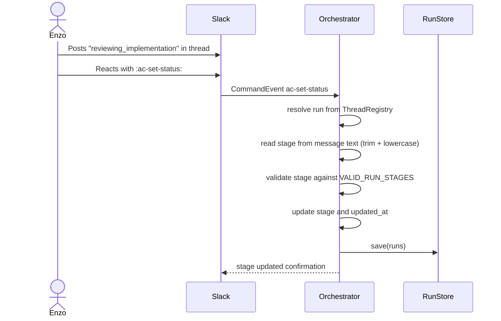

# Ignored message reactions and :ac-set-status: for Slack

## What

Two always-on improvements to Slack operator visibility:
1. Autocatalyst reacts with `:ac-message-ignored:` when it ignores a Slack message, making deliberate discards visible without log access. When a message is received in a known run thread but discarded because the run's current stage cannot accept input, Autocatalyst additionally responds with `:ac-message-discarded:`.
2. Operators can update a stuck run's stage by posting the target stage name in a run thread and reacting to that message with `:ac-set-status:`. The command is thread-only; the thread context determines which run to update.
Neither capability requires a config flag. Both are always active. If granular control is needed in the future, a `debug` config block can be introduced at that time.
## Why

Autocatalyst currently gives operators no signal when a Slack message is silently discarded. A message can be ignored because it lacks a bot mention, belongs to an unrelated thread, or arrives while a run is in a stage that cannot accept feedback. Without a visible signal, operators cannot distinguish an expected discard from a broken connection without leaving Slack to read process logs.
Runs can also get stuck in a stale stage after an agent failure, process restart, or incorrect classification. Operators currently have no in-Slack way to correct this; they must access the filesystem or restart the service.
Both problems are addressed by lightweight, always-available Slack interactions that require no configuration.
## Personas

- **Enzo: Engineer/operator** — monitors Autocatalyst runs, diagnoses routing failures, and corrects stale run state when needed.
- **Phoebe: Product manager** — notices when a thread appears silent and can ask an operator to investigate without needing filesystem access herself.
## Narratives

### Finding a silently ignored or discarded message

Enzo is testing a new Slack routing rule. He posts a message he expects Autocatalyst to ignore because it does not mention the bot. The bot reacts with `:ac-message-ignored:`. Enzo knows the message was seen and deliberately discarded rather than missed.
He then replies in an unrelated Slack thread and mentions the bot. The bot again reacts with `:ac-message-ignored:` because the thread is not tied to a known run. Enzo can distinguish an expected discard from a broken connection without reading logs.
Later, Enzo posts a feedback message in a run thread while the run is in the `implementing` stage, which does not accept operator input. The bot responds with `:ac-message-discarded:`, signaling that the message was received in a known run context but explicitly dropped because the stage does not accept input — distinct from being ignored outright.
### Unsticking a stuck run

A process restart leaves a run in `implementing`, but the PR review thread is ready. Enzo opens the Slack thread for the run, posts the message `reviewing_implementation`, and reacts to it with `:ac-set-status:`. Autocatalyst validates the stage name, updates the run in memory, persists it, and replies with the old and new stage.
Because stage text is trimmed and lowercased before processing, Enzo could also post `"  Reviewing_Implementation  "` and get the same result — the normalized form `reviewing_implementation` is what is validated and applied.
If Enzo mistypes the stage name, Autocatalyst replies with a list of valid stages and leaves the run unchanged.
## User stories

### Ignored-message reaction

- When Autocatalyst classifies a Slack message as `ignore` because it lacks a bot mention or belongs to an unrelated thread, it adds `:ac-message-ignored:` to the message.
- When a message arrives in a known run thread but is discarded because the run's current stage cannot accept input, Autocatalyst responds with `:ac-message-discarded:`.
- Reaction and response failures are logged but do not emit inbound events or reply further in Slack.
### Stage override via :ac-set-status:

- Enzo can post a valid stage name in a run thread and react to that message with `:ac-set-status:` to update the run's stage.
- The command works only in a thread associated with a known run. Using it in an unlinked thread returns a clear error.
- Autocatalyst replies with the previous stage and the new stage on success.
- An invalid stage name returns an error listing valid stage names; the run is not changed.
- A successful override is persisted so the updated stage survives a process restart.
- Malformed input (empty message text, whitespace only) returns a usage error.
## Goals

- React to ignored Slack messages with `:ac-message-ignored:` with no config flag.
- Respond to blocked-stage thread messages with `:ac-message-discarded:` with no config flag.
- Support `:ac-set-status:` as an emoji command that works only within a run thread.
- Resolve the run from thread context; no run ID argument is required.
- Read the target stage from the trimmed, lowercased text of the message the emoji is applied to.
- Validate the target stage against the `RunStage` union before mutating state.
- Persist a successful stage override through the existing run store.
- Reply with a clear confirmation or a clear error for every `:ac-set-status:` invocation.
## Non-goals

- A `debug` config block or any per-flag gating of these behaviors.
- Log retrieval via Slack text commands (already provided by `:ac-run-logs:`).
- Run listing or run detail inspection via Slack text commands (already provided by `:ac-run-status:`).
- Supporting `:ac-set-status:` outside a run thread (e.g., as a top-level mention command with an explicit run ID).
- Editing run fields other than `stage`.
- Creating, deleting, retrying, or canceling runs. Existing command-mode cancellation remains separate.
- Role-based authorization beyond channel access.
- Supporting these behaviors for non-Slack channel adapters in this iteration.
- Guaranteeing that every ignored internal event receives a reaction. Only Slack message events with a valid message timestamp can be reacted to.
## Design changes

### Ignored-message reaction and discarded-message response

When `classifyMessage()` returns `ignore` because a message lacks a bot mention or belongs to an unrelated thread, the Slack adapter calls `reactions.add` with `ac-message-ignored` on the message. No config check precedes this call. Reaction failures are logged and do not affect downstream processing.
When a message arrives in a known run thread but is rejected because the run's current stage cannot accept input, the Slack adapter calls `reactions.add` with `ac-message-discarded` on the message. The same failure-handling policy applies.
**Ignored reaction:**
```plain text
:ac-message-ignored:
```
**Discarded response:**
```plain text
:ac-message-discarded:
```
### :ac-set-status: emoji command

`:ac-set-status:` follows the existing emoji command path. The command handler:
1. Resolves the run from the thread's `ThreadRegistry` entry.
2. Reads the stage name from the text of the message the emoji was applied to (trimmed, lowercased).
	- Example: `"  Reviewing_Implementation  "` → `reviewing_implementation`
	- Example: `"IMPLEMENTING"` → `implementing`
3. Validates the stage name against `VALID_RUN_STAGES`.
4. On success: updates `run.stage` and `run.updated_at`, calls `_persistRuns()`, and replies in thread.
5. On failure: replies with the applicable error and leaves state unchanged.
**Success reply:**
```plain text
Run 4f8c... stage updated: implementing → reviewing_implementation. Change persisted.
```
**Invalid stage reply:**
```plain text
Unknown stage "implemneting". Valid stages: intake, speccing, reviewing_spec, implementing, awaiting_impl_input, reviewing_implementation, pr_open, done, failed.
```
**Not in a run thread reply:**
```plain text
:ac-set-status: can only be used in a thread linked to an active run.
```
**Empty message text reply:**
```plain text
React to a message containing the target stage name. Valid stages: intake, speccing, reviewing_spec, implementing, awaiting_impl_input, reviewing_implementation, pr_open, done, failed.
```
## Technical changes

### Affected files

- `src/adapters/slack/slack-adapter.ts` — add `:ac-message-ignored:` reaction for every `ignore` classification; add `:ac-message-discarded:` response for blocked-stage thread messages; ensure `:ac-set-status:` dispatches through the existing emoji command path.
- `src/adapters/slack/classifier.ts` — no change expected; emoji command classification already handles `:ac-*:` patterns.
- `src/core/commands/registry-setup.ts` — register `ac-set-status` command handler unconditionally.
- `src/core/commands/set-status-command.ts` *(new)* — implement stage override handler: resolve run from thread, read stage from message text, validate, persist, reply.
- `src/core/orchestrator.ts` — add `overrideRunStage(runId, stage)` private helper used by the command handler.
- `src/core/run-store.ts` — no schema change expected; verify stage override uses the existing `save()` path.
- Tests in `tests/adapters/slack/`, `tests/core/commands/`, and `tests/core/orchestrator.test.ts`.
## Tech spec

### 1. Introduction and overview

**Dependencies and assumptions**
- Depends on `feature-command-mode.md` — emoji command dispatch and `ThreadRegistry` already exist.
- Depends on `feature-slack-message-routing.md` — Slack adapter classification and thread-to-run mapping already exist.
- Depends on `FileRunStore` — run persistence already writes all records to `.autocatalyst/runs.json`.
- Slack API calls may fail. Reactions are best-effort. `:ac-set-status:` must return user-visible errors for all failure cases.
**Technical goals**
- `:ac-message-ignored:` reaction fires for every `ignore` classification (no bot mention, unrelated thread) with no config check.
- `:ac-message-discarded:` response fires for blocked-stage thread messages with no config check.
- `:ac-set-status:` dispatches via the existing emoji command path without any new classification logic.
- `overrideRunStage()` validates the stage, mutates in-memory state, and persists before returning.
- No new config types, resolvers, or runtime composition changes are required.
**Glossary**
- **Discard reaction** — a Slack emoji reaction added to a message classified as `ignore` (`:ac-message-ignored:`) or blocked by stage (`:ac-message-discarded:`).
- **Stage override** — operator-forced update to `run.stage`, persisted through the existing run store.
---
### 2. Stage override design

**Stage override flow**

#### Orchestrator helper

```typescript
private overrideRunStage(
  runId: string,
  stage: RunStage
): 'updated' | 'not_found' | 'invalid_stage';
```
- `runId` is resolved from the thread's `ThreadRegistry` entry by the command handler before calling this method.
- Validates `stage` against `VALID_RUN_STAGES` before touching state.
- On success: updates `run.stage`, sets `run.updated_at = new Date().toISOString()`, calls `_persistRuns()`.
- Returns one of three discriminated results; the command handler formats the Slack reply accordingly.
#### Valid stages constant

```typescript
export const VALID_RUN_STAGES: RunStage[] = [
  'intake',
  'speccing',
  'reviewing_spec',
  'implementing',
  'awaiting_impl_input',
  'reviewing_implementation',
  'pr_open',
  'done',
  'failed',
];
```
#### :ac-set-status: handler

```typescript
// src/core/commands/set-status-command.ts

export interface SetStatusCommandDeps {
  findRunForThread: (threadTs: string, channelId: string) => Run | undefined;
  overrideRunStage: (runId: string, stage: RunStage) => 'updated' | 'not_found' | 'invalid_stage';
}

export function createSetStatusHandler(deps: SetStatusCommandDeps): CommandHandler;
```
The handler reads the stage from `event.messageText` (the text of the message the emoji was reacted to), trims and lowercases it, then:
1. Rejects empty or whitespace-only text with a usage error and valid stage list.
2. Resolves the run via `findRunForThread(event.threadTs, event.channelId)`.
3. Returns a not-in-thread error if no run is found.
4. Calls `overrideRunStage(run.id, stage)` and replies based on the result.
---
### 3. Testing plan

**Ignored-message reaction**
- Ignored root messages (no bot mention) call `reactions.add` with `ac-message-ignored`.
- Ignored unrelated thread replies call `reactions.add` with `ac-message-ignored`.
- Blocked-stage thread messages call `reactions.add` with `ac-message-discarded`.
- No config flag is consulted before any `reactions.add` call.
- Reaction failures are logged and do not emit inbound events.
**:ac-set-status: handler**
- Valid stage in a known thread: updates stage, persists, replies with old and new stage.
- Stage text with mixed case and surrounding whitespace (`"  Reviewing_Implementation  "`) is normalized and accepted.
- Invalid stage: replies with valid stage list, leaves run unchanged, does not call `_persistRuns()`.
- Unknown thread (no linked run): replies with not-in-thread error.
- Empty or whitespace-only message text: replies with usage error and valid stage list.
- Successful override persists through the run store.
**Regression**
- Existing `:ac-run-logs:`, `:ac-run-status:`, `:ac-run-cancel:`, `health`, and `help` command tests still pass.
- Existing Slack routing tests for ignored messages, new requests, and thread messages still pass.
## Task decomposition

### Story 1: Ignored and discarded Slack messages receive visibility reactions

**Description:** React to every ignored or discarded Slack message so operators can distinguish deliberate routing decisions from silent failures, and can tell apart stage-blocked messages from fully unrouted ones.
**Tasks:**
1. Add `:ac-message-ignored:` reaction and `:ac-message-discarded:` response in the Slack adapter.
	- Acceptance criteria:
		- Every `ignore` classification (no mention, unrelated thread) triggers `reactions.add` with `ac-message-ignored`.
		- Every blocked-stage thread message triggers `reactions.add` with `ac-message-discarded`.
		- No config flag is consulted.
		- Reaction failure is logged; no inbound event is emitted.
	- Dependencies: none.
2. Add adapter tests.
	- Acceptance criteria:
		- Tests assert `reactions.add` is called with `ac-message-ignored` for ignored root and unrelated thread messages.
		- Tests assert `reactions.add` is called with `ac-message-discarded` for blocked-stage thread messages.
		- Tests assert no inbound event is emitted on reaction failure.
	- Dependencies: task 1.
### Story 2: :ac-set-status: emoji command updates run stage in a thread

**Description:** Implement the emoji command that lets operators correct a stuck run's stage directly from the Slack thread.
**Tasks:**
1. Add `VALID_RUN_STAGES` constant.
	- Acceptance criteria:
		- Constant covers every `RunStage` value.
		- Invalid strings are rejected by comparison.
	- Dependencies: none.
2. Add `overrideRunStage()` orchestrator helper.
	- Acceptance criteria:
		- Validates stage against `VALID_RUN_STAGES`.
		- Updates `stage` and `updated_at` on success.
		- Calls `_persistRuns()` on success.
		- Does not mutate state on invalid stage or missing run.
	- Dependencies: task 1.
3. Implement `set-status-command.ts` handler.
	- Acceptance criteria:
		- Reads stage from message text (trimmed, lowercased).
		- Resolves run from thread context.
		- Delegates to `overrideRunStage()`.
		- Replies with appropriate success or error message for all outcomes (valid, invalid stage, unknown thread, empty text).
	- Dependencies: task 2.
4. Register handler and add tests.
	- Acceptance criteria:
		- Handler is registered unconditionally in `registry-setup.ts`.
		- Tests cover valid override, invalid stage, unknown thread, and empty message text.
		- Tests cover mixed-case and whitespace-padded input being normalized correctly.
		- Successful override persists through run store mock.
		- Regression: existing emoji command tests pass.
	- Dependencies: task 3.