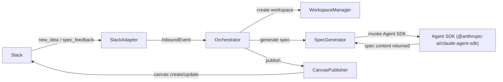
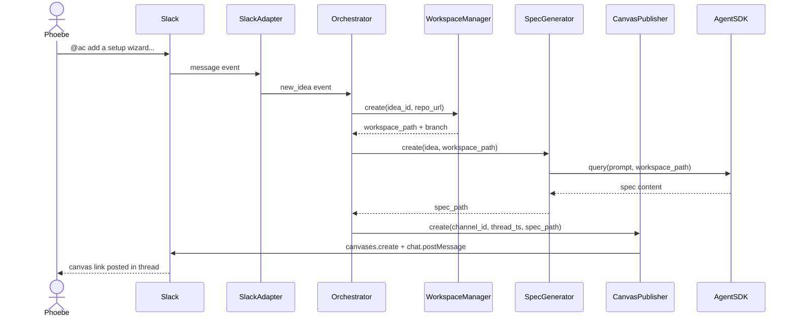
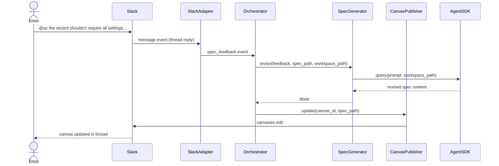

# Idea to spec to review

## What

When a team member seeds an idea in Slack, Autocatalyst picks it up and turns it into a structured spec. The system generates the spec autonomously — working through what the feature is, why it matters, who uses it, and what a working implementation looks like — then posts it to the idea's Slack thread for the team to read. If someone pushes back or points out something missing, they reply in the thread and Autocatalyst revises the spec and reposts it. The loop continues until the team is satisfied with the spec, at which point it's ready for approval.

This feature covers the full cycle from raw idea to a spec the team considers ready: generation, posting, feedback intake, and revision. It does not cover the approval decision itself — that's a separate step.

## Why

A good spec is the most leveraged artifact in the development loop. It aligns the team on what to build before any code is written, surfaces ambiguity early when it's cheap to resolve, and gives the implementation agent a precise target. Without it, implementations drift from intent and require expensive rework.

The bottleneck today is that writing a good spec takes time and discipline that most teams don't consistently apply. Autocatalyst removes that bottleneck by generating the spec automatically from the seed idea — the same mental model and planning rigor, without as much manual effort. The team's role shifts from writing specs to reviewing and refining them, which is a much lower-friction touchpoint and one they can do asynchronously in a channel they're already using.

## Personas

- **Phoebe: Product manager** — seeds ideas from product observations and reviews the generated spec in the Slack thread, pushing back when the scope or framing is wrong
- **Enzo: Engineer** — seeds technical ideas and reviews specs for feasibility, flagging gaps or incorrect assumptions about the codebase

## Narratives

### Seeding an idea and reading the first draft

Enzo notices that first-time users of AMP's CLI struggle with the initial configuration step — there are too many settings and no guidance on what values to use. Without leaving Slack, he posts in `#autocatalyst-amp`: `@ac add a setup wizard to the CLI that walks new users through initial configuration`. Within a minute, Autocatalyst posts a spec draft to the thread: scope, open questions, a proposed interaction model, and a task list.

Enzo reads it and pushes back on one point — the spec requires all settings to be completed before the wizard exits, but new users often won't have all the values ready. He replies in the thread: `@ac the wizard shouldn't require all settings before exiting — new users won't have everything ready`. Autocatalyst acknowledges the feedback and posts a revised spec a minute later, with optional settings that can be skipped and completed from the CLI later.

Enzo reads the revision — it's right. The spec is ready for approval.

### A spec that takes a few rounds to land

Phoebe has been thinking about composable workflows for AMP — a way for users to define pipeline steps independently and assemble them at runtime. She seeds the idea with a paragraph in `#autocatalyst-amp` and Autocatalyst posts a first draft. The scope looks right, but the spec's proposed data model treats steps as stateless, and Phoebe knows that several step types need to carry state between pipeline runs. She replies with the correction.

Autocatalyst revises and reposts. The revised model is better, but it surfaces a new open question about dependency ordering between steps — something neither Phoebe nor the spec had considered. She answers it in the thread. Autocatalyst incorporates the answer and posts a third version.

This one holds up. By the time it's ready for approval, the spec reflects three distinct rounds of refinement, all in one thread, without a single meeting or document handoff.

## User stories

**Seeding an idea and reading the first draft**

- Enzo can seed an idea with a single @mention message and receive a structured spec draft in the thread within a minute
- Enzo can read the spec draft directly in the Slack thread without leaving the channel
- Enzo can reply with feedback and see a revised spec posted to the same thread
- Enzo can tell when the spec is ready for approval without any external status check

**A spec that takes a few rounds to land**

- Phoebe can provide feedback across multiple rounds and see each revision posted as a new message in the thread
- Phoebe can answer open questions surfaced by the spec in a thread reply and see them incorporated into the next revision
- Phoebe can see the full history of the spec's evolution in a single Slack thread

## Goals

- First spec draft posted to the Slack thread within 5 minutes of the idea being received
- Each revised draft posted within 5 minutes of feedback being received
- Spec format matches the mm:planning spec template used for human-authored specs
- The system never posts a revision without having received feedback — no unsolicited redrafts

## Non-goals

- Generating specs from sources other than Slack (email, GitHub issues, etc.)
- Storing spec history beyond what's visible in the Slack thread

## Tech spec

### 1. Introduction and overview

**Dependencies**
- Feature: Slack message routing — provides the `SlackAdapter` and `InboundEvent` stream (`new_idea`, `spec_feedback`)
- ADR-001: Agent-first development — establishes Agent SDK as the agent runtime and mm:planning as the spec generation skill
- ADR-003: Spec format — defines the Markdown + YAML frontmatter standard all generated specs must follow
- Decision: Agent runtime adapter — defines the `AgentRuntimeAdapter` interface Autocatalyst uses to invoke Agent SDK

**Technical goals**
- First spec draft posted to Slack canvas within 5 minutes of `new_idea` event received
- Each revision posted within 5 minutes of `spec_feedback` event received
- Generated specs conform to ADR-003 format (Markdown + YAML frontmatter, correct lifecycle fields)
- Each idea runs in an isolated workspace — a shallow git clone of the target repo on a dedicated branch, capable of receiving commits and opening PRs
- Spec file is not committed to the repo until the approval signal is received (Feature 4)

**Non-goals**
- Persisting run state across service restarts

**Glossary**
- **Agent SDK (`@anthropic-ai/claude-agent-sdk`)** — the Anthropic Agent SDK; Autocatalyst uses its `query()` function to run Claude with a prompt and workspace context
- **mm:planning** — the Claude Code skill that generates structured specs from a seed idea, used here in headless mode
- **Canvas** — Slack's native document format; created and updated via the Slack Web API; used to post the spec to the idea's thread
- **Workspace** — an isolated directory containing a shallow git clone of the target repository on a dedicated branch; supports commits and PRs
- **Run** — the in-memory record tracking a single idea's progress through the pipeline (stage, workspace path, attempt count)

### 2. System design and architecture

**New components**

- `src/core/orchestrator.ts` — wires the `SlackAdapter` event stream to the speccing pipeline; owns the in-memory run registry; drives stage transitions
- `src/core/workspace-manager.ts` — creates and tears down workspaces (shallow git clone + dedicated branch per idea)
- `src/adapters/agent/spec-generator.ts` — invokes Agent SDK with mm:planning and the idea content; captures the generated spec file from the workspace
- `src/adapters/slack/canvas-publisher.ts` — creates and updates a Slack canvas with spec content; posts the canvas link to the idea's thread

**High-level flow**



**Sequence diagram — new idea**



**Sequence diagram — spec feedback**



### 3. Detailed design

**New types**

```typescript
// src/types/runs.ts
export type RunStage = 'intake' | 'speccing' | 'review' | 'approved' | 'failed';

export interface Run {
  id: string;
  idea_id: string;
  stage: RunStage;
  workspace_path: string;
  branch: string;
  spec_path: string | undefined;
  canvas_id: string | undefined;
  attempt: number;
  created_at: string;
  updated_at: string;
}
```

**Component interfaces**

```typescript
// src/core/workspace-manager.ts
export interface WorkspaceManager {
  create(idea_id: string, repo_url: string): Promise<{ workspace_path: string; branch: string }>;
  destroy(workspace_path: string): Promise<void>;
}

// src/adapters/agent/spec-generator.ts
export interface SpecGenerator {
  create(idea: Idea, workspace_path: string): Promise<string>;                               // returns spec_path
  revise(feedback: SpecFeedback, spec_path: string, workspace_path: string): Promise<void>; // rewrites spec in place
}

// src/adapters/slack/canvas-publisher.ts
export interface CanvasPublisher {
  create(channel_id: string, thread_ts: string, spec_path: string): Promise<string>; // returns canvas_id
  update(canvas_id: string, spec_path: string): Promise<void>;
}
```

**Agent SDK invocation**

`SpecGenerator` invokes Agent SDK's `query()` function with `cwd` set to `workspace_path`:

```typescript
for await (const message of query({ prompt, options: { cwd: workspace_path, permissionMode: 'bypassPermissions', tools: { type: 'preset', preset: 'claude_code' } } })) {
  // stream agent messages
}
```

Generation prompt:
```
Using mm:planning conventions, generate a complete product spec for the following idea.

On the very first line of your response, write: FILENAME: <feature-or-enhancement-slug>.md
Then write the complete spec as a Markdown document with YAML frontmatter.

Idea:
<<<
<idea.content>
>>>
```

Revision prompt:
```
Revise the spec below based on the feedback. Return the complete revised spec as a Markdown document.

Feedback:
<<<
<feedback.content>
>>>

Current spec:
<<<
<spec content>
>>>
```

`SpecGenerator` instructs Agent SDK to write the result to `.autocatalyst/spec-create-result.json` in the workspace. On completion, it reads the result file, parses the `FILENAME:` line, writes the spec body to `<workspace_path>/context-human/specs/<filename>`, and returns that path. The filename is validated against `^(feature|enhancement)-[a-z0-9-]+\.md$` before use.

**WorkspaceManager implementation**

```bash
git clone --depth=1 <repo_url> <workspace_root>/<idea_id>/
git -C <workspace_root>/<idea_id>/ checkout -b spec/<idea-slug>
```

`repo_url` is derived at startup by running `git remote get-url origin` in the `--repo` directory; startup exits with an error if no `origin` remote is configured. `workspace_root` comes from `config.workspace.root`, which defaults to `~/.autocatalyst/workspaces/{repoName}` via `bootstrapWorkflow`.

**Orchestrator logic**

On `new_idea`:
1. Create `Run` in stage `intake`; store keyed by `idea_id`
2. Transition to `speccing`; call `WorkspaceManager.create(idea_id, repo_url)` → `{ workspace_path, branch }`
3. Call `SpecGenerator.create(idea, workspace_path)` → `spec_path`; store on Run
4. Call `CanvasPublisher.create(channel_id, thread_ts, spec_path)` → `canvas_id`; store on Run
5. Transition to `review`
6. On any failure: transition to `failed`; post error message to thread

On `spec_feedback`:
1. Look up Run by `idea_id`; discard if not found or not in `review`
2. Transition to `speccing`; increment `attempt`
3. Call `SpecGenerator.revise(feedback, spec_path, workspace_path)`
4. Call `CanvasPublisher.update(canvas_id, spec_path)`
5. Transition back to `review`
6. On failure: transition to `failed`; post error message to thread

**Service and entry point wiring**

`src/index.ts` is updated to wire the Orchestrator into the startup sequence:

1. After loading config, resolve `repo_url`:
   ```bash
   git -C <repoPath> remote get-url origin
   ```
   Exit with a descriptive error if the command fails or returns empty.

2. Create `SlackAdapter` from `config.slack`.

3. Create `Orchestrator` with the adapter, `repo_url`, and `config.workspace.root`.

4. Pass the `Orchestrator` to `Service` via `ServiceOptions`.

`ServiceOptions` is extended:
```typescript
interface ServiceOptions {
  logDestination?: pino.DestinationStream;
  orchestrator?: Orchestrator;
}
```

`Service.start()` calls `await orchestrator.start()` before the interval begins. `Service.stop()` calls `await orchestrator.stop()` during shutdown.

`Orchestrator` interface:
```typescript
// src/core/orchestrator.ts
export interface Orchestrator {
  start(): Promise<void>;
  stop(): Promise<void>;
}
```

`Orchestrator.start()` begins consuming `SlackAdapter.receive()` in a loop, dispatching `new_idea` and `spec_feedback` events to the pipeline. `Orchestrator.stop()` signals the loop to exit and waits for any in-flight pipeline run to complete before resolving.

### 4. Security, privacy, and compliance

**Authentication and authorization**
- Slack tokens are provided by the operator at startup and grant access to the channels Autocatalyst is added to. No additional per-user authentication is performed.
- `repo_url` is derived from the `origin` remote of the `--repo` directory. Workspace access is governed by the OS user running the process and whatever credentials are configured for git (SSH keys, credential helpers).

**Data privacy**
- Idea content and spec feedback are sent to Anthropic via Agent SDK. This data is not logged by Autocatalyst.
- The generated spec is written to disk in the workspace but is not committed to the repository until the approval signal is received (Feature 4).

**Input validation**
- Events are pre-filtered by `SlackAdapter` before reaching the Orchestrator — only `new_idea` and `spec_feedback` events are processed.
- The `FILENAME` line in Agent SDK output is validated against `^(feature|enhancement)-[a-z0-9-]+\.md$` before the spec is written to disk. An invalid filename causes the run to transition to `failed`.

### 5. Observability

**Logging**

All components use `createLogger()` from `src/core/logger.ts`. Each log entry includes `component`, `event` (stable name), `run_id`, `idea_id`, and `stage` where applicable.

Stable event names for this feature:

| Event | Level | Component |
|---|---|---|
| `run.created` | info | orchestrator |
| `run.stage_transition` | info | orchestrator |
| `run.failed` | error | orchestrator |
| `workspace.created` | info | workspace-manager |
| `workspace.destroyed` | info | workspace-manager |
| `spec.generated` | info | spec-generator |
| `spec.revised` | info | spec-generator |
| `spec.agent_invoked` | debug | spec-generator |
| `spec.agent_completed` | debug | spec-generator |
| `spec.agent_failed` | error | spec-generator |
| `canvas.created` | info | canvas-publisher |
| `canvas.updated` | info | canvas-publisher |

**Traces**

Per the observability-stack ADR, OpenTelemetry traces will wrap each orchestrator stage transition and each Agent SDK invocation. Not implemented in this feature — tracked separately.

### 6. Testing plan

All tests use Vitest. Component tests mock subprocess and Slack API calls via `vi.fn()`; filesystem operations use real temp directories created in `beforeEach` and cleaned up in `afterEach`. Log output is captured via the `destination` injection pattern from `src/core/logger.ts`.

---

**WorkspaceManager**

_Subprocess invocation_
- `create` issues `git clone --depth=1 <repo_url> <workspace_root>/<idea_id>/` as a child process with the correct arguments
- `create` issues `git checkout -b spec/<idea-slug>` after a successful clone
- `create` returns `{ workspace_path, branch }` matching the constructed paths
- `create` throws if the clone command exits non-zero; cloned directory is removed before throwing
- `create` throws if the checkout command exits non-zero
- `destroy` removes the workspace directory recursively

_Path construction_
- `workspace_path` is `<config.workspace.root>/<idea_id>`
- `branch` is `spec/<idea-slug>` (slug derived from `idea.content`)
- Two ideas with different `idea_id`s produce non-overlapping paths

---

**SpecGenerator**

_Agent SDK invocation — `create`_
- `create` calls `query()` with `cwd` set to `workspace_path`
- The prompt includes the idea content wrapped in `<<<`/`>>>` delimiters
- The prompt instructs Agent SDK to write `FILENAME: <slug>.md` on the first line
- `create` throws if Agent SDK `query()` rejects
- `create` throws if the result file does not exist

_Artifact parsing — `create`_
- `FILENAME: feature-setup-wizard.md` on the first line of `## Raw output` is parsed correctly
- `FILENAME: enhancement-some-thing.md` is accepted
- `FILENAME: invalid_name.md` (underscore) causes `create` to throw with a descriptive error
- `FILENAME: setup-wizard.md` (no `feature-`/`enhancement-` prefix) causes `create` to throw
- A missing `FILENAME:` line causes `create` to throw
- After a successful parse, the spec body (everything after the `FILENAME:` line) is written to `<workspace_path>/context-human/specs/<filename>`
- `create` returns the full spec path

_Agent SDK invocation — `revise`_
- `revise` calls `query()` with `cwd` set to `workspace_path`
- The prompt leads with feedback content wrapped in `<<<`/`>>>`
- The prompt follows with the current spec file content wrapped in `<<<`/`>>>`
- `revise` reads the spec from `spec_path` before invoking Agent SDK
- `revise` overwrites the spec file in place with the revised content from the artifact
- `revise` throws if Agent SDK `query()` rejects

---

**CanvasPublisher**

_`create`_
- Reads the spec file at `spec_path`
- Calls `app.client.canvases.create` with the spec content as the canvas body
- Calls `app.client.chat.postMessage` with `channel: channel_id`, `thread_ts: thread_ts`, and a message containing the canvas link
- `postMessage` is called after `canvases.create` (canvas exists before link is posted)
- Returns the `canvas_id` from the `canvases.create` response
- Throws if `canvases.create` rejects; no `postMessage` call is made

_`update`_
- Reads the spec file at `spec_path`
- Calls `app.client.canvases.edit` with the correct `canvas_id` and updated content
- Throws if `canvases.edit` rejects

---

**Orchestrator — `new_idea` path**

_Happy path_
- Receiving a `new_idea` event creates a `Run` in stage `intake` keyed by `idea_id`
- `WorkspaceManager.create` is called with `idea_id` and the configured `repo_url`
- Stage transitions to `speccing` before `SpecGenerator.create` is called
- `SpecGenerator.create` is called with the `Idea` and `workspace_path` from the workspace
- `spec_path` is stored on the run after `SpecGenerator.create` resolves
- `CanvasPublisher.create` is called with `channel_id`, `thread_ts`, and `spec_path`
- `canvas_id` is stored on the run after `CanvasPublisher.create` resolves
- Stage transitions to `review` after all steps complete

_Failure paths_
- `WorkspaceManager.create` rejects → run transitions to `failed`; error message posted to thread
- `SpecGenerator.create` rejects → run transitions to `failed`; error message posted to thread; workspace is destroyed
- `CanvasPublisher.create` rejects → run transitions to `failed`; error message posted to thread; workspace is destroyed

---

**Orchestrator — `spec_feedback` path**

_Happy path_
- `spec_feedback` for a known `idea_id` in `review` stage transitions run to `speccing`
- `attempt` is incremented by 1
- `SpecGenerator.revise` is called with `feedback`, `spec_path`, and `workspace_path`
- `CanvasPublisher.update` is called with `canvas_id` and `spec_path`
- Stage transitions back to `review` after both calls complete

_Guard conditions_
- `spec_feedback` for an unknown `idea_id` is silently discarded; no components called
- `spec_feedback` for a run in stage `speccing` is silently discarded (feedback arrived while already processing)
- `spec_feedback` for a run in stage `failed` is silently discarded

_Failure paths_
- `SpecGenerator.revise` rejects → run transitions to `failed`; error message posted to thread
- `CanvasPublisher.update` rejects → run transitions to `failed`; error message posted to thread

---

**Concurrency**

- Two simultaneous `new_idea` events produce two independent runs with separate `idea_id`s, separate workspaces, and no interference
- `spec_feedback` for idea A does not affect the run for idea B

---

**Logging**

- `run.created` is emitted with `run_id` and `idea_id` when a run is first created
- `run.stage_transition` is emitted with `run_id`, `idea_id`, `from_stage`, `to_stage` on every transition
- `run.failed` is emitted with `run_id`, `idea_id`, and the error at the error level when a run fails
- `spec.agent_invoked` and `spec.agent_completed` are emitted at debug level with `run_id` and `idea_id`
- `spec.agent_failed` is emitted at error level with the exit code and stderr when Agent SDK `query()` rejects
- Idea content is not logged at `info` level or above (content goes to Agent SDK, not logs)

---

**Service and entry point wiring**

- `Service.start()` calls `orchestrator.start()`; `Service.stop()` calls `orchestrator.stop()`
- If `orchestrator.start()` rejects, the error propagates and the service does not enter the running state
- `src/index.ts`: `git remote get-url origin` failure causes startup to exit with a non-zero code and a descriptive error message
- `src/index.ts`: missing `config.workspace.root` causes startup to exit with an error before the Orchestrator is created

---

**Manual acceptance testing**

- Seed an idea in the test Slack channel; confirm a canvas link appears in the thread within 5 minutes
- Reply with feedback; confirm the canvas is updated (not a new message) within 5 minutes
- Inspect the canvas content; confirm it matches the ADR-003 Markdown + YAML frontmatter format
- Confirm no spec file exists in the workspace repository until the approval signal is sent (Feature 4)
- Trigger a deliberate Agent SDK failure (bad credentials); confirm an error message appears in the thread and no canvas is posted

### 7. Alternatives considered

**Posting the spec as a Slack message instead of a canvas**

The spec content will typically exceed Slack's message length limit and lacks structure when rendered as plain text. A canvas renders Markdown natively, supports in-place updates without creating new messages, and keeps the thread uncluttered across multiple revision rounds. Canvas was the clear choice.

**Storing run state in a database instead of in-memory**

A persistent store would survive service restarts and support multi-process deployments. For the initial feature, in-memory state was chosen: it eliminates infrastructure dependencies, keeps the data model simple, and the cost of losing in-flight runs on restart is low given that ideas are seeded via Slack (the history is still there). Persistence is deferred as an explicit non-goal.

**Invoking Claude directly via the Anthropic SDK instead of Agent SDK**

Calling the SDK directly would remove the Agent SDK dependency and give full control over the API call. Agent SDK was chosen because it provides the mm:planning skill context, artifact management, and a consistent invocation pattern shared across the system. Bypassing it would require reimplementing that context injection and diverge from the ADR-001 agent-first architecture.

**One workspace shared across all ideas vs. one per idea**

A shared workspace reduces disk usage but creates branch conflicts and race conditions between concurrent ideas. A dedicated shallow clone per idea provides clean isolation at the cost of additional disk and clone time, both of which are acceptable given the expected volume.

### 8. Risks

**Agent SDK output format changes**

The artifact parsing logic depends on the `FILENAME:` convention on the first line of the result file. If the Agent SDK output format changes, `SpecGenerator` will fail to parse and all runs will transition to `failed`. Mitigation: pin the Agent SDK version in `package.json` and treat upgrades as explicit changes that require re-validating the parsing logic.

**Slack Canvas API availability**

The Canvases API is newer than the core Slack messaging API and has had availability gaps in the past. If `canvases.create` or `canvases.edit` is unavailable, spec posting fails entirely. Mitigation: `CanvasPublisher` errors are caught by the Orchestrator and posted to the thread so the team is not left without feedback. A fallback to plain message posting is not implemented but could be added.

**Shallow clone missing required history**

`--depth=1` gives the latest commit only. If the mm:planning skill or any Agent SDK invocation needs git history (e.g., to understand recent changes), it will be absent. Current Agent SDK usage in this feature is stateless — it reads the working tree but not git history — so this is not an immediate issue. Worth revisiting if Agent SDK's behavior changes.

**Disk accumulation from orphaned workspaces**

Workspaces are created on `new_idea` and are only destroyed on failure or approval (Feature 4). A run stuck in `review` indefinitely will leave a workspace on disk indefinitely. Mitigation: `WorkspaceManager.destroy` is already available; a future cleanup pass or TTL-based eviction can use it without interface changes.

## Task list

- [x] **Story: Run types**
  - [x] **Task: Define `RunStage` and `Run` types**
    - **Description**: Create `src/types/runs.ts` with the `RunStage` union type and `Run` interface as specified in Section 3. Export both from the file.
    - **Acceptance criteria**:
      - [x] `RunStage` is `'intake' | 'speccing' | 'review' | 'approved' | 'failed'`
      - [x] `Run` interface has all fields: `id`, `idea_id`, `stage`, `workspace_path`, `branch`, `spec_path`, `canvas_id`, `attempt`, `created_at`, `updated_at`
      - [x] `spec_path` and `canvas_id` are `string | undefined`
      - [x] File compiles without errors under `NodeNext` module resolution
    - **Dependencies**: None

- [x] **Story: WorkspaceManager**
  - [x] **Task: Implement `WorkspaceManager`**
    - **Description**: Create `src/core/workspace-manager.ts` with the `WorkspaceManager` interface and a concrete implementation. `create` runs `git clone --depth=1 <repo_url> <workspace_path>` then `git -C <workspace_path> checkout -b spec/<slug>` as child processes with `util.promisify(exec)`. The slug is derived from the first five words of `idea_id`, lowercased and hyphenated. If clone fails, remove the directory before throwing. `destroy` removes the directory recursively.
    - **Acceptance criteria**:
      - [x] `WorkspaceManager` interface exported: `create(idea_id, repo_url)` and `destroy(workspace_path)`
      - [x] `create` constructs `workspace_path` as `<config.workspace.root>/<idea_id>`
      - [x] `create` runs `git clone --depth=1 <repo_url> <workspace_path>` as a subprocess
      - [x] `create` runs `git -C <workspace_path> checkout -b spec/<slug>` after a successful clone
      - [x] `create` removes the cloned directory and re-throws if the clone command exits non-zero
      - [x] `create` throws if the checkout command exits non-zero
      - [x] `create` returns `{ workspace_path, branch }`
      - [x] `destroy` removes the directory recursively (equivalent to `rm -rf`)
      - [x] All relative imports use `.js` extensions
    - **Dependencies**: None

  - [x] **Task: Unit tests for `WorkspaceManager`**
    - **Description**: Create `tests/core/workspace-manager.test.ts`. Mock `child_process.exec` (via the promisified wrapper) with `vi.fn()`. Use a real temp directory for path construction assertions. Cover all cases from the testing plan's WorkspaceManager section.
    - **Acceptance criteria**:
      - [x] `create` issues the correct `git clone` command with `--depth=1` and the right path
      - [x] `create` issues the correct `git checkout -b` command after a successful clone
      - [x] `create` returns `{ workspace_path, branch }` with correct values
      - [x] `create` throws and removes the cloned directory if clone exits non-zero
      - [x] `create` throws if checkout exits non-zero
      - [x] `destroy` removes the workspace directory
      - [x] Two calls with different `idea_id`s produce non-overlapping paths
      - [x] All tests pass: `npm test`
    - **Dependencies**: "Task: Implement `WorkspaceManager`"

- [x] **Story: SpecGenerator**
  - [x] **Task: Implement `SpecGenerator`**
    - **Description**: Create `src/adapters/agent/spec-generator.ts` with the `SpecGenerator` interface and a concrete `AgentSDKSpecGenerator` implementation. `create` calls `query()` with `cwd` set to `workspace_path`, reads the result file at `.autocatalyst/spec-create-result.json`, parses the `FILENAME:` line, validates it against `^(feature|enhancement)-[a-z0-9-]+\.md$`, writes the spec body to `<workspace_path>/context-human/specs/<filename>`, and returns the path. `revise` builds a prompt with the feedback content in `<<<`/`>>>` delimiters first, then the current spec content in `<<<`/`>>>` delimiters, invokes Agent SDK identically, and overwrites the spec file in place with the revised content.
    - **Acceptance criteria**:
      - [x] `SpecGenerator` interface exported: `create(idea, workspace_path)` and `revise(feedback, spec_path, workspace_path)`
      - [x] `create` calls `query()` with `cwd: workspace_path` and the generation prompt from Section 3
      - [x] Generation prompt wraps `idea.content` in `<<<`/`>>>` and includes the `FILENAME:` instruction on the first line
      - [x] `create` reads the result file from `.autocatalyst/spec-create-result.json`
      - [x] `create` parses `FILENAME:` from the result file
      - [x] `create` validates the filename against `^(feature|enhancement)-[a-z0-9-]+\.md$`; throws with a descriptive error if invalid or missing
      - [x] `create` writes the spec body (everything after the `FILENAME:` line) to `<workspace_path>/context-human/specs/<filename>`
      - [x] `create` returns the full spec path
      - [x] `create` throws if Agent SDK `query()` rejects
      - [x] `revise` prompt leads with feedback in `<<<`/`>>>`, follows with current spec content in `<<<`/`>>>`
      - [x] `revise` reads the current spec from `spec_path` before invoking Agent SDK
      - [x] `revise` overwrites `spec_path` with the revised content from the artifact
      - [x] `revise` throws if Agent SDK `query()` rejects
      - [x] All relative imports use `.js` extensions
    - **Dependencies**: None

  - [x] **Task: Unit tests for `SpecGenerator`**
    - **Description**: Create `tests/adapters/agent/spec-generator.test.ts`. Mock the Agent SDK `query()` function with `vi.fn()`. Use real temp directories for file I/O. Write fixture result files with varying `FILENAME:` values to test parsing. Cover all cases from the testing plan's SpecGenerator section.
    - **Acceptance criteria**:
      - [x] `create` calls `query()` with the correct `cwd` and prompt content
      - [x] `create` correctly parses `FILENAME: feature-setup-wizard.md`
      - [x] `create` correctly parses `FILENAME: enhancement-some-thing.md`
      - [x] `create` throws with a descriptive error on `FILENAME: invalid_name.md` (underscore)
      - [x] `create` throws on `FILENAME: setup-wizard.md` (missing `feature-`/`enhancement-` prefix)
      - [x] `create` throws when the `FILENAME:` line is absent
      - [x] `create` writes the correct spec body to the correct path and returns it
      - [x] `create` throws if Agent SDK `query()` rejects
      - [x] `revise` prompt leads with feedback in `<<<`/`>>>`, follows with spec content in `<<<`/`>>>`
      - [x] `revise` reads the current spec from `spec_path` before invoking Agent SDK
      - [x] `revise` overwrites the spec file in place with revised content
      - [x] `revise` throws if Agent SDK `query()` rejects
      - [x] All tests pass: `npm test`
    - **Dependencies**: "Task: Implement `SpecGenerator`"

- [x] **Story: CanvasPublisher**
  - [x] **Task: Implement `CanvasPublisher`**
    - **Description**: Create `src/adapters/slack/canvas-publisher.ts` with the `CanvasPublisher` interface and a concrete `SlackCanvasPublisher` implementation. The implementation takes the Bolt `App` instance in its constructor. `create` reads the spec file, calls `app.client.canvases.create` with the content, then calls `app.client.chat.postMessage` with the canvas link posted to the thread. `update` reads the spec file and calls `app.client.canvases.edit` with the updated content.
    - **Acceptance criteria**:
      - [x] `CanvasPublisher` interface exported: `create(channel_id, thread_ts, spec_path)` and `update(canvas_id, spec_path)`
      - [x] `create` reads spec content from `spec_path`
      - [x] `create` calls `app.client.canvases.create` with the spec content as the canvas body
      - [x] `create` calls `app.client.chat.postMessage` after `canvases.create` with `channel_id`, `thread_ts`, and a message containing the canvas link
      - [x] `create` returns the `canvas_id` from the `canvases.create` response
      - [x] `create` throws if `canvases.create` rejects; `postMessage` is not called
      - [x] `update` reads spec content from `spec_path`
      - [x] `update` calls `app.client.canvases.edit` with the correct `canvas_id` and updated content
      - [x] `update` throws if `canvases.edit` rejects
      - [x] All relative imports use `.js` extensions
    - **Dependencies**: None

  - [x] **Task: Unit tests for `CanvasPublisher`**
    - **Description**: Create `tests/adapters/slack/canvas-publisher.test.ts`. Mock `app.client.canvases.create`, `app.client.canvases.edit`, and `app.client.chat.postMessage` with `vi.fn()`. Use real temp files for spec content. Cover all cases from the testing plan's CanvasPublisher section.
    - **Acceptance criteria**:
      - [x] `create` calls `canvases.create` with the correct spec file content
      - [x] `create` calls `postMessage` after `canvases.create` with `channel_id`, `thread_ts`, and a message containing the canvas link
      - [x] `create` returns the `canvas_id` from the response
      - [x] `create` does not call `postMessage` if `canvases.create` rejects
      - [x] `update` calls `canvases.edit` with the correct `canvas_id` and updated content
      - [x] `update` throws if `canvases.edit` rejects
      - [x] All tests pass: `npm test`
    - **Dependencies**: "Task: Implement `CanvasPublisher`"

- [x] **Story: Orchestrator**
  - [x] **Task: Implement `Orchestrator`**
    - **Description**: Create `src/core/orchestrator.ts` with the `Orchestrator` interface (`start(): Promise<void>`, `stop(): Promise<void>`) and a concrete implementation. The constructor accepts `SlackAdapter`, `WorkspaceManager`, `SpecGenerator`, `CanvasPublisher`, and `repo_url`. `start()` begins consuming `SlackAdapter.receive()` in an async loop, dispatching `new_idea` and `spec_feedback` events to the pipeline. The in-memory run registry is a `Map<string, Run>` keyed by `idea_id`. `stop()` signals the loop to exit and resolves after any in-flight pipeline step completes. Stage transitions and error handling follow Section 3 exactly: on failure, transition to `failed` and post an error message to the Slack thread via `SlackAdapter`.
    - **Acceptance criteria**:
      - [x] `Orchestrator` interface exported: `start()` and `stop()`
      - [x] `new_idea`: creates `Run` in `intake`, transitions through `speccing`, calls all four components in order, transitions to `review`
      - [x] `new_idea`: `workspace_path`, `branch`, `spec_path`, `canvas_id` stored on Run after each step
      - [x] `new_idea`: WorkspaceManager failure → `failed`, error posted to thread, no further components called
      - [x] `new_idea`: SpecGenerator failure → `failed`, error posted to thread, workspace destroyed
      - [x] `new_idea`: CanvasPublisher failure → `failed`, error posted to thread, workspace destroyed
      - [x] `spec_feedback`: transitions `review → speccing`, increments `attempt`, calls `revise` then `update`, transitions back to `review`
      - [x] `spec_feedback`: silently discarded if `idea_id` not found in registry
      - [x] `spec_feedback`: silently discarded if run is in `speccing` stage
      - [x] `spec_feedback`: silently discarded if run is in `failed` stage
      - [x] `spec_feedback`: SpecGenerator failure → `failed`, error posted to thread
      - [x] `spec_feedback`: CanvasPublisher failure → `failed`, error posted to thread
      - [x] `stop()` resolves only after any in-flight pipeline step completes
      - [x] All relative imports use `.js` extensions
    - **Dependencies**: "Task: Implement `WorkspaceManager`", "Task: Implement `SpecGenerator`", "Task: Implement `CanvasPublisher`", "Task: Define `RunStage` and `Run` types"

  - [x] **Task: Unit tests for Orchestrator — `new_idea` path**
    - **Description**: Create `tests/core/orchestrator.test.ts`. Mock all four dependencies with `vi.fn()`. Test the happy path and all failure paths for `new_idea`. Verify stage transitions in the run registry, component call arguments, and error message posting.
    - **Acceptance criteria**:
      - [x] Happy path: all four components called in order with correct arguments
      - [x] Happy path: run in `review` stage with `workspace_path`, `branch`, `spec_path`, `canvas_id` all populated
      - [x] WorkspaceManager failure: run transitions to `failed`, error posted to thread, no further components called
      - [x] SpecGenerator failure: run transitions to `failed`, error posted to thread, workspace destroyed
      - [x] CanvasPublisher failure: run transitions to `failed`, error posted to thread, workspace destroyed
      - [x] All tests pass: `npm test`
    - **Dependencies**: "Task: Implement `Orchestrator`"

  - [x] **Task: Unit tests for Orchestrator — `spec_feedback` path, guards, and concurrency**
    - **Description**: Extend `tests/core/orchestrator.test.ts`. Test the spec_feedback happy path, all three guard conditions, both failure paths, and two concurrent idea scenarios.
    - **Acceptance criteria**:
      - [x] Happy path: `attempt` incremented, `revise` and `update` called with correct arguments, run back in `review`
      - [x] Unknown `idea_id`: no components called, no error posted
      - [x] Run in `speccing` stage: discarded, no components called
      - [x] Run in `failed` stage: discarded, no components called
      - [x] SpecGenerator.revise failure: run transitions to `failed`, error posted to thread
      - [x] CanvasPublisher.update failure: run transitions to `failed`, error posted to thread
      - [x] Two concurrent ideas produce independent runs with no cross-contamination
      - [x] All tests pass: `npm test`
    - **Dependencies**: "Task: Unit tests for Orchestrator — `new_idea` path"

- [x] **Story: Service and entry point wiring**
  - [x] **Task: Update `Service` to accept and lifecycle the `Orchestrator`**
    - **Description**: Modify `src/core/service.ts` to extend `ServiceOptions` with `orchestrator?: Orchestrator`. `start()` calls `await orchestrator.start()` if provided. `stop()` calls `await orchestrator.stop()` during shutdown. No behavioral change when no orchestrator is provided.
    - **Acceptance criteria**:
      - [x] `ServiceOptions` has `orchestrator?: Orchestrator`
      - [x] `Service.start()` calls `orchestrator.start()` before the polling interval begins
      - [x] `Service.stop()` calls `orchestrator.stop()` during shutdown
      - [x] Service without an orchestrator behaves identically to before
      - [x] All existing `Service` tests still pass: `npm test`
    - **Dependencies**: "Task: Implement `Orchestrator`"

  - [x] **Task: Wire `SlackAdapter` and `Orchestrator` in `src/index.ts`**
    - **Description**: Modify `src/index.ts` to add four steps after config load: (1) run `git remote get-url origin` in `repoPath` via `child_process.execSync` — exit with code 1 and a descriptive error message if it fails; (2) validate `config.workspace.root` is non-empty — exit with code 1 if not; (3) create `SlackAdapter` from `config.slack`; (4) create `Orchestrator` with the adapter, `repo_url`, and `config.workspace.root`, then pass it to `Service` via `ServiceOptions`.
    - **Acceptance criteria**:
      - [x] `git remote get-url origin` is run in `repoPath` immediately after config is loaded
      - [x] Process exits with code 1 and a clear error message if no `origin` remote is configured
      - [x] Process exits with code 1 and a clear error message if `config.workspace.root` is empty or undefined
      - [x] `SlackAdapter` is created from `config.slack`
      - [x] `Orchestrator` is created with the adapter, resolved `repo_url`, and `config.workspace.root`
      - [x] `Orchestrator` is passed to `Service` via `ServiceOptions`
    - **Dependencies**: "Task: Update `Service` to accept and lifecycle the `Orchestrator`"

  - [x] **Task: Tests for Service wiring and entry point changes**
    - **Description**: Add tests to `tests/core/service.test.ts` for orchestrator delegation. For the `src/index.ts` changes, extract the startup wiring into a testable helper function and test it separately with mocked git and config inputs, verifying exit behavior on failure conditions.
    - **Acceptance criteria**:
      - [x] `Service` with a mock orchestrator: `start()` calls `orchestrator.start()`
      - [x] `Service` with a mock orchestrator: `stop()` calls `orchestrator.stop()`
      - [x] `Service` without an orchestrator: all prior tests pass unchanged
      - [x] Entry point helper: missing git `origin` remote causes exit with code 1 and descriptive message
      - [x] Entry point helper: missing `config.workspace.root` causes exit with code 1 and descriptive message
      - [x] All tests pass: `npm test`
    - **Dependencies**: "Task: Wire `SlackAdapter` and `Orchestrator` in `src/index.ts`"
