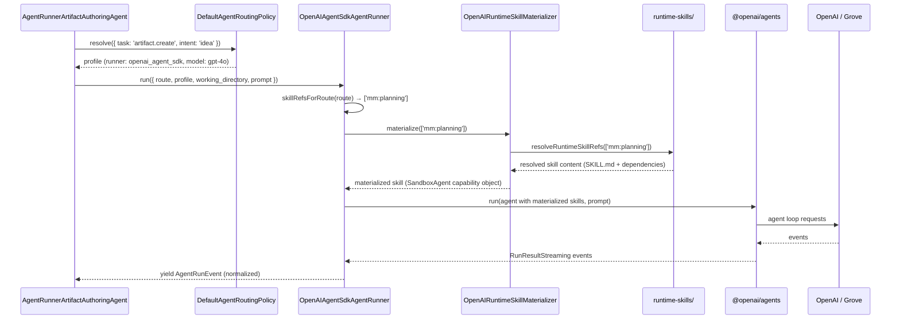

# OpenAI Agent SDK Runner

## What

The OpenAI Agent SDK Runner adds a new agent runner class to Autocatalyst's adapter layer — one that drives the OpenAI Agents SDK (`@openai/agents`) instead of the Claude Agent SDK. When a profile in `autocatalyst.yaml` specifies `runner: ``openai_agent_sdk`, this runner handles all agent tasks: it accepts an `AgentRunRequest`, selects and materializes only the runtime skills required for the current route, drives the OpenAI Agents SDK loop, and streams the resulting events as `AgentRunEvent`.
The runner works with any service that speaks the OpenAI Agents API: OpenAI's hosted API, Azure OpenAI deployments, or any self-hosted compatible endpoint. For Azure APIM and Grove deployments that require the `api-key` request header in place of `Authorization: Bearer`, the runner applies the same header override as `OpenAIDirectModelRunner`.
## Why

Issue #105 defines `openai_agent_sdk` as a valid `RunnerKind` in `src/types/config.ts`, and the config types already include it. Issue #89 introduced the `runtime-skills/` catalog so skills can be resolved without a local Claude installation. But `composeBuiltInWorkflowRuntime` in `runtime-composition.ts` unconditionally constructs `ClaudeAgentSdkAgentRunner` regardless of which runner the resolved profile declares. Any operator who configures an `openai_agent_sdk` profile today gets Claude's agent behavior regardless, and there is no path to run agent tasks through an OpenAI-protocol endpoint.
This matters for teams that:
- Route all AI traffic through Grove (Azure APIM), which exposes an OpenAI-compatible API
- Prefer GPT-family models for agent tasks such as spec writing and implementation
- Operate under policies that prohibit direct Anthropic API calls
- Want to evaluate OpenAI models for autonomous coding work alongside existing Claude deployments
Closing this gap makes `openai_agent_sdk` a fully functional runner kind, completing the multi-vendor agent routing capability that the config schema has promised since #105.
## Personas

- **Enzo: Engineer** — configures and maintains Autocatalyst; wants to route spec writing and implementation tasks to a GPT-family model through Grove without changing the rest of the workflow loop or breaking existing Anthropic routes.
## Narratives

### Routing spec creation through Grove

Enzo's organization routes all external AI traffic through Grove, an internal Azure APIM gateway that exposes an OpenAI-compatible API. He wants Autocatalyst to generate specs using a GPT-family model. He opens `autocatalyst.yaml`, adds a `grove-key` credential with his Grove API key, adds a `grove` endpoint with `base_url: https://grove.internal/openai`, and creates a `spec-gpt4o` profile with `runner: openai_agent_sdk` and `model: gpt-4o`. He updates `routing.artifact.create` to `spec-gpt4o`. Autocatalyst restarts, validates the config, logs `"Using OpenAI Agents SDK"`, and begins routing spec creation through Grove. The spec is generated using the `mm:planning` skill loaded from the `runtime-skills/` catalog. Nothing else in the loop changes.
### Running implementation on OpenAI direct

Enzo wants to evaluate GPT-4o for implementation tasks alongside the existing Claude setup. He adds an `openai-key` credential, an `openai` endpoint with no `base_url`, and an `impl-gpt4o` profile with `runner: openai_agent_sdk`, `model: gpt-4o`, and `reasoning_effort: high`. He updates `routing.implementation.run` to `impl-gpt4o`. Autocatalyst builds `OpenAIAgentSdkAgentRunner` for this profile and runs implementation requests through it, loading `superpowers:writing-plans` and `superpowers:subagent-driven-development` from the catalog. Claude handles all other routes unchanged.
## User stories

**Routing agent tasks through Grove**
- Enzo can configure an `openai_agent_sdk` profile in `autocatalyst.yaml` with a Grove endpoint and start the service without errors
- Enzo can route `artifact.create` to an `openai_agent_sdk` profile and receive a correctly structured spec
- Enzo sees `"Using OpenAI Agents SDK"` logged at startup when an `openai_agent_sdk` profile is configured
- Enzo sees a clear, actionable startup error when the API key credential for an `openai_agent_sdk` profile is missing or unresolved
**Routing implementation through OpenAI direct**
- Enzo can route `implementation.run` to an `openai_agent_sdk` profile and have `superpowers:writing-plans` and `superpowers:subagent-driven-development` loaded from the catalog automatically
- Enzo can set `base_url` on an `openai_agent_sdk` endpoint and have the `api-key` header applied automatically, with no extra config
**Skill handling**
- Routes with no required skills (`question.answer`, `intent.classify`, `pr.title_generate`, `artifact.revise`) run without skill setup
- A missing catalog entry or missing skill file produces a clear error at run time before the SDK loop starts, not a silent failure mid-run
## Goals

- `OpenAIAgentSdkAgentRunner.run()` accepts `AgentRunRequest`, materializes only the runtime skills required for the route, drives the OpenAI Agents SDK loop, and streams well-formed `AgentRunEvent`
- `buildAgentRunner` in `runtime-composition.ts` dispatches on the runner kind declared by the resolved profile: returns `OpenAIAgentSdkAgentRunner` when the profile's runner is `openai_agent_sdk`, returns `ClaudeAgentSdkAgentRunner` when the profile's runner is `claude_agent_sdk`, and throws a clear startup error for any other runner kind — there is no default
- Route-to-skill mapping is applied at run time based on route and intent: `artifact.create/idea` → `mm:planning`; `artifact.create/bug|chore` and `issue.triage` → `mm:issue-triage`; `implementation.run` → `superpowers:writing-plans` + `superpowers:subagent-driven-development`; all others → no skills
- `SandboxAgent` (currently in beta in `@openai/agents`) is the preferred skill-passing mechanism: `OpenAIRuntimeSkillMaterializer` must use `SandboxAgent`'s native `capabilities` API to pass skills as first-class objects rather than injecting raw `SKILL.md` text into system instructions; this enables proper sandboxed execution and tool exposure as designed by the `@openai/agents` SDK
- The runner emits OTLP telemetry on every run: `autocatalyst.agent.turns` (counter), `autocatalyst.agent.runs` (counter with `outcome` attribute), and `autocatalyst.adapter.latency` (histogram), using `component: 'openai-agent-sdk'` to match the metric naming conventions of `ClaudeAgentSdkAgentRunner`
- Grove/Azure APIM compatibility: when the resolved endpoint has a `base_url`, the `api-key` header is set on all requests
- Missing catalog entries or files produce a clear error before the SDK loop starts
- `tsc --noEmit` passes after all changes
## Non-goals

- A composite agent runner that dispatches per-request across both Claude and OpenAI runner kinds (a valid future enhancement, not in scope here)
- Streaming responses for direct model tasks (handled by `OpenAIDirectModelRunner`)
- The direct OpenAI runner (`openai_direct`, covered by #111)
- Hot-swapping runner configuration without a restart
- IAM or workload identity credential types (only `api_key` is supported for `openai_agent_sdk`)
- OpenAI fine-tuned models or assistants API
## Design spec

*(Not applicable — no UI elements)*
## Tech spec

### 1. Introduction and overview

**Dependencies**
- Issue #105 — complete; `RunnerKind` in `src/types/config.ts` already includes `openai_agent_sdk`
- Issue #111 — complete; `OpenAIDirectModelRunner` establishes the Grove/api-key header pattern; reuse its construction logic
- Issue #89 — complete; `runtime-skills/` catalog, `resolveRuntimeSkillRefs`, and `materializeClaudeRuntimeSkillPlugins` are available and tested
- `src/types/ai.ts` — `AgentRunner`, `AgentRunRequest`, `AgentRunEvent`, `AgentSkillRef`
- `src/types/config.ts` — `ProfileConfig.runner: RunnerKind`, `EndpointConfig.base_url`, `CredentialConfig`
- `src/adapters/runtime-composition.ts` — `composeBuiltInWorkflowRuntime` is the wiring point
- `@openai/agents` npm package — not yet a dependency; must be added
- `openai` npm package — already a dependency (`^6.37.0`); reuse for client construction
**Technical goals**
- `OpenAIAgentSdkAgentRunner` implements `AgentRunner` with an injectable `runFn` for testing (same pattern as `ClaudeAgentSdkAgentRunner.queryFn`)
- Route-based skill resolution is a pure function: given a route and optional intent, return the list of `AgentSkillRef` values required — no I/O, fully testable
- `buildAgentRunner` mirrors `buildDirectModelRunner` in structure: inspects the resolved profile's runner kind and dispatches accordingly — `openai_agent_sdk` → `OpenAIAgentSdkAgentRunner`, `claude_agent_sdk` → `ClaudeAgentSdkAgentRunner`, any other kind → startup error
- Grove/Azure APIM support reuses the same `api-key` defaultHeaders pattern from `OpenAIDirectModelRunner`; no new config fields
**Non-goals (technical)**
- No new config schema fields
- No database, state, or storage changes
- No changes to `AgentRoutingPolicy`, `AgentRunnerArtifactAuthoringAgent`, or other agent service classes — they accept `AgentRunner` by interface
**Glossary**
- **`@openai/agents`** — the OpenAI TypeScript SDK for building agentic AI applications
- **`SandboxAgent`** — beta feature in `@openai/agents` providing isolated Unix-like execution environments with filesystems, shell access, and a native `capabilities` API for passing skills as first-class objects
- **skill materialization** — the process of reading runtime skill content from the catalog and converting it into a form the runner can use (via `SandboxAgent` capabilities or instruction-injection)
- **`openai_agent_sdk`** — the runner kind for agent (multi-turn, tool-using) calls via the OpenAI Agents SDK
- **Grove** — Azure APIM gateway for AI traffic; uses `api-key` header instead of `Authorization: Bearer`
- **`runFn`** — injected function wrapping the SDK agent loop; used in tests to avoid real HTTP calls
### 2. System design and architecture

**High-level architecture**
```mermaid
graph TD
  RC[runtime-composition.ts\nbuildAgentRunner] -->|openai_agent_sdk profile| OA[OpenAIAgentSdkAgentRunner]
  RC -->|claude_agent_sdk profile| CA[ClaudeAgentSdkAgentRunner]
  RC -->|unknown runner kind| ERR[startup error]
  OA -->|implements| AR[AgentRunner interface]
  CA -->|implements| AR
  AR --> AAA[AgentRunnerArtifactAuthoringAgent]
  AR --> AIA[AgentRunnerImplementationAgent]
  AR --> AITA[AgentRunnerIssueTriageAgent]
  AR --> AQAA[AgentRunnerQuestionAnsweringAgent]
  OA --> SM[OpenAIRuntimeSkillMaterializer]
  SM --> CAT[runtime-skills/ catalog]
  OA --> SDK[@openai/agents SDK]
  SDK --> API[OpenAI / Grove / Azure APIM]
```
**Component breakdown**

Component
Status
Change

`src/adapters/openai/agent-sdk-agent-runner.ts`
New
`OpenAIAgentSdkAgentRunner` class

`src/adapters/openai/openai-runtime-skill-materializer.ts`
New
Converts `AgentSkillRef[]` to OpenAI Agents SDK skill form

`src/adapters/runtime-composition.ts`
Modified
`buildAgentRunner` function; dispatch in `composeBuiltInWorkflowRuntime`

`tests/adapters/openai/agent-sdk-agent-runner.test.ts`
New
Unit tests for `OpenAIAgentSdkAgentRunner`

`tests/adapters/openai/openai-runtime-skill-materializer.test.ts`
New
Unit tests for the materializer

`package.json`
Modified
Add `@openai/agents` dependency

**Sequence diagram — spec creation via openai_agent_sdk**

### 3. Detailed design

#### `skillRefsForRoute` — route-to-skill mapping

This is a pure function that returns the skill refs required for a given route. It lives in `src/adapters/openai/agent-sdk-agent-runner.ts`.
```typescript
export function skillRefsForRoute(route: AgentRoute): AgentSkillRef[] {
  if (route.task === 'implementation.run') {
    return ['superpowers:writing-plans', 'superpowers:subagent-driven-development'];
  }
  if (route.task === 'issue.triage') {
    return ['mm:issue-triage'];
  }
  if (route.task === 'artifact.create') {
    if (route.intent === 'idea') return ['mm:planning'];
    if (route.intent === 'bug' || route.intent === 'chore') return ['mm:issue-triage'];
  }
  return [];
}
```
Routes that return no skills: `question.answer`, `intent.classify`, `pr.title_generate`, `artifact.revise`, and any `artifact.create` without a recognized intent.
#### `OpenAIRuntimeSkillMaterializer`

File: `src/adapters/openai/openai-runtime-skill-materializer.ts`
Skills are sourced exclusively from the `runtime-skills/` catalog introduced by issue #89. The runner does not rely on Claude plugin directories, user-local Claude settings, or prompt-only skill references.
The materializer must use `SandboxAgent`'s native `capabilities` API (beta in `@openai/agents/sandbox`) to pass skills as first-class objects. `SandboxAgent` accepts a `capabilities` array including `skills({ from: ... })` entries that map to individual `Skill` objects with `name`, `description`, and `content` (the `SKILL.md` file). This is the correct mechanism — injecting raw `SKILL.md` text into system instructions is the fallback only when `SandboxAgent` is not available for a given execution path.
The implementer must consult the installed `@openai/agents` TypeScript types for the exact `Skill` and `skills()` signatures, as the API is in beta and details may change. The interface below is illustrative; return type and call sites should reflect the actual SDK types.
Key behaviors:
- Returns an empty capabilities array for an empty refs array — no I/O in the no-skills case
- `resolveRuntimeSkillRefs` already validates that every ref is declared in the manifest and that every `SKILL.md` exists; it throws a clear error if not
- Skill content is passed in dependency-resolved order (dependencies before dependents, as guaranteed by the catalog traversal in `resolveSkill`)
- Only skills declared as required for the current route are loaded
Illustrative interface (adjust types to match installed SDK):
```typescript
import { skills as sdkSkills, type Skill } from '@openai/agents/sandbox';
import { readFileSync } from 'node:fs';
import { join } from 'node:path';
import { resolveRuntimeSkillRefs } from '../../core/runtime-skills/catalog.js';
import type { AgentSkillRef } from '../../types/ai.js';

export interface OpenAIRuntimeSkillMaterializerOptions {
  rootDir?: string;
}

export async function materializeOpenAIRuntimeSkills(
  refs: AgentSkillRef[],
  options?: OpenAIRuntimeSkillMaterializerOptions,
) {
  if (refs.length === 0) return [];

  const resolved = resolveRuntimeSkillRefs(refs, { rootDir: options?.rootDir });
  const skillObjects: Skill[] = [];

  for (const provider of resolved.providers) {
    for (const skill of provider.skills) {
      const skillMdPath = join(skill.sourcePath, 'SKILL.md');
      const content = readFileSync(skillMdPath, 'utf-8');
      skillObjects.push({
        name: skill.ref,
        description: `Runtime skill: ${skill.ref}`,
        content,
      });
    }
  }

  return [sdkSkills({ skills: skillObjects })];
}
```
#### `OpenAIAgentSdkAgentRunner`

File: `src/adapters/openai/agent-sdk-agent-runner.ts`
```typescript
import { Agent, SandboxAgent, run as _run } from '@openai/agents';
import OpenAI from 'openai';
import { performance } from 'node:perf_hooks';
import { metrics } from '@opentelemetry/api';
import type { Counter, Histogram, Meter } from '@opentelemetry/api';
import type { AgentRunEvent, AgentRunRequest, AgentRunner, AgentSkillRef } from '../../types/ai.js';
import { materializeOpenAIRuntimeSkills } from './openai-runtime-skill-materializer.js';
import { skillRefsForRoute } from './agent-sdk-agent-runner.js';

type RunFn = typeof _run;

export interface OpenAIAgentSdkAgentRunnerOptions {
  runFn?: RunFn;
  materializeSkills?: (refs: AgentSkillRef[]) => Promise;
  meter?: Meter;
}

export class OpenAIAgentSdkAgentRunner implements AgentRunner {
  private readonly runFn: RunFn;
  private readonly materializeSkills: (refs: AgentSkillRef[]) => Promise;
  private readonly _agentTurns: Counter;
  private readonly _adapterLatency: Histogram;
  private readonly _agentRunOutcome: Counter;

  constructor(
    private readonly apiKey: string,
    private readonly baseUrl: string | undefined,
    private readonly defaultModel: string | undefined,
    options?: OpenAIAgentSdkAgentRunnerOptions,
  ) {
    this.runFn = options?.runFn ?? _run;
    this.materializeSkills =
      options?.materializeSkills ?? materializeOpenAIRuntimeSkills;
    const meter = options?.meter ?? metrics.getMeter('autocatalyst');
    this._agentTurns = meter.createCounter('autocatalyst.agent.turns', {
      unit: '{turn}',
      description: 'Agent turns yielded',
    });
    this._adapterLatency = meter.createHistogram('autocatalyst.adapter.latency', {
      unit: 'ms',
      description: 'Latency of adapter operations',
    });
    this._agentRunOutcome = meter.createCounter('autocatalyst.agent.runs', {
      unit: '{run}',
      description: 'Agent runs completed, by outcome',
    });
  }

  async *run(request: AgentRunRequest): AsyncIterable {
    const model = request.profile?.model ?? this.defaultModel ?? 'gpt-4o';
    const refs = skillRefsForRoute(request.route);
    const skillCapabilities = await this.materializeSkills(refs);

    const clientOptions: ConstructorParameters[0] = { apiKey: this.apiKey };
    if (this.baseUrl) {
      clientOptions.baseURL = this.baseUrl;
      clientOptions.defaultHeaders = { 'api-key': this.apiKey };
    }

    const baseInstructions = [
      'You are an AI agent for software development automation.',
      'Work in the provided working directory.',
      request.working_directory ? `Working directory: ${request.working_directory}` : '',
    ].filter(Boolean).join('\n');

    // SandboxAgent is preferred when skills are required; Agent is used for skill-free routes.
    // Implementer must verify the SandboxAgent constructor signature against installed SDK types.
    const agent = skillCapabilities.length > 0
      ? new SandboxAgent({
          name: 'autocatalyst-agent',
          model,
          instructions: baseInstructions,
          capabilities: skillCapabilities,
        })
      : new Agent({
          name: 'autocatalyst-agent',
          model,
          instructions: baseInstructions,
        });

    const startMs = performance.now();
    let outcome: 'success' | 'error' = 'success';

    try {
      const stream = await this.runFn(agent, request.prompt);
      for await (const event of stream) {
        const normalized = normalizeOpenAIEvent(event);
        if (normalized) {
          if (normalized.type === 'assistant') {
            this._agentTurns.add(1, { component: 'openai-agent-sdk', model });
          }
          yield normalized;
        }
      }
    } catch (err) {
      outcome = 'error';
      throw err;
    } finally {
      this._agentRunOutcome.add(1, { component: 'openai-agent-sdk', model, outcome });
      this._adapterLatency.record(performance.now() - startMs, {
        adapter: 'agent-sdk',
        operation: 'run',
        model,
      });
    }
  }
}

function normalizeOpenAIEvent(event: unknown): AgentRunEvent | null {
  // Map @openai/agents streaming events to AgentRunEvent.
  // Events with a text content payload map to type: 'assistant'.
  // Other event types (tool calls, handoffs, etc.) map to their event type with raw payload.
  if (!event || typeof event !== 'object') return null;
  const e = event as Record;
  if (e.type === 'message_output_item' || e.type === 'agent_updated_stream_event') {
    const content = extractTextContent(e);
    if (content !== null) {
      return { type: 'assistant', content: [{ type: 'text', text: content }] };
    }
  }
  if (typeof e.type === 'string') {
    return { type: e.type, ...e };
  }
  return null;
}

function extractTextContent(event: Record): string | null {
  // Walk common OpenAI Agents SDK event shapes to find text output
  const item = event.item as Record | undefined;
  if (!item) return null;
  if (item.type === 'message' && Array.isArray(item.content)) {
    const textBlock = (item.content as Record[]).find(b => b.type === 'output_text');
    if (textBlock && typeof textBlock.text === 'string') return textBlock.text;
  }
  return null;
}
```
**Important notes on the event mapping:**
The `@openai/agents` SDK event shapes must be verified against the actual SDK version installed. The `normalizeOpenAIEvent` and `extractTextContent` implementations above are illustrative; the implementer must consult the SDK's TypeScript types for the correct event shape. The invariant that must hold: any event containing text output from the model must yield `{ type: 'assistant', content: [{ type: 'text', text: '...' }] }`.
#### `buildAgentRunner` in `runtime-composition.ts`

`buildAgentRunner` dispatches on the runner kind declared by the resolved profile. It does not default to any runner — if the profile's runner kind is unrecognized, it throws a startup error. This ensures misconfigured environments fail fast rather than silently running the wrong runner.
`composeBuiltInWorkflowRuntime` replaces:
```typescript
const agentRunner = new ClaudeAgentSdkAgentRunner({ meter: options.meter });
```
with:
```typescript
const agentRunner = buildAgentRunner(resolvedAi, logger, options.meter);
```
`buildAgentRunner` implementation:
```typescript
export function buildAgentRunner(
  resolvedAi: ResolvedAiConfig,
  logger: RuntimeLogger,
  meter?: Meter,
): AgentRunner {
  const claudeProfile = resolvedAi.profiles.find(p => p.runner === 'claude_agent_sdk');
  if (claudeProfile) {
    return new ClaudeAgentSdkAgentRunner({ meter });
  }

  const openAiAgentProfile = resolvedAi.profiles.find(p => p.runner === 'openai_agent_sdk');
  if (openAiAgentProfile) {
    const endpoint = resolvedAi.endpoints.find(e => e.name === openAiAgentProfile.endpoint)!;
    const credential = resolvedAi.credentials.find(c => c.name === endpoint.credential)!;

    if (credential.type !== 'api_key') {
      throw new Error(
        `Credential type '${credential.type}' is not supported for openai_agent_sdk runner`,
      );
    }

    logger.info(
      {
        event: 'service.config',
        provider: 'openai',
        runner: 'openai_agent_sdk',
        model: openAiAgentProfile.model ?? 'default',
        base_url: endpoint.base_url ?? 'default',
      },
      'Using OpenAI Agents SDK',
    );

    return new OpenAIAgentSdkAgentRunner(
      credential.resolvedValue!,
      endpoint.base_url,
      openAiAgentProfile.model,
      { meter },
    );
  }

  const runnerKinds = resolvedAi.profiles.map(p => p.runner).join(', ') || 'none';
  throw new Error(
    `No recognized agent runner configured. Expected a profile with runner: claude_agent_sdk or openai_agent_sdk. Found: ${runnerKinds}`,
  );
}
```
Profile lookup: `claude_agent_sdk` is checked first to preserve current behavior when the config has only Claude profiles. `openai_agent_sdk` is checked next. Any other runner kind — or a config with no agent runner profiles — throws a clear startup error. Mixed configs (some routes on Claude, some on OpenAI) are a non-goal for this feature.
**No data model or API contract changes** — this feature adds no new HTTP endpoints, database tables, or schema migrations.
### 4. Security, privacy, and compliance

- API keys are injected via environment variables and resolved by `resolveAiConfig` before `buildAgentRunner` runs; the runner never reads env directly
- The `api-key` header value is identical to the API key credential — no new credential surface is introduced
- API keys are never logged; the `service.config` log event records only `provider`, `runner`, `model`, and `base_url`
- No user-generated content is stored by the runner; the agent loop is fire-and-forget
- Runtime skill content ([SKILL.md](http://SKILL.md) files) is read from the local `runtime-skills/` directory and passed to the agent as `SandboxAgent` capability objects; it is never sent to external logging or storage
### 5. Observability

The runner emits the same three OTLP metrics as `ClaudeAgentSdkAgentRunner`, with `component: 'openai-agent-sdk'` as the differentiating attribute:

Metric
Type
Attributes

`autocatalyst.agent.turns`
Counter
`component`, `model`

`autocatalyst.agent.runs`
Counter
`component`, `model`, `outcome`

`autocatalyst.adapter.latency`
Histogram (ms)
`adapter: 'agent-sdk'`, `operation: 'run'`, `model`

One `service.config` log event is emitted at startup: `{ event: 'service.config', provider: 'openai', runner: 'openai_agent_sdk', model, base_url }` at `INFO` level.
### 6. Testing plan

**Unit tests — ****`skillRefsForRoute`** (`tests/adapters/openai/agent-sdk-agent-runner.test.ts`)
- Returns `['mm:planning']` for `{ task: 'artifact.create', intent: 'idea' }`
- Returns `['mm:issue-triage']` for `{ task: 'artifact.create', intent: 'bug' }`
- Returns `['mm:issue-triage']` for `{ task: 'artifact.create', intent: 'chore' }`
- Returns `['mm:issue-triage']` for `{ task: 'issue.triage' }`
- Returns `['superpowers:writing-plans', 'superpowers:subagent-driven-development']` for `{ task: 'implementation.run' }`
- Returns `[]` for `{ task: 'question.answer' }`, `{ task: 'artifact.revise' }`, `{ task: 'intent.classify' }`, `{ task: 'pr.title_generate' }`
- Returns `[]` for `{ task: 'artifact.create' }` with no intent
**Unit tests — ****`OpenAIAgentSdkAgentRunner`** (`tests/adapters/openai/agent-sdk-agent-runner.test.ts`)
- `run()` calls `materializeSkills` with the skill refs for the route
- `run()` calls `runFn` with a `SandboxAgent` (when skills are present) or `Agent` (when no skills) with the resolved model and instructions
- `run()` yields `{ type: 'assistant', content: [...] }` events for model text output
- `run()` sets `api-key` header when `baseUrl` is provided (verify via spy on agent model config)
- `run()` uses `request.profile?.model` as model when set, falling back to `defaultModel`, then `'gpt-4o'`
- Metrics: `autocatalyst.agent.turns` increments once per assistant event; `autocatalyst.agent.runs` records `outcome: 'success'` on clean exit and `outcome: 'error'` when `runFn` throws; `autocatalyst.adapter.latency` records a positive value
All tests use mock `runFn` and mock `materializeSkills` — no real HTTP calls or file I/O.
**Unit tests — ****`materializeOpenAIRuntimeSkills`** (`tests/adapters/openai/openai-runtime-skill-materializer.test.ts`)
- Returns `[]` for an empty refs array
- Returns a non-empty capabilities array containing the `SKILL.md` content for a resolved skill ref
- Propagates errors from `resolveRuntimeSkillRefs` for unknown refs
**Unit tests — ****`buildAgentRunner`** (extend `tests/adapters/runtime-composition.test.ts` or add new file)
- Returns `ClaudeAgentSdkAgentRunner` when the resolved profile's runner is `claude_agent_sdk`
- Returns `OpenAIAgentSdkAgentRunner` when the resolved profile's runner is `openai_agent_sdk`
- Throws a clear startup error when no recognized runner kind is configured
- Throws when the `openai_agent_sdk` profile uses a non-`api_key` credential
- Logs `service.config` with correct provider, runner, model, and base_url
### 7. Alternatives considered

**Reusing ****`materializeClaudeRuntimeSkillPlugins`**** instead of a new materializer**
The Claude materializer copies plugin directories to a temp location and returns `AgentPluginConfig[]` with local paths. The Claude Agent SDK loads these as plugins with their own tools and instructions. The OpenAI Agents SDK has no equivalent plugin-loading mechanism — it does not accept local plugin directories. A new materializer that reads [SKILL.md](http://SKILL.md) content and passes it via `SandboxAgent` capabilities is the correct abstraction. Rejected for reuse.
**A composite runner that dispatches per-request across Claude and OpenAI**
If the routing config maps some routes to `claude_agent_sdk` profiles and others to `openai_agent_sdk` profiles, a single runner cannot serve both. A `RoutingAwareAgentRunner` (similar to `RoutingAwareDirectModelRunner`) would hold one runner per kind and dispatch on `request.profile?.runner`. This is a valid future enhancement; for this feature, the simpler approach of picking one runner kind at startup is sufficient and matches the current usage pattern where all agent routes use the same model family. Mixed configs are a non-goal.
**Using the ****`openai`**** npm package directly instead of ****`@openai/agents`**
The `openai` SDK (`^6.37.0`) includes Responses API and Assistants API but does not provide a managed agent loop with tool execution and event streaming at the level the `@openai/agents` SDK does. Building an agent loop from scratch on the raw `openai` SDK would duplicate work the Agents SDK is designed to handle. Rejected in favor of `@openai/agents`.
**Instruction-injection instead of ****`SandboxAgent`**** capabilities for skill passing**
Concatenating `SKILL.md` content into system instructions works but bypasses the `@openai/agents` SDK's designed skill-passing mechanism. `SandboxAgent`'s `capabilities` API passes skills as first-class objects with name, description, and content — enabling proper tool exposure and sandboxed execution. The beta status means API details may change, but using the SDK-native path is correct and the implementer should pin to a tested version. Rejected in favor of `SandboxAgent` capabilities.
### 8. Risks

Risk
Likelihood
Mitigation

`@openai/agents` TypeScript event shapes differ from the spec's assumptions
Medium
Implementer must consult the installed SDK's types; `normalizeOpenAIEvent` is explicitly marked as requiring verification against actual SDK types

`SandboxAgent` beta API changes before this feature ships
Medium
Pin `@openai/agents` to a specific tested version; review release notes before upgrading. The skill-passing invariant (skills as first-class capability objects) is unlikely to change even if method signatures do

Grove endpoint rejects requests despite correct `api-key` header
Medium (runtime)
Cannot be caught at startup; surfaced as a runtime error on first agent run. Document the Grove config pattern in the operator guide

Mixed configs (some routes on Claude, some on OpenAI) silently route everything to one runner
Low for current users
Documented as a non-goal; `buildAgentRunner` uses the first matching runner kind found. Operators relying on mixed configs should wait for the composite runner feature

`@openai/agents` version incompatibility with `openai ^6.37.0`
Low
Both packages are from OpenAI; check peer dependency requirements before pinning versions

## Task list

- [ ] **Story: Add the OpenAI Agents SDK package**
	- [ ] **Task: Add ****`@openai/agents`**** package dependency**
		- **Description**: Run `npm install @openai/agents` to add the package as a production dependency. Verify the installed version is compatible with the currently installed `openai ^6.37.0` (check peer dependency requirements). Confirm `tsc --noEmit` still passes after install.
		- **Acceptance criteria**:
			- [ ] `@openai/agents` appears in `package.json` `dependencies`
			- [ ] `npm install` completes without errors or peer dependency conflicts
			- [ ] `tsc --noEmit` passes after install
		- **Dependencies**: None
- [ ] **Story: Implement ****`skillRefsForRoute`**** and ****`OpenAIAgentSdkAgentRunner`**
	- [ ] **Task: Implement ****`skillRefsForRoute`**
		- **Description**: Create `src/adapters/openai/agent-sdk-agent-runner.ts`. Implement and export `skillRefsForRoute(route: AgentRoute): AgentSkillRef[]` as a pure function using the route-to-skill mapping table in the tech spec. No I/O, no imports from external packages.
		- **Acceptance criteria**:
			- [ ] Returns `['mm:planning']` for `artifact.create / intent: idea`
			- [ ] Returns `['mm:issue-triage']` for `artifact.create / intent: bug` and `artifact.create / intent: chore`
			- [ ] Returns `['mm:issue-triage']` for `issue.triage`
			- [ ] Returns `['superpowers:writing-plans', 'superpowers:subagent-driven-development']` for `implementation.run`
			- [ ] Returns `[]` for `question.answer`, `artifact.revise`, `intent.classify`, `pr.title_generate`, and `artifact.create` with no recognized intent
			- [ ] `tsc --noEmit` passes
		- **Dependencies**: Task: Add `@openai/agents` package dependency
	- [ ] **Task: Implement ****`materializeOpenAIRuntimeSkills`**
		- **Description**: Create `src/adapters/openai/openai-runtime-skill-materializer.ts`. Use `SandboxAgent`'s native `capabilities` API from `@openai/agents/sandbox` — consult the installed TypeScript types for the exact `Skill` and `skills()` signatures. Call `resolveRuntimeSkillRefs`, read the `SKILL.md` for each resolved skill, construct a `Skill` object per entry, and return `[sdkSkills({ skills: [...] })]`. Return `[]` for an empty refs array. Let `resolveRuntimeSkillRefs` throw for missing catalog entries or files — do not catch.
		- **Acceptance criteria**:
			- [ ] Returns `[]` for an empty refs array (no file I/O)
			- [ ] Returns a non-empty capabilities array containing each skill's content for valid refs
			- [ ] Propagates errors from `resolveRuntimeSkillRefs` without wrapping
			- [ ] `tsc --noEmit` passes
		- **Dependencies**: Task: Implement `skillRefsForRoute`
	- [ ] **Task: Write unit tests for ****`skillRefsForRoute`**
		- **Description**: Create `tests/adapters/openai/agent-sdk-agent-runner.test.ts`. Add a `describe('skillRefsForRoute')` block covering every route kind listed in the acceptance criteria above.
		- **Acceptance criteria**:
			- [ ] One test per route kind documented in the tech spec
			- [ ] `vitest run` passes with no failures
		- **Dependencies**: Task: Implement `skillRefsForRoute`
	- [ ] **Task: Write unit tests for ****`materializeOpenAIRuntimeSkills`**
		- **Description**: Create `tests/adapters/openai/openai-runtime-skill-materializer.test.ts`. Use a `rootDir` pointing to the actual `runtime-skills/` directory (integration-style) or stub `resolveRuntimeSkillRefs` (unit-style). Cover: empty refs returns `[]`, valid ref returns capabilities array containing expected skill content, invalid ref propagates error.
		- **Acceptance criteria**:
			- [ ] Test: empty refs → returns `[]`
			- [ ] Test: valid skill ref → returned capabilities array contains the skill's `SKILL.md` content
			- [ ] Test: unknown skill ref → error propagated
			- [ ] `vitest run` passes with no failures
		- **Dependencies**: Task: Implement `materializeOpenAIRuntimeSkills`
	- [ ] **Task: Implement ****`OpenAIAgentSdkAgentRunner`**
		- **Description**: In `src/adapters/openai/agent-sdk-agent-runner.ts`, implement `OpenAIAgentSdkAgentRunner` implementing `AgentRunner`. Constructor accepts `apiKey`, optional `baseUrl`, optional `defaultModel`, and `OpenAIAgentSdkAgentRunnerOptions` (injectable `runFn`, `materializeSkills`, `meter`). The `run()` method: (1) resolves skill refs via `skillRefsForRoute`; (2) calls `materializeSkills` to get `SandboxAgent` capability objects; (3) constructs an OpenAI client with `api-key` header override when `baseUrl` is set; (4) builds a `SandboxAgent` (with capabilities) when skills are present, or a plain `Agent` when no skills; (5) calls `runFn(agent, prompt)` and iterates the stream; (6) normalizes each event via `normalizeOpenAIEvent` and yields non-null results; (7) records telemetry counters and histogram. Implement `normalizeOpenAIEvent` — consult the installed `@openai/agents` TypeScript types for the correct event shapes and adjust from the illustrative design above.
		- **Acceptance criteria**:
			- [ ] `run()` calls `materializeSkills` with the correct refs for the route
			- [ ] `run()` uses `SandboxAgent` with capabilities when skills are present, plain `Agent` otherwise
			- [ ] `run()` yields `{ type: 'assistant', content }` for model text output events
			- [ ] When `baseUrl` is set, the OpenAI client is constructed with `api-key` header
			- [ ] Telemetry: turns counter increments on assistant events; runs counter records success/error; latency histogram records elapsed time
			- [ ] `tsc --noEmit` passes
		- **Dependencies**: Task: Implement `materializeOpenAIRuntimeSkills`; Task: Add `@openai/agents` package dependency
	- [ ] **Task: Write unit tests for ****`OpenAIAgentSdkAgentRunner`**
		- **Description**: Extend `tests/adapters/openai/agent-sdk-agent-runner.test.ts` with a `describe('OpenAIAgentSdkAgentRunner')` block. Use injectable `runFn` and `materializeSkills` to avoid real HTTP calls and file I/O. Cover all acceptance criteria from the testing plan in the tech spec.
		- **Acceptance criteria**:
			- [ ] Test: `run()` calls `materializeSkills` with skill refs matching the route
			- [ ] Test: `run()` uses `SandboxAgent` when `materializeSkills` returns non-empty capabilities
			- [ ] Test: `run()` yields `{ type: 'assistant', content }` for text output events
			- [ ] Test: `api-key` header is set when `baseUrl` is provided
			- [ ] Test: model resolves from `profile.model` → `defaultModel` → `'gpt-4o'`
			- [ ] Test: turns counter increments once per assistant event
			- [ ] Test: runs counter records `outcome: 'success'` on clean exit
			- [ ] Test: runs counter records `outcome: 'error'` when `runFn` throws
			- [ ] Test: latency histogram records a value
			- [ ] `vitest run` passes with no failures
		- **Dependencies**: Task: Implement `OpenAIAgentSdkAgentRunner`
- [ ] **Story: Wire ****`openai_agent_sdk`**** into ****`runtime-composition.ts`**
	- [ ] **Task: Implement ****`buildAgentRunner`**** and update ****`composeBuiltInWorkflowRuntime`**
		- **Description**: In `src/adapters/runtime-composition.ts`: (1) Add `buildAgentRunner(resolvedAi, logger, meter?)` function that checks for a `claude_agent_sdk` profile first (returns `ClaudeAgentSdkAgentRunner`), then checks for an `openai_agent_sdk` profile (validates `api_key` credential, logs the `service.config` event, returns `OpenAIAgentSdkAgentRunner`), and throws a clear error if neither is found. (2) Replace the hardcoded `new ClaudeAgentSdkAgentRunner({ meter })` with `buildAgentRunner(resolvedAi, logger, options.meter)`. Import `OpenAIAgentSdkAgentRunner` from `./openai/agent-sdk-agent-runner.js`. Add `AgentRunner` to the imports from `../types/ai.js`.
		- **Acceptance criteria**:
			- [ ] `buildAgentRunner` returns `ClaudeAgentSdkAgentRunner` when the profile runner is `claude_agent_sdk`
			- [ ] `buildAgentRunner` returns `OpenAIAgentSdkAgentRunner` when the profile runner is `openai_agent_sdk`
			- [ ] Throws a clear startup error when no recognized runner kind is configured
			- [ ] Throws a clear startup error when the `openai_agent_sdk` profile uses a non-`api_key` credential
			- [ ] Logs `{ event: 'service.config', provider: 'openai', runner: 'openai_agent_sdk', model, base_url }` at INFO
			- [ ] `tsc --noEmit` passes
			- [ ] `vitest run` passes — no regressions in existing tests
		- **Dependencies**: Task: Implement `OpenAIAgentSdkAgentRunner`