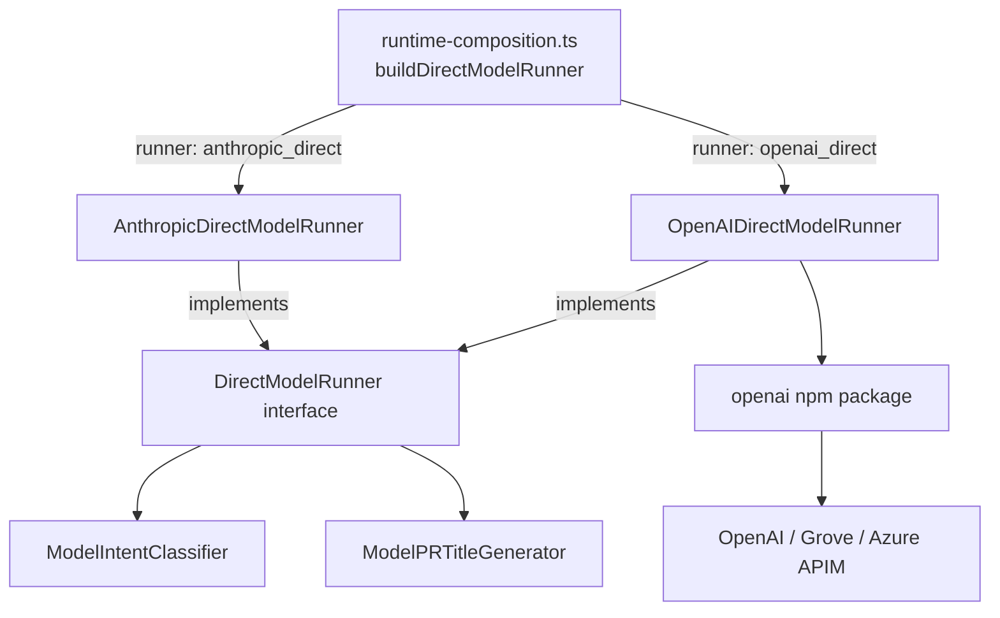
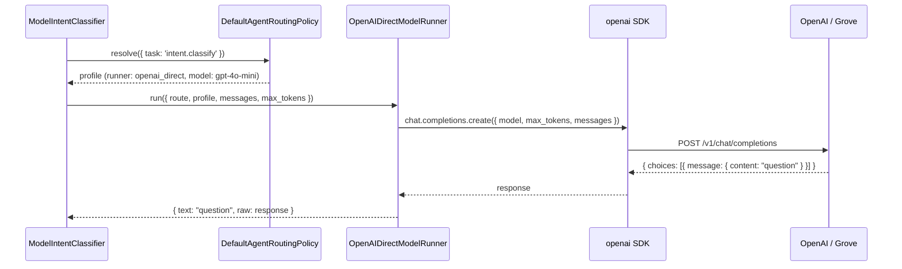

# OpenAI Direct Model Runner

## What

The OpenAI Direct Model Runner adds a new runner class to Autocatalyst's AI adapter layer — one that speaks the OpenAI Chat Completions protocol. When a profile in `autocatalyst.yaml` specifies `runner: openai_direct`, this runner handles the request: it translates Autocatalyst's internal `DirectModelRunRequest` into an OpenAI Chat Completions call, sends it to the configured endpoint, and returns the response as a `DirectModelRunResult`.
The runner works with any service that speaks the OpenAI Chat Completions API: OpenAI's hosted API, Azure OpenAI deployments, or any self-hosted compatible endpoint. For Azure APIM and Grove deployments that require the `api-key` request header in place of `Authorization: Bearer`, the runner applies that override automatically when a custom base URL is configured.
## Why

The config schema introduced in #105 defines `openai_direct` as a valid runner kind, and the config types already include it in `RunnerKind`. But the runtime only handles `anthropic_direct` profiles — `buildDirectModelRunner` in `runtime-composition.ts` throws at startup when it can't find an Anthropic profile to instantiate. Any operator who configures an `openai_direct` profile gets a startup error rather than a working system.
This gap makes `openai_direct` a config option you can write but never run. Closing it is the minimum required to make multi-vendor direct model routing functional — enabling operators to route lightweight tasks like intent classification to cost-optimized OpenAI-compatible models without code changes, and opening the door to Grove-gated Azure deployments.
## Personas

- **Enzo: Engineer** — configures and maintains Autocatalyst; adds an `openai_direct` profile to route classification tasks to a lightweight model and needs the service to start cleanly and produce correct results.
## Narratives

### Routing classification through a cost-optimized endpoint

Enzo's team runs Autocatalyst with an Anthropic profile for implementation work. Classification calls are fast and cheap to run through a smaller model, so Enzo wants to point them at `gpt-4o-mini`. He opens `autocatalyst.yaml`, adds an `openai-key` credential with the OpenAI API key value template, adds an `openai-direct` endpoint, and creates a `classify-gpt4o-mini` profile with `runner: openai_direct` and `model: gpt-4o-mini`. He updates `routing.intent.classify` to `classify-gpt4o-mini`. Autocatalyst restarts, validates all config cross-references, logs `"Using OpenAI direct API"`, and begins routing classification requests through the OpenAI endpoint. Classification latency drops and cost falls — nothing else in the loop changes.
### Connecting Autocatalyst to Grove (Azure APIM)

Enzo's organization routes all external AI traffic through Grove, an internal Azure APIM gateway. Grove authenticates via the `api-key` header instead of `Authorization: Bearer`. Enzo sets `base_url: https://grove.internal/openai` on the endpoint entry in `autocatalyst.yaml`. Autocatalyst picks up the `base_url`, constructs the OpenAI client with `defaultHeaders: { 'api-key': ... }` and the custom base URL, and calls reach Grove without any special handling. The rest of the call path is identical to a direct OpenAI request.
## User stories

**Routing classification through a cost-optimized endpoint**
- Enzo can configure an `openai_direct` profile in `autocatalyst.yaml` and start the service without errors
- Enzo can route `intent.classify` to an `openai_direct` profile and receive correct intent classification results
- Enzo can route `pr.title_generate` to an `openai_direct` profile and receive correct PR title text
**Connecting Autocatalyst to Grove (Azure APIM)**
- Enzo can set `base_url` on an `openai_direct` endpoint and have the `api-key` header applied automatically, with no extra config
- Enzo sees a clear, actionable startup error when the API key credential for an `openai_direct` profile is missing or unresolved
## Goals

- `OpenAIDirectModelRunner.run()` correctly maps `DirectModelRunRequest` to OpenAI Chat Completions format and returns a well-formed `DirectModelRunResult`
- `buildDirectModelRunner` returns an `OpenAIDirectModelRunner` when the resolved profile has `runner: openai_direct`
- When the endpoint has a `base_url`, the `api-key` header is set automatically (Grove/Azure APIM compatibility)
- A missing or unresolved API key for an `openai_direct` profile produces a clear startup error — it does not fail silently at first use
- `tsc --noEmit` passes after all changes
## Non-goals

- Streaming responses for direct model tasks
- Function calling or tool use in the `openai_direct` runner
- The OpenAI Agents runner (`openai_agents` — a separate runner kind handled by a different feature)
- IAM or workload identity credential types for `openai_direct` (only `api_key` is supported)
- Hot-swapping runner configuration without a restart
## Design spec

*(Not applicable — no UI elements)*
## Tech spec

### 1. Introduction and overview

**Dependencies**
- Issue #105 — closed; `RunnerKind` in `src/types/config.ts` already includes `openai_direct`
- `src/types/config.ts` — `ProfileConfig.runner: RunnerKind`, `EndpointConfig.base_url`, `CredentialConfig`
- `src/types/ai.ts` — `DirectModelRunner`, `DirectModelRunRequest`, `DirectModelRunResult`
- `src/adapters/runtime-composition.ts` — `buildDirectModelRunner` is the sole wiring point for direct runners
- `openai` npm package — not yet a dependency; must be added
**Technical goals**
- `OpenAIDirectModelRunner` implements `DirectModelRunner` with the same testability affordance as `AnthropicDirectModelRunner` (injectable `createFn`)
- `buildDirectModelRunner` return type narrows to `DirectModelRunner` (interface) rather than the concrete `AnthropicDirectModelRunner`
- Grove/Azure APIM support requires no new config fields — the existing `base_url` on `EndpointConfig` is the signal
- API key absence is detected at startup by `resolveAiConfig` (existing behavior); the runner constructor validates that the resolved value is present before use
**Non-goals (technical)**
- No new config schema fields
- No database, state, or storage changes
- No changes to `ModelIntentClassifier` or `ModelPRTitleGenerator` — they already accept `DirectModelRunner`
**Glossary**
- **Chat Completions** — the OpenAI `/v1/chat/completions` API surface
- **Grove** — MongoDB's internal Azure APIM gateway for AI traffic
- **`openai_direct`** — the runner kind for non-agent, non-streaming OpenAI protocol direct calls
- **`createFn`** — injected function wrapping the SDK call; used in tests to avoid real HTTP calls
### 2. System design and architecture

**High-level architecture**

**Component breakdown**

Component
Status
Change

`src/adapters/openai/direct-model-runner.ts`
New
`OpenAIDirectModelRunner` class

`src/adapters/runtime-composition.ts`
Modified
`buildDirectModelRunner` dispatches on runner kind; return type → `DirectModelRunner`

`tests/adapters/openai/direct-model-runner.test.ts`
New
Unit tests for `OpenAIDirectModelRunner`

`package.json`
Modified
Add `openai` dependency

**Sequence diagram — intent classification via openai_direct**

### 3. Detailed design

**`OpenAIDirectModelRunner`**
File: `src/adapters/openai/direct-model-runner.ts`
```typescript
import OpenAI from 'openai';
import type { DirectModelRunRequest, DirectModelRunResult, DirectModelRunner } from '../../types/ai.js';

export type OpenAIChatCompletionFn = (params: {
  model: string;
  max_tokens: number;
  messages: Array;
}) => Promise }>;

export interface OpenAIDirectModelRunnerOptions {
  createFn?: OpenAIChatCompletionFn;
  defaultModel?: string;
}

export class OpenAIDirectModelRunner implements DirectModelRunner {
  private readonly createFn: OpenAIChatCompletionFn;
  private readonly defaultModel?: string;

  constructor(apiKey: string, baseUrl?: string, options?: OpenAIDirectModelRunnerOptions) {
    if (options?.createFn) {
      this.createFn = options.createFn;
    } else {
      const clientOptions: ConstructorParameters[0] = { apiKey };
      if (baseUrl) {
        clientOptions.baseURL = baseUrl;
        clientOptions.defaultHeaders = { 'api-key': apiKey };
      }
      const client = new OpenAI(clientOptions);
      this.createFn = params =>
        client.chat.completions.create(params) as Promise;
        }>;
    }
    this.defaultModel = options?.defaultModel;
  }

  async run(request: DirectModelRunRequest): Promise {
    const model = request.model ?? request.profile?.model ?? this.defaultModel;
    if (!model) {
      throw new Error(`Direct model route ${request.route.task} requires a model`);
    }

    const raw = await this.createFn({
      model,
      max_tokens: request.max_tokens ?? 1024,
      messages: request.messages,
    });

    return {
      text: raw.choices[0]?.message.content ?? '',
      raw,
    };
  }
}
```
**`buildDirectModelRunner`**** changes in ****`runtime-composition.ts`**
Return type changes from `AnthropicDirectModelRunner` to `DirectModelRunner`. The function adds a branch for `openai_direct` before the existing Anthropic branches. The profile lookup is updated to accept either runner kind.
```typescript
export function buildDirectModelRunner(
  resolvedAi: ResolvedAiConfig,
  logger: RuntimeLogger,
): DirectModelRunner {
  const directProfile =
    resolvedAi.profiles.find(p => p.runner === 'openai_direct') ??
    resolvedAi.profiles.find(p => p.runner === 'anthropic_direct');

  if (!directProfile) {
    throw new Error(
      'No profile with runner "openai_direct" or "anthropic_direct" found in autocatalyst.yaml ai.profiles',
    );
  }

  const endpoint = resolvedAi.endpoints.find(e => e.name === directProfile.endpoint)!;
  const credential = resolvedAi.credentials.find(c => c.name === endpoint.credential)!;

  if (directProfile.runner === 'openai_direct') {
    if (credential.type !== 'api_key') {
      throw new Error(`Credential type '${credential.type}' is not supported for openai_direct runner`);
    }
    logger.info(
      { event: 'service.config', provider: 'openai', auth: 'api_key', base_url: endpoint.base_url ?? 'default' },
      'Using OpenAI direct API',
    );
    return new OpenAIDirectModelRunner(credential.resolvedValue!, endpoint.base_url, {
      defaultModel: directProfile.model,
    });
  }

  // Existing anthropic_direct / bedrock / bearer_token paths follow unchanged...
```
Profile lookup priority: `openai_direct` is checked first. If no `openai_direct` profile exists, the function falls back to `anthropic_direct` — preserving all current behavior for Anthropic-only configs.
**No data model or API contract changes** — this feature adds no new HTTP endpoints, database tables, or schema migrations.
### 4. Security, privacy, and compliance

- API keys are injected via environment variables and resolved by `resolveAiConfig` before `buildDirectModelRunner` runs; the runner never reads env directly
- The `api-key` header value is identical to the API key credential — no new credential surface is introduced
- API keys are never logged; the `service.config` log event records only `provider`, `auth`, and `base_url`
- No user-generated content is stored by the runner; requests are fire-and-forget
### 5. Observability

- `buildDirectModelRunner` logs one `service.config` event at startup: `{ event: 'service.config', provider: 'openai', auth: 'api_key', base_url }` at `INFO` level — consistent with the Anthropic runner pattern
- No new metrics are added; direct model calls are not currently instrumented, and this runner does not change that
### 6. Testing plan

**Unit tests — ****`OpenAIDirectModelRunner`** (`tests/adapters/openai/direct-model-runner.test.ts`)
- `run()` maps `DirectModelRunRequest.messages` to the correct Chat Completions format
- `run()` returns `{ text, raw }` with `text` set from `choices[0].message.content`
- `run()` resolves model from `request.model`, falling back to `request.profile?.model`, then `defaultModel`
- `run()` throws a descriptive error when no model is resolvable
- Constructor: when `baseUrl` is provided, `createFn` is called with `api-key` header set (verify via mock)
All tests use a mock `createFn` — no real HTTP calls.
**Unit tests — ****`buildDirectModelRunner`**
Extend or add to `tests/adapters/` coverage to verify:
- Returns `OpenAIDirectModelRunner` when the first matching profile has `runner: openai_direct`
- Returns `AnthropicDirectModelRunner` when no `openai_direct` profile exists and an `anthropic_direct` profile does (no regression)
- Throws when `openai_direct` profile uses a non-`api_key` credential
### 7. Alternatives considered

**Raw ****`fetch`**** instead of the ****`openai`**** SDK**
A raw `fetch` to `/v1/chat/completions` would avoid adding the `openai` dependency. The request and response shapes are simple enough that this would work. Rejected because the SDK handles retries, type safety, and streaming/non-streaming response parsing; the `openai` package is the canonical client and the only real downside is binary size, which does not matter here.
**Single composite runner with per-profile dispatch**
Instead of having `buildDirectModelRunner` pick one runner at startup, a `CompositeDirectModelRunner` could hold multiple runners and dispatch based on `request.profile?.runner`. This would support mixed configs where `intent.classify` and `pr.title_generate` use different provider types. Rejected for this feature: the current architecture passes a single `directModelRunner` instance to both `ModelIntentClassifier` and `ModelPRTitleGenerator`, and the routing policy already resolves which profile to use per task. The composite pattern is a valid future enhancement but adds complexity not needed now.
### 8. Risks

Risk
Likelihood
Mitigation

`openai` package API surface differs from expected
Low
The `chat.completions.create` shape is stable and well-documented; mock `createFn` in tests isolates the runner from SDK changes

`buildDirectModelRunner` return type change breaks a caller
Low
Only `composeBuiltInWorkflowRuntime` calls it; the result is typed as `DirectModelRunner` at the call site

Grove endpoint rejects requests despite correct `api-key` header
Medium (runtime, not build-time)
Cannot be caught at startup; surfaced as a runtime error on first classification call. Mitigation: document the Grove config pattern in the operator guide

## Task list

- [ ] **Story: Add the OpenAI Direct Model Runner**
	- [ ] **Task: Add ****`openai`**** package dependency**
		- **Description**: Run `npm install openai` to add the `openai` npm package as a production dependency in `package.json`. Confirm the installed version is `^4.x.x`.
		- **Acceptance criteria**:
			- [ ] `openai` appears in `package.json` `dependencies` with a `^4.x.x` version
			- [ ] `npm install` completes without errors
			- [ ] `tsc --noEmit` still passes after the install
		- **Dependencies**: None
	- [ ] **Task: Implement ****`OpenAIDirectModelRunner`**
		- **Description**: Create `src/adapters/openai/direct-model-runner.ts`. Implement `OpenAIDirectModelRunner` implementing `DirectModelRunner`. The constructor accepts `apiKey: string`, optional `baseUrl?: string`, and optional `OpenAIDirectModelRunnerOptions` (injectable `createFn` and `defaultModel`). When `baseUrl` is provided, the OpenAI client is initialized with `baseURL` and `defaultHeaders: { 'api-key': apiKey }` for Grove/Azure APIM compatibility. The `run()` method resolves the model from `request.model ?? request.profile?.model ?? this.defaultModel`, throws a descriptive error if no model is found, calls `createFn`, and returns `{ text: choices[0]?.message.content ?? '', raw }`. Follow the same structure as `src/adapters/anthropic/direct-model-runner.ts`.
		- **Acceptance criteria**:
			- [ ] `run()` sends correct `{ model, max_tokens, messages }` to `createFn`
			- [ ] `run()` returns `DirectModelRunResult` with `text` from `choices[0].message.content`
			- [ ] `run()` throws `"Direct model route  requires a model"` when no model is resolvable
			- [ ] `run()` defaults `max_tokens` to 1024 when not specified in the request
			- [ ] When `baseUrl` is provided, the default OpenAI client is built with `baseURL` and `defaultHeaders: { 'api-key': apiKey }`
			- [ ] `tsc --noEmit` passes
		- **Dependencies**: Task: Add `openai` package dependency
	- [ ] **Task: Write unit tests for ****`OpenAIDirectModelRunner`**
		- **Description**: Create `tests/adapters/openai/direct-model-runner.test.ts` using Vitest. Use the injectable `createFn` pattern (same as `tests/adapters/anthropic/direct-model-runner.test.ts`) to avoid real HTTP calls. Cover: correct message mapping, model resolution fallback chain, missing-model error, and the `api-key` header path (verify the mock `createFn` receives the expected args when the runner is constructed with a `baseUrl`).
		- **Acceptance criteria**:
			- [ ] Test: `run()` sends `role: 'user'` messages verbatim to `createFn`
			- [ ] Test: `run()` returns `text` from `choices[0].message.content`
			- [ ] Test: `run()` uses `profile.model` when `request.model` is absent
			- [ ] Test: `run()` uses `defaultModel` when neither `request.model` nor `profile.model` is set
			- [ ] Test: `run()` throws when no model can be resolved
			- [ ] `vitest run` passes with no failures
		- **Dependencies**: Task: Implement `OpenAIDirectModelRunner`
- [ ] **Story: Wire ****`openai_direct`**** into ****`runtime-composition.ts`**
	- [ ] **Task: Update ****`buildDirectModelRunner`**** to dispatch on runner kind**
		- **Description**: In `src/adapters/runtime-composition.ts`, make the following changes: (1) Change the return type of `buildDirectModelRunner` from `AnthropicDirectModelRunner` to `DirectModelRunner`. (2) Update the profile lookup to find either an `openai_direct` or `anthropic_direct` profile (`openai_direct` takes priority if both exist). (3) Add a branch: when `directProfile.runner === 'openai_direct'`, validate that the credential type is `api_key`, log the `service.config` event, and return a new `OpenAIDirectModelRunner` with the resolved API key, `endpoint.base_url`, and `defaultModel`. (4) Update the error message when no direct profile is found to name both runner kinds. Import `OpenAIDirectModelRunner` from `./openai/direct-model-runner.js`.
		- **Acceptance criteria**:
			- [ ] `buildDirectModelRunner` returns `OpenAIDirectModelRunner` when the resolved profile has `runner: openai_direct`
			- [ ] `buildDirectModelRunner` continues to return `AnthropicDirectModelRunner` for all existing Anthropic/Bedrock/bearer paths (no behavior change)
			- [ ] Throws a clear startup error when `openai_direct` profile uses a non-`api_key` credential
			- [ ] Throws a clear startup error when no `openai_direct` or `anthropic_direct` profile exists
			- [ ] Logs `{ event: 'service.config', provider: 'openai', auth: 'api_key', base_url }` at INFO
			- [ ] `tsc --noEmit` passes
			- [ ] `vitest run` passes (no regressions in existing tests)
		- **Dependencies**: Task: Implement `OpenAIDirectModelRunner`