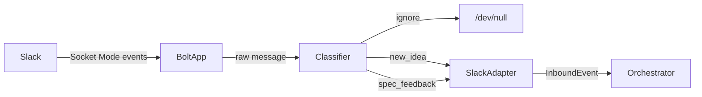
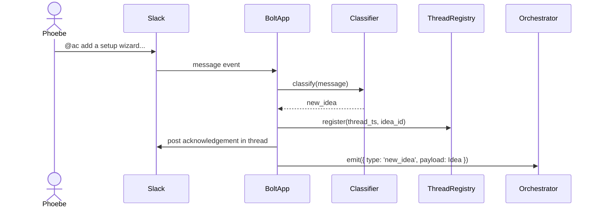
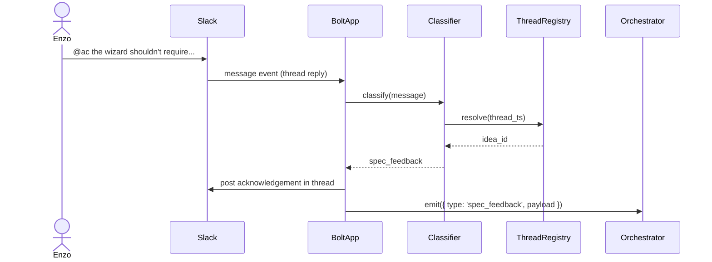

# Slack message routing

## What

Slack message routing connects Autocatalyst to a Slack workspace so that team members can interact with the system through a channel they already use. The feature listens to a designated Slack channel, reads each incoming message, and routes it to the right part of the system based on what the message is trying to do. A new idea gets handed off to the spec pipeline. A reply in an existing idea thread is treated as feedback on that idea's spec. Anything else — a question, a comment, casual conversation — gets a direct conversational response in Slack.

One channel maps to one repository. Ideas and their related threads are organized as one thread per idea, so all discussion about a given idea stays in one place and the system always knows which idea a reply belongs to.

## Why

Human attention is the scarcest resource on the team. Meeting people in Slack — where they already are, where they can respond asynchronously at the right moment — removes friction that would otherwise suppress the volume and quality of ideas and feedback. The combination of a familiar channel and low-ceremony @tagging makes it easy to act on a thought in the moment rather than scheduling it for later.

## Personas

- **Phoebe: Product manager** — seeds ideas and provides spec feedback via Slack
- **Enzo: Engineer** — seeds technical ideas and reviews implementation feedback in threads

## Narratives

### Seeding an idea and refining the spec

Phoebe is reviewing AMP's onboarding metrics when she notices new users struggle with the initial CLI configuration step. Without leaving Slack, she drops a message in `#autocatalyst-amp`: `@ac add a setup wizard to the CLI that walks new users through initial configuration`. Autocatalyst recognizes this as a new idea, opens a thread, and posts a structured spec draft — what, why, narratives, all the way through a task list.

Enzo sees the thread notification, reads the spec, and replies: `@ac the wizard shouldn't require all settings before exiting — new users won't have everything ready`. Autocatalyst routes the reply as spec feedback and acknowledges it in the thread.

> **Note:** The spec revision and updated draft posted in response to Enzo's feedback are handled by a future feature (idea-to-spec). This narrative shows the full loop for context but only the routing and classification steps are in scope here.

### A message not meant for Autocatalyst

Enzo posts in `#autocatalyst-amp`: `anyone know if the Victoria stack supports cardinality limits out of the box?`. No `@ac` mention — it's a question for the team, not a task for the system. Autocatalyst ignores the message entirely. The channel stays usable as a normal team channel without every conversation triggering a response.

## User stories

**Seeding an idea and refining the spec**

- Phoebe can seed a new idea by @mentioning `@ac` in the channel with a description
- Phoebe can see Autocatalyst acknowledge the idea and open a thread with a spec draft
- Enzo can reply to an idea thread with `@ac` to provide spec feedback
- Enzo can see Autocatalyst acknowledge the feedback in the thread

**A message not meant for Autocatalyst**

- Phoebe can post in the channel without `@ac` and have Autocatalyst ignore the message
- Enzo can use the channel for normal team conversation without triggering a response

## Goals

- Autocatalyst connects to a configured Slack channel within 5 seconds of startup
- Messages that do not mention the configured bot handle are never processed or responded to
- Messages that mention the configured bot handle are classified and routed within 3 seconds of receipt
- A new-idea message produces a thread with an acknowledgement reply
- A thread reply mentioning the configured bot handle is correctly identified as spec feedback and routed to the appropriate handler

## Non-goals

- Generating or posting the spec draft (future feature)
- Processing approval signals or implementation feedback (future feature)
- Supporting multiple channels per repo
- Supporting Slack channels across multiple workspaces

## Tech spec

### 1. Introduction and overview

**Dependencies**
- `context-agent/decisions/human-interface-adapter.md` — Slack Bolt SDK chosen; adapter interface defined
- `context-agent/wiki/domain-model.md` — `Idea`, `Approval` entities
- Foundation feature — `Service` lifecycle, `loadConfig`, WORKFLOW.md config loading

**Technical goals**
- Bolt app connects within 5s of service startup and remains connected
- Messages without a bot @mention are dropped before any processing
- @mention messages are classified and routed within 3s of receipt
- Thread-to-idea mapping maintained in memory; a thread reply always resolves to the correct idea

**Non-goals**
- Persisting message history or thread mappings across restarts

**Glossary**
- **Socket Mode** — Slack connection via persistent WebSocket; no public URL required
- **`thread_ts`** — Slack's timestamp-based identifier for a message thread; used to correlate replies to their parent idea
- **Intent classification** — determining what a message is asking the system to do (new idea, spec feedback, or nothing)

### 2. System design and architecture

**New components**

- `src/adapters/slack/bolt-app.ts` — initializes the Bolt app with Socket Mode; connects using `AC_SLACK_BOT_TOKEN` and `AC_SLACK_APP_TOKEN`
- `src/adapters/slack/classifier.ts` — classifies inbound messages as `new_idea`, `spec_feedback`, or `ignore` using the logic below
- `src/adapters/slack/thread-registry.ts` — in-memory `Map<thread_ts, idea_id>`; registers new threads and resolves replies to their parent idea
- `src/adapters/slack/slack-adapter.ts` — implements `HumanInterfaceAdapter`; wires Bolt events to classified event stream

**Classification logic**

Bolt provides the bot's user ID after connecting. Slack encodes mentions as `<@U12345>` in message text. The classifier applies these rules in order:

```
1. Does message.text contain <@{botUserId}>?
   → No: ignore
2. Does message have a thread_ts different from its own ts?
   → Yes + thread_ts in registry: spec_feedback
   → Yes + thread_ts NOT in registry: ignore (unrelated thread reply)
   → No: new_idea
```

The existing `HumanInterfaceAdapter` interface defines `receive(): AsyncIterable<Idea>`. This feature extends the emitted type to a union so both event kinds can flow through:

```typescript
type InboundEvent =
  | { type: 'new_idea'; payload: Idea }
  | { type: 'spec_feedback'; payload: SpecFeedback }
  | { type: 'approval_signal'; payload: ApprovalSignal }
```

**High-level flow**



**Sequence diagram — new idea**



**Sequence diagram — spec feedback**



### 3. Detailed design

**New types** (`src/types/events.ts`)

```typescript
export interface Idea {
  id: string;
  source: 'slack';
  content: string;
  author: string;
  received_at: string;   // ISO 8601
  thread_ts: string;     // used to post replies back to the thread
  channel_id: string;
}

export interface SpecFeedback {
  idea_id: string;
  content: string;
  author: string;
  received_at: string;
  thread_ts: string;
  channel_id: string;
}

export interface ApprovalSignal {
  idea_id: string;
  approver: string;
  emoji: string;
  received_at: string;   // ISO 8601
}

export type InboundEvent =
  | { type: 'new_idea'; payload: Idea }
  | { type: 'spec_feedback'; payload: SpecFeedback }
  | { type: 'approval_signal'; payload: ApprovalSignal }
```

**WorkflowConfig extension** (`src/types/config.ts`)

```typescript
slack?: {
  bot_token?: string;       // $AC_SLACK_BOT_TOKEN (xoxb-)
  app_token?: string;       // $AC_SLACK_APP_TOKEN (xapp-) — required for Socket Mode
  channel_name?: string;    // e.g. "autocatalyst-amp"; resolved to channel ID at startup
  approval_emojis?: string[]; // default: ['thumbsup']
}
```

**WORKFLOW.md config shape**

```yaml
slack:
  bot_token: $AC_SLACK_BOT_TOKEN
  app_token: $AC_SLACK_APP_TOKEN
  channel_name: autocatalyst-amp
  approval_emojis:
    - thumbsup
    - white_check_mark
```

**validateConfig extension**

When `slack` is present, `bot_token`, `app_token`, and `channel_name` must be non-empty strings; `approval_emojis` must be a non-empty array of strings if present, defaulting to `['thumbsup']`. Missing `slack` section is valid — adapter simply won't start.

**Thread registry**

In-memory `Map<string, string>` — `thread_ts → idea_id`. Populated when a new-idea acknowledgement is posted; consulted on every thread reply. Not persisted — lost on restart (deferred to a future feature along with message history replay).

**Acknowledgement messages**

- New idea: `"Got it — I'll work on a spec and post it here."`
- Spec feedback: `"Thanks — I'll incorporate that feedback."`

No API contracts — no HTTP endpoints; all interaction is event-driven through Bolt.

### 4. Security, privacy, and compliance

**Authentication and authorization**

- Bolt SDK verifies Slack request signatures automatically (Socket Mode); no additional auth layer needed
- `AC_SLACK_BOT_TOKEN` and `AC_SLACK_APP_TOKEN` are loaded via `$VAR` resolution in `loadConfig` and redacted before logging per the foundation's logging standard
- No per-user authorization — any Slack user in the configured channel can interact with the bot

**Data privacy**

- Message content is not logged — only metadata (author, channel, intent classification, `thread_ts`)
- Tokens are never written to disk or included in log output

### 5. Observability

**Log events**

| Event | Level | Fields |
|---|---|---|
| `slack.connected` | info | `channel_id`, `channel_name` |
| `slack.message.ignored` | debug | `author`, `channel_id` |
| `slack.message.classified` | info | `author`, `channel_id`, `intent`, `thread_ts` |
| `slack.post.sent` | info | `channel_id`, `thread_ts`, `intent` |
| `slack.disconnected` | warn | `reason` |
| `slack.error` | error | `error` |
| `slack.reaction.classified` | info | `author`, `thread_ts`, `intent` |
| `slack.reaction.ignored` | debug | `author`, `thread_ts` |
| `slack.startup.channel_resolved` | info | `channel_name`, `channel_id` |

Message content is never logged — only metadata. Token values are redacted per the foundation's logging standard.

**Metrics**

- `slack.messages.received` — counter; incremented on every message event reaching the classifier
- `slack.messages.ignored` — counter; incremented when classifier returns `ignore`
- `slack.messages.classified` — counter with `intent` label (`new_idea`, `spec_feedback`); incremented on every routed message
- `slack.connection.status` — gauge; `1` when connected, `0` when disconnected

**Alerting**

`slack.disconnected` not followed by `slack.connected` within 30 seconds triggers an alert. Reconnection within that window is treated as a transient blip; beyond it is an operational issue.

### 6. Testing plan

Tests are organized by component. All tests run in-process with no live Slack API calls. Integration tests use a test double for the Bolt app client, injected via the adapter constructor.

**`classifier.ts` — unit tests**

*Message classification:*
- No `@mention` in text → `ignore`
- `@mention` present, no `thread_ts` → `new_idea`
- `@mention` present, `thread_ts === ts` (root message that started a thread) → `new_idea`
- `@mention` present, `thread_ts !== ts`, `thread_ts` in registry → `spec_feedback`
- `@mention` present, `thread_ts !== ts`, `thread_ts` not in registry → `ignore`
- Message from the bot's own user ID → `ignore` (prevents response loops when the bot posts an acknowledgement)
- `@mention` token is an exact match (`<@U12345>` does not match when botUserId is `U123456`) — substring false-positive guard

*Reaction classification:*
- Emoji in `approval_emojis`, `item.ts` in registry → `approval_signal`
- Emoji not in `approval_emojis` → `ignore` (regardless of registry)
- Emoji in `approval_emojis`, `item.ts` not in registry → `ignore`
- Reaction from the bot's own user ID → `ignore`

**`thread-registry.ts` — unit tests**

- Starts empty: resolve on any key returns `undefined`
- Register `thread_ts → idea_id`, resolve returns correct `idea_id`
- Resolve unregistered key returns `undefined`
- Registering the same `thread_ts` twice: second write overwrites first (last-writer-wins)

**`validateConfig` extension — unit tests**

- Missing `slack` section → valid (adapter won't start, not an error)
- `slack` with all three required fields non-empty → valid
- `slack` with empty `bot_token` → fails with field-specific error
- `slack` with empty `app_token` → fails
- `slack` with empty `channel_name` → fails
- `slack` with `approval_emojis` absent → valid, defaults to `['thumbsup']`
- `slack` with `approval_emojis` as non-empty array → valid, uses provided value
- `slack` with `approval_emojis` as empty array → fails (non-empty required)
- `$VAR` values for `bot_token` and `app_token` resolve from environment correctly
- `redactConfig` masks `bot_token` and `app_token` values

**`slack-adapter.ts` — integration tests (Bolt test double)**

*Startup:*
- `conversations.list` returns a channel matching `channel_name` → ID resolved, `slack.startup.channel_resolved` logged, `slack.connected` logged after connection
- `conversations.list` returns no matching channel → adapter fails to start with a clear error; no messages are processed
- Adapter registers message and reaction event handlers only after channel is resolved (startup ordering)

*New idea pipeline:*
- `@mention` in root message → `client.chat.postMessage` called with correct acknowledgement text in the correct channel/thread; `new_idea` event emitted on the `InboundEvent` stream; `thread_ts` registered in the thread registry
- Emitted `Idea` shape: `source: 'slack'`, `content` is the raw message text, `author` is the Slack user ID, `received_at` is a valid ISO 8601 string, `thread_ts` and `channel_id` match the event
- A subsequent reply to that thread is correctly classified as `spec_feedback` (registry populated by prior step)

*Spec feedback pipeline:*
- `@mention` in thread reply with registered `thread_ts` → acknowledgement posted; `spec_feedback` event emitted
- Emitted `SpecFeedback`: `idea_id` resolved from registry, all other fields correct

*Approval signal pipeline:*
- Reaction in `approval_emojis` on registered message → `approval_signal` emitted
- Emitted `ApprovalSignal`: `idea_id` resolved from registry, `approver` and `received_at` set correctly

*Ignore cases (verify no side effects):*
- Non-mention message in channel → no `postMessage` call, no event emitted
- `@mention` reply to unregistered thread → no `postMessage`, no event
- Non-approval emoji reaction → no event
- Approval emoji reaction on unregistered message → no event
- Message from the bot's own user ID → no `postMessage`, no event

*Error handling:*
- `client.chat.postMessage` throws → `slack.error` logged, exception does not propagate, adapter continues processing subsequent messages
- Bolt emits an `error` event → logged at error level; adapter continues running

*Service lifecycle:*
- `Service.start()` initiates `bolt.start()`; `Service.stop()` calls `bolt.stop()`

### 7. Alternatives considered

**Polling instead of Socket Mode**

Slack offers a REST API that can be polled for new messages. The trade-off is simplicity (no persistent connection to manage) against latency and rate limits. Socket Mode gives near-real-time delivery with no public URL, which fits the local deployment target. Polling was rejected for this reason — it introduces artificial latency and adds complexity to manage polling intervals and deduplication.

**Webhook / Events API instead of Socket Mode**

The Slack Events API sends HTTP POST requests to a public URL. This would require exposing an endpoint, which adds infrastructure that doesn't exist yet and conflicts with the local-first deployment model. Socket Mode achieves the same event delivery without a public URL. This is the primary reason Socket Mode was chosen.

**Storing the bot handle in config instead of resolving from the SDK**

The classifier needs the bot's user ID to detect `<@{botUserId}>` mentions. An alternative is to require operators to configure the user ID explicitly. Resolving it at startup via the SDK is preferable — it removes a manual config step and eliminates a class of misconfiguration where a configured ID drifts from the live bot.

**Persisting the thread registry to disk**

The in-memory registry is lost on restart. Persisting it would allow the adapter to resume correlating replies after a restart. This was deferred to a future feature alongside message history replay — both require a consistent storage strategy, and solving one without the other produces a half-measure. Restarting the service creates a clean registry; replies to threads created before the restart will be classified as `ignore`.

### 8. Risks

**Prompt injection via message content**

A Slack message could contain text crafted to manipulate downstream AI processing — for example, instructions embedded in an idea that attempt to override system prompts. The adapter treats message content as untrusted user input throughout: it logs only metadata, passes `content` as a typed field (not interpolated into any prompt), and never executes or evaluates message text. The risk is noted here because the content does flow into AI processing in later stages; those stages are responsible for maintaining prompt isolation.

**Thread registry lost on restart**

The thread registry is in-memory and not persisted. If the service restarts, all prior `thread_ts → idea_id` mappings are lost. Thread replies that arrive after a restart will be classified as `ignore` rather than `spec_feedback`. Users would need to seed a new idea message to re-establish routing. This is a known limitation deferred with message history replay to a future feature.

**Message history lost during downtime**

Socket Mode delivers events in real time; there is no replay of events missed while the service was offline. Messages sent during downtime are silently dropped. The service has no way to detect or surface this gap on reconnection. This is acceptable for the initial deployment (local machine, not expected to have extended downtime) but will need to be addressed before hosted deployment.

## Task list

- [x] **Story: Types and configuration**
  - [x] **Task: Define event types and update adapter interface**
    - **Description**: Create `src/types/events.ts` with the `Idea`, `SpecFeedback`, and `ApprovalSignal` interfaces and the `InboundEvent` union type. Update the `HumanInterfaceAdapter` interface's `receive()` return type from `AsyncIterable<Idea>` to `AsyncIterable<InboundEvent>`. Update `context-agent/wiki/domain-model.md` to reflect the `thread_ts` and `channel_id` fields added to `Idea`.
    - **Acceptance criteria**:
      - [ ] `src/types/events.ts` created with `Idea` (`id`, `source`, `content`, `author`, `received_at`, `thread_ts`, `channel_id`), `SpecFeedback` (`idea_id`, `content`, `author`, `received_at`, `thread_ts`, `channel_id`), `ApprovalSignal` (`idea_id`, `approver`, `emoji`, `received_at`)
      - [ ] `InboundEvent` union covers `new_idea`, `spec_feedback`, `approval_signal`
      - [ ] `HumanInterfaceAdapter.receive()` updated to `AsyncIterable<InboundEvent>`
      - [ ] `context-agent/wiki/domain-model.md` updated to include `thread_ts` and `channel_id` on `Idea`
      - [ ] `tsc --noEmit` passes
    - **Dependencies**: None

  - [x] **Task: Extend WorkflowConfig with slack fields**
    - **Description**: Add the optional `slack` field to `WorkflowConfig` in `src/types/config.ts` with `bot_token`, `app_token`, `channel_name`, and `approval_emojis` sub-fields — all optional at the type level (runtime validation handles which are required).
    - **Acceptance criteria**:
      - [ ] `WorkflowConfig.slack?` added with correct shape matching the tech spec
      - [ ] All sub-fields typed as optional (`string | undefined`, `string[] | undefined`)
      - [ ] `tsc --noEmit` passes
    - **Dependencies**: None

  - [x] **Task: Extend validateConfig with slack validation**
    - **Description**: Add slack validation logic to `validateConfig` in `src/core/config.ts`. When `slack` is present: `bot_token`, `app_token`, and `channel_name` must be non-empty strings; `approval_emojis` defaults to `['thumbsup']` when absent and must be a non-empty array when present. Missing `slack` section is valid. Extend `redactConfig` to mask `bot_token` and `app_token`. Write unit tests in `tests/core/config.test.ts` (extending existing tests) covering all cases in the testing plan.
    - **Acceptance criteria**:
      - [ ] Missing `slack` section passes validation
      - [ ] `slack` with all required fields non-empty passes
      - [ ] `slack` with empty `bot_token`, `app_token`, or `channel_name` fails with a field-specific error message
      - [ ] `approval_emojis` absent → defaults to `['thumbsup']`
      - [ ] `approval_emojis` empty array → validation error
      - [ ] `redactConfig` masks `bot_token` and `app_token`
      - [ ] `$VAR` env var resolution works for `bot_token` and `app_token`
      - [ ] All unit test cases from the testing plan for this component pass
      - [ ] `tsc --noEmit` passes
    - **Dependencies**: Task: Extend WorkflowConfig with slack fields

- [x] **Story: Thread registry**
  - [x] **Task: Implement ThreadRegistry**
    - **Description**: Create `src/adapters/slack/thread-registry.ts`. The class maintains an in-memory `Map<string, string>` mapping `thread_ts` to `idea_id`. Expose two methods: `register(thread_ts: string, idea_id: string): void` and `resolve(thread_ts: string): string | undefined`. No persistence — the registry is empty on construction and lost on process exit. Write unit tests in `tests/adapters/slack/thread-registry.test.ts` covering all cases in the testing plan.
    - **Acceptance criteria**:
      - [ ] `ThreadRegistry` class created with `register` and `resolve` methods
      - [ ] New instance starts empty; `resolve` on any key returns `undefined`
      - [ ] `register` followed by `resolve` returns the registered `idea_id`
      - [ ] `resolve` on unregistered key returns `undefined`
      - [ ] Re-registering the same `thread_ts` overwrites the previous `idea_id`
      - [ ] All unit test cases from the testing plan pass
      - [ ] `tsc --noEmit` passes
    - **Dependencies**: None

- [x] **Story: Message classifier**
  - [x] **Task: Implement Classifier**
    - **Description**: Create `src/adapters/slack/classifier.ts`. Implement two pure functions with no side effects. `classifyMessage(message, botUserId, registry)` applies the rules from the tech spec: check for `<@{botUserId}>` → check `thread_ts` → check registry. `classifyReaction(event, approvalEmojis, registry)` checks emoji membership then registry. Both functions suppress events from the bot's own user ID. The `@mention` check must use exact token matching — `<@U12345>` should not match a bot ID of `U1234` or `U123456`. Write unit tests in `tests/adapters/slack/classifier.test.ts` covering all cases in the testing plan.
    - **Acceptance criteria**:
      - [ ] `classifyMessage` returns the correct intent for all branches: no `@mention` → `ignore`; `@mention` root message → `new_idea`; `@mention` reply with registered `thread_ts` → `spec_feedback`; `@mention` reply with unregistered `thread_ts` → `ignore`
      - [ ] `classifyMessage` returns `ignore` for messages from `botUserId`
      - [ ] `@mention` matching does not false-positive on a user ID that contains `botUserId` as a substring
      - [ ] `classifyReaction` returns `approval_signal` only when emoji is in the list AND `item.ts` is in registry
      - [ ] `classifyReaction` returns `ignore` for reactions from `botUserId`
      - [ ] All unit test cases from the testing plan pass
      - [ ] `tsc --noEmit` passes
    - **Dependencies**: Story: Thread registry

- [ ] **Story: Slack adapter**
  - [ ] **Task: Implement BoltApp factory**
    - **Description**: Create `src/adapters/slack/bolt-app.ts`. Export a `createBoltApp(botToken: string, appToken: string): App` factory function that initializes a Slack Bolt `App` configured for Socket Mode using `SocketModeReceiver`. The factory creates and returns the app instance; event handlers are not registered here.
    - **Acceptance criteria**:
      - [ ] `createBoltApp` creates a Bolt `App` with `SocketModeReceiver` using the provided tokens
      - [ ] Returned `App` instance is ready to have event listeners added
      - [ ] `tsc --noEmit` passes
    - **Dependencies**: Task: Define event types and update adapter interface

  - [ ] **Task: Implement SlackAdapter**
    - **Description**: Create `src/adapters/slack/slack-adapter.ts`. This is the main wiring component implementing `HumanInterfaceAdapter`. On `start()`: (1) call `app.client.conversations.list` to resolve `channel_name` → `channel_id`, logging `slack.startup.channel_resolved`; fail with a clear error if not found; (2) register `message` and `reaction_added` event handlers filtered to the resolved channel; (3) call `app.start()` and log `slack.connected`. Message handler: classify via `classifyMessage`; on `new_idea`, post the acknowledgement, register the thread, emit the event; on `spec_feedback`, post the acknowledgement, emit; on `ignore`, log at debug and drop. Reaction handler: classify via `classifyReaction`; on `approval_signal`, emit; on `ignore`, log at debug and drop. On `stop()`: call `app.stop()` and log `slack.disconnected`. Emit all observability events from Section 5. Never log message content.
    - **Acceptance criteria**:
      - [ ] Channel name resolved to ID before any event handlers process messages
      - [ ] `conversations.list` returning no match fails with a clear log error
      - [ ] `@mention` root message → correct acknowledgement text posted in thread, `new_idea` event on `InboundEvent` stream, `thread_ts` registered
      - [ ] `@mention` reply to registered thread → acknowledgement posted, `spec_feedback` event emitted with `idea_id` from registry
      - [ ] Approval emoji reaction on registered message → `approval_signal` event emitted
      - [ ] All ignore cases produce no acknowledgement and no emitted event
      - [ ] Bot's own messages and reactions are silently dropped
      - [ ] `chat.postMessage` failure logs `slack.error` and does not crash the adapter
      - [ ] All 9 observability events from Section 5 emitted at the correct levels with the correct fields
      - [ ] `tsc --noEmit` passes
    - **Dependencies**: Task: Implement BoltApp factory, Task: Implement Classifier, Story: Thread registry, Task: Extend validateConfig with slack validation

  - [ ] **Task: Write SlackAdapter integration tests**
    - **Description**: Write `tests/adapters/slack/slack-adapter.test.ts`. Inject a Bolt test double — mock `App` and `WebClient` — via the adapter constructor so no live Slack API calls are made. Cover all integration test cases from the testing plan: startup (channel found, channel not found, handler ordering), new idea pipeline (event shape, acknowledgement text, thread registration, chaining to spec_feedback), spec feedback pipeline, approval signal pipeline, all four ignore cases, error handling (postMessage failure, Bolt error event), and service lifecycle (start/stop).
    - **Acceptance criteria**:
      - [ ] All integration test cases from the testing plan pass
      - [ ] Tests verify no `postMessage` call is made for ignore cases
      - [ ] Tests verify the `InboundEvent` stream emits events with the correct shape
      - [ ] No live Slack API calls (Bolt test double injected)
      - [ ] `tsc --noEmit` passes
    - **Dependencies**: Task: Implement SlackAdapter
