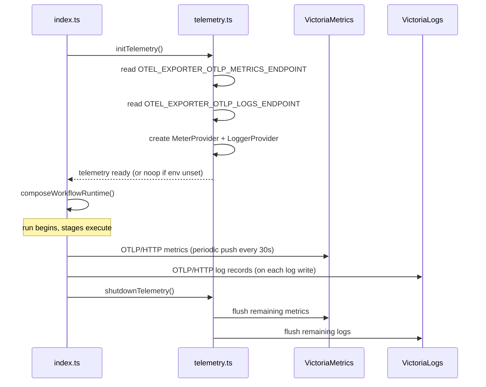

# VictoriaMetrics Backend Integration and Operational Dashboard

## What

Autocatalyst gains a first-class observability backend: an OpenTelemetry export pipeline that ships metrics and logs to VictoriaMetrics and VictoriaLogs, paired with a Docker Compose stack that operators can run alongside the service. A pre-built vmui dashboard surfaces run throughput, stage durations, error rates, adapter latency, and agent turn counts. After starting one compose command, an operator sees live telemetry without configuring anything.
The feature also ships an operator guide documenting both the local development setup and what a production deployment looks like.
## Why

The service already emits structured JSON logs to stderr — enough visibility for a developer watching a terminal, but nothing an operator can query after the fact or monitor across runs. There is no way to answer "how many runs completed in the last hour?" or "which stage is consistently slow?" without grepping files by hand.
The observability-stack ADR committed to the Victoria stack (VictoriaLogs, VictoriaMetrics) and Vector as the target backend. This feature closes the gap between that decision and working infrastructure. With the pipeline in place, engineers can diagnose bottlenecks quantitatively, the loop's self-improvement relies on structured telemetry rather than prose summaries, and the service is ready to be operated at scale without manual plumbing.
## Personas

- **Enzo: Engineer** — deploys and operates Autocatalyst, needs to diagnose failed runs, spot slow stages, and confirm the system is healthy during a release.
- **Phoebe: Product manager** — monitors run throughput and feature velocity over time; needs a readable dashboard without writing queries.
## Narratives

### Enzo wires up observability on a new deployment

Enzo is setting up Autocatalyst in a new environment after the team migrates repositories. He clones the repo, copies `.env.example` to `.env`, and follows the observability setup guide in `context-human/wiki/observability.md`. The guide tells him to run `docker compose up -d` from the repo root. Within thirty seconds the compose stack is healthy: VictoriaMetrics, VictoriaLogs, and Vector are all running. He starts the Autocatalyst service with `autocatalyst run --repo .` and seeds a test idea through Slack.
The service logs its first structured JSON lines to stderr. Vector picks them up from the Docker log stream and forwards them to VictoriaLogs. The service's OTel SDK simultaneously pushes metrics — run counts, stage latency histograms — to VictoriaMetrics via OTLP. Enzo opens the vmui dashboard URL from the guide and sees a live panel: one run in flight, zero errors, the spec-generation stage at 14 seconds. The dashboard requires no Grafana account, no provisioning step, and no query knowledge — it loaded from the preset bundled with VictoriaMetrics. Enzo bookmarks the URL and closes his terminal; the monitoring is running.
### Enzo diagnoses a slow implementation stage

Three days into running Autocatalyst against the AMP repo, Enzo notices that some runs take noticeably longer than others without an obvious pattern. He opens the vmui dashboard and looks at the stage duration heatmap. The implementation stage shows a bimodal distribution: most runs complete in eight to twelve minutes, but a cluster completes in twenty-two to thirty minutes. He filters by `run_id` for one of the slow runs and sees the agent turn count is three to four times higher than normal — the agent is looping. He clicks through to VictoriaLogs, pastes the `run_id`, and reads the structured log trail. The slow runs all triggered on a single repository where the workspace context is unusually large.
Enzo files an issue with the run IDs and the log evidence already attached. Because the telemetry is structured and queryable, his bug report takes ten minutes instead of an hour of log archaeology.
### Phoebe reviews weekly velocity from the dashboard

Phoebe wants to present the team's weekly automation velocity at the Friday review. She opens the vmui dashboard and sets the time range to the past seven days. The run throughput panel shows forty-one completed runs; the error rate panel shows two failed runs, both on the same day. She screenshots both panels and notes that the failure day matches a dependency upgrade she remembers from earlier in the week. She shares the screenshots in the team channel without writing a single query. The numbers are already formatted as the team has been tracking them — runs per day, error percentage, median stage latency — because those panels are part of the shipped preset.
## User stories

**Wiring up observability on a new deployment**
- Enzo can start the complete observability stack with a single `docker compose up` command.
- Enzo can confirm stack health by checking compose service status.
- Enzo can open the dashboard immediately after the service starts its first run.
- Enzo can see logs in VictoriaLogs without configuring the service beyond its defaults.
- Enzo can see metrics in VictoriaMetrics after a run completes.
- Enzo can override the OTLP endpoint via an environment variable when deploying to a hosted backend.
**Diagnosing a slow implementation stage**
- Enzo can filter the dashboard by time range to isolate a specific day or run.
- Enzo can view per-stage duration data broken out by stage name.
- Enzo can drill from a metric anomaly to the corresponding structured logs using `run_id`.
- Enzo can read the full log trail for a specific run without grepping files.
**Reviewing weekly velocity**
- Phoebe can see run throughput (completed runs over time) without writing a PromQL query.
- Phoebe can see error rate and failed run counts in the same dashboard view.
- Phoebe can set the time range on all panels simultaneously.
- Phoebe can share a dashboard screenshot that shows the same panels each week.
## Goals

- An operator can go from zero to live telemetry in under five minutes following the setup guide, on Mac, Linux, or Windows with Docker Desktop.
- The compose stack's total compressed image footprint is under 150 MB (VictoriaMetrics \~20 MB, VictoriaLogs \~20 MB, Vector \~50 MB; no Grafana).
- OTLP export failures do not crash the service or affect the main run loop.
- Pino log output continues to appear on stderr when OTLP export is disabled — the default behavior is unchanged for operators not using the observability stack.
- The dashboard preset ships as a file in the repo (not a Grafana account requirement).
## Non-goals

- VictoriaTraces integration — the issue defers this pending image availability; traces are out of scope for this feature.
- Hosted/cloud deployment of the observability backend (documented as future work, not implemented).
- Grafana — vmui is sufficient; adding Grafana would exceed the image-weight budget and is explicitly rejected in the issue.
- Alerting rules or on-call paging configuration.
- Backfilling historical telemetry for runs that completed before this feature ships.
## Tech spec

### Introduction and overview

**Dependencies on ADRs and decisions:**
- `context-agent/decisions/observability-stack.md` — commits to OpenTelemetry SDK instrumentation, Victoria stack + Vector, OTLP as the transport; this feature implements it.
- `context-agent/standards/logging.md` — pino to stderr is the current logging standard; this feature adds a parallel OTLP export path without replacing it.
**Technical goals:**
- OTel `MeterProvider` initialized at startup; metrics exported via OTLP/HTTP.
- OTel `LoggerProvider` initialized at startup; pino log records bridged to it and exported via OTLP/HTTP.
- Backward compatibility: when `OTEL_EXPORTER_OTLP_ENDPOINT` is unset, no OTLP connection is attempted and the service behaves identically to today.
- Docker Compose stack validated healthy on Mac (Apple Silicon and Intel) and Linux.
**Non-goals (technical):** OpenTelemetry traces (spans) are already noted in the logging standard but not wired; this feature does not add trace export either. The focus is metrics and logs.
**Glossary:**
- **OTLP** — OpenTelemetry Protocol; the wire format used by the OTel SDK to export telemetry.
- **MeterProvider** — OTel SDK component that manages metric instruments and their export.
- **LoggerProvider** — OTel SDK component that manages log records and their export.
- **vmui** — VictoriaMetrics' built-in query and dashboard UI, served by the VictoriaMetrics process itself.
- **Vector** — A high-performance observability data pipeline; used here to collect structured JSON from the service's stderr (via Docker log driver) and forward to VictoriaLogs.
---
### System design and architecture

**High-level architecture:**
```javascript
┌──────────────────────────────────────────────────────────┐
│                  autocatalyst process                    │
│                                                          │
│   pino logger ──► stderr (fd 2)  [preserved, existing]  │
│        │                                                 │
│        └──► OTel LoggerProvider ──► OTLP/HTTP ──────────►│──► VictoriaLogs  :9428
│                                                          │
│   OTel MeterProvider ──────────────► OTLP/HTTP ─────────►│──► VictoriaMetrics :4318
│                                                          │
└──────────────────────────────────────────────────────────┘

┌──────────────────────────────────────────────────────────┐
│                  docker compose stack                    │
│                                                          │
│  VictoriaMetrics (single-node)  :8428 vmui, :4318 OTLP  │
│  VictoriaLogs                   :9428 OTLP logs          │
│  Vector                         reads Docker log stream  │
│                                 → VictoriaLogs :9428     │
│                                                          │
└──────────────────────────────────────────────────────────┘
```
VictoriaMetrics accepts OTLP metrics on its `/opentelemetry/api/v1/push` endpoint (port 4318 mapped). VictoriaLogs accepts OTLP logs on its `/insert/opentelemetry/v1/logs` endpoint (port 9428). Vector runs in the compose stack as a sidecar to also collect container stderr output via the Docker log API and forward it to VictoriaLogs — this provides log visibility even if the OTel log bridge is disabled.
**Component breakdown:**

Component
What changes

`src/core/telemetry.ts` (new)
Initializes `MeterProvider` and `LoggerProvider`; exports a `meter` singleton and a `shutdownTelemetry()` function. Reads `OTEL_EXPORTER_OTLP_METRICS_ENDPOINT` and `OTEL_EXPORTER_OTLP_LOGS_ENDPOINT`. No-ops when env vars are unset.

`src/core/logger.ts`
Adds an OTel log bridge destination alongside the existing pino stderr path. Reads the OTel `LoggerProvider` from the telemetry module. Writes remain on stderr.

`src/index.ts`
Calls `initTelemetry()` before `composeWorkflowRuntime()`; calls `shutdownTelemetry()` before `process.exit()`.

`src/core/orchestrator.ts`
Adds meter instruments: run counter, stage duration histogram. Records on existing stage transition events.

`src/adapters/anthropic/claude-agent-sdk-agent-runner.ts`
Records an agent turn counter metric on each yielded turn event.

`docker-compose.yml` (new)
VictoriaMetrics single-node, VictoriaLogs, Vector, with named volumes and explicit version tags.

`vector.yaml` (new, at repo root)
Vector pipeline: Docker log source → JSON parser → VictoriaLogs sink.

`victoriametrics-dashboard.json` (new, at repo root or `ops/`)
vmui preset covering the five required panels.

`context-human/wiki/observability.md` (new)
Operator setup guide: docker compose steps, env var reference, dashboard URL, hosted deployment notes.

`context-agent/standards/logging.md`
Add OTLP env var reference section.

**Primary sequence — startup with OTLP enabled:**

---
### Detailed design

#### New module: `src/core/telemetry.ts`

```typescript
// Env vars read:
//   OTEL_EXPORTER_OTLP_METRICS_ENDPOINT  (default: unset → no-op)
//   OTEL_EXPORTER_OTLP_LOGS_ENDPOINT     (default: unset → no-op)
//   OTEL_EXPORT_INTERVAL_MS              (default: 30000)

export interface TelemetryHandles {
  meter: Meter;            // OTel API Meter, safe to call even when no-op
  loggerProvider: LoggerProvider;
  shutdown: () => Promise;
}

export function initTelemetry(): TelemetryHandles
```
Behavior:
- If neither endpoint env var is set, returns no-op `Meter` and no-op `LoggerProvider`. No network connections made.
- If either endpoint is set, initializes the respective provider with an `OTLPMetricExporter` / `OTLPLogExporter` using periodic/batch export.
- Export errors are caught and logged at `warn` level; they do not propagate to the run loop.
- `shutdown()` calls `forceFlush()` then `shutdown()` on each provider; ignores errors.
#### Changes to `src/core/logger.ts`

Add an optional OTel log bridge. When `loggerProvider` is a live provider (not a no-op), construct a `pino.transport` that writes records to the OTel `LoggerProvider` alongside the existing stderr destination. Use `pino.multistream` or a custom writable to fan out.
The pino format does not change. The bridge reads each parsed JSON log record and emits an OTel `LogRecord` with severity mapped from pino's numeric level, body set to `message`, and all structured fields set as attributes.
#### Metric instruments (added to `orchestrator.ts` and agent runner)

Instrument
Type
Unit
Description

`autocatalyst.run.started`
Counter
`{run}`
Incremented when a run enters the run loop. Attributes: `intent`.

`autocatalyst.run.completed`
Counter
`{run}`
Incremented on terminal state. Attributes: `terminal_reason`.

`autocatalyst.stage.duration`
Histogram
`ms`
Recorded on each stage transition. Attributes: `stage`, `outcome`.

`autocatalyst.agent.turns`
Counter
`{turn}`
Incremented per yielded turn event in the SDK runner. Attributes: `component`.

`autocatalyst.adapter.latency`
Histogram
`ms`
Time for each Slack API call or agent SDK call. Attributes: `adapter`, `operation`.

All instruments are created once at module init and safe to use whether or not OTLP is configured (no-op meter if not).
#### `docker-compose.yml`

```yaml
version: "3.9"
services:
  victoriametrics:
    image: victoriametrics/victoria-metrics:v1.111.0
    ports:
      - "8428:8428"   # vmui + query API
      - "4318:4318"   # OTLP receiver (metrics)
    volumes:
      - vm-data:/victoria-metrics-data
    command:
      - -retentionPeriod=1
      - -opentsdbHTTPListenAddr=:4242
    restart: unless-stopped

  victorialogs:
    image: victoriametrics/victoria-logs:v1.14.0
    ports:
      - "9428:9428"   # OTLP log ingestion + query API
    volumes:
      - vl-data:/vlogs-data
    command:
      - -retentionPeriod=1w
    restart: unless-stopped

  vector:
    image: timberio/vector:0.43.0-alpine
    volumes:
      - /var/run/docker.sock:/var/run/docker.sock:ro
      - ./vector.yaml:/etc/vector/vector.yaml:ro
    depends_on:
      - victorialogs
    restart: unless-stopped

volumes:
  vm-data:
  vl-data:
```
#### `vector.yaml`

```yaml
sources:
  docker_logs:
    type: docker_logs
    include_labels:
      com.docker.compose.project: autocatalyst

transforms:
  parse_json:
    type: remap
    inputs: [docker_logs]
    source: |
      . = parse_json!(.message) ?? .

sinks:
  victorialogs:
    type: http
    inputs: [parse_json]
    uri: "http://victorialogs:9428/insert/jsonline?_stream_fields=component,level"
    encoding:
      codec: json
    framing:
      method: newline_delimited
```
#### Dashboard preset (`victoriametrics-dashboard.json`)

vmui supports importing a dashboard JSON file. The preset defines five panels:

Panel
Query type
Description

Run throughput
rate counter
`rate(autocatalyst_run_completed_total[5m])` — runs/sec over time

Error rate
ratio
Completed with `terminal_reason="failed"` / all completed

Stage duration (p50/p95)
histogram quantile
`histogram_quantile(0.95, autocatalyst_stage_duration_ms)` by `stage`

Adapter latency
histogram quantile
`histogram_quantile(0.95, autocatalyst_adapter_latency_ms)` by `adapter`

Agent turn count
counter
`sum(rate(autocatalyst_agent_turns_total[5m])) by (component)`

The JSON file is generated once and committed. It loads via vmui's "Import dashboard" feature (no account required).
---
### Security, privacy, and compliance

**Authentication and authorization:** The compose stack exposes VictoriaMetrics and VictoriaLogs on [localhost](http://localhost) ports only (`127.0.0.1` binding in compose). No authentication is configured for local development. For hosted deployments, the operator guide documents adding basic auth or a reverse proxy — this is out of scope for the feature implementation.
**Data privacy:** Log records exported via OTLP contain the same fields as pino stderr output. No secrets are logged per existing logging standards (`context-agent/standards/logging.md`). The OTLP exporter sends data to a local endpoint by default; operators choosing a hosted backend are responsible for their data residency requirements.
**Input validation:** The OTLP endpoints are read from environment variables and passed directly to the exporter constructors. No user-supplied input flows through the telemetry path at runtime.
---
### Observability

This feature is itself observable:
- `logger.warn` on OTLP export failure (structured: `{ event: "telemetry.export_failed", error: "..." }`).
- `logger.info` on telemetry init with resolved endpoints (or `disabled` if not configured).
- `logger.info` on telemetry shutdown with flush outcome.
- No new metrics about the metrics exporter — that would be circular and unhelpful.
---
### Testing plan

**Unit tests:**
- `telemetry.ts` — `initTelemetry()` returns no-op handles when env vars are unset; does not attempt any network call. Verify by checking that `meter.createCounter()` returns a no-op instrument.
- `telemetry.ts` — `initTelemetry()` with a non-reachable endpoint does not throw; OTLP errors are swallowed without propagating.
- `logger.ts` — pino writes to stderr when OTLP is disabled; stderr output is unchanged from today.
- Metric instruments — counter `add()` and histogram `record()` do not throw when called with no-op meter.
**Integration tests:**
- `docker compose up` reaches healthy state on Mac (Apple Silicon). All three services pass their health checks within 30 seconds.
- After a synthetic run completion event, VictoriaMetrics' `/api/v1/query` endpoint returns a non-empty result for `autocatalyst_run_completed_total`.
- After a log line is emitted, VictoriaLogs' `/select/logsql/query` returns matching structured data.
**Documentation test:**
- A team member (not the author) follows `context-human/wiki/observability.md` from a clean state on Mac and confirms the dashboard is visible within five minutes. Verified before merge.
---
### Alternatives considered

**OTel Collector instead of direct OTLP to VictoriaMetrics/VictoriaLogs:** A standard OTel Collector acts as a fan-out proxy. Rejected: it adds another image (\~50 MB), another config file, and another process to debug. VictoriaMetrics and VictoriaLogs both support OTLP natively; the collector adds indirection with no benefit at this scale.
**Grafana instead of vmui:** Grafana is the more familiar dashboard tool and supports richer panel types. Rejected explicitly in the issue: it adds a heavy image, requires account provisioning, and exceeds the 150 MB image-weight budget. vmui is sufficient for the five required panels.
**Stdout log collection via Vector only (no OTel log bridge):** Vector can collect container stdout/stderr and forward to VictoriaLogs without any code change to the service. This approach is simpler but couples log visibility to the Docker runtime — it does not work when running the service outside Docker (e.g., bare `npm start`). The OTel log bridge makes log export process-portable.
---
### Risks

Risk
Likelihood
Impact
Mitigation

VictoriaLogs OTLP log ingestion endpoint changes between releases
Low
Medium
Pin explicit image versions in compose; test against pinned versions in CI.

pino-to-OTel bridge adds measurable latency to log writes
Low
Low
Bridge writes asynchronously via batch exporter; pino stderr write is synchronous and unaffected. Measure in unit tests.

Docker Desktop unavailable on some operator machines
Medium
Low
The compose stack is optional; the service runs identically without it. Document fallback: `OTEL_EXPORTER_OTLP_METRICS_ENDPOINT` can point to any OTLP endpoint.

VictoriaTraces image availability
Unknown
Low
Issue already defers this. No risk to this feature — traces are explicitly out of scope.

---
## Task list

- [ ] **Story: OTel SDK dependencies and telemetry module**
	- [ ] **Task: Add OTel npm dependencies**
		- **Description**: Add `@opentelemetry/api`, `@opentelemetry/sdk-metrics`, `@opentelemetry/sdk-logs`, `@opentelemetry/exporter-metrics-otlp-http`, and `@opentelemetry/exporter-logs-otlp-http` to `package.json`. Verify no peer dependency conflicts with existing packages.
		- **Acceptance criteria**:
			- [ ] All packages added to `dependencies` (not `devDependencies`)
			- [ ] `npm install` completes without errors
			- [ ] TypeScript build passes after install
		- **Dependencies**: None
	- [ ] **Task: Create ****`src/core/telemetry.ts`**
		- **Description**: Implement `initTelemetry()` that reads `OTEL_EXPORTER_OTLP_METRICS_ENDPOINT` and `OTEL_EXPORTER_OTLP_LOGS_ENDPOINT`. When unset, returns no-op `Meter` and `LoggerProvider`. When set, creates `OTLPMetricExporter` and `OTLPLogExporter` with 30-second periodic export intervals. Export errors are caught and logged at `warn` level. Returns `{ meter, loggerProvider, shutdown }`.
		- **Acceptance criteria**:
			- [ ] Returns no-op handles when both env vars are unset; zero network connections attempted
			- [ ] Returns live handles when both env vars are set to `http://localhost:4318`
			- [ ] `shutdown()` calls `forceFlush()` before `shutdown()` on each provider
			- [ ] Export errors do not propagate (caught internally, logged as warn)
			- [ ] Unit test: `initTelemetry()` with no env vars — instruments are callable without throwing
			- [ ] Unit test: `initTelemetry()` with non-reachable URL — no throw on construction
		- **Dependencies**: "Task: Add OTel npm dependencies"
- [ ] **Story: Logger OTLP bridge**
	- [ ] **Task: Add OTel log bridge to ****`src/core/logger.ts`**
		- **Description**: Modify `createLogger()` to accept an optional `loggerProvider: LoggerProvider` parameter. When provided (and not no-op), add a second pino destination that writes each JSON log record to the OTel `LoggerProvider` as a `LogRecord`. Map pino level numbers to OTel `SeverityNumber`. Set body to `message`, set all other fields as attributes. Use `pino.multistream` to fan out to both stderr and the OTel destination concurrently.
		- **Acceptance criteria**:
			- [ ] Existing pino stderr behavior unchanged when `loggerProvider` is absent or no-op
			- [ ] When a live `loggerProvider` is provided, a log record is emitted to OTel for each pino call
			- [ ] Pino level numbers 10–70 map correctly to OTel SeverityNumber values
			- [ ] Unit test: logger writes to stderr with no OTel provider — output matches current format
			- [ ] Unit test: logger calls OTel emit when provider is present
		- **Dependencies**: "Task: Create `src/core/telemetry.ts`"
- [ ] **Story: Startup and shutdown wiring**
	- [ ] **Task: Wire telemetry init and shutdown into ****`src/index.ts`**
		- **Description**: Call `initTelemetry()` at the top of `src/index.ts`, before `composeWorkflowRuntime()`. Pass the `loggerProvider` from `initTelemetry()` to `createLogger()`. Register `shutdown()` in the shutdown sequence alongside `service.stopped`. Ensure `shutdownTelemetry()` is called on both normal exit and signal-triggered exit.
		- **Acceptance criteria**:
			- [ ] `initTelemetry()` is called before any logger or service is constructed
			- [ ] Logger receives the live `loggerProvider` when OTLP is configured
			- [ ] `shutdown()` is called before `process.exit(0)` in the normal path
			- [ ] `shutdown()` is called from the signal handler path (SIGINT, SIGTERM)
			- [ ] Service starts and exits cleanly with no env vars set (no-op path)
		- **Dependencies**: "Task: Add OTel log bridge to `src/core/logger.ts`"
- [ ] **Story: Metric instrumentation**
	- [ ] **Task: Add run lifecycle counters to ****`src/core/orchestrator.ts`**
		- **Description**: Using the `meter` from `initTelemetry()` (passed via dependency injection), create `autocatalyst.run.started` (Counter) and `autocatalyst.run.completed` (Counter). Increment `run.started` when a run enters the loop for the first time; increment `run.completed` with a `terminal_reason` attribute on each terminal state transition.
		- **Acceptance criteria**:
			- [ ] `run.started` is incremented once per new run (not per retry)
			- [ ] `run.completed` includes `terminal_reason` attribute matching the terminal state name
			- [ ] No change to existing orchestrator behavior or test outcomes
			- [ ] Instruments are safe to call when meter is a no-op (no env vars set)
		- **Dependencies**: "Task: Wire telemetry init and shutdown into `src/index.ts`"
	- [ ] **Task: Add stage duration histogram to ****`src/core/orchestrator.ts`**
		- **Description**: Create `autocatalyst.stage.duration` (Histogram, unit `ms`). Record elapsed time on each stage transition with attributes `stage` (stage name) and `outcome` (`success` or `failed`). Use `performance.now()` for timing.
		- **Acceptance criteria**:
			- [ ] Duration is recorded in milliseconds
			- [ ] `stage` attribute matches the stage name strings already used in structured logs
			- [ ] `outcome` is `success` for normal transitions, `failed` for error transitions
			- [ ] No observable performance change to the orchestrator tick
		- **Dependencies**: "Task: Add run lifecycle counters to `src/core/orchestrator.ts`"
	- [ ] **Task: Add agent turn counter to ****`claude-agent-sdk-agent-runner.ts`**
		- **Description**: Create `autocatalyst.agent.turns` (Counter) and `autocatalyst.adapter.latency` (Histogram, unit `ms`). Increment the turn counter each time the async iterator yields a turn event. Record the latency histogram around the `query()` call with `adapter=agent-sdk` and `operation=query`.
		- **Acceptance criteria**:
			- [ ] Turn counter increments once per yielded turn event
			- [ ] Latency histogram records the wall time of each `query()` invocation
			- [ ] Attributes include `component` (value: `claude-agent-sdk`) on turn counter
			- [ ] Instruments are safe to call when meter is no-op
		- **Dependencies**: "Task: Wire telemetry init and shutdown into `src/index.ts`"
- [ ] **Story: Docker Compose observability stack**
	- [ ] **Task: Write ****`docker-compose.yml`**
		- **Description**: Create `docker-compose.yml` at the repo root. Include `victoriametrics/victoria-metrics:v1.111.0` (ports 8428 and 4318), `victoriametrics/victoria-logs:v1.14.0` (port 9428), and `timberio/vector:0.43.0-alpine`. Use named volumes for VM and VL data. All images must use explicit version tags (no `latest`). Bind all host ports to `127.0.0.1` for local-only exposure.
		- **Acceptance criteria**:
			- [ ] `docker compose up -d` succeeds on Mac (Apple Silicon)
			- [ ] All three services reach healthy/running state within 30 seconds
			- [ ] VictoriaMetrics vmui is reachable at `http://localhost:8428/vmui`
			- [ ] VictoriaLogs query API is reachable at `http://localhost:9428/select/logsql/query`
			- [ ] No `latest` tag appears in the file
		- **Dependencies**: None
	- [ ] **Task: Write ****`vector.yaml`**
		- **Description**: Create `vector.yaml` at the repo root. Configure a `docker_logs` source that reads from containers labelled with the autocatalyst compose project. Add a `remap` transform that attempts to parse each log line as JSON. Configure an HTTP sink that forwards to VictoriaLogs at `http://victorialogs:9428/insert/jsonline` with `_stream_fields=component,level`.
		- **Acceptance criteria**:
			- [ ] Vector container starts without config errors
			- [ ] After the autocatalyst service emits a log line, it appears in VictoriaLogs within 10 seconds
			- [ ] Non-JSON log lines are forwarded as raw strings without dropping
		- **Dependencies**: "Task: Write `docker-compose.yml`"
	- [ ] **Task: Validate compose stack integration end-to-end**
		- **Description**: Start the compose stack, start the service with `OTEL_EXPORTER_OTLP_METRICS_ENDPOINT=http://localhost:4318` and `OTEL_EXPORTER_OTLP_LOGS_ENDPOINT=http://localhost:9428`, run one synthetic run (or seed an idea end-to-end), then query VictoriaMetrics and VictoriaLogs to confirm data arrived.
		- **Acceptance criteria**:
			- [ ] `autocatalyst_run_completed_total` returns a result from VictoriaMetrics query API
			- [ ] At least one log record from `autocatalyst` appears in VictoriaLogs query
			- [ ] Service exits cleanly after flush with no errors logged
		- **Dependencies**: "Task: Write `vector.yaml`", "Task: Add stage duration histogram to `src/core/orchestrator.ts`"
- [ ] **Story: Dashboard preset**
	- [ ] **Task: Create vmui dashboard preset JSON**
		- **Description**: Create `ops/victoriametrics-dashboard.json` (create `ops/` directory if needed). Define five panels: (1) run throughput rate, (2) error rate, (3) stage duration p50/p95 by stage name, (4) adapter latency p95 by adapter, (5) agent turn count rate. Use PromQL expressions against VictoriaMetrics. Import the file into a running vmui instance and verify all panels load without query errors.
		- **Acceptance criteria**:
			- [ ] Dashboard imports successfully via vmui "Import dashboard"
			- [ ] All five panels display data after at least one run completes
			- [ ] Panel titles and axis labels are human-readable (no raw metric names)
			- [ ] No Grafana dependency
		- **Dependencies**: "Task: Validate compose stack integration end-to-end"
- [ ] **Story: Documentation**
	- [ ] **Task: Write ****`context-human/wiki/observability.md`**
		- **Description**: Write the operator setup guide. Cover: prerequisites (Docker, Docker Compose), how to start the stack (`docker compose up -d`), env vars to set for the autocatalyst service, how to open the dashboard (URL + import step for the preset), how to query VictoriaLogs for a specific `run_id`, and a brief section on hosted deployment (point OTLP env vars at a remote endpoint). Include a troubleshooting section for the three most common failure modes (port conflict, Vector can't reach Docker socket, OTLP export silently dropping because endpoint is wrong).
		- **Acceptance criteria**:
			- [ ] A team member with no prior knowledge of VictoriaMetrics can follow the guide to a working dashboard in under five minutes
			- [ ] All env var names in the guide match the implementation
			- [ ] Dashboard import step matches the actual vmui import flow
			- [ ] Hosted deployment section is present (even if brief)
		- **Dependencies**: "Task: Create vmui dashboard preset JSON"
	- [ ] **Task: Update ****`context-agent/standards/logging.md`**
		- **Description**: Add a section documenting the two OTLP env vars (`OTEL_EXPORTER_OTLP_METRICS_ENDPOINT`, `OTEL_EXPORTER_OTLP_LOGS_ENDPOINT`) and their defaults. Note that when both are unset the service is identical to its pre-feature behavior.
		- **Acceptance criteria**:
			- [ ] New section appears under a clear heading (e.g., "OpenTelemetry export")
			- [ ] Both env var names are correct and match the implementation
			- [ ] Default behavior (no-op when unset) is clearly stated
		- **Dependencies**: "Task: Wire telemetry init and shutdown into `src/index.ts`"